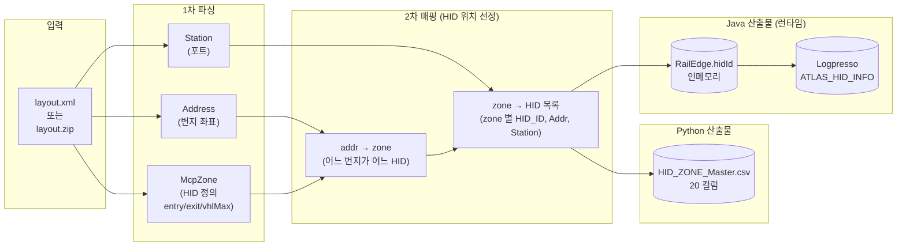
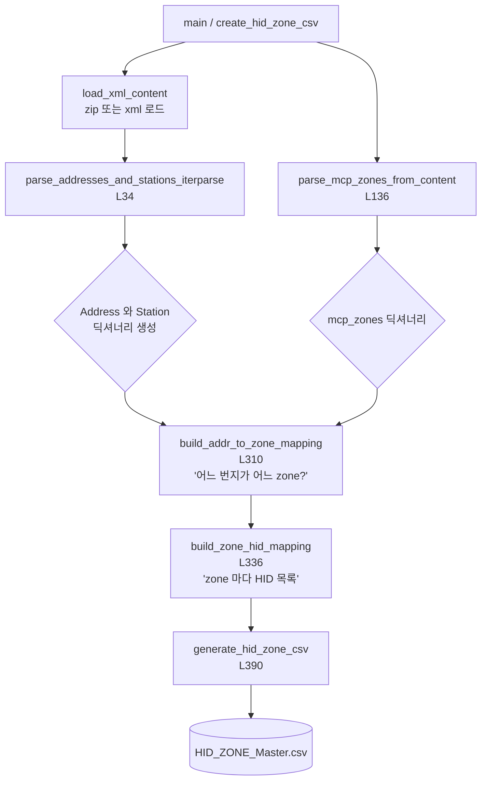
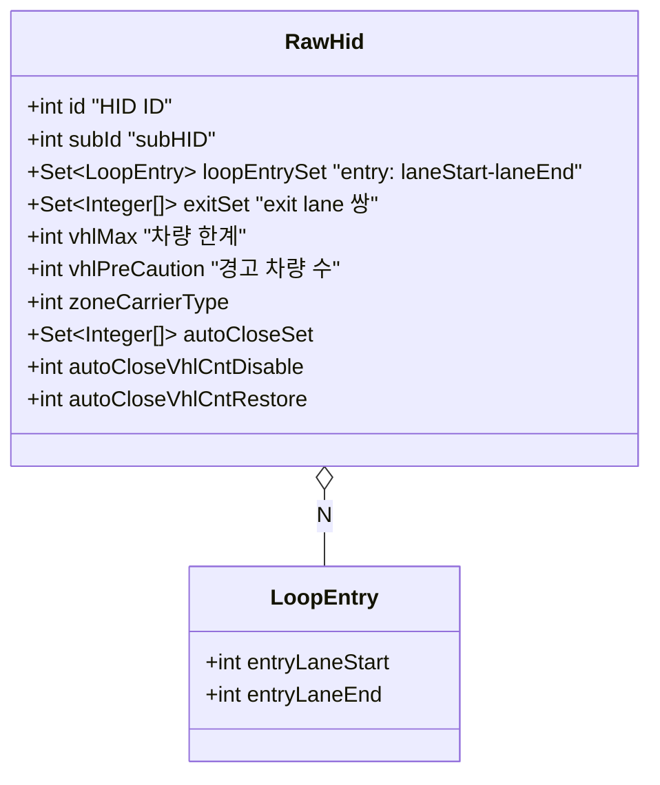
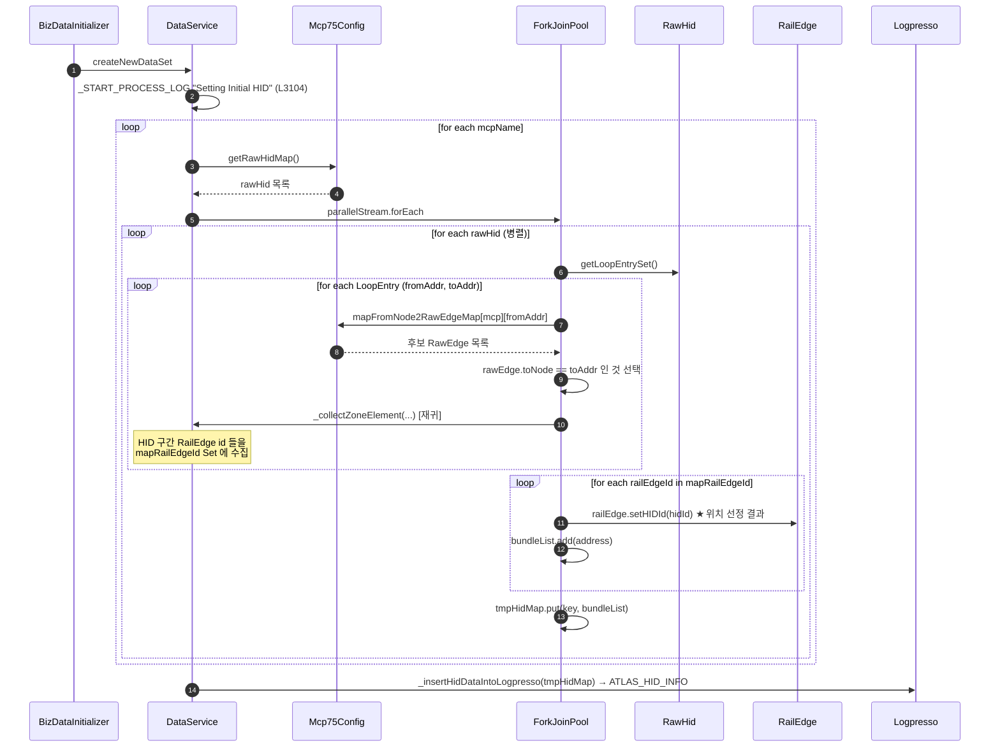
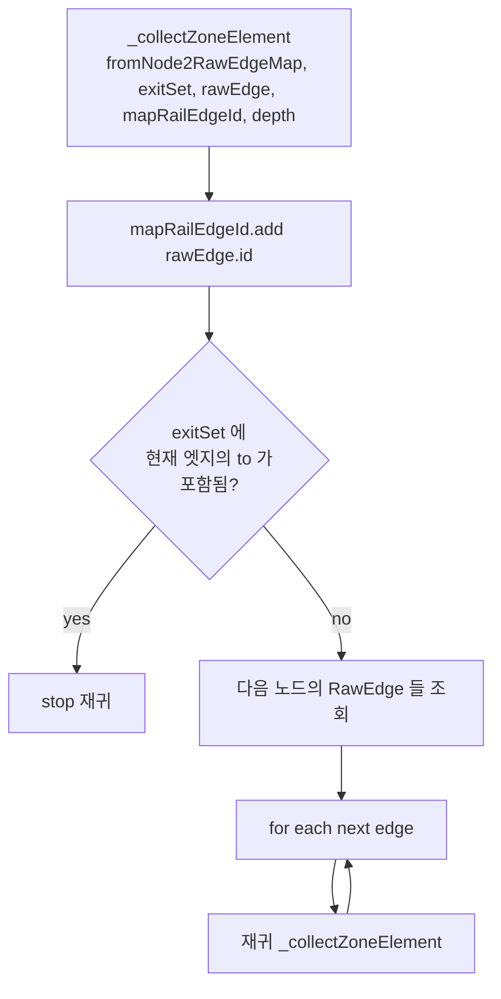
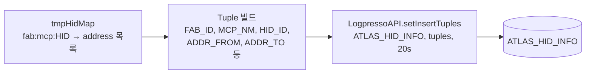
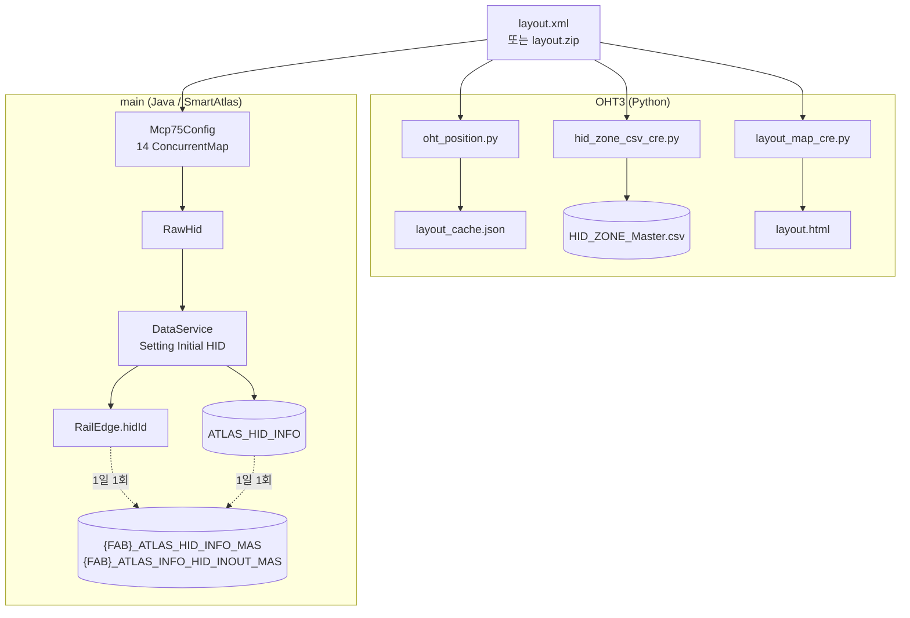

# HID 위치 선정(HID Zone) 로직 — Python(OHT3) ↔ Java(main) 통합 분석

> **HID** = OHT 레일의 인터록 구간(고밀도 영역). 차량이 어느 HID 에 속하는지를
> 정해서 트래픽/혼잡도/지연을 관리한다.
>
> **"위치 선정"** = layout.xml(McpZone) 에 정의된 Zone 을 읽어 각 주소(address)
> 와 RailEdge 가 어떤 HID 에 속하는지를 결정하는 작업.
>
> 이 로직은 **Python (OHT3 폴더)** 와 **Java (main, SmartAtlas)** 양쪽에 비슷한
> 형태로 구현되어 있음.

---

## 0. 위치/파일 매트릭스 (어디에 무엇이 있나)

| 구분 | 위치 | 역할 |
|---|---|---|
| Python — HID Zone CSV 생성기 | `OHT3/hid_zone_csv_cre.py` (756 라인) | layout.xml → `HID_ZONE_Master.csv` 변환 |
| Python — 위치 계산기 | `OHT3/oht_position.py` (362 라인) | OHT (번지, 거리) → (x,y) 좌표 |
| Python — 위치 계산 가이드 | `OHT3/MD/OHT_위치계산_가이드.md` | 위 두 파일의 이론 설명 |
| Python — Layout 캐시 | `OHT3/layout_cache.json` | `nodes: {addr: [x,y]}` 형태 |
| Python — Layout HTML 생성기 | `OHT3/layout_map_cre.py` | layout.zip → 시각화 HTML |
| Java — HID 빌드 (런타임) | `main/java/.../util/DataService.java:3104-3175` | 부팅 시 RailEdge 마다 `setHIDId()` |
| Java — Zone 탐색 재귀 | `main/java/.../util/DataService.java:3612` `_collectZoneElement` | HID 구간 RailEdge 수집 (재귀) |
| Java — Logpresso 적재 | `main/java/.../util/DataService.java:4406` `_insertHidDataIntoLogpresso` | `ATLAS_HID_INFO` 테이블 |
| Java — Raw HID 모델 | `main/java/.../data/raw/RawHid.java` | layout.xml HID 정의 객체 |
| Java — Raw HID 파싱 | `main/java/.../data/raw/Mcp75Config.java:295-308` | `new RawHid(...)` |
| Java — RailEdge HID 필드 | `main/java/.../map/edge/RailEdge.java` | `hidId` 보유, `setHIDId/getHIDId` |
| Java — Logpresso 적재 (스냅샷) | `main/java/.../batch/HidEdgeInOutUpdateMasterBatch.java` | 일 1회 갱신 |

---

## 1. HID 위치 선정의 큰 그림



**핵심 동등성**: Python `hid_zone_csv_cre.py` 의 `build_zone_hid_mapping()` 과
Java `DataService._collectZoneElement()` 는 같은 일을 한다 — McpZone 정의로부터
각 주소가 어느 HID 에 속하는지 결정.

---

## 2. Python (`OHT3/`) 구현

### 2.1 `hid_zone_csv_cre.py` — HID_ZONE_Master.csv 생성기

**입력:** `layout.xml` 또는 `*.layout.zip`
**출력:** `HID_ZONE_Master.csv` (20 컬럼)

**핵심 함수 흐름:**



**위치 선정의 핵심: `build_zone_hid_mapping()` (L336-376)**

```python
for addr_no, addr_data in addresses.items():
    if addr_no not in addr_to_zone:    # 번지 → 존 매핑 확인
        continue
    zone_id = addr_to_zone[addr_no]['zone_id']

    for stn_no in addr_data.get('stations', []):
        hid_id = stations[stn_no].get('port_id', '')
        if not hid_id:
            continue

        zone_hid_map[zone_id].append({
            'HID_ID':     hid_id,
            'Addr_No':    str(addr_no),
            'Station_No': str(stn_no)
        })
```

→ **번지(addr) → zone → HID** 의 3단계 매핑.

### 2.2 CSV 출력 컬럼 (20개)

`HID_ZONE_Master.csv` 헤더 (L405-410):

| # | 컬럼 | 의미 |
|---:|---|---|
| 1 | `Zone_ID` | McpZone 번호 |
| 2 | `HID_No` | HID 번호 |
| 3 | `Bay_Zone` | Bay 영역 (`derive_bay_zone()` 으로 추정) |
| 4 | `Sub_Region` | 1 또는 2 |
| 5 | `Full_Name` | 명칭 |
| 6 | `Territory` | 구역 |
| 7 | `Type` | 타입 |
| 8 | `IN_Count` | 진입 lane 수 |
| 9 | `OUT_Count` | 이탈 lane 수 |
| 10 | `IN_Lanes` | `"a→b; c→d"` 포맷 |
| 11 | `OUT_Lanes` | 동 |
| 12 | `Vehicle_Max` | HID 차량 한계 |
| 13 | `Vehicle_Precaution` | 차량 경고치 |
| 14 | `Project` | 프로젝트명 |
| 15 | `ZCU` | ZCU ID |
| 16 | `HID_Type` | HID 종류 |
| 17 | `HID_ID` | 개별 HID ID |
| 18 | `Zone_ID2` | (중복) |
| 19 | `Addr_No` | 번지 |
| 20 | `Station_No` | 스테이션 번호 |

### 2.3 `oht_position.py` — OHT 좌표 계산기

별개 책임이지만 위치 관련. **(번지, 거리, 다음 번지) → (x, y)** 좌표 변환.

```mermaid
flowchart LR
    A[MCS 메시지<br/>'V00795 12340→12341 dist=14'] --> B[oht_position.py calc]
    B --> C[layout_cache.json 조회<br/>12340 = 500,200<br/>12341 = 600,200]
    C --> D[보간 (dist 비율)]
    D --> E["좌표: 501.4, 200"]
```

CLI:
```
python oht_position.py convert A.layout.zip   # 캐시 생성
python oht_position.py calc 12340 14 12341    # 위치 계산
python oht_position.py parse "<UDP message>"  # 메시지 파싱→좌표
```

---

## 3. Java (`main/`) 구현

### 3.1 RawHid 모델 — `data/raw/RawHid.java`

layout.xml 의 HID 정의 1건을 표현.



빌드 위치: `Mcp75Config.java:295` `new RawHid(id, subId, loopEntrySet, exitSet, ...)`.
저장: `rawHidMap.put(id + ":" + subId, rh)` (라인 308).

### 3.2 런타임 HID 위치 선정 — `DataService.java:3104-3175`

서버 부팅 시 **`Setting Initial HID`** 단계에서 실행됨.



**핵심 코드 (L3119-3162):**

```java
final int hidId = rawHid.getId();
String key = fabId + ":" + mcpName + ":" + String.format("%03d", hidId);

for (LoopEntry loopEntry : entries) {
    final int fromAddress = loopEntry.getEntryLaneStart();
    final int toAddress   = loopEntry.getEntryLaneEnd();
    if (bundleList.isEmpty()) bundleList.add(String.valueOf(fromAddress));

    final ConcurrentLinkedQueue<RawEdge> rawEdges =
            mapFromNode2RawEdgeMap.get(mcpName).get(fromAddress);

    for (RawEdge rawEdge : rawEdges) {
        if (rawEdge.toNode == toAddress) {
            this._collectZoneElement(
                    mapFromNode2RawEdgeMap.get(mcpName),
                    rawHid.getExitSet(),     // ← 출구 조건
                    rawEdge,
                    mapRailEdgeId,           // ← 결과 누적
                    1
            );
            break;
        }
    }
}

for (String railEdgeId : mapRailEdgeId) {
    RailEdge railEdge = tmpRailEdgeMap.get(railEdgeId);
    railEdge.setHIDId(hidId);                // ★ HID 위치 선정
    bundleList.add(railEdge.getAddress());
}
tmpHidMap.put(key, bundleList);
```

**알고리즘 요약:**
1. `LoopEntry` 의 (fromAddr → toAddr) 시작 엣지를 찾음
2. `_collectZoneElement()` 가 시작 엣지부터 **재귀로 인접 엣지 따라가며** HID 구간에 속한 모든 RailEdge ID 를 `mapRailEdgeId` 에 모음. **`exitSet`** 에 도달하면 멈춤.
3. 수집된 RailEdge 들에 모두 동일한 `hidId` 부여 (`setHIDId`)
4. Logpresso `ATLAS_HID_INFO` 테이블에 (key, addressList) 적재

### 3.3 `_collectZoneElement()` — 재귀 탐색 (DataService.java:3612)



→ DFS 로 HID 구간을 순회하며 RailEdge id 집합을 모은다. `exitSet` 이 종료 조건.

### 3.4 RailEdge 측 — `map/edge/RailEdge.java`

```java
private int hidId = -1;
public int  getHIDId()       { return hidId; }
public void setHIDId(int id) { this.hidId = id; }
```

→ 초기값 -1, `DataService` 가 부팅 시 한 번만 채워줌.
이후 `OhtMsgWorkerRunnable._processHidInout()` 같은 곳에서 읽힘.

### 3.5 Logpresso 적재 — `_insertHidDataIntoLogpresso()` (DataService.java:4406-4444)



→ Python 의 `HID_ZONE_Master.csv` 와 **거의 동일한 의미** 의 데이터를 Logpresso 에 적재.

---

## 4. Python ↔ Java 동등성 매트릭스

| 단계 | Python (`hid_zone_csv_cre.py`) | Java (`DataService` + `Mcp75Config`) |
|---|---|---|
| XML 로드 | `load_xml_content()` (L499) | `Mcp75Config` 생성자 / `LayoutUtil` |
| Address 파싱 | `parse_addresses_and_stations_iterparse()` (L34) | `Mcp75Config` 의 `rawPointMap` 파싱 |
| McpZone 파싱 | `parse_mcp_zones_from_content()` (L136) | `Mcp75Config` 의 `rawHidMap` 파싱 (L256-308) |
| addr → zone | `build_addr_to_zone_mapping()` (L310) | `LoopEntry`(`entryLaneStart`/`entryLaneEnd`) 기반 |
| zone → HID 목록 | `build_zone_hid_mapping()` (L336) | `_collectZoneElement()` 재귀 (L3612) |
| RailEdge 에 HID 부여 | (CSV 의 `HID_ID` 컬럼) | `railEdge.setHIDId(hidId)` (L3157) |
| 출력 | `HID_ZONE_Master.csv` (20 컬럼) | `ATLAS_HID_INFO` Logpresso 테이블 |

→ 양쪽이 **같은 입력(layout.xml) 으로 같은 결과** 를 만든다고 볼 수 있음.
다만 Python 은 **CSV 정적 산출물** 중심, Java 는 **인메모리 + DB 적재** 중심.

---

## 5. 자료 흐름 통합도



---

## 6. 핵심 결론

1. **HID 위치 선정 = 두 곳에 구현됨**
   - Python (`OHT3/hid_zone_csv_cre.py`) — 오프라인 CSV 산출용
   - Java (`main/.../DataService.java:3104-3175`) — 서버 부팅 시 런타임 매핑
2. **같은 입력(layout.xml) 으로 같은 결과**를 만들지만, Python 은 **번지↔Station↔Zone** 의 직접 매핑, Java 는 **LoopEntry 시작점부터 인접 엣지 DFS 로 ExitSet 까지** 따라가는 방식 — 결과는 동일하나 알고리즘 모양이 다름.
3. **출력 형태가 다름**
   - Python → `HID_ZONE_Master.csv` (20 컬럼)
   - Java → `ATLAS_HID_INFO` Logpresso 테이블 + `RailEdge.hidId` 인메모리
4. **OHT 위치 좌표 계산 (`oht_position.py`)** 은 HID 위치 선정과 **별개**. 차량 (번지, 거리) → (x, y) 변환 전용. Java 측에는 대응이 없고 UI 측에서 자체 처리하는 듯.
5. **운영 데이터 관점**: Java 의 `{FAB}_ATLAS_HID_INFO_MAS` (마스터, 일 1회) + `{FAB}_ATLAS_HID_INOUT` (분 단위 카운트) 이 실제 모니터링 테이블이며, Python 의 CSV 는 분석/검증용.

---

## 7. 파일 라인 빠른 참조

| 항목 | 파일 | 라인 |
|---|---|---|
| Python HID 위치 결정 메인 | `OHT3/hid_zone_csv_cre.py` | `build_zone_hid_mapping()` L336-376 |
| Python CSV 생성 | `OHT3/hid_zone_csv_cre.py` | `generate_hid_zone_csv()` L390-498 |
| Python McpZone 파싱 | `OHT3/hid_zone_csv_cre.py` | `parse_mcp_zones_from_content()` L136 |
| Python Address 파싱 | `OHT3/hid_zone_csv_cre.py` | `parse_addresses_and_stations_iterparse()` L34 |
| Python addr→zone | `OHT3/hid_zone_csv_cre.py` | `build_addr_to_zone_mapping()` L310 |
| Python 위치 좌표 계산 | `OHT3/oht_position.py` | 전체 (362 line) |
| Java HID 빌드 시작 | `main/java/.../util/DataService.java` | L3104 `Setting Initial HID` |
| Java setHIDId 호출 | `main/java/.../util/DataService.java` | L3157 |
| Java 재귀 Zone 탐색 | `main/java/.../util/DataService.java` | L3612 `_collectZoneElement` |
| Java Logpresso 적재 | `main/java/.../util/DataService.java` | L4406 `_insertHidDataIntoLogpresso` |
| Java RawHid 빌드 | `main/java/.../data/raw/Mcp75Config.java` | L295-308 |
| Java RawHid 모델 | `main/java/.../data/raw/RawHid.java` | 전체 (123 line) |
| Java RailEdge.hidId | `main/java/.../map/edge/RailEdge.java` | 필드 + getter/setter |
| Java HID 마스터 갱신 (일 1회) | `main/java/.../batch/HidEdgeInOutUpdateMasterBatch.java` | 전체 |

---

## 8. 응용 — Python 결과 vs Java 결과 검증법

운영 환경에서 둘이 동일한지 검증하려면:

```bash
# Python 으로 CSV 생성
cd OHT3
python hid_zone_csv_cre.py /path/to/A.layout.zip /tmp/python_hid.csv

# Java 측 ATLAS_HID_INFO 조회 (Logpresso)
# table = ATLAS_HID_INFO | order by HID_ID, ADDR_FROM | limit 10000
# → CSV 다운로드 → /tmp/java_hid.csv

# 비교 (HID_ID, ADDR_FROM 컬럼 기준 sort 후)
diff <(sort /tmp/python_hid.csv) <(sort /tmp/java_hid.csv)
```

→ **결과가 다르면** Mcp75Config 의 `_collectZoneElement` 재귀 동작과
Python 의 `addr_to_zone` 매핑 중 하나가 layout 의 일부 케이스(예: 분기 노드)
를 다르게 처리하고 있음.

---

*관련 가이드: `OHT3/MD/OHT_위치계산_가이드.md` — OHT 좌표(x,y) 계산 원리.*
