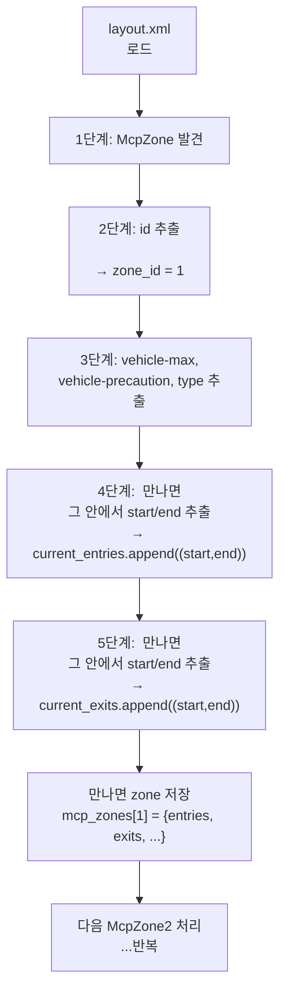
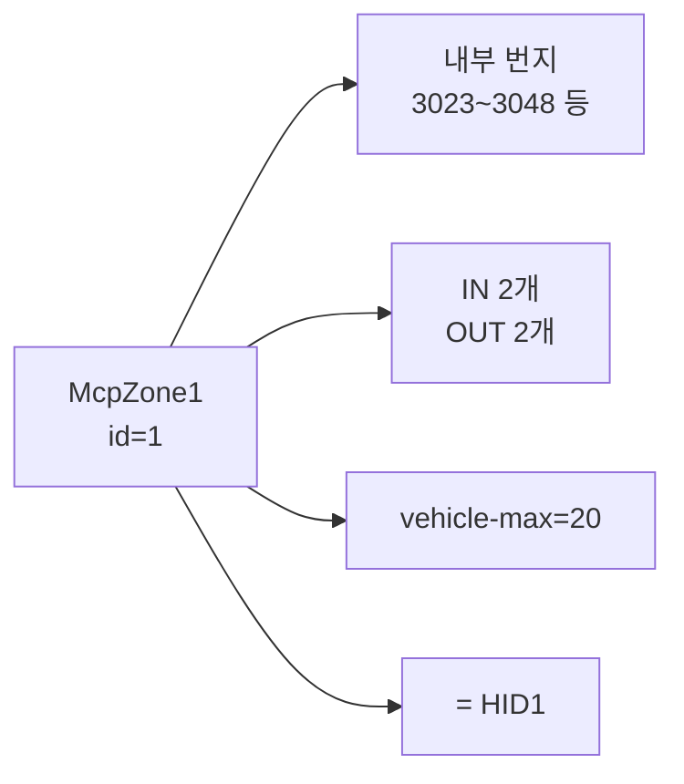
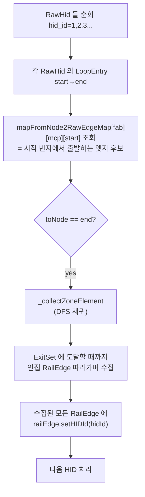

# HID 구역(HID1, HID2, ...) 은 어떻게 만들어졌나?

> **결론부터:** **HID 구역은 우리가 임의로 나눈 게 아니라, `layout.xml` 안에
> 이미 `<group name="McpZone1">`, `<McpZone2">` ... 로 정의되어 있는 것을
> 그대로 읽어들인 것입니다.**
>
> 우리가 한 일은 그 XML 의 `McpZone` 구조와 그 안의 `<group name="Entry">` /
> `<group name="Exit">` 를 파싱해서 IN/OUT 개수와 번지를 추출한 것뿐입니다.

---

## 1. 핵심 한 줄

```
HID 구역 정의의 원본 = layout.xml 의 <group name="McpZone{N}">
```

- `McpZone1` → HID 1
- `McpZone2` → HID 2
- ...
- `McpZoneN` → HID N

→ **누가 어떻게 1번 2번을 정했나?** = layout.xml 만든 사람(설비/맵 담당)이 미리
지정한 것. 우리는 **읽어서 옮기기만** 했음.

---

## 2. layout.xml 안의 McpZone 구조 (실제 형태)

```xml
<group name="McpZone1" type="mcpzone.McpZone">
    <param key="id" value="1"/>
    <param key="vehicle-max" value="20"/>
    <param key="vehicle-precaution" value="15"/>
    <param key="type" value="0"/>

    <group name="Entry1" type="mcpzone.Entry">
        <param key="start" value="3048"/>     ← 들어오는 시작 번지
        <param key="end"   value="3023"/>     ← 들어오는 끝 번지
        <param key="stop-zcu" value="ZCU01"/>
    </group>
    <group name="Entry2" type="mcpzone.Entry">
        <param key="start" value="3100"/>
        <param key="end"   value="3120"/>
    </group>

    <group name="Exit1" type="mcpzone.Exit">
        <param key="start" value="3500"/>     ← 나가는 시작
        <param key="end"   value="3525"/>     ← 나가는 끝
    </group>
    <group name="Exit2" type="mcpzone.Exit">
        ...
    </group>
</group>

<group name="McpZone2" type="mcpzone.McpZone">
    <param key="id" value="2"/>
    ...
</group>
```

→ **HID1** 의 `IN_COUNT = 2` (Entry1 + Entry2), `OUT_COUNT = 2` (Exit1 + Exit2)
→ HID1 의 **IN_Lanes** = `"3048→3023; 3100→3120"`
→ HID1 의 **OUT_Lanes** = `"3500→3525; ..."`

이게 우리 `HID_ZONE_Master.csv` 의 한 행이 됨.

---

## 3. 파싱 알고리즘 (정확히 5단계)

`OHT3/hid_zone_csv_cre.py` 가 한 일:



**파이썬 코드 핵심 발췌** (`hid_zone_csv_cre.py:136-309`):

```python
# 1단계: McpZone 그룹 발견
if '<group name="McpZone' in line and 'mcpzone.McpZone"' in line:
    match = re.search(r'McpZone(\d+)', line)
    current_mcp_id = int(match.group(1))   # ← 여기서 1, 2, 3... 추출

# 2~3단계: 파라미터
if '<param' in line and 'key="..."' in line:
    if key == 'id': current_zone_id = safe_int(value)         # HID 번호
    elif key == 'vehicle-max':         vehicle_max = value    # 차량 한계
    elif key == 'vehicle-precaution':  vehicle_precaution     # 경고치

# 4단계: Entry 안에서
if in_entry:
    if key == 'start': entry_start = safe_int(value)          # IN 시작 번지
    elif key == 'end': entry_end = safe_int(value)            # IN 끝 번지
    elif key == 'stop-zcu': entry_zcu = value                 # ZCU ID

# 5단계: Exit 안에서
elif in_exit:
    if key == 'start': exit_start = safe_int(value)           # OUT 시작
    elif key == 'end': exit_end = safe_int(value)             # OUT 끝
```

---

## 4. IN_COUNT / OUT_COUNT 는 어떻게 구했나?

```python
zone_data = mcp_zones[zone_id]
entries = zone_data.get('entries', [])   # [(start, end), (start, end), ...]
exits   = zone_data.get('exits',   [])

in_count  = len(entries)                  # ★ IN_COUNT = Entry 그룹 개수
out_count = len(exits)                    # ★ OUT_COUNT = Exit 그룹 개수

in_lanes  = '; '.join([f"{e[0]}→{e[1]}" for e in entries])   # "3048→3023; 3100→3120"
out_lanes = '; '.join([f"{e[0]}→{e[1]}" for e in exits])
```

→ **"몇 군데로 들어오나" = `<group name="Entry...">` 가 몇 개냐**
→ **"몇 군데로 나가나" = `<group name="Exit...">` 가 몇 개냐**

XML 안에 이미 다 그렇게 적혀 있어요.

---

## 5. "HID1 / HID2" 의 정체

| 우리가 부르는 이름 | XML 안의 정체 | 의미 |
|---|---|---|
| HID1 | `<group name="McpZone1">` 의 `<param key="id" value="1">` | 1번 인터록 구역 |
| HID2 | `McpZone2` 의 `id=2` | 2번 인터록 구역 |
| HID3 | `McpZone3` 의 `id=3` | 3번 인터록 구역 |
| ... | ... | ... |



**즉, HID1, HID2 ... 의 번호는 설비/맵 설계자가 layout.xml 만들 때
이미 매긴 것**이고, 우리는 그 ID 를 그대로 가져다 썼습니다.

---

## 6. 자바 측에서도 똑같이 함

`main/java/com/skhynix/smartatlas/data/raw/Mcp75Config.java:295-308`:

```java
RawHid rh = new RawHid(
    id,                    // ← XML 의 id 값 (1, 2, 3...)
    subId,
    loopEntrySet,          // ← Entry 의 (start, end) Set
    exitSet,               // ← Exit 의 (start, end) Set
    vhlMax,                // ← vehicle-max
    vhlPreCaution,         // ← vehicle-precaution
    zoneCarrierType,
    ...
);
this.rawHidMap.put(rh.getId() + ":" + rh.getSubId(), rh);
```

→ 같은 XML 같은 필드를 자바도 동일하게 읽음.

---

## 7. 그 다음 — RailEdge 에 HID 번호 부여

`DataService.java:3104-3175` 의 **"Setting Initial HID"** 단계:



**즉:**
1. XML 에서 HID1 의 Entry = `(3048, 3023)` 알아냄
2. 자바가 시작 번지 3048 에서 출발하는 RailEdge 찾음
3. 그 엣지부터 시작해서 → **인접 엣지 → 인접 엣지 → ... → Exit 만나면 멈춤**
4. 이 과정에서 지나간 모든 RailEdge 에 `hidId = 1` 부여
5. HID2, HID3 ... 모두 동일 반복

→ 결과: **모든 RailEdge 가 자기가 어느 HID 에 속하는지 알게 됨.**

---

## 8. 한 번에 정리

```mermaid
flowchart LR
    subgraph X["layout.xml (설비팀이 만든 것)"]
        Z1["McpZone1<br/>id=1<br/>Entry: 3048→3023<br/>Exit: 3500→3525"]
        Z2["McpZone2<br/>id=2<br/>..."]
        ZN["..."]
    end

    subgraph PY["Python (OHT3/hid_zone_csv_cre.py)"]
        P1[parse_mcp_zones]
        P2[build_addr_to_zone]
        P3[build_zone_hid_mapping]
        P4[(HID_ZONE_Master.csv)]
    end

    subgraph JV["Java (main/DataService.java)"]
        J1[RawHid 생성<br/>Mcp75Config:295]
        J2["_collectZoneElement<br/>DFS 인접 엣지 수집"]
        J3[railEdge.setHIDId<br/>L3157]
        J4[(ATLAS_HID_INFO<br/>{FAB}_ATLAS_HID_INFO_MAS)]
    end

    Z1 & Z2 & ZN --> P1 --> P2 --> P3 --> P4
    Z1 & Z2 & ZN --> J1 --> J2 --> J3 --> J4
```

---

## 9. 그래서 "어떻게 한 거야?" 답

| 질문 | 답 |
|---|---|
| HID1, HID2 의 **번호**는 어디서 왔나? | layout.xml 의 `<McpZone1>`, `<McpZone2>` 안의 `<param key="id">` 그대로 |
| HID 구역의 **경계**는 어떻게 정해졌나? | XML 의 `<Entry start/end>` 로 시작점, `<Exit start/end>` 로 끝점 |
| HID 안에 **어떤 RailEdge** 가 속하나? | Java 가 Entry 시작 번지에서 출발해 DFS 로 Exit 까지 따라가며 수집 |
| **IN_COUNT / OUT_COUNT** 는 어떻게? | `<Entry>` 그룹 개수 = IN_COUNT, `<Exit>` 그룹 개수 = OUT_COUNT |
| **vehicle-max** 등 속성은? | XML 의 `<param key="vehicle-max">` 그대로 가져옴 |
| 우리가 새로 만든 것이 있나? | **없음. 전부 XML 에서 읽어옴.** 우리는 "구조 해석" 만 했음 |

---

## 10. 코드 보고 싶을 때 빠른 점프

| 알고 싶은 것 | 파일 + 라인 |
|---|---|
| McpZone 시작 발견 | `OHT3/hid_zone_csv_cre.py:185` |
| Entry/Exit 파라미터 파싱 | `OHT3/hid_zone_csv_cre.py:243-271` |
| addr → zone 매핑 | `OHT3/hid_zone_csv_cre.py:310` |
| zone → HID 매핑 | `OHT3/hid_zone_csv_cre.py:336` |
| IN_COUNT / OUT_COUNT 계산 | `OHT3/hid_zone_csv_cre.py:421-426` |
| CSV 출력 | `OHT3/hid_zone_csv_cre.py:390` |
| Java: RawHid 생성 | `main/.../data/raw/Mcp75Config.java:295` |
| Java: HID 부팅 빌드 | `main/.../util/DataService.java:3104` |
| Java: setHIDId | `main/.../util/DataService.java:3157` |
| Java: DFS 재귀 | `main/.../util/DataService.java:3612` `_collectZoneElement` |

---

## 11. 추가 — XML 안 보고도 알 수 있는 방법

운영 서버에서 실제 데이터로 확인:

```sql
-- Logpresso 에서
table = ATLAS_HID_INFO | order by HID_ID limit 100
-- HID 1, 2, 3, ... 의 ADDR 목록을 직접 볼 수 있음
```

또는 Python 으로:
```bash
cd OHT3
python hid_zone_csv_cre.py /path/to/A.layout.zip output.csv
# 결과 CSV 를 열면 HID 별 IN_Lanes / OUT_Lanes 가 다 나옴
```

---

*요약: HID 구역은 layout.xml 의 `<group name="McpZone{N}">` 구조 그대로.
우리는 그걸 파싱해서 IN_COUNT, OUT_COUNT, vehicle-max 등 메타데이터를
추출했고, Java 는 추가로 Entry 시작점에서 DFS 로 따라가며 각 RailEdge 에
HID 번호를 부여했음. **우리가 임의로 나눈 적 없음 — XML 에 다 있었음.***
