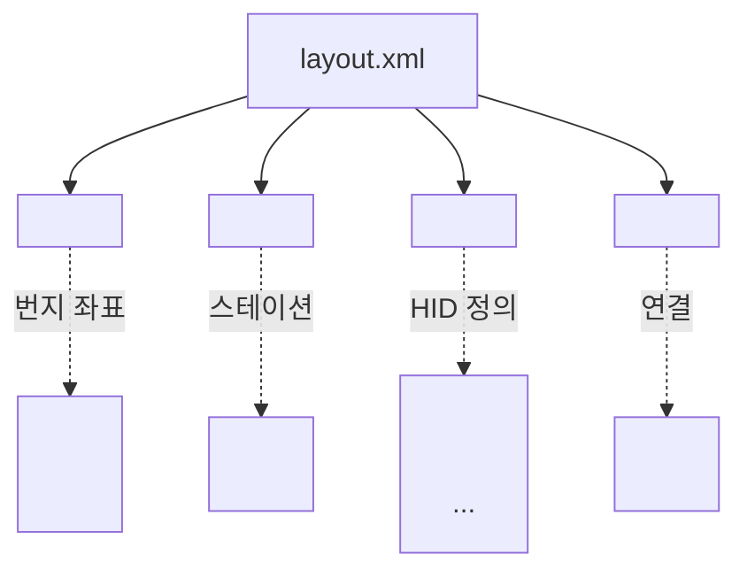
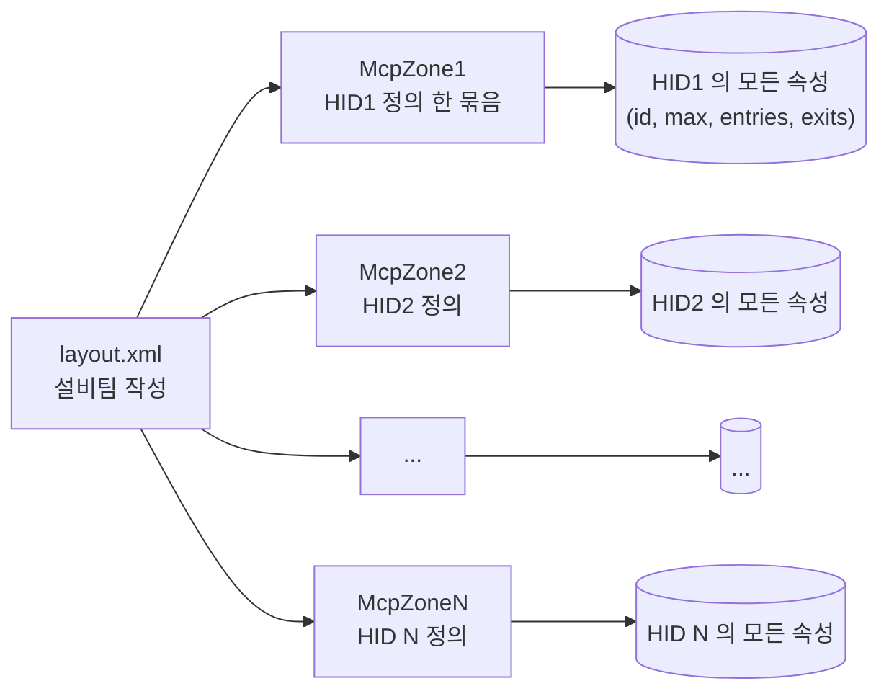

# Step 1 — 원본 layout.xml 에 HID 구역이 정의되어 있다

> 모든 시작점은 **`layout.xml`**. 설비팀이 만들어 우리에게 전달한 XML 파일에
> HID 구역 정보가 이미 다 들어 있다.

---

## 1. 파일 위치

| 경로 | 설명 |
|---|---|
| `$SMARTFX_REPOSITORY/map/{FAB}/A.layout.zip` | FAB 별 layout zip |
| 압축 풀면 `layout.xml` | 실제 정의가 든 XML |

예: `map/M14A/A.layout.zip` → `layout.xml`

---

## 2. layout.xml 안의 핵심 그룹



이 네 가지 그룹 중 **`McpZone`** 가 HID 구역의 본체.

---

## 3. McpZone 상세 구조 (실제 XML)

```xml
<group name="McpZone1" type="mcpzone.McpZone">
    <param key="id" value="1"/>                    ← HID 번호 (이게 HID1)
    <param key="vehicle-max" value="20"/>          ← 차량 최대 수
    <param key="vehicle-precaution" value="15"/>   ← 차량 경고 임계
    <param key="type" value="0"/>                  ← 구역 종류

    <!-- 입구 (Entry) — 차량이 들어오는 곳 -->
    <group name="Entry1" type="mcpzone.Entry">
        <param key="start" value="3048"/>          ← 입구 시작 번지
        <param key="end"   value="3023"/>          ← 입구 끝 번지
        <param key="stop-zcu" value="ZCU01"/>      ← ZCU ID
    </group>
    <group name="Entry2" type="mcpzone.Entry">
        <param key="start" value="3100"/>
        <param key="end"   value="3120"/>
    </group>

    <!-- 출구 (Exit) — 차량이 나가는 곳 -->
    <group name="Exit1" type="mcpzone.Exit">
        <param key="start" value="3500"/>
        <param key="end"   value="3525"/>
    </group>
    <group name="Exit2" type="mcpzone.Exit">
        <param key="start" value="3600"/>
        <param key="end"   value="3640"/>
    </group>

    <!-- CutLane (있을 수도) — 통제용 -->
    <group name="CutLane1" type="mcpzone.CutLane">
        ...
    </group>
</group>

<group name="McpZone2" type="mcpzone.McpZone">
    <param key="id" value="2"/>
    ...
</group>

... (계속, McpZoneN 까지)
```

---

## 4. 이 XML 한 덩어리에서 우리가 얻는 정보

`McpZone1` 한 개로부터 추출되는 데이터:

| 추출 데이터 | XML 위치 | HID1 의 값 (예시) |
|---|---|---|
| `HID_ID` | `<param key="id">` | 1 |
| `Vehicle_Max` | `<param key="vehicle-max">` | 20 |
| `Vehicle_Precaution` | `<param key="vehicle-precaution">` | 15 |
| `Type` | `<param key="type">` | 0 |
| `IN_COUNT` | `<Entry>` 그룹 개수 | 2 |
| `OUT_COUNT` | `<Exit>` 그룹 개수 | 2 |
| `IN_Lanes` | Entry 의 start→end 모음 | `"3048→3023; 3100→3120"` |
| `OUT_Lanes` | Exit 의 start→end 모음 | `"3500→3525; 3600→3640"` |
| `ZCU_ID` | Entry 의 `stop-zcu` | `"ZCU01"` |

---

## 5. 그래서 — XML 안에 "이미 다 있다"



→ **우리는 이 그룹들을 발견 + 분해 + 추출 하는 코드만 작성한 것.**

---

## 6. 결론

| 질문 | 답 |
|---|---|
| HID1, HID2 ... 의 정체는? | layout.xml 의 `<McpZone1>`, `<McpZone2>` 그 자체 |
| 누가 정했나? | 설비팀 (layout.xml 작성자) |
| 우리가 한 일은? | XML 의 그룹을 인식하고 파라미터를 추출 |
| 구역의 경계는? | Entry/Exit 그룹의 `start`, `end` 번지 |
| HID 안에 어떤 RailEdge 가 있나? | XML 에는 시작/끝만 있음 → 자바가 부팅 시 DFS 로 채움 ([04 참조](04_RailEdge_부여.md)) |

---

*다음: [02_XML_파싱.md](02_XML_파싱.md) — Python 과 Java 가 이 XML 을 어떻게 읽어 들이는지*
