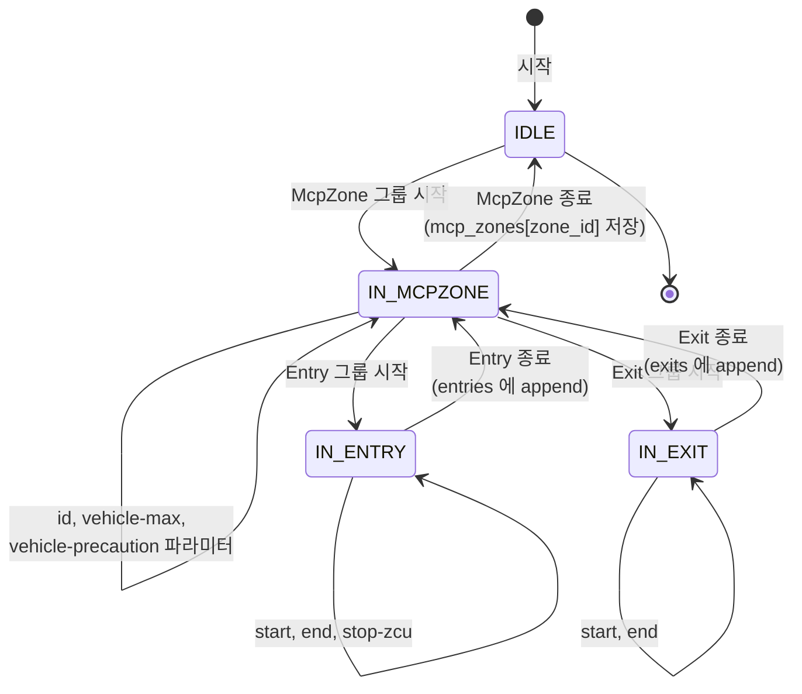
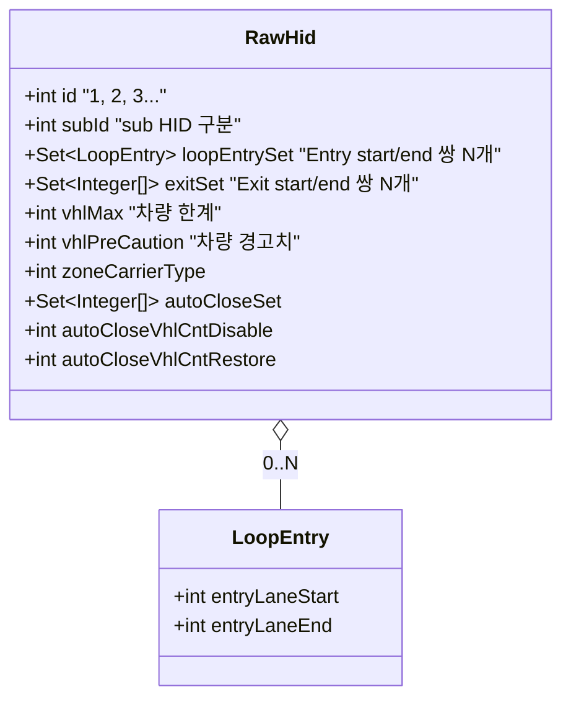
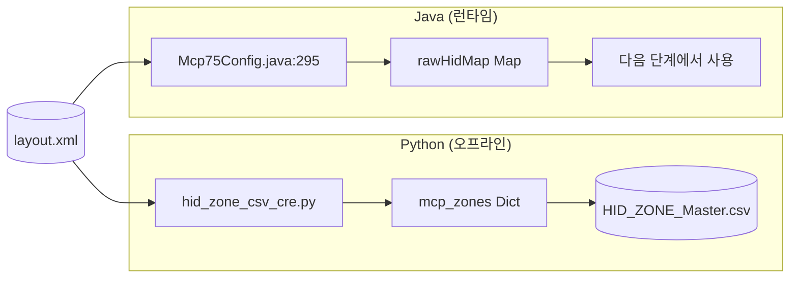

# Step 2 — XML 파싱: Python 과 Java 가 어떻게 읽나

> Step 1 에서 본 `<McpZone>` 그룹들을 코드로 읽어 구조화하는 단계.
> Python(오프라인 분석) 과 Java(런타임) 양쪽에 거의 동일한 파싱 로직이 있다.

---

## 1. 누가 무엇을 파싱하나

| 코드 | 입력 | 출력 | 시점 |
|---|---|---|---|
| Python `OHT3/hid_zone_csv_cre.py` | `layout.xml` 또는 `.zip` | `HID_ZONE_Master.csv` (분석/검증용) | 오프라인 임의 실행 |
| Java `Mcp75Config.java` | `layout.zip` | `rawHidMap: Map<String, RawHid>` (메모리) | 서버 부팅 시 |

→ 알고리즘은 비슷하지만 **출력 형태가 다르다** (CSV vs 인메모리 객체).

---

## 2. Python 파싱 흐름

### 2.1 `OHT3/hid_zone_csv_cre.py:136-309` — `parse_mcp_zones_from_content()`

라인 단위로 XML 텍스트를 한 줄씩 읽으며 상태 머신처럼 처리.



### 2.2 핵심 코드 발췌

```python
for i, line in enumerate(lines):
    line = line.strip()

    # 1. McpZone 그룹 발견
    if '<group name="McpZone' in line and 'mcpzone.McpZone"' in line:
        match = re.search(r'McpZone(\d+)', line)
        current_mcp_id = int(match.group(1))   # ← 1, 2, 3...

    # 2. Entry/Exit 그룹 시작
    if '<group name="Entry' in line and 'mcpzone.Entry"' in line:
        in_entry = True

    # 3. 파라미터 추출
    if '<param ' in line:
        key   = re.search(r'key="([^"]+)"',   line).group(1)
        value = re.search(r'value="([^"]*)"', line).group(1)

        if in_entry:
            if key == 'start': entry_start = int(value)
            elif key == 'end': entry_end   = int(value)
        elif in_exit:
            if key == 'start': exit_start = int(value)
            elif key == 'end': exit_end   = int(value)
        else:  # McpZone 직속
            if key == 'id':              current_zone_id   = int(value)
            elif key == 'vehicle-max':   vehicle_max       = int(value)
            elif key == 'vehicle-precaution': vehicle_precaution = int(value)

    # 4. 그룹 종료
    if '</group>' in line:
        if in_entry:
            current_entries.append((entry_start, entry_end))
        elif in_exit:
            current_exits.append((exit_start, exit_end))
        else:  # McpZone 종료
            mcp_zones[current_zone_id] = {
                'mcp_id': current_mcp_id,
                'vehicle_max': vehicle_max,
                'entries': current_entries.copy(),
                'exits':   current_exits.copy(),
                ...
            }
```

### 2.3 결과 자료 구조

```python
mcp_zones = {
    1: {
        'mcp_id': 1,
        'zone_id': 1,
        'vehicle_max': 20,
        'vehicle_precaution': 15,
        'type': 0,
        'entries': [(3048, 3023), (3100, 3120)],   # ← 2개 = IN_COUNT
        'exits':   [(3500, 3525), (3600, 3640)],   # ← 2개 = OUT_COUNT
        'zcu': 'ZCU01'
    },
    2: { ... },
    ...
}
```

---

## 3. Java 파싱 흐름

### 3.1 `main/.../data/raw/Mcp75Config.java:295-308`

자바도 비슷하게 라인 파싱하지만 정규식 + 분기로 처리.

```java
// 한 줄씩 읽으며
if (r.indexOf("\"McpZone\"") > 0) {     // McpZone 발견
    int id    = ...;
    int subId = ...;
    Set<LoopEntry>   loopEntrySet = new HashSet<>();
    Set<Integer[]>   exitSet      = new HashSet<>();
    int vhlMax = 0, vhlPreCaution = 0;
    int zoneCarrierType = 0;
    Set<Integer[]> autoCloseSet = new HashSet<>();
    int autoCloseVhlCntDisable = 0;
    int autoCloseVhlCntRestore = 0;

    for (String cfg : ...) {            // 내부 파라미터 순회
        if (cfg.startsWith("VEHICLE_MAX")) {
            vhlMax = Util.getIntOrZero(cfg.split("=")[1].trim());
        }
        else if (cfg.startsWith("VEHICLE_PRECAUTION")) {
            vhlPreCaution = Util.getIntOrZero(cfg.split("=")[1].trim());
        }
        else if (cfg.startsWith("ZONE_CARRIER_TYPE")) {
            zoneCarrierType = Util.getIntOrZero(cfg.split("=")[1].trim());
        }
        else if (cfg.startsWith("AUTO_CLOSE_VEHICLE_COUNT")) {
            autoCloseVhlCntDisable = ...;
            autoCloseVhlCntRestore = ...;
        }
        else if (cfg.startsWith("AUTO_CLOSE")) {
            autoCloseSet.add(new Integer[]{ start, end });
        }
        // Entry / Exit 파싱도 동일 패턴
    }

    RawHid rh = new RawHid(
        id, subId,
        loopEntrySet, exitSet,
        vhlMax, vhlPreCaution,
        zoneCarrierType,
        autoCloseSet,
        autoCloseVhlCntDisable, autoCloseVhlCntRestore
    );

    this.rawHidMap.put(rh.getId() + ":" + rh.getSubId(), rh);
}
```

### 3.2 `RawHid` 객체 한 개에 담기는 것



### 3.3 저장

```java
rawHidMap.put("1:0", rh1)   // HID 1 의 sub 0
rawHidMap.put("2:0", rh2)   // HID 2
rawHidMap.put("3:0", rh3)
...
```

이 `rawHidMap` 은 `Mcp75Config` 의 필드에 보관 → 부팅 후 `DataService` 가
가져다가 [Step 4](04_RailEdge_부여.md) 의 RailEdge 부여 작업에 사용.

---

## 4. Python ↔ Java 비교



| 항목 | Python | Java |
|---|---|---|
| 진입점 | `parse_mcp_zones_from_content()` | `Mcp75Config(생성자)` |
| 파싱 방식 | 라인 텍스트 + 정규식 | 라인 텍스트 + indexOf/split |
| 결과 형태 | Python Dict | `RawHid` 객체 |
| 보관 위치 | 메모리 (return) | `rawHidMap : ConcurrentMap` |
| 후속 사용 | CSV 생성 | DataService 의 HID 부여 |

→ **본질적으로 같은 일**, 표현만 다름.

---

## 5. 파싱 시 주의점 (실제 코드에 있는 트릭)

### 5.1 `<group name="McpZone1">` 의 숫자 부분 추출

```python
match = re.search(r'McpZone(\d+)', line)
mcp_id = int(match.group(1))
```

→ `name` 속성에서 정규식으로 숫자만 추출.

### 5.2 zone_depth 카운터로 중첩 추적

`McpZone` 안에 `Entry/Exit/CutLane` 이 또 들어있어 **그룹 종료(`</group>`) 가
여러 번 발생**. `zone_depth` 라는 카운터로 어디까지가 McpZone 내부인지 추적:

```python
if '<group name="McpZone' in line:
    zone_depth = 1
if '<group name="Entry' in line or '<group name="Exit' in line:
    zone_depth += 1
if '</group>' in line:
    zone_depth -= 1
    if zone_depth == 0:
        # McpZone 종료 시점에 zone 저장
```

### 5.3 매우 큰 XML 의 메모리 절약

Python 은 `iterparse` 와 비슷한 라인 단위 처리로 **전체를 메모리에 올리지 않음**:

```python
# 라인 한 줄씩 처리 → 대용량도 안전
for i, line in enumerate(lines):
    ...
```

---

## 6. 산출물 한 번 더 확인

### Python
```
hid_zone_csv_cre.py 실행 결과:
  Address 파싱 완료: 23,456 주소
  McpZone 파싱 완료: 142 zones
  Address ↔ Zone 매핑: 8,234개 매핑됨
  HID_ZONE_Master.csv 생성: /tmp/m14a_hid.csv
```

### Java
```
부팅 로그:
  [STEP 11] Setting Initial HID
  RawHid loaded: 142개
  rawHidMap.size() = 142
  [STEP 11 elapsed: 327ms]
```

→ Python 도 Java 도 모두 **HID 142 개 발견** = layout.xml 안의 McpZone 개수 142.

---

*다음: [03_번지매핑.md](03_번지매핑.md) — 어떤 번지가 어떤 HID 인지 결정*
