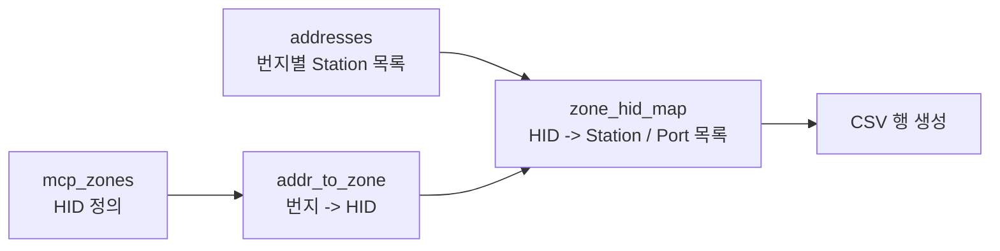

# Step 3 — 번지 ↔ HID 매핑 결정

> Step 2 에서 `mcp_zones` (또는 `rawHidMap`) 가 생겼다. 이제 **"3048 번지는 HID1
> 에 속한다"** 같은 매핑을 만들 차례.

---

## 1. 무엇을 만들어야 하나

```
입력:  mcp_zones[1] = { entries=[(3048,3023)], exits=[(3500,3525)] }
       mcp_zones[2] = { entries=[(4100,4150)], exits=[(4500,4530)] }
       ...

출력:  addr_to_zone[3048] = { 'zone_id': 1 }
       addr_to_zone[3023] = { 'zone_id': 1 }
       addr_to_zone[3500] = { 'zone_id': 1 }
       addr_to_zone[3525] = { 'zone_id': 1 }
       addr_to_zone[4100] = { 'zone_id': 2 }
       ...
```

---

## 2. 결정 규칙 (단순)

| 규칙 | 의미 |
|---|---|
| HID 의 Entry `start` 번지 → 그 HID 소속 | "들어오는 입구" 도 HID 영역 |
| HID 의 Entry `end` 번지 → 그 HID 소속 | |
| HID 의 Exit `start` 번지 → 그 HID 소속 | "나가는 출구" 도 HID 영역 |
| HID 의 Exit `end` 번지 → 그 HID 소속 | |

→ **Entry 와 Exit 의 4개 번지 모두를 그 HID 에 매핑.**

---

## 3. Python 코드 — `build_addr_to_zone_mapping()`

`OHT3/hid_zone_csv_cre.py:310-334`:

```python
def build_addr_to_zone_mapping(mcp_zones):
    addr_to_zone = {}

    for zone_id, zone_data in mcp_zones.items():
        mcp_id = zone_data.get('mcp_id', '')

        # Entry 의 start/end 모두 이 zone 에 매핑
        for entry_start, entry_end in zone_data.get('entries', []):
            addr_to_zone[entry_start] = {'zone_id': zone_id, 'mcp_id': mcp_id}
            addr_to_zone[entry_end]   = {'zone_id': zone_id, 'mcp_id': mcp_id}

        # Exit 의 start/end 모두 이 zone 에 매핑
        for exit_start, exit_end in zone_data.get('exits', []):
            addr_to_zone[exit_start] = {'zone_id': zone_id, 'mcp_id': mcp_id}
            addr_to_zone[exit_end]   = {'zone_id': zone_id, 'mcp_id': mcp_id}

    return addr_to_zone
```

이게 전부. 매우 단순함.

---

## 4. Python — 그 다음: Station 까지 매핑

`build_zone_hid_mapping()` (L336) 에서는 **번지에 붙어있는 Station** 도 같이 매핑:



```python
def build_zone_hid_mapping(addresses, stations, addr_to_zone):
    zone_hid_map = {}

    for addr_no, addr_data in addresses.items():
        if addr_no not in addr_to_zone:    # 번지 ↔ zone 매핑 있어야 함
            continue
        zone_id = addr_to_zone[addr_no]['zone_id']

        # 이 번지에 붙어있는 Station 들의 HID(port-id) 추출
        for stn_no in addr_data.get('stations', []):
            hid_id = stations[stn_no].get('port_id', '')
            if not hid_id:
                continue

            zone_hid_map[zone_id].append({
                'HID_ID':     hid_id,
                'Addr_No':    str(addr_no),
                'Station_No': str(stn_no)
            })

    return zone_hid_map
```

→ "HID1 안의 stations" 목록이 만들어짐.

---

## 5. 자바 측은 좀 다름

Java 는 위 같은 직접 매핑을 **만들지 않음**. 대신 [Step 4](04_RailEdge_부여.md) 에서
RailEdge 그래프 DFS 로 처리. 다만 부팅 단계에서 `mapFromNode2RawEdgeMap` 이라는
**번지 → RailEdge 후보 목록** 인덱스를 미리 만들어둠:

```java
// DataService 의 부팅 초기에 만들어지는 인덱스
// key: mcpName -> address -> RawEdge 목록
ConcurrentMap<String, Map<Integer, ConcurrentLinkedQueue<RawEdge>>>
    mapFromNode2RawEdgeMap;
```

이 인덱스로 Entry 시작 번지에서 곧바로 RawEdge 들을 찾을 수 있게 됨.

---

## 6. 결과 예시 (실제로 어떻게 생겼나)

`HID_ZONE_Master.csv` 일부:

| Zone_ID | HID_No | IN_Count | OUT_Count | IN_Lanes | OUT_Lanes | Vehicle_Max | Addr_No | Station_No |
|---:|---|---:|---:|---|---|---:|---|---|
| 1 | 1 | 2 | 2 | 3048→3023; 3100→3120 | 3500→3525; 3600→3640 | 20 | 3048 | 42 |
| 1 | 1 | 2 | 2 | 3048→3023; 3100→3120 | 3500→3525; 3600→3640 | 20 | 3023 | - |
| 1 | 1 | 2 | 2 | 3048→3023; 3100→3120 | 3500→3525; 3600→3640 | 20 | 3500 | 51 |
| 2 | 2 | 1 | 1 | 4100→4150 | 4500→4530 | 15 | 4100 | 78 |
| ... | | | | | | | | |

→ 같은 HID 의 여러 번지가 각 행으로 나옴.

---

## 7. 한 줄 정리


**번지 ↔ HID 매핑은 layout.xml 안에 이미 1:1 로 적혀있는 것이고,
우리는 그 관계를 단순히 Dict 로 옮긴 것**.

---

## 8. 빠뜨린 번지는?

Entry/Exit 에 등장하지 않는 번지(예: HID 내부의 중간 번지) 는 이 매핑에 들어가지 않음.

→ 그래서 **자바는 추가로 DFS** 를 돈다. ([Step 4](04_RailEdge_부여.md))
→ Python 은 CSV 생성용이라 입출구 번지만 알아도 충분.

---

*다음: [04_RailEdge_부여.md](04_RailEdge_부여.md) — RailEdge 객체에 hidId 부여*
