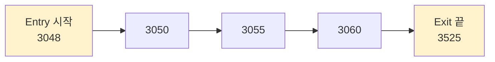
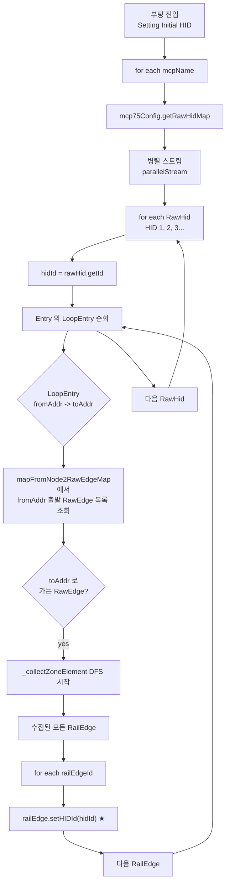
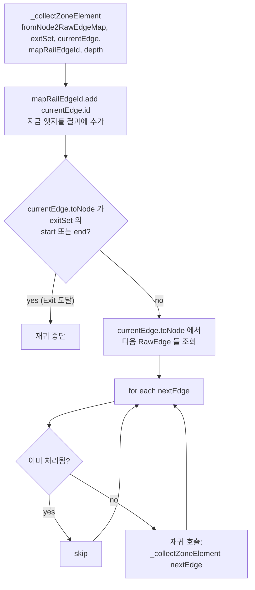
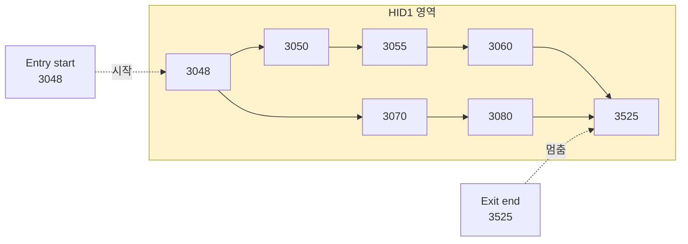
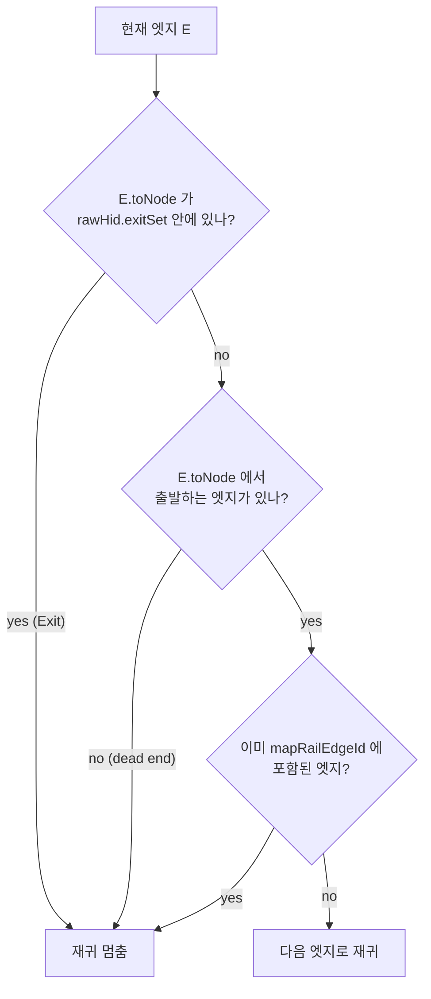

# Step 4 — RailEdge 객체에 hidId 부여 (자바 DFS)

> Step 3 까지로 "어느 번지가 어느 HID 인지" 는 알았다. 하지만 **HID 내부의 모든
> RailEdge** (입구와 출구 사이의 레일 조각들) 가 어느 HID 에 속하는지는 아직
> 모른다. 그걸 채우는 단계.

---

## 1. 왜 추가 작업이 필요한가



- layout.xml 에는 **3048 (Entry start)**, **3525 (Exit end)** 만 명시
- 그 사이의 **3050, 3055, 3060** 등 중간 RailEdge 들은 XML 에 HID 정보 없음
- 하지만 운영상 **"3055 번지의 RailEdge 도 HID1 에 속한다"** 를 알아야 함
- 그래서 부팅 시 **그래프 DFS** 로 채움

---

## 2. 누가 언제 하나

- 위치: `main/java/.../util/DataService.java:3104-3175`
- 로그 메시지: `"Setting Initial HID"`
- 실행 시점: SmartAtlas 부팅 중 단 1회

---

## 3. 알고리즘 흐름



---

## 4. `_collectZoneElement()` 재귀 (DataService.java:3612)

이 메서드가 핵심.



→ 시작 엣지부터 인접 엣지를 따라가며, **출구를 만나면 멈추고** 그 동안 지나간
모든 엣지를 `mapRailEdgeId` 에 모은다.

### 4.1 결과 시각화



→ 위 그림의 모든 엣지(3048→3050, 3050→3055, ..., 3070→3080, ...) 가 수집되어
   `railEdge.setHIDId(1)` 호출됨.

---

## 5. 자바 코드 핵심 발췌

`DataService.java:3104-3175`:

```java
this._START_PROCESS_LOG(++sequence, "Setting Initial HID");
Map<String, List<String>> tmpHidMap = new HashMap<>();

for (String mcpName : mcp75ConfigMap.keySet()) {
    final Map<String, RawHid> mapHid = mcp75ConfigMap.get(mcpName).getRawHidMap();

    pool.submit(() -> mapHid.values().parallelStream().forEach(rawHid -> {
        final Set<String> mapRailEdgeId = new HashSet<>();
        final Set<LoopEntry> entries = rawHid.getLoopEntrySet();
        final int hidId = rawHid.getId();                     // 1, 2, 3...
        String key = fabId + ":" + mcpName + ":" + String.format("%03d", hidId);

        for (LoopEntry loopEntry : entries) {
            final int fromAddress = loopEntry.getEntryLaneStart();   // 3048
            final int toAddress   = loopEntry.getEntryLaneEnd();     // 3023

            // fromAddress 에서 출발하는 RawEdge 들
            final ConcurrentLinkedQueue<RawEdge> rawEdges =
                    mapFromNode2RawEdgeMap.get(mcpName).get(fromAddress);

            for (RawEdge rawEdge : rawEdges) {
                if (rawEdge.toNode == toAddress) {
                    // ★ 시작 엣지 발견 → DFS 시작
                    this._collectZoneElement(
                            mapFromNode2RawEdgeMap.get(mcpName),
                            rawHid.getExitSet(),    // 멈춤 조건
                            rawEdge,                 // 현재 엣지
                            mapRailEdgeId,           // 결과 누적
                            1                        // depth
                    );
                    break;
                }
            }
        }

        // ★ 핵심: 수집된 모든 RailEdge 에 hidId 부여
        for (String railEdgeId : mapRailEdgeId) {
            RailEdge railEdge = tmpRailEdgeMap.get(railEdgeId);
            railEdge.setHIDId(hidId);                // ← 이 줄!
            bundleList.add(railEdge.getAddress());
        }

        tmpHidMap.put(key, bundleList);
    })).get();
}

// 다음 단계: Logpresso 적재 ([Step 5](05_DB_적재.md))
this._insertHidDataIntoLogpresso(tmpHidMap);

this._END_PROCESS_LOG(sequence, "Setting Initial HID");
```

---

## 6. RailEdge 객체의 변화

### 부팅 전 (XML 파싱 직후)
```java
RailEdge re = new RailEdge(...);
re.hidId = -1;        // 초기값
```

### 부팅 후 (Setting Initial HID 종료)
```java
re.hidId = 1;         // ★ DFS 로 부여됨
// 또는 2, 3, 4...
// HID 에 속하지 않는 RailEdge 는 여전히 -1
```

---

## 7. 병렬 처리

코드에서 `parallelStream()` 사용:
- **여러 RawHid 를 동시에 처리** (HID 100개 → 멀티 스레드로 동시 DFS)
- 각 DFS 는 자기 자신의 `mapRailEdgeId` Set 사용 → 충돌 없음
- 결과 `setHIDId()` 도 RailEdge 별로 한 번씩만 호출 → race condition 없음

⚠ 단, **두 HID 가 같은 RailEdge 를 지나가면** 어느 hidId 가 마지막에 박힐지
비결정적. 실제로 layout.xml 의 HID 구역들은 겹치지 않게 설계되어야 함.

---

## 8. DFS 가 끝나는 조건 (멈춤 규칙)



3가지 종료 조건:
1. Exit set 도달 (정상)
2. Dead end (그래프 종단)
3. 이미 방문한 엣지 (cycle 방지)

---

## 9. 결과 부산물 — `tmpHidMap`

DFS 의 부수 효과로 `tmpHidMap` 이라는 보조 자료가 만들어짐:

```java
tmpHidMap = {
    "M14A:MCP01:001": ["3048", "3050", "3055", ...],   // HID 1 에 속한 번지들
    "M14A:MCP01:002": ["4100", "4105", ...],
    ...
}
```

이게 [Step 5](05_DB_적재.md) 에서 `ATLAS_HID_INFO` 테이블로 적재됨.

---

## 10. 정리

| 입력 | 처리 | 출력 |
|---|---|---|
| `RawHid` (id, Entry, Exit) | `_collectZoneElement` DFS | `RailEdge.hidId` 세팅 |
| `mapFromNode2RawEdgeMap` (번지 → 엣지 인덱스) | | `tmpHidMap` (HID → 번지 목록) |

**한 줄 요약:** Entry 시작 번지에서 출발해 인접 엣지를 따라가며, Exit 만날 때까지
모든 RailEdge 에 `setHIDId(N)` 부여.

---

*다음: [05_DB_적재.md](05_DB_적재.md) — 결과를 Logpresso 마스터 테이블에 적재*
