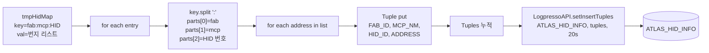
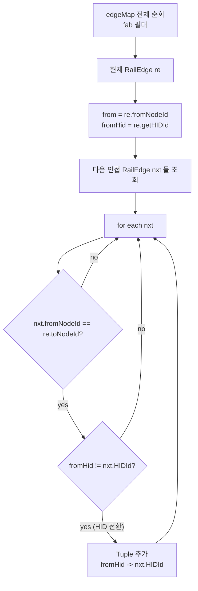
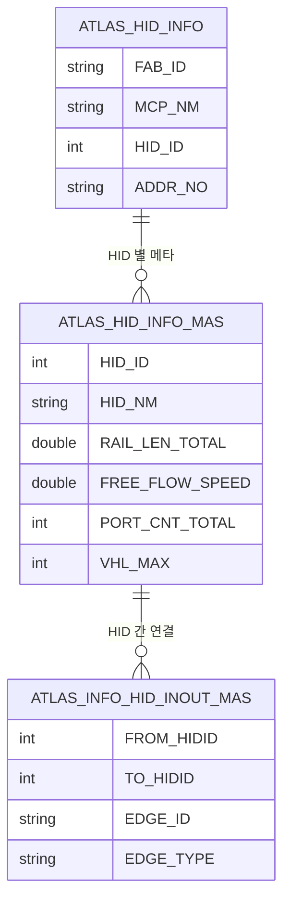
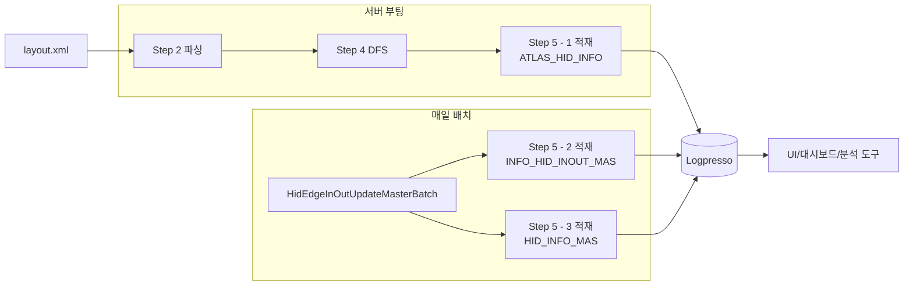

# Step 5 — Logpresso 마스터 테이블 적재

> Step 4 까지로 RailEdge 객체에 HID 가 박혔다. 이제 그 정보를 **DB 에 영구
> 저장** 해서 다른 시스템(UI/대시보드/분석) 이 조회할 수 있게 한다.

---

## 1. 적재되는 3개 테이블

| 테이블 | 적재 시점 | 데이터 |
|---|---|---|
| `ATLAS_HID_INFO` | 부팅 시 1회 | HID 별 번지 목록 (위 Step 4 의 `tmpHidMap`) |
| `{FAB}_ATLAS_INFO_HID_INOUT_MAS` | 일 1회 | HID 간 인접 엣지 마스터 |
| `{FAB}_ATLAS_HID_INFO_MAS` | 일 1회 | HID 별 메타정보 (레일길이/속도/포트 등) |

---

## 2. 적재 1 — `ATLAS_HID_INFO` (부팅 시)

### 위치
`DataService.java:4406-4444` `_insertHidDataIntoLogpresso()`

### 입력
[Step 4](04_RailEdge_부여.md) 에서 만들어진 `tmpHidMap`:

```java
tmpHidMap = {
    "M14A:MCP01:001": ["3048", "3050", "3055", ...],
    "M14A:MCP01:002": ["4100", "4105", ...],
    ...
}
```

### 적재 흐름



### 코드 발췌

```java
private void _insertHidDataIntoLogpresso(Map<String, List<String>> data) {
    List<Tuple> logpressoData = new ArrayList<>();

    for (Map.Entry<String, List<String>> entry : data.entrySet()) {
        String[] split = entry.getKey().split(":");
        String fabId   = split[0];
        String mcpName = split[1];
        int    hidId   = Integer.parseInt(split[2]);

        for (String address : entry.getValue()) {
            Tuple tuple = new Tuple();
            tuple.put("FAB_ID",   fabId);
            tuple.put("MCP_NM",   mcpName);
            tuple.put("HID_ID",   hidId);
            tuple.put("ADDR_NO",  address);
            logpressoData.add(tuple);
        }
    }

    boolean isInsertedData =
            LogpressoAPI.setInsertTuples("ATLAS_HID_INFO", logpressoData, 20);
}
```

→ HID 번호 - 번지 매핑이 DB 에 영구 저장됨.

---

## 3. 적재 2 — `{FAB}_ATLAS_INFO_HID_INOUT_MAS` (일 1회)

### 위치
`main/java/.../batch/HidEdgeInOutUpdateMasterBatch.java:180`

### 무엇을 적재하나
**HID 와 HID 사이의 인접 관계** (엣지 마스터).

예:
| FROM_HIDID | TO_HIDID | EDGE_ID | FROM_HID_NM | TO_HID_NM | EDGE_TYPE |
|---:|---:|---|---|---|---|
| 0 | 1 | "000:001" | OUTSIDE | HID_001 | IN |
| 1 | 2 | "001:002" | HID_001 | HID_002 | INTERNAL |
| 2 | 0 | "002:000" | HID_002 | OUTSIDE | OUT |
| 1 | 3 | "001:003" | HID_001 | HID_003 | INTERNAL |

`EDGE_TYPE`:
- `IN` = 외부 → HID (fromHidId == 0)
- `OUT` = HID → 외부 (toHidId == 0)
- `INTERNAL` = HID 간 이동

### 만드는 법



→ 결국 **모든 HID 간 전환 가능한 쌍** 이 DB 에 들어감.

---

## 4. 적재 3 — `{FAB}_ATLAS_HID_INFO_MAS` (일 1회)

### 위치
`HidEdgeInOutUpdateMasterBatch.java:271`

### 무엇을 적재하나
**HID 별 메타정보** (속성).

예:
| HID_ID | HID_NM | RAIL_LEN_TOTAL | FREE_FLOW_SPEED | PORT_CNT_TOTAL | VHL_MAX |
|---:|---|---:|---:|---:|---:|
| 1 | HID_001 | 1245.5 | 2.83 | 8 | 20 |
| 2 | HID_002 | 998.2 | 2.65 | 6 | 15 |

### 데이터 출처

| 컬럼 | 출처 |
|---|---|
| `HID_ID` | RailEdge.hidId |
| `RAIL_LEN_TOTAL` | HID 내 RailEdge 들의 `getLength()` 합 |
| `FREE_FLOW_SPEED` | HID 내 RailEdge 들의 `getMaxVelocity()` 평균 |
| `PORT_CNT_TOTAL` | HID 내 RailEdge 들의 `getPortIdList().size()` 합 |
| `VHL_MAX` | `RawHid.getVhlMax()` (XML 값) |

### 만드는 법

```java
Map<Integer, Double>       railLenByHid    = new HashMap<>();
Map<Integer, List<Double>> velocitiesByHid = new HashMap<>();
Map<Integer, Integer>      portCntByHid    = new HashMap<>();

for (AbstractEdge ae : edgeMap.values()) {
    if (!(ae instanceof RailEdge)) continue;
    RailEdge re = (RailEdge) ae;
    int hidId = re.getHIDId();
    if (hidId <= 0) continue;

    railLenByHid.merge(hidId, re.getLength(), Double::sum);

    double maxV = re.getMaxVelocity();
    if (maxV > 0) {
        velocitiesByHid.computeIfAbsent(hidId, k -> new ArrayList<>()).add(maxV);
    }

    if (re.getPortIdList() != null) {
        portCntByHid.merge(hidId, re.getPortIdList().size(), Integer::sum);
    }
}
```

→ HID 별로 RailEdge 들을 합산/평균해서 한 줄로 만듦.

---

## 5. 세 테이블의 관계



---

## 6. 적재 주기 정리

```mermaid
gantt
    title HID 마스터 데이터 적재 주기
    dateFormat HH:mm
    axisFormat %H:%M

    section 부팅
    ATLAS_HID_INFO          :crit, b1, 00:00, 5m

    section 매일 일정 시각 (Quartz)
    INFO_HID_INOUT_MAS      :a1, 02:30, 10m
    HID_INFO_MAS            :a2, 02:40, 10m

    section 1분마다 (Quartz)
    {FAB}_ATLAS_HID_INOUT   :active, c1, 00:01, 60m
```



→ **마스터 (부팅/일)** 와 **이력 (분)** 이 분리됨. ([Step 6](06_실시간_사용.md))

---

## 7. 한 번에 보는 적재 흐름



---

## 8. 정리

| 테이블 | 무엇 | 언제 |
|---|---|---|
| `ATLAS_HID_INFO` | HID → 번지 목록 | 부팅 시 1회 |
| `{FAB}_ATLAS_INFO_HID_INOUT_MAS` | HID 인접 엣지 (FROM/TO) | 매일 |
| `{FAB}_ATLAS_HID_INFO_MAS` | HID 메타 (속도/길이/포트수) | 매일 |
| `{FAB}_ATLAS_HID_INOUT` | 차량 전환 이력 (분 단위) | 1분 ([Step 6](06_실시간_사용.md)) |

---

*다음: [06_실시간_사용.md](06_실시간_사용.md) — 운영 중 HID 정보를 어떻게 활용*
