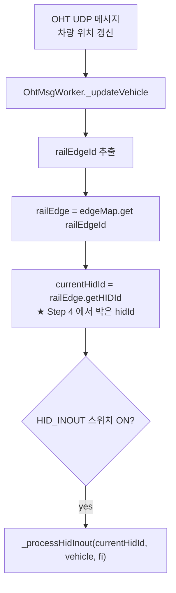
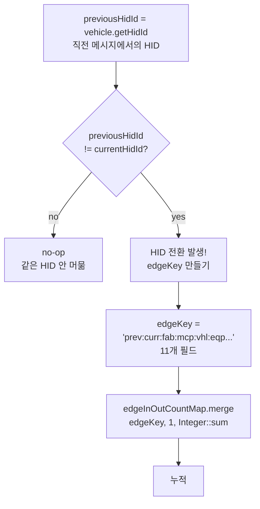
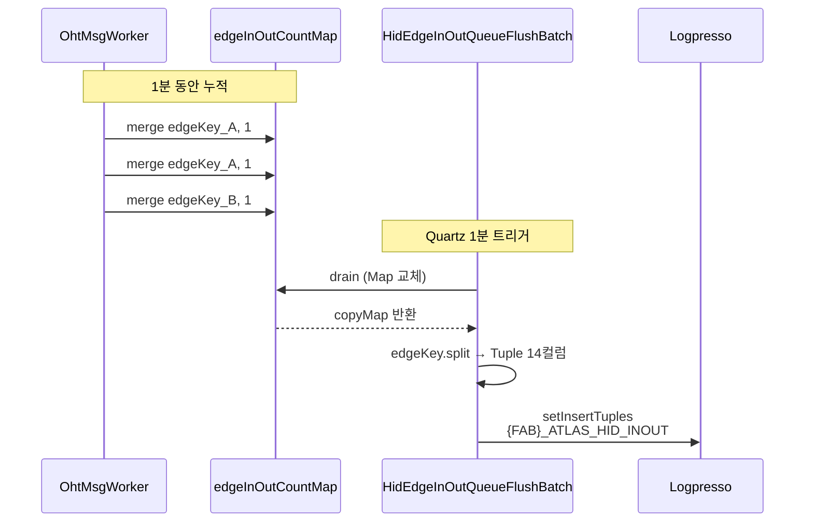
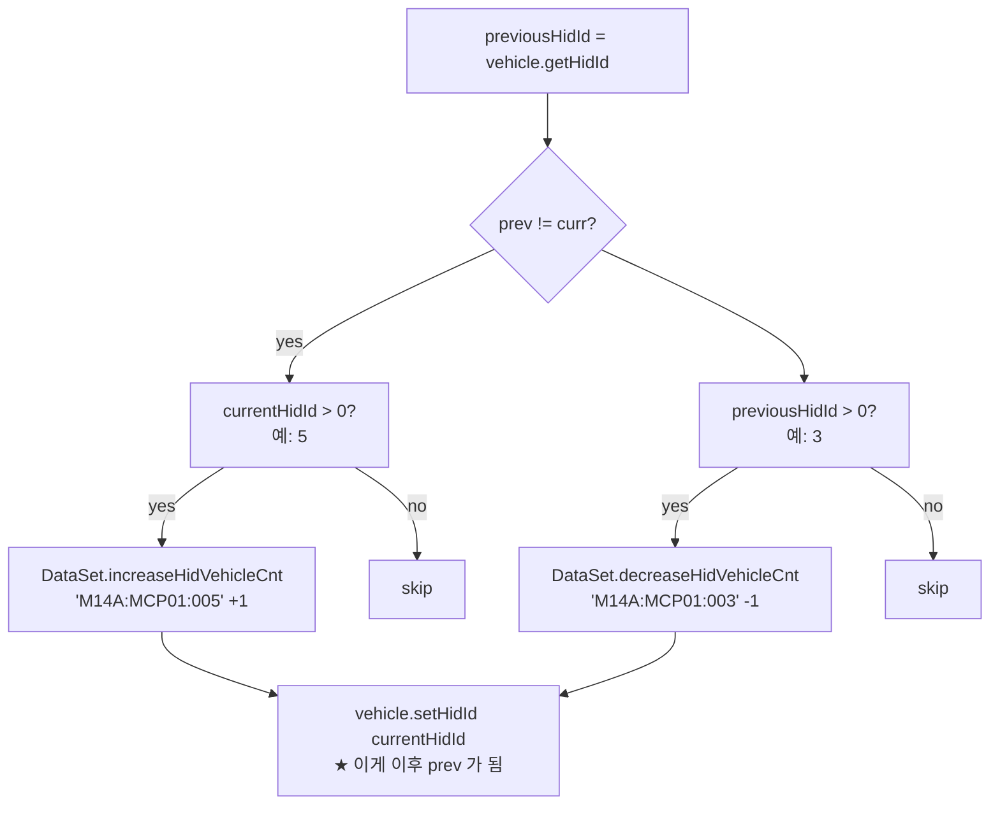
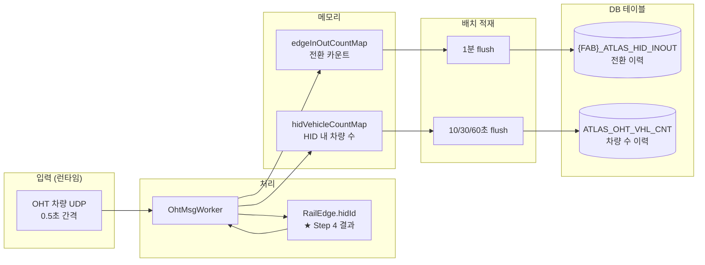

# Step 6 — 운영 중 HID 정보의 실시간 사용

> Step 5 까지로 마스터 데이터가 모두 셋업 완료. 이제 실제 운영에서 OHT 차량
> 메시지가 들어올 때 이 HID 정보를 어떻게 활용하는지.

---

## 1. 두 가지 실시간 활용

| 활용 | 무엇 | 결과 적재 |
|---|---|---|
| (A) HID IN/OUT 카운트 | 차량이 HID 를 넘어갈 때 카운트 +1 | `{FAB}_ATLAS_HID_INOUT` (1분) |
| (B) HID 내 차량 수 추적 | HID 별 현재 몇 대 있는지 | `ATLAS_OHT_VHL_CNT` (10/30/60초) |

---

## 2. 활용 (A) — HID IN/OUT 카운트

### 2.1 위치
`OhtMsgWorkerRunnable.java:473-522` `_processHidInout()`

### 2.2 트리거



### 2.3 `_processHidInout()` 동작



### 2.4 1분 후 적재



→ `{FAB}_ATLAS_HID_INOUT` 에 1분 분량의 row 들이 적재됨.

---

## 3. 활용 (B) — HID 내 차량 수 추적

### 3.1 위치
`OhtMsgWorkerRunnable.java:440-463` `_calculatedVhlCnt()`

### 3.2 동작



→ `DataSet.hidVehicleCountMap` 에 HID 별 현재 차량 수가 유지됨.

### 3.3 주기적 적재

`VhlCntBatch` / `VhlCnt10Batch` / `VhlCnt30Batch` / `VhlCnt60Batch` 가
각각 10초/30초/60초 단위로 `ATLAS_OHT_VHL_CNT` 에 적재.

---

## 4. 통합 운영 흐름



---

## 5. HID 정보가 없으면 어떻게 되나

| 시나리오 | 영향 |
|---|---|
| Step 4 의 `setHIDId` 가 안 박혔다 (hidId = -1) | `_processHidInout` 에서 `currentHidId = -1` → 매번 전환으로 잘못 인식 가능 |
| HID_INOUT 스위치 OFF | 카운트 안 함. `{FAB}_ATLAS_HID_INOUT` 적재 안 됨 |
| VHL_CNT 스위치 OFF | `vehicle.setHidId` 안 불려서 `previousHidId` 가 영구히 -1 → HID_INOUT 도 깨짐 |

→ 두 스위치를 **함께 ON** 해야 정상 동작 ([HID_INOUT_FLOW.md §3.4 참조](../HID_INOUT_FLOW.md))

---

## 6. 운영 중 모니터링 가능한 것

| 분석 | 원본 테이블 |
|---|---|
| HID 별 진입/이탈 빈도 | `{FAB}_ATLAS_HID_INOUT` `FROM_HIDID`, `TO_HIDID`, `TRANS_CNT` |
| 시간대별 트래픽 | `{FAB}_ATLAS_HID_INOUT` `EVENT_DT` |
| 혼잡도 (현재 vs 한계) | `ATLAS_OHT_VHL_CNT` vs `{FAB}_ATLAS_HID_INFO_MAS.VHL_MAX` |
| 차량별 이동 패턴 | `{FAB}_ATLAS_HID_INOUT` `VHL_ID`, `EVENT_DT` |
| HID 평균 속도 | `{FAB}_ATLAS_HID_INFO_MAS.FREE_FLOW_SPEED` |

---

## 7. 전체 라이프사이클 한 줄 정리

```
설비팀 layout.xml 작성
    ↓
SmartAtlas 부팅
    ├─ Step 2: XML 파싱 → RawHid 객체 N개
    ├─ Step 4: DFS 로 RailEdge 에 hidId 부여
    └─ Step 5: ATLAS_HID_INFO 적재
    ↓
운영 시작
    ├─ Step 6-A: 차량 메시지 → edgeInOutCountMap 누적 → 1분마다 {FAB}_ATLAS_HID_INOUT
    └─ Step 6-B: 차량 메시지 → hidVehicleCountMap 증감 → 10/30/60초 ATLAS_OHT_VHL_CNT
    ↓
매일 02:30
    └─ Step 5: {FAB}_ATLAS_INFO_HID_INOUT_MAS + {FAB}_ATLAS_HID_INFO_MAS 마스터 갱신
```

---

## 8. 끝

이 6단계로 SmartAtlas 의 HID 구역 생성 ~ 활용이 완료됨.

| 단계 | 핵심 |
|---|---|
| [Step 1](01_원본_레이아웃.md) | layout.xml 의 `<McpZone>` |
| [Step 2](02_XML_파싱.md) | 라인 파싱 + `RawHid` 생성 |
| [Step 3](03_번지매핑.md) | 입출구 번지 → HID 매핑 |
| [Step 4](04_RailEdge_부여.md) | DFS 로 RailEdge.hidId 부여 |
| [Step 5](05_DB_적재.md) | 3개 마스터 테이블 적재 |
| [Step 6](06_실시간_사용.md) | 실시간 카운트 적재 (이 문서) |

---

*폴더 진입점: [README.md](README.md)*
