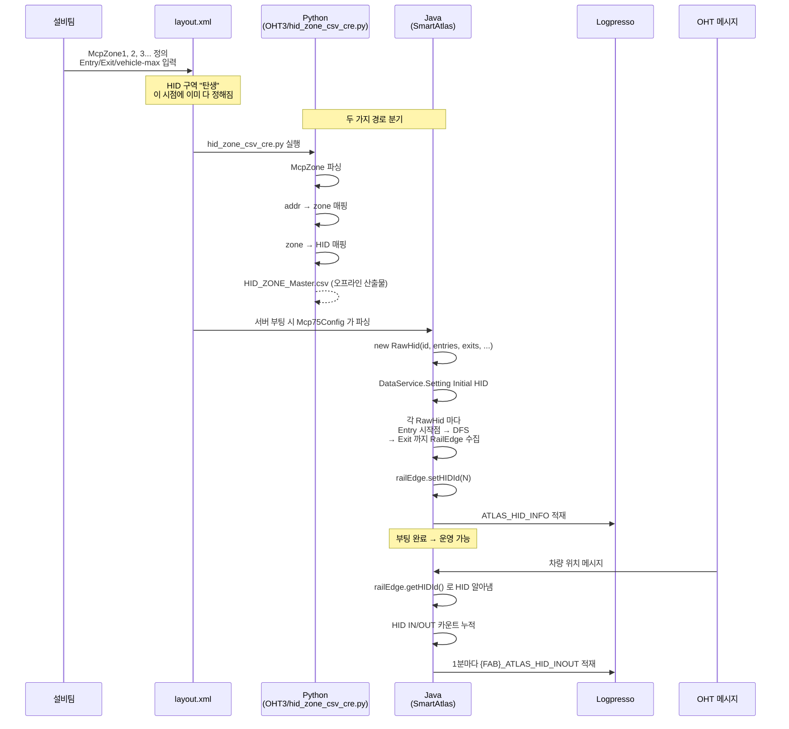

# HID 구역 생성 과정 — 단계별 절차서

> SmartAtlas 의 HID 구역(HID1, HID2, ...) 이 어떻게 만들어졌는지를 **순서대로**
> 따라가는 절차서. 처음 보는 사람도 이 폴더만 읽으면 전 과정을 알 수 있게 정리.

---

## 📑 문서 구성

| 파일 | 단계 |
|---|---|
| [README.md](README.md) (이 파일) | 전체 흐름 / 한눈에 보기 |
| [01_원본_레이아웃.md](01_원본_레이아웃.md) | Step 1 — layout.xml 에 HID 구역이 정의되어 있다 |
| [02_XML_파싱.md](02_XML_파싱.md) | Step 2 — Python/Java 가 XML 을 어떻게 읽나 |
| [03_번지매핑.md](03_번지매핑.md) | Step 3 — 어떤 번지가 어떤 HID 인지 결정 |
| [04_RailEdge_부여.md](04_RailEdge_부여.md) | Step 4 — RailEdge 객체에 HID 번호 부여 (DFS) |
| [05_DB_적재.md](05_DB_적재.md) | Step 5 — Logpresso 마스터 테이블 적재 |
| [06_실시간_사용.md](06_실시간_사용.md) | Step 6 — 차량 메시지가 HID 를 어떻게 활용 |

---

## ⏱ 한눈에 보는 전체 과정


---

## 🎯 핵심 사실 6가지

1. **HID 구역 번호(HID1, HID2)는 우리가 정한 게 아니다.**
   layout.xml 의 `<group name="McpZone1">` 의 `<param key="id" value="1">` 그대로.

2. **HID 의 경계는 Entry/Exit 번지로 정의된다.**
   ```xml
   <group name="Entry1"><param key="start" value="3048"/><param key="end" value="3023"/></group>
   ```
   이 한 쌍이 "HID 로 들어오는 입구 한 곳" 임.

3. **IN_COUNT / OUT_COUNT = Entry/Exit 그룹의 개수.**
   별도 계산 없음. XML 안에서 `<group name="Entry...">` 가 몇 개냐 그게 IN_COUNT.

4. **각 RailEdge 가 어느 HID 에 속하는지는 자바 부팅 시 DFS 로 결정된다.**
   `DataService._collectZoneElement()` 가 Entry 시작점부터 인접 엣지 따라가며
   Exit 만날 때까지 수집 → 그 모든 RailEdge 에 `setHIDId(N)`.

5. **결과는 두 군데에 영구 저장된다.**
   - 인메모리: `RailEdge.hidId` (런타임 사용)
   - DB: `ATLAS_HID_INFO`, `{FAB}_ATLAS_HID_INFO_MAS`, `{FAB}_ATLAS_INFO_HID_INOUT_MAS`

6. **실시간 모니터링은 이 결과를 읽어서 쓴다.**
   `OhtMsgWorkerRunnable._processHidInout()` 이 차량 위치 갱신 때마다
   `railEdge.getHIDId()` 로 어느 HID 에 있는지 알아냄 → IN/OUT 카운트.

---

## 📍 시간순 흐름 (한 번 더)



---

## ❓ 자주 묻는 질문

### Q1. HID 번호는 누가 정했나?
A. **설비팀이 layout.xml 만들 때 매김.** 우리는 그 번호를 그대로 가져왔을 뿐.

### Q2. HID 안에 어떤 RailEdge 가 포함되는지 어떻게 알았나?
A. **layout.xml 에는 Entry/Exit 번지만 있음.** 그 사이의 RailEdge 들은
자바가 부팅 시 **그래프 DFS 탐색**으로 찾아냄 (`_collectZoneElement` 재귀).

### Q3. IN_COUNT 가 왜 3 이고 OUT_COUNT 는 2 인가?
A. layout.xml 안에 그 HID 의 `<group name="Entry...">` 가 3개,
`<group name="Exit...">` 가 2개 있어서.

### Q4. HID 가 바뀌면 어떻게 하나?
A. **layout.xml 을 새로 받아서 서버를 재기동**하면 자동으로 새 HID 가
부여됨. 실시간 변경은 안 됨.

### Q5. 우리가 만든 코드와 외부에서 받은 데이터의 경계가 어디인가?
A. **layout.xml 까지가 외부에서 받는 것.** 그 뒤(파싱/DFS/DB 적재)는 우리 코드.

---

## 📂 폴더 파일 가이드

| 무엇이 궁금한가 | 어느 문서 |
|---|---|
| layout.xml 안에 뭐가 들어있나? | [01_원본_레이아웃.md](01_원본_레이아웃.md) |
| Python/Java 가 XML 을 어떻게 읽나? | [02_XML_파싱.md](02_XML_파싱.md) |
| 어떤 번지가 어떤 HID 에 속하나? | [03_번지매핑.md](03_번지매핑.md) |
| RailEdge 에 HID 번호는 언제 박히나? | [04_RailEdge_부여.md](04_RailEdge_부여.md) |
| 결과가 어느 DB 테이블에 들어가나? | [05_DB_적재.md](05_DB_적재.md) |
| 운영 중 실제로 어떻게 쓰이나? | [06_실시간_사용.md](06_실시간_사용.md) |

---

## 📚 관련 자료

- 전체 분석: `../HID_구역_만든방법.md` (이전 통합본)
- 적재 로직: `../HID_INOUT_FLOW.md`
- 코드 모음: `../hid_inout_logic/`
- SmartAtlas 분석: `../smartatlas_analysis/`
