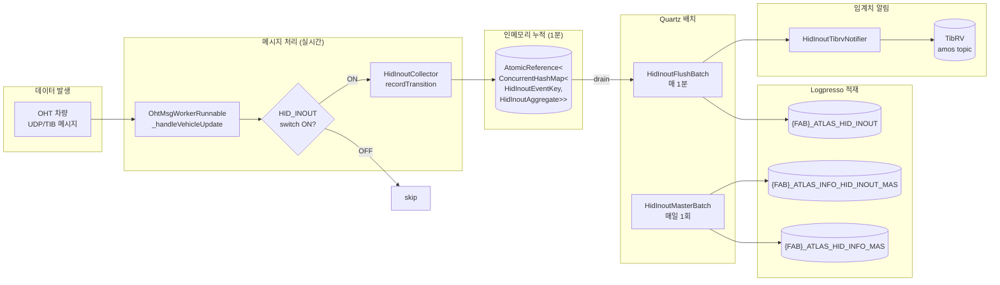
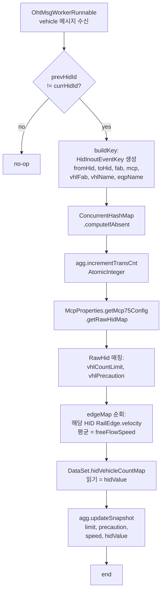
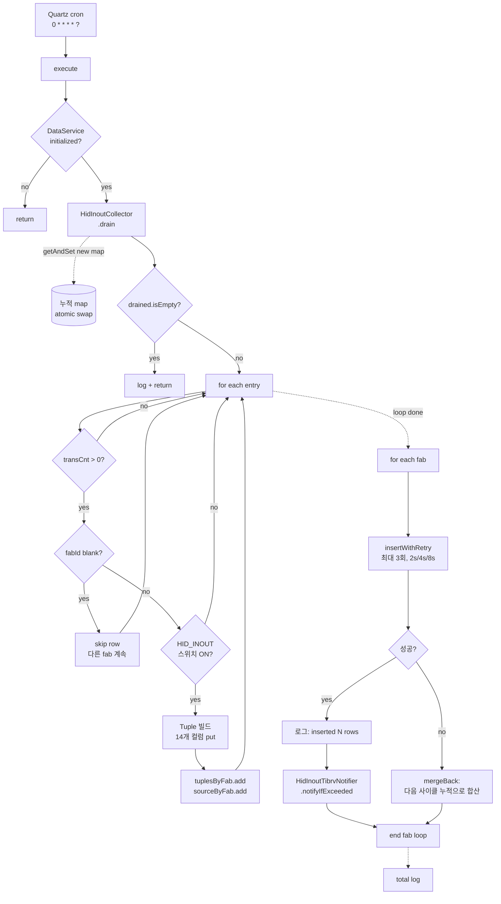
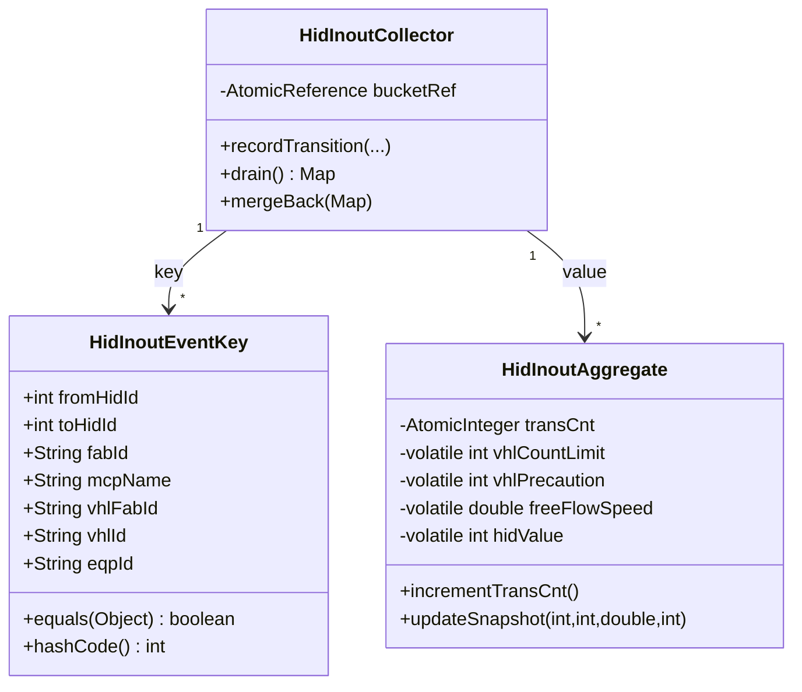
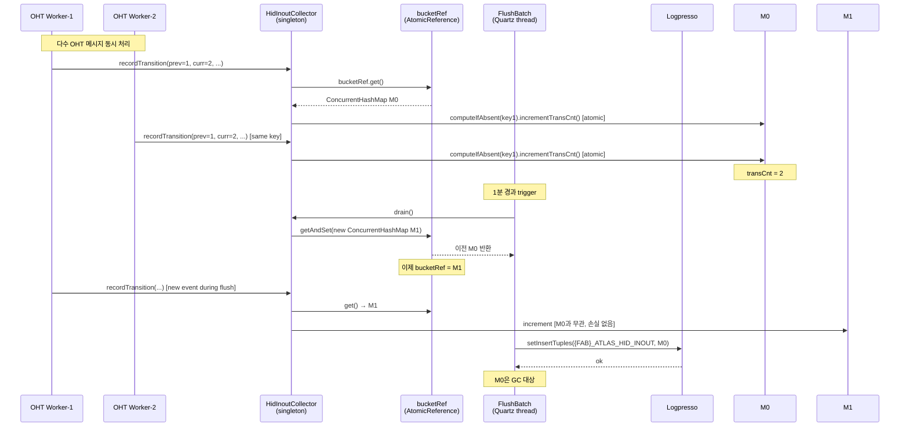
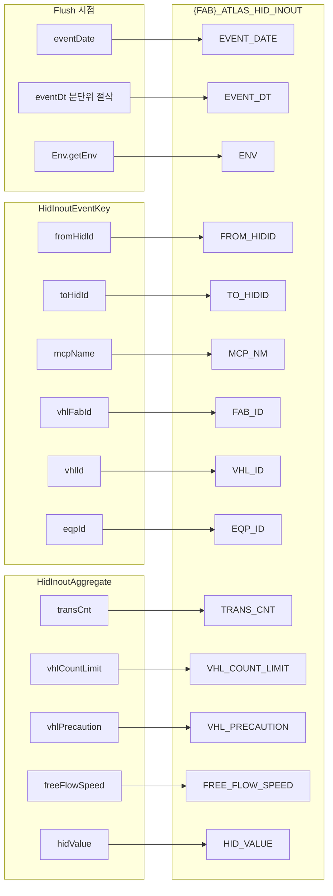
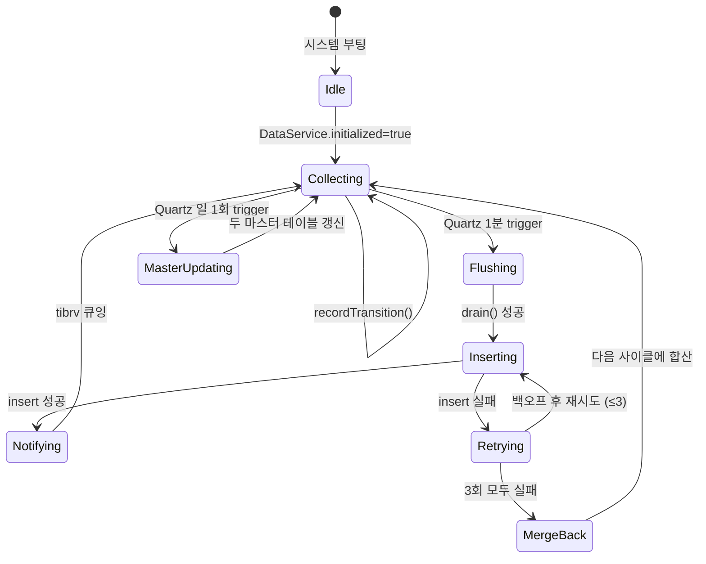

# HID IN/OUT 로직 흐름도

`ALT/hid_inout_new/` 신규 구현의 전체 데이터 흐름을 시각화한 문서.
(기존 `HidEdgeInOutQueueFlushBatch` / `HidEdgeInOutUpdateMasterBatch` 와 병행
가능하지만, 운영 시에는 한쪽 Quartz Job 만 enable)

---

## 1. 전체 아키텍처



---

## 2. 실시간 수집: HidInoutCollector.recordTransition()



**핵심:**
- `incrementTransCnt()` 는 `AtomicInteger.incrementAndGet()` — 다수 OHT 워커 동시 호출 안전
- 스냅샷 4개 필드는 `volatile` — 마지막 관측치만 보존 (분단위 통계라 단조성 불필요)
- 예외는 catch 후 흡수 → 단일 차량 처리 실패가 전체 메시지 루프 정지시키지 않음

---

## 3. 1분 적재: HidInoutFlushBatch.execute()



**기존 대비 핵심 차이:**

| 단계 | 기존 | 신규 |
|---|---|---|
| drain | `forEach` 후 `setEdgeInOutCountMap(new)` (그 사이 이벤트는 새 map으로) | `AtomicReference.getAndSet()` — 원자적 swap |
| blank fabId | `return` (전체 종료) | `continue` (해당 행만 skip) |
| insert 실패 | 손실 | 3회 백오프 → 그래도 실패 시 `mergeBack` |
| 알림 | 주석 처리 | `HidInoutTibrvNotifier` 호출 |

---

## 4. 키 구조: HidInoutEventKey



기존: `"%03d:%03d:%s:%s:%s:%s:%s:%s:%s:%s:%s"` 11토큰 문자열 → `split(":")` 파싱
신규: 타입 안전 record-like class → 이름에 `:` 가 있어도 안전, `equals/hashCode` 명시

---

## 5. 일간 마스터 갱신: HidInoutMasterBatch

```mermaid
flowchart TD
    Q[Quartz cron<br/>0 30 2 * * ?] --> A[execute]
    A --> B[for each fab]
    B --> C{FabProperties<br/>null?}
    C -- yes --> B
    C -- no --> D[filterRailEdgesForFab<br/>fab + RailEdge만]
    D --> E{비어있음?}
    E -- yes --> B
    E -- no --> F[for each mcp]
    F --> G{HID_INOUT<br/>스위치 ON?}
    G -- no --> F
    G -- yes --> H[collectRawHidById<br/>id → RawHid 맵]

    H --> I[updateEdgeMaster]
    I --> I1[fromNodeId 인덱스 빌드<br/>O&#40;N&#41;]
    I1 --> I2[엣지 순회 → 다음 엣지의<br/>HID 와 비교, 다르면 전환]
    I2 --> I3[dedup&#58; fromHid:toHid]
    I3 --> I4[EDGE_TYPE 결정&#58;<br/>0→x = IN, x→0 = OUT,<br/>그 외 = INTERNAL]
    I4 --> I5[Tuple put → tuples 누적]
    I5 --> I6[Logpresso insert<br/>{FAB}_ATLAS_INFO_HID_INOUT_MAS]

    I6 --> J[updateHidInfoMaster]
    J --> J1[HID별 집계&#58;<br/>railLen 합계,<br/>maxVelocity 목록,<br/>portCnt 합계]
    J1 --> J2[RawHid에서<br/>VHL_MAX, ZCU_ID,<br/>IN_CNT, OUT_CNT]
    J2 --> J3[HID별 Tuple 빌드]
    J3 --> J4[Logpresso insert<br/>{FAB}_ATLAS_HID_INFO_MAS]

    J4 --> F
    F -.->|loop done| B
```

---

## 6. 임계치 알림: HidInoutTibrvNotifier

```mermaid
flowchart LR
    A[HidInoutAggregate<br/>flush row] --> B[ThresholdPolicy<br/>.evaluate]
    B --> C{limit &gt; 0 &amp;&amp;<br/>value &gt;= limit?}
    C -- yes --> D1[CRITICAL]
    C -- no --> E{warn &gt; 0 &amp;&amp;<br/>value &gt;= warn?}
    E -- yes --> D2[WARNING]
    E -- no --> D3[NONE]
    D3 --> X[no send]
    D1 --> F[Map 빌드:<br/>TYPE = OHT.HID.INOUT<br/>+ SEVERITY<br/>+ 14 fields]
    D2 --> F
    F --> G[DataService<br/>.getTibrvSenderLikeMap<br/>fabRouteId&#58;send&#58;amos]
    G --> H[for each sender<br/>addTibrvMessageQueue]
    H --> RV[(TibRV)]
```



`setThresholdPolicy(custom)` 으로 정책 교체 가능.

---

## 7. 동시성 모델



**보장:**
- flush 진행 중 도착한 이벤트는 새 map(M1) 에 들어가므로 **이중 집계 없음**
- M0 직렬화 중에는 그 누구도 M0 을 수정하지 않으므로 **카운트 손실 없음**
- 실패 시 `mergeBack(M0)` 으로 M1 에 합쳐 다음 사이클 재시도

---

## 8. {FAB}_ATLAS_HID_INOUT 컬럼 매핑



---

## 9. 상태 전이 (전체 라이프사이클)



---

## 10. 파일 구조

```
ALT/hid_inout_new/
├── README.md                          # 사용 가이드
├── LOGIC_DIAGRAM.md                   # ← 이 파일
└── src/com/skhynix/smartatlas/hidinout/
    ├── HidInoutTableSchema.java       (95)   상수
    ├── HidInoutEventKey.java          (73)   키
    ├── HidInoutAggregate.java         (45)   누적치
    ├── HidInoutCollector.java         (187)  수집기
    ├── HidInoutFlushBatch.java        (155)  1분 적재
    ├── HidInoutMasterBatch.java       (301)  일 마스터 갱신
    └── HidInoutTibrvNotifier.java     (95)   임계치 알림
```
