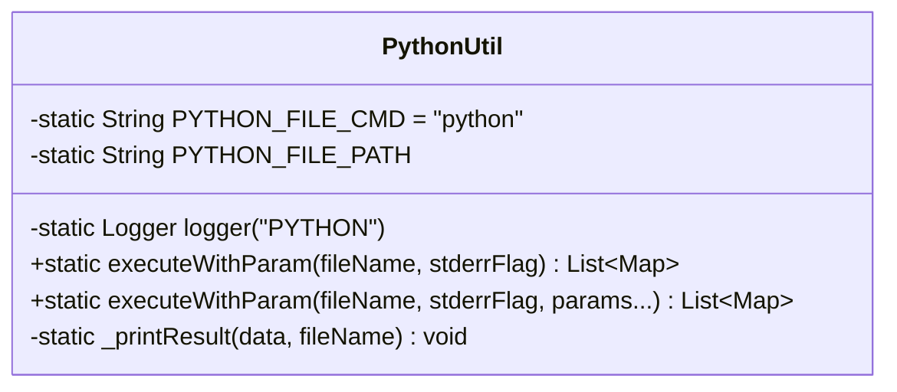
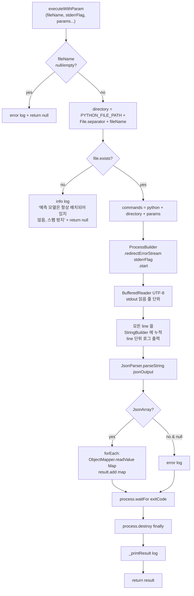
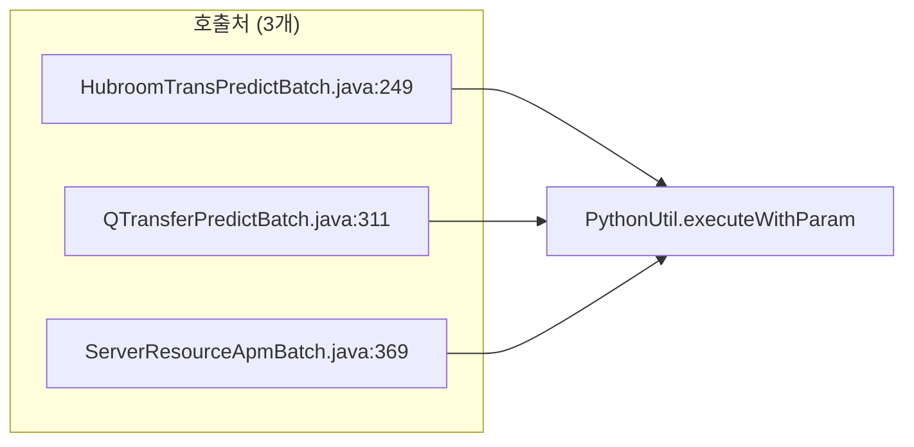

# 01. `util/PythonUtil.java` — Python 실행 핵심 분석

> **위치:** `main/java/com/skhynix/smartatlas/util/PythonUtil.java` (151 라인)
> **역할:** 자바에서 외부 Python 인터프리터를 실행하고 stdout JSON 을 파싱해 반환

---

## 1. 클래스 개요



전부 `static` 메서드 — 인스턴스화 없음. 호출자는 `PythonUtil.executeWithParam(...)` 한 줄.

---

## 2. 상수 (라인 20-23)

| 상수 | 값 | 의미 |
|---|---|---|
| `logger` | `LoggerFactory.getLogger("PYTHON")` | 별도 logger 카테고리 |
| `PYTHON_FILE_CMD` | `"python"` | 실행 명령 (PATH 의존) |
| `PYTHON_FILE_PATH` | `String.format("%s\\%s", FilePathUtil.REPOSITORY_PATH, PYTHON_FILE_CMD)` | Python 스크립트 루트 |

⚠ `PYTHON_FILE_PATH` 는 `"\\"` 구분자 사용 = **Windows 전용**.

`FilePathUtil.REPOSITORY_PATH = System.getProperty("SMARTFX_REPOSITORY")` 이므로
JVM 기동 시 `-DSMARTFX_REPOSITORY=...` 로 주입되는 디렉토리 하위 `/python/` 폴더.

---

## 3. `executeWithParam(fileName, stderrFlag, params...)` 동작

라인 35-115.

### 3.1 전체 흐름



### 3.2 핵심 코드 발췌 (라인 55-72)

```java
commands.add(PYTHON_FILE_CMD);        // "python"
commands.add(directory);              // 절대 경로
if (params != null && params.length > 0) {
    Collections.addAll(commands, params);
}

ProcessBuilder processBuilder = new ProcessBuilder(commands);
processBuilder.redirectErrorStream(stderrFlag);
process = processBuilder.start();

try (BufferedReader reader = new BufferedReader(
        new InputStreamReader(process.getInputStream(), "UTF-8"))) {
    // ...
}
```

⚠ 주석: `// !!! no using StandardCharsets (---> there is occurred parsing exception)` — 일부러
`"UTF-8"` 문자열을 쓴 이유가 있음 (이전 버그 회피).

### 3.3 입력 / 출력 명세

**입력:**
- `fileName` (필수): 실행할 `.py` 파일 이름 (절대경로 아님 — `PYTHON_FILE_PATH` 와 합성)
- `stderrFlag` (필수): true → stderr 도 stdout 으로 합쳐서 받음 / false → 분리
- `params` (가변): Python 스크립트의 command-line argument

**출력:**
- 정상: `List<Map<String, Object>>` (JSON Array → 각 Object → Map)
- 비정상:
  - `fileName` null/empty → `null` 반환 (에러 로그)
  - 파일 미존재 → `null` 반환 (info 로그)
  - JSON 파싱 실패 → 예외 catch 후 빈 result 반환 (에러 로그)
  - JSON Object/Primitive 반환 → 에러 로그 후 빈 result

⚠ **반환 가능 값이 `null` 과 빈 리스트 두 종류** — 호출자는 항상 null 검사 필요.

---

## 4. `_printResult(data, fileName)` 로그 헬퍼

라인 121-150. 디버그 출력만 담당.

- 빈 결과 → `info: calculated prediction is empty`
- 결과 있음 → `<PREDICTION RESULT [filename]>` 헤더 + row 별로
  `[ROW=N] column: value` 형식 출력
- 2번째 row 부터 `==========` 구분선

---

## 5. 의존성

| 외부 | 사용 |
|---|---|
| `java.lang.ProcessBuilder` | Python 프로세스 생성 |
| `java.io.BufferedReader` | stdout 읽기 |
| `com.fasterxml.jackson.databind.ObjectMapper` | JSON Object → Map 변환 |
| `com.google.gson.JsonParser` / `JsonArray` / `JsonElement` | JSON Array 1차 파싱 |
| `FilePathUtil.REPOSITORY_PATH` | 경로 prefix |

⚠ Jackson 과 Gson 을 **둘 다 사용** — 단일화 권장.

---

## 6. 호출하는 곳 (외부에서 본 의존)



상세 호출 시그니처는 [02_INVOCATION_SITES.md](02_INVOCATION_SITES.md) 참조.

⚠ `AmosMinBatch`, `AmosBoundryBatch` 는 **`PythonUtil` 을 사용하지 않고** `ProcessBuilder` 를 직접 작성 (working directory 설정이 필요해서) — 분리 시 통일 필요.

---

## 7. 분리 시 변경 포인트 요약

| 변경 | 이유 |
|---|---|
| `PYTHON_FILE_CMD` 제거 | 더 이상 로컬 python 호출 안 함 |
| `PYTHON_FILE_PATH` 제거 | 로컬 디렉토리 의존 제거 |
| `ProcessBuilder` 로직 전체 → `HttpClient` 로 교체 | REST 호출 |
| 메서드 시그니처 유지 (`executeWithParam(fileName, stderrFlag, params...)`) | 호출처 코드 무변경 |
| `fileName` → endpoint path 또는 model_id 로 매핑 | API 라우팅 |
| `params...` → JSON body 의 필드로 직렬화 | API 입력 |
| stdout JSON Array 처리 → HTTP response body 처리 | 동일 결과 형식 유지 |

이 어댑터 변환의 코드 예시는 [04_SEPARATION_STRATEGY.md](04_SEPARATION_STRATEGY.md) §3 참조.

---

## 8. ⚠ 주의 사항

1. **`File.separator`** vs **`"\\"`**: 라인 23 은 `"\\"` 하드, 라인 39 는 `File.separator` 혼용 → Linux 에서 깨짐.
2. **버퍼링 안 함**: `BufferedReader.readLine()` 만 호출 — 매우 큰 출력에서 OOM 가능.
3. **`process.destroy()` finally**: 정상 종료 후에도 호출 — exitCode 받은 직후라 OS 따라 SIGTERM 중복 전송.
4. **`Map.class` raw type**: 라인 90 `readValue(jsonObject.toString(), Map.class)` → unchecked warning 발생.
5. **JSON Object/Primitive 반환을 거부**: Python 이 `{}` 한 줄 반환하면 에러로 취급되어 결과 손실.
6. **Timeout 없음**: `process.waitFor()` 가 무한 대기 → Python hang 시 Quartz 스레드 영구 점유.

---

*다음 문서: [02_INVOCATION_SITES.md](02_INVOCATION_SITES.md) — 호출부 5개 배치 상세*
