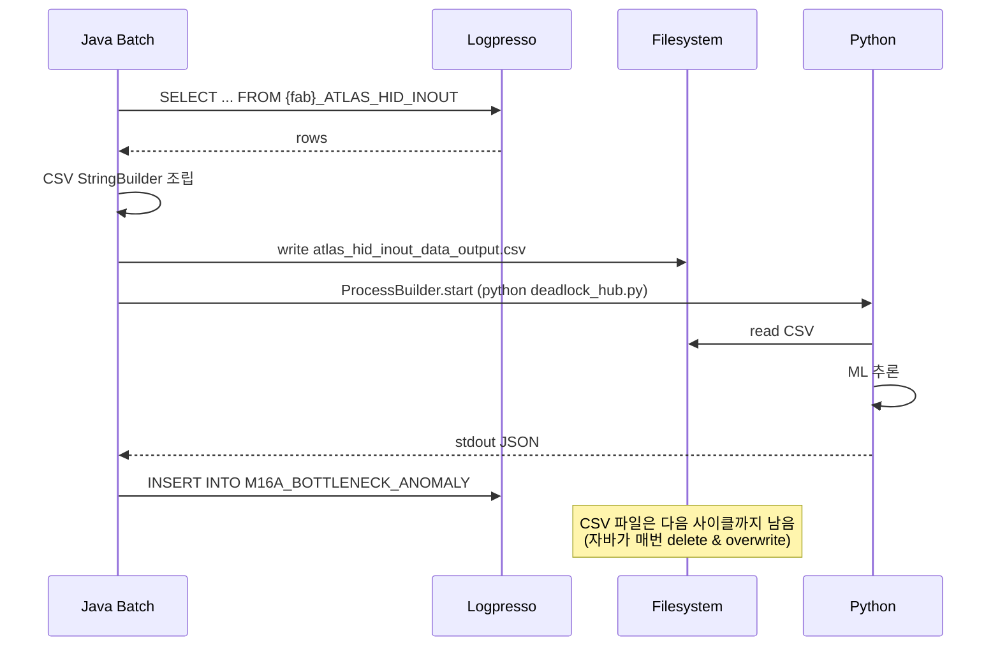

# 03. Python 스크립트 인벤토리

> **위치:** `$SMARTFX_REPOSITORY/python/` (예: `/opt/smartfx/python/` 또는 `C:\smartfx\python\`)
> 자바 코드에서 식별 가능한 스크립트 + 동적 로딩되는 스크립트 총정리.

---

## 📁 디렉토리 구조 (추정)

```
$SMARTFX_REPOSITORY/python/
├── atlas_hid/
│   ├── deadlock_hub.py                ← AmosMinBatch._predictor_atlas_hid 가 호출
│   ├── data/
│   │   └── atlas_hid_inout_data_output.csv   ← 자바가 생성
│   └── app/                           ← Python 측 모듈 (자바 주석 라인 417-418 에서 언급)
│
├── star_idc/
│   ├── standard_detector.py           ← AmosMinBatch._predictor_star_idc
│   ├── boundary_batch.py              ← AmosBoundryBatch._predictor_star_idc_data
│   ├── data/
│   │   └── star_idc_inout_data_output.csv    ← 자바가 생성
│   └── app/
│
├── star_event/
│   ├── 3DO_PRETIME_TEST3.py           ← AmosMinBatch._predictor_star_event
│   ├── data/
│   │   └── star_event_inout_data_output.csv  ← 자바가 생성
│   ├── output/                        ← 인자 -o ./output 으로 지정
│   └── app/
│
├── HUB_ROOM_*.py                      ← HubroomTransPredictBatch 가 pyInfoList 로 동적 호출
├── Q_TRANSFER_PREDICTOR_10m.py        ← QTransferPredictBatch default
├── Q_TRANSFER_*.py                    ← QTransferPredictBatch 동적 모델
├── SERVER_RESOURCE_MODEL.py           ← ServerResourceApmBatch
├── HUBROOM_PIVOT_DATA.csv             ← 자바(HubroomTransPredictBatch)가 생성
└── data/
    └── APMWEEKDATA.csv                ← 자바(ServerResourceApmBatch)가 생성
```

---

## 1. 식별된 정적 스크립트 7개

### 1.1 `atlas_hid/deadlock_hub.py`

| 항목 | 값 |
|---|---|
| 호출 자바 | `AmosMinBatch.java:406` (`_predictor_atlas_hid`) |
| working dir | `python/atlas_hid/` |
| 입력 파일 | `data/atlas_hid_inout_data_output.csv` |
| 입력 데이터 출처 | `{FAB}_ATLAS_HID_INOUT` Logpresso 테이블 |
| CSV 컬럼 | `EVENT_DT, HID_1_FROM_SUM, HID_2_FROM_SUM, ..., HID_N_FROM_SUM` (N = `COLUMN_SIZE` 상수) |
| 명령행 인자 | 없음 |
| 출력 (stdout) | 2중 JSON Array: `[ [features_rows...], [anomaly_rows...] ]` |
| 자바 사용 | `anomaly_rows` 만 사용 → `M16A_BOTTLENECK_ANOMALY` 적재 |
| 모델 종류 (추정) | HID 구간 deadlock / bottleneck 예측 |
| 트리거 주기 | `AmosMinBatch` 의 cron (대개 분 단위) |

**Python 측 출력 규약:**
```json
[
  [ {"col1": v, "col2": v, ...}, ... ],   // features (현재 자바에서 사용 안 함)
  [ {"FAB_ID": "M16A", "HID_ID": 5, "SCORE": 0.87, ...}, ... ]   // anomaly
]
```

---

### 1.2 `star_idc/standard_detector.py`

| 항목 | 값 |
|---|---|
| 호출 자바 | `AmosMinBatch.java:848` (`_predictor_star_idc`) |
| working dir | `python/star_idc/` |
| 입력 파일 | `data/star_idc_inout_data_output.csv` |
| 명령행 인자 | 없음 |
| 출력 | 2중 JSON Array (`deadlock_hub.py` 와 같음) + 단일 Object fallback 가능 |
| 자바 사용 | `anomaly_rows` → `M14A_QUEUE_ANOMALY` 적재 |
| 모델 종류 (추정) | M14A 큐 anomaly detection |

---

### 1.3 `star_idc/boundary_batch.py`

| 항목 | 값 |
|---|---|
| 호출 자바 | `AmosBoundryBatch.java:506` (`_predictor_star_idc_data`) |
| working dir | `python/star_idc/` |
| 입력 파일 | (자바 측 사전 처리 없음 — Python 이 자체 조회로 보임) |
| 명령행 인자 | 없음 |
| 출력 | **stdout 미사용** — exitCode 만 확인 |
| 자바 사용 | 결과를 안 받음 (fire-and-forget) |
| 모델 종류 (추정) | star_idc 데이터 boundary/정규화 작업 — Python 측이 파일/DB 에 결과 적재 |

---

### 1.4 `star_event/3DO_PRETIME_TEST3.py`

| 항목 | 값 |
|---|---|
| 호출 자바 | `AmosMinBatch.java:1113` (`_predictor_star_event`) |
| working dir | `python/star_event/` |
| 입력 파일 | `data/star_event_inout_data_output.csv` (절대경로로 전달) |
| 명령행 인자 | `{absolute_csv_path}` `-o` `./output` |
| 출력 (stdout) | 2중 JSON Array |
| 자바 사용 | **현재 적재 코드 모두 주석 처리** — 결과 사용 안 함 |
| 모델 종류 (추정) | 3DO process pre-time 예측 (테스트 단계) |
| 비고 | ⚠ 운영 활성 여부 확인 필요 |

---

### 1.5 `HUB_ROOM_*.py` (동적, 복수)

| 항목 | 값 |
|---|---|
| 호출 자바 | `HubroomTransPredictBatch.java:249` (`_predictor` 안의 for loop) |
| 파일명 결정 | `_preparePredictor()` 가 만든 `pyInfoList[i].FILE_NM` |
| pyInfoList 출처 | properties/XML 설정 또는 Logpresso 쿼리 |
| FLOW 매핑 | `pyInfoList[i].FLOW` (예: `M14A.BB`) |
| 입력 파일 | `python/HUBROOM_PIVOT_DATA.csv` (자바가 `_createInputData` 에서 생성) |
| 명령행 인자 | `errorVhlState (0/1)` `errorAddData (default "30")` |
| 출력 | 1중 JSON Array of objects |
| 자바 사용 | `_validWarnYN` 으로 후처리 → `test_hubroom_predict` 적재 |
| 모델 종류 | Hub-room transfer 예측. flow 마다 별도 모델 |
| 모델 수 | 설정 따라 N개 |

---

### 1.6 `Q_TRANSFER_PREDICTOR_10m.py` (default) + `Q_TRANSFER_*.py` (동적)

| 항목 | 값 |
|---|---|
| 호출 자바 | `QTransferPredictBatch.java:311` |
| 파일명 결정 | `pyInfoList[i].FILE_NM` (default `Q_TRANSFER_PREDICTOR_10m.py`) |
| Default override | `XmlUtil.getVariableEnv("Q_TRANSFER_MODEL_MAPPER_DEFAULT")` 가 유효하면 그 값 |
| 입력 파일 | (자바가 별도 CSV 생성하지 않음 — Python 이 직접 Logpresso 조회) |
| 명령행 인자 | 없음 |
| 출력 | 1중 JSON Array |
| 자바 사용 | `_buildLogpressoDataWithPrediction` → `ATLAS_TS_PREDICT` 적재 |
| 모델 종류 | Q-Transfer (큐 트랜스퍼) 10분 단위 예측 |
| 모델 수 | 설정 따라 N개 |

---

### 1.7 `SERVER_RESOURCE_MODEL.py`

| 항목 | 값 |
|---|---|
| 호출 자바 | `ServerResourceApmBatch.java:369` |
| 입력 파일 | `python/data/APMWEEKDATA.csv` (자바가 생성) |
| 입력 데이터 출처 | `server_resource_apm` Logpresso |
| 명령행 인자 | `outputRangeStr` (default `"7"` = 7일 예측) |
| 출력 | 1중 JSON Array |
| 자바 사용 | `getAlarmText(result, "PREDICT")` 후처리 → `server_resource_predict` 적재 |
| 모델 종류 | 서버 자원 (CPU/MEM/DISK 등) 예측 |

---

## 2. Python 측 공통 입출력 규약

### 2.1 입력

| 종류 | 방식 |
|---|---|
| CSV 파일 (사전 생성) | `python/<sub>/data/<NAME>.csv` 또는 `python/data/<NAME>.csv` 위치, header 첫 줄 |
| 명령행 인자 | `sys.argv[1], [2], ...` (스크립트마다 0~3 개) |
| **직접 DB 조회** | Q-Transfer / Boundary 일부 모델은 Python 이 자체적으로 Logpresso/MongoDB 조회 |

### 2.2 출력 (stdout)

전부 **JSON** 으로 print 됨 (parse 가능한 단일 JSON value).

세 가지 형태:
- **1중 Array**: `[{...}, {...}, ...]` — 대부분
- **2중 Array**: `[[features], [anomaly]]` — `deadlock_hub.py`, `standard_detector.py`, `3DO_PRETIME_TEST3.py`
- **stdout 미사용**: `boundary_batch.py`

⚠ **stdout 에 디버그 print 가 섞이면 JSON 파싱 실패** → Python 측이 모든 디버그를 stderr 또는 logger 로 보내야 함.

### 2.3 에러

| 자바 | Python |
|---|---|
| `exitCode != 0` 시 stderr 읽어 로그 | 이상시 `sys.exit(1)` + stderr 메시지 |
| `stdout` 이 비거나 JSON 깨짐 | 자바가 `unexpected JSON type` 로그 |

---

## 3. 모델 파일 디렉토리 — 추정 위치

코드에서 모델 파일 경로는 직접 명시되지 않지만, working dir 기준 상대 경로일 가능성:

| 스크립트 | 추정 모델 경로 |
|---|---|
| `deadlock_hub.py` | `python/atlas_hid/models/` 또는 `python/atlas_hid/checkpoints/` |
| `standard_detector.py` | `python/star_idc/models/` |
| `3DO_PRETIME_TEST3.py` | `python/star_event/models/` |
| `HUB_ROOM_*.py` | `python/models/hubroom/` |
| `Q_TRANSFER_*.py` | `python/models/qtransfer/` |
| `SERVER_RESOURCE_MODEL.py` | `python/models/server_resource/` |

→ **실제 모델 파일 위치는 Python 코드 자체를 봐야 확인 가능.**

---

## 4. 의존 Python 패키지 (추정)

자바 코드에서 직접 알 수 없지만, 일반 ML 예측 스크립트의 통상적 의존:
- `pandas` (CSV 처리)
- `numpy` / `scipy`
- `scikit-learn` 또는 `tensorflow` / `pytorch` (모델)
- `statsmodels` (시계열)
- `joblib` / `pickle` (모델 직렬화)
- 자체 `app/` 모듈 (라인 417-418 주석)

→ 분리 시 `requirements.txt` 작성 필요.

---

## 5. CSV 임시 파일 라이프사이클



→ **CSV 가 디스크 매개체** = 자바와 Python 이 같은 파일 시스템을 봐야 함.

---

## 6. 분리 시 영향 매트릭스

| 항목 | 현재 | 분리 후 |
|---|---|---|
| 스크립트 위치 | 자바 서버 디스크 | 별도 Python 서비스 (자체 디스크 또는 컨테이너) |
| CSV 전달 | 자바가 자기 디스크에 쓰면 Python 이 같은 디스크에서 읽음 | HTTP body 로 직접 전송 또는 공유 스토리지 (S3) |
| 명령행 인자 | `sys.argv` | JSON body 의 필드 |
| stdout JSON | 그대로 파싱 | HTTP response body |
| stderr / exitCode | `BufferedReader` + `waitFor` | HTTP status code + 에러 body |
| 모델 디렉토리 의존 | Python working dir 의존 | Python 서비스 내부 처리 |
| 동시 실행 | 자바 Quartz 스레드 점유 | 비동기 가능 (HTTP 202 + 폴링) |

---

## 7. 누락 검증

| 식별 항목 | 출처 라인 |
|---|---|
| `python` 명령어 | `PythonUtil.java:21`, `AmosMinBatch:411,853,1118`, `AmosBoundryBatch:511` |
| `.py` 파일명 | `AmosMinBatch:406,848,1113`, `AmosBoundryBatch:506`, `QTransferPredictBatch:278`, `ServerResourceApmBatch:369` |
| `PYTHON_FILE_PATH` 사용 | `PythonUtil:23`, `AmosBoundryBatch:38`, `AmosMinBatch:40,42,44`, `HubroomTransPredictBatch:20`, `QTransferPredictBatch:25`, `ServerResourceApmBatch:342,347` |
| `PythonUtil.executeWithParam` 호출 | `HubroomTransPredictBatch:249`, `QTransferPredictBatch:311`, `ServerResourceApmBatch:369` |
| ProcessBuilder + python 직접 | `AmosMinBatch:414,856,1127`, `AmosBoundryBatch:515` |

→ **누락 없음 확인 완료.**

---

*다음: [04_SEPARATION_STRATEGY.md](04_SEPARATION_STRATEGY.md) — 분리 전략 및 마이그레이션 가이드*
