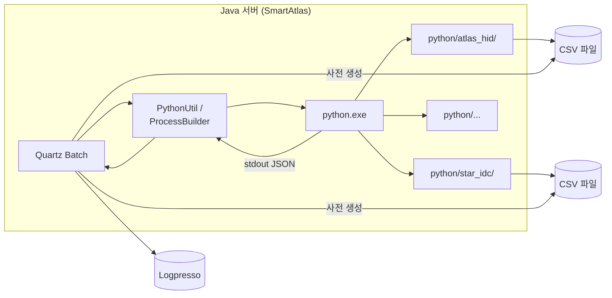
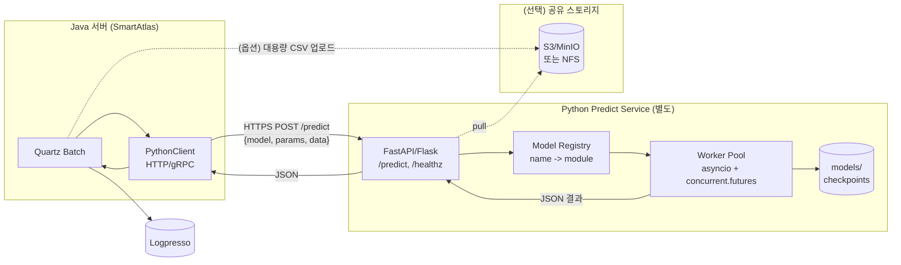
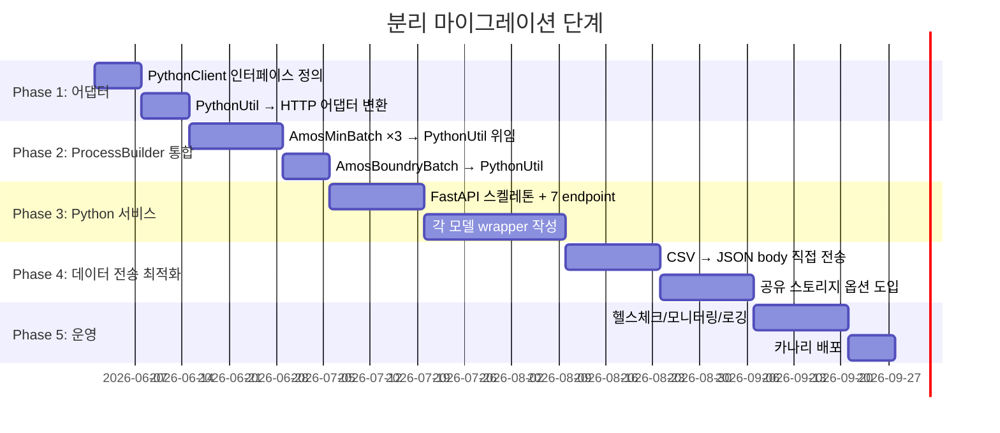
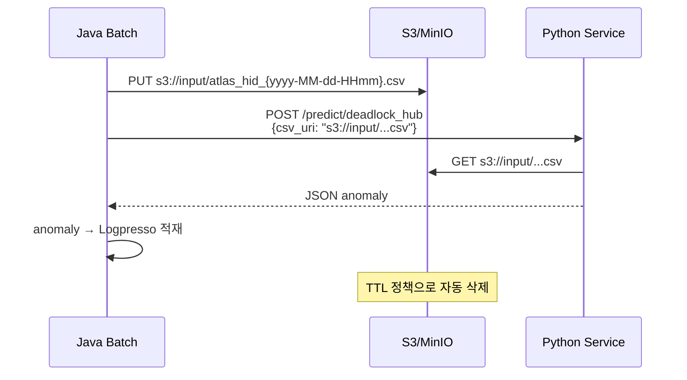

# 04. Python 영역 분리 전략

> SmartAtlas 자바 서버에서 Python 호출 영역을 **독립 서비스**로 분리하기 위한
> 단계별 가이드. 호환성 유지를 위한 어댑터 패턴 + 점진적 마이그레이션.

---

## 1. 목표 아키텍처

### 1.1 현재 (AS-IS)



문제:
- Python 인터프리터 + 모델 파일 + 입력 CSV 가 **자바 서버와 같은 디스크**에 있어야 함
- Windows 경로 하드코딩
- 자바 Quartz 스레드가 Python 종료까지 점유

### 1.2 분리 후 (TO-BE)



---

## 2. 분리 단계 — 5 phases



---

## 3. Phase 1 — `PythonUtil` 어댑터화 (호출처 무변경)

### 3.1 핵심 아이디어

`PythonUtil.executeWithParam(fileName, stderrFlag, params...)` 의 **시그니처 유지**.
내부만 HTTP 호출로 교체. **호출처 6곳은 코드 변경 없음**.

### 3.2 매핑 규칙

| 자바 호출 | HTTP 요청 |
|---|---|
| fileName = `"deadlock_hub.py"` | `POST {BASE}/predict/deadlock_hub` |
| fileName = `"HUB_ROOM_001.py"` | `POST {BASE}/predict/HUB_ROOM_001` (또는 일반화 `/predict?model=...`) |
| params = `["1", "30"]` | request body: `{"args": ["1", "30"]}` |
| (사전 CSV 파일) | request body: `{"csv_b64": "..."}` 또는 별도 업로드 후 `csv_url` |

### 3.3 새 `PythonUtil` (예시 스켈레톤)

```java
public class PythonUtil {
    private static final Logger logger = LoggerFactory.getLogger("PYTHON");
    private static final String BASE_URL =
            System.getProperty("PYTHON_SVC_URL", "http://python-svc:8000");
    private static final HttpClient http =
            HttpClient.newBuilder()
                    .connectTimeout(Duration.ofSeconds(5))
                    .build();
    private static final ObjectMapper M = new ObjectMapper();

    public static List<Map<String, Object>> executeWithParam(
            String fileName, boolean stderrFlag, String... params) {

        String modelName = fileName.replaceFirst("\\.py$", "");
        String url = BASE_URL + "/predict/" + modelName;

        Map<String, Object> body = new HashMap<>();
        body.put("args", Arrays.asList(params));
        // (Phase 4) CSV 도 함께 전송 시 body.put("csv_b64", ...)

        try {
            HttpRequest req = HttpRequest.newBuilder()
                    .uri(URI.create(url))
                    .timeout(Duration.ofSeconds(300))
                    .header("Content-Type", "application/json")
                    .POST(HttpRequest.BodyPublishers.ofString(
                            M.writeValueAsString(body)))
                    .build();
            HttpResponse<String> resp = http.send(req,
                    HttpResponse.BodyHandlers.ofString());

            if (resp.statusCode() == 404) {
                logger.info("[{}] no model on server (404)", fileName);
                return null;   // 기존과 동일 시멘틱
            }
            if (resp.statusCode() >= 400) {
                logger.error("[{}] http {} - {}",
                        fileName, resp.statusCode(), resp.body());
                return new ArrayList<>();
            }

            // 응답 body: JSON Array (기존 stdout 과 동일 형식)
            return M.readValue(resp.body(),
                    new TypeReference<List<Map<String, Object>>>() {});

        } catch (Exception e) {
            logger.error("[{}] http call failed", fileName, e);
            return new ArrayList<>();
        }
    }

    public static List<Map<String, Object>> executeWithParam(
            String fileName, boolean stderrFlag) {
        return executeWithParam(fileName, stderrFlag);
    }
}
```

### 3.4 호환 시멘틱 매트릭스

| 기존 동작 | 새 동작 |
|---|---|
| 파일 없음 → `null` | HTTP 404 → `null` |
| 정상 JSON Array → `List<Map>` | HTTP 200 + body JSON Array → `List<Map>` |
| 파싱 에러 → 빈 List | HTTP 5xx 또는 파싱 에러 → 빈 List |
| `process.waitFor()` 무한 대기 | `timeout(300s)` 강제 종료 |

---

## 4. Phase 2 — `AmosMinBatch` / `AmosBoundryBatch` 의 ProcessBuilder 통합

ProcessBuilder 를 직접 쓰던 4곳 (라인 406, 506, 848, 1113) 을
`PythonUtil.executeWithParam(...)` 호출로 일괄 교체.

### 4.1 `_predictor_atlas_hid` — Before / After

**Before** (라인 406-477, 약 80줄):
```java
String pyFileName = "deadlock_hub.py";
File workingDir = new File(FILE_PATH_ATLAS_HID);
command.add("python");
command.add(pyFileName);
ProcessBuilder pb = new ProcessBuilder(command);
pb.directory(workingDir);
pb.redirectErrorStream(stderrFlag);
process = pb.start();
// ... BufferedReader, JsonParser, 2중 Array 분기 ...
```

**After** (4줄):
```java
List<Map<String, Object>> result =
        PythonUtil.executeWithParam("deadlock_hub.py", false);
if (result == null || result.isEmpty()) return;
List<Map<String, Object>> anomaly = (List<Map<String, Object>>) result;
```

### 4.2 2중 Array 응답 처리

기존: stdout 에 `[[features], [anomaly]]` 가 한 번에 옴. 자바가 둘로 split.

분리 후 권장: Python 서비스가 **anomaly 만 반환** (features 는 어차피 자바가 안 씀).
응답 body 단순화.

→ 만약 features 도 보존이 필요하면, response 를 객체로:
```json
{
  "features": [{...}, ...],
  "anomaly":  [{...}, ...]
}
```
→ PythonUtil 시그니처 확장 필요 (override 추가).

### 4.3 working directory 의 해석

기존엔 `processBuilder.directory(workingDir)` 로 Python 측 import 경로를 설정.
분리 후엔 **endpoint 별로 다른 서비스 인스턴스를 두거나**, 단일 서비스 안에서
모델별 namespace 로 격리 (FastAPI 의 `APIRouter` 등).

---

## 5. Phase 3 — Python 서비스 구축

### 5.1 추천 스택

- **FastAPI** (async, type hint, OpenAPI 자동 생성)
- **uvicorn** (ASGI 서버)
- **pydantic** (요청/응답 모델)
- 모델 로딩: 시작 시 한 번 (`@app.on_event("startup")`)
- 워커: `concurrent.futures.ProcessPoolExecutor` (CPU bound) 또는 `asyncio` (IO bound)

### 5.2 디렉토리 구조 (제안)

```
python-svc/
├── app/
│   ├── main.py                # FastAPI app
│   ├── routers/
│   │   ├── deadlock_hub.py    # /predict/deadlock_hub
│   │   ├── standard_detector.py
│   │   ├── boundary.py
│   │   ├── hub_room.py
│   │   ├── q_transfer.py
│   │   └── server_resource.py
│   ├── models/                # ML 모델 로딩
│   ├── schemas/               # pydantic
│   └── core/
│       ├── config.py
│       └── logging.py
├── requirements.txt
├── Dockerfile
└── docker-compose.yml
```

### 5.3 endpoint 매핑 표

| URL | 메서드 | Java 호출 | 입력 | 출력 |
|---|---|---|---|---|
| `POST /predict/deadlock_hub` | POST | AmosMinBatch | csv (atlas_hid) | `{features:[], anomaly:[]}` |
| `POST /predict/standard_detector` | POST | AmosMinBatch | csv (star_idc) | `{features:[], anomaly:[]}` |
| `POST /predict/3DO_PRETIME_TEST3` | POST | AmosMinBatch | csv (star_event) + `-o ./output` | `{features:[], anomaly:[]}` |
| `POST /predict/boundary_batch` | POST | AmosBoundryBatch | (없음) | `{status:"ok"}` (fire-and-forget) |
| `POST /predict/{model}` (dynamic) | POST | HubroomTransPredictBatch | `args=[errorVhlState, errorAddData]` | `[{rows}]` |
| `POST /predict/{model}` (dynamic) | POST | QTransferPredictBatch | (없음) | `[{rows}]` |
| `POST /predict/SERVER_RESOURCE_MODEL` | POST | ServerResourceApmBatch | csv + `args=["7"]` | `[{rows}]` |
| `GET /healthz` | GET | (모니터링) | - | `{"status":"ok"}` |
| `GET /models` | GET | (검색) | - | 사용 가능한 모델 목록 |

### 5.4 FastAPI 예시 (deadlock_hub)

```python
# app/routers/deadlock_hub.py
from fastapi import APIRouter, HTTPException
from pydantic import BaseModel
from typing import List, Optional
import base64, io
import pandas as pd
from ..models.deadlock_hub import predict   # 기존 deadlock_hub.py 의 함수화

router = APIRouter()

class PredictReq(BaseModel):
    args: List[str] = []
    csv_b64: Optional[str] = None

class PredictResp(BaseModel):
    features: List[dict]
    anomaly: List[dict]

@router.post("/predict/deadlock_hub", response_model=PredictResp)
def deadlock_hub(req: PredictReq):
    if req.csv_b64:
        df = pd.read_csv(io.BytesIO(base64.b64decode(req.csv_b64)))
    else:
        raise HTTPException(400, "csv_b64 required")
    features, anomaly = predict(df, args=req.args)
    return {"features": features, "anomaly": anomaly}
```

### 5.5 기존 .py 함수화 (필수)

현재 모든 .py 가 **스크립트 (`if __name__ == "__main__":`)** 로 작성됨.
분리 후엔 **함수**로 호출 가능해야 함.

**Before (스크립트):**
```python
# deadlock_hub.py
df = pd.read_csv("data/atlas_hid_inout_data_output.csv")
result = run_model(df)
print(json.dumps(result))
```

**After (함수):**
```python
# app/models/deadlock_hub.py
def predict(df: pd.DataFrame, args: list[str] = None):
    result = run_model(df)
    return result["features"], result["anomaly"]
```

기존 스크립트 부분은 `if __name__ == "__main__":` 블록으로 옮겨 **CLI 호환 유지**도 가능 (로컬 테스트용).

---

## 6. Phase 4 — 데이터 전송 최적화

### 6.1 CSV 의 3가지 전송 방식

| 방식 | 장점 | 단점 |
|---|---|---|
| **A. JSON 인라인 (base64)** | 구현 단순, 외부 의존 없음 | payload 크기 ↑, 메모리 부담 |
| **B. multipart/form-data** | 효율적 바이너리 | FastAPI 측 처리 약간 복잡 |
| **C. 공유 스토리지 (S3 path)** | 대용량 OK | 인프라 추가 |

권장:
- 작은 CSV (< 10 MB) → A
- 중간 크기 → B
- 분 단위 자주 갱신되는 대형 → C

### 6.2 S3/MinIO 흐름 예시



---

## 7. Phase 5 — 운영

### 7.1 모니터링

| 항목 | 메트릭 |
|---|---|
| 호출 횟수 | `python_predict_total{model="..."}` |
| 응답 시간 | `python_predict_duration_seconds` (histogram) |
| 실패율 | `python_predict_errors_total{model, code}` |
| 큐 깊이 | (서비스 측) |

### 7.2 로깅

- 자바 측: 기존 `logger "PYTHON"` 카테고리 유지 (요청 ID 추가)
- Python 측: structured logging (JSON) — `request_id`, `model`, `latency`, `result_size`

### 7.3 헬스체크

- `GET /healthz` 200 / 503
- `GET /readyz` — 모델 로딩 완료 여부

### 7.4 카나리

기존 PythonUtil 과 새 PythonClient 를 **둘 다 빌드 가능**하게 두고,
`PYTHON_MIGRATION_ENABLED` 시스템 프로퍼티로 토글:

```java
public static List<Map<String, Object>> executeWithParam(...) {
    if (Boolean.getBoolean("PYTHON_MIGRATION_ENABLED")) {
        return _http(fileName, stderrFlag, params);
    }
    return _legacy(fileName, stderrFlag, params);
}
```

→ 일부 배치에서 먼저 적용 → 검증 후 전체 확대.

---

## 8. 위험 / 체크 리스트

| 위험 | 대응 |
|---|---|
| Python 서비스 다운 → 자바 배치 실패 | `null` 반환으로 graceful degrade (기존 시멘틱과 동일) |
| 네트워크 지연으로 Quartz 스레드 점유 | `timeout(300s)` 강제 + Quartz 분리 thread pool |
| 모델 출력 형식 변경 | response schema 버전 헤더 (`X-Predict-Schema: v1`) |
| 대용량 CSV 처리 | 공유 스토리지 (Phase 4) |
| 자바/Python 동시 배포 정합성 | model_id 에 버전 포함 (`deadlock_hub:v3`) |
| stdout 디버그 print 사고 | Python 측 logger 강제 (print 금지) |
| Windows 경로 잔재 | `FilePathUtil.PYTHON_FILE_PATH` 참조 전부 제거 (Phase 3 종료 시점) |

---

## 9. 최종 체크리스트

- [ ] Phase 1: `PythonUtil` 어댑터화 (HTTP 호출, 시그니처 유지)
- [ ] Phase 1: 카나리 토글 (`PYTHON_MIGRATION_ENABLED`)
- [ ] Phase 2: `AmosMinBatch:406` ProcessBuilder → `PythonUtil`
- [ ] Phase 2: `AmosMinBatch:848` ProcessBuilder → `PythonUtil`
- [ ] Phase 2: `AmosMinBatch:1113` ProcessBuilder → `PythonUtil` (인자 처리 포함)
- [ ] Phase 2: `AmosBoundryBatch:506` ProcessBuilder → `PythonUtil` (fire-and-forget endpoint)
- [ ] Phase 3: FastAPI 서비스 스켈레톤
- [ ] Phase 3: 7개 endpoint 구현
- [ ] Phase 3: 모델 wrapper 함수화 (`predict(df, args)`)
- [ ] Phase 3: Dockerfile / docker-compose
- [ ] Phase 4: CSV 전송 방식 결정 (A/B/C)
- [ ] Phase 4: 공유 스토리지 도입 (옵션)
- [ ] Phase 5: Prometheus 메트릭
- [ ] Phase 5: 헬스체크 / readiness
- [ ] Phase 5: 카나리 → 전체 전환
- [ ] Phase 5: 레거시 ProcessBuilder 코드 제거
- [ ] Phase 5: `FilePathUtil.PYTHON_FILE_PATH` 제거
- [ ] Phase 5: `python/` 디렉토리 자바 서버에서 제거

---

*다음: [05_AFFECTED_FILES.md](05_AFFECTED_FILES.md) — 영향 파일 라인별 매트릭스*
