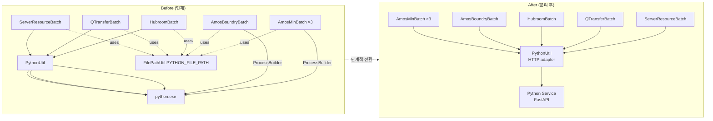

# 05. 영향 받는 자바 파일 — 라인별 매트릭스

> Python 분리 작업 시 손대야 하는 자바 파일과 정확한 라인 번호.
> 7개 파일 / 약 20곳.

---

## 1. 전체 매트릭스

| # | 파일 | 라인 | 종류 | 변경 내용 |
|---:|---|---:|---|---|
| 1 | `util/PythonUtil.java` | 19-150 | 핵심 클래스 | HTTP 클라이언트로 전체 교체 (시그니처 유지) |
| 2 | `util/FilePathUtil.java` | 12 | 상수 | `PYTHON_FILE_PATH` 제거 (Phase 5) |
| 3 | `batch/AmosMinBatch.java` | 40-45 | 상수 | `FILE_PATH_ATLAS_HID/STAR_IDC/STAR_EVENT` 제거 |
| 4 | `batch/AmosMinBatch.java` | 395-503 | 메서드 `_predictor_atlas_hid` | ProcessBuilder 블록 → `PythonUtil.executeWithParam` |
| 5 | `batch/AmosMinBatch.java` | 835-947 | 메서드 `_predictor_star_idc` | 동일 |
| 6 | `batch/AmosMinBatch.java` | 1100-1180 | 메서드 `_predictor_star_event` | 동일 (인자 `-o ./output` 처리 변경) |
| 7 | `batch/AmosBoundryBatch.java` | 38 | 상수 | `FILE_PATH_STAR_IDC` 제거 |
| 8 | `batch/AmosBoundryBatch.java` | 495-548 | 메서드 `_predictor_star_idc_data` | ProcessBuilder → fire-and-forget HTTP |
| 9 | `batch/HubroomTransPredictBatch.java` | 20 | 상수 | `folderPath` (PYTHON_FILE_PATH 참조) → CSV 임시 위치만 |
| 10 | `batch/HubroomTransPredictBatch.java` | 117-160 | 메서드 `_createInputData` | CSV 생성 위치 변경 가능 (또는 그대로) |
| 11 | `batch/HubroomTransPredictBatch.java` | 249 | `PythonUtil.executeWithParam` | **변경 불필요** (어댑터화로 자동 전환) |
| 12 | `batch/QTransferPredictBatch.java` | 25 | 상수 | `folderPath` 제거 |
| 13 | `batch/QTransferPredictBatch.java` | 311 | `PythonUtil.executeWithParam` | **변경 불필요** |
| 14 | `batch/ServerResourceApmBatch.java` | 342-360 | CSV 생성 | 위치 변경 또는 유지 |
| 15 | `batch/ServerResourceApmBatch.java` | 369 | `PythonUtil.executeWithParam` | **변경 불필요** |

---

## 2. 파일별 상세 변경

### 2.1 `util/PythonUtil.java` — 전면 재작성

**제거할 import**
```java
import java.io.BufferedReader;        // 라인 3
import java.io.File;                  // 라인 4
import java.io.InputStreamReader;     // 라인 5
import com.google.gson.JsonArray;     // 라인 15
import com.google.gson.JsonElement;   // 라인 16
import com.google.gson.JsonParser;    // 라인 17
```

**제거할 상수**
```java
private static final String PYTHON_FILE_CMD  = "python";              // 라인 21
private static final String PYTHON_FILE_PATH = ...                    // 라인 22-23
```

**추가할 상수**
```java
private static final String BASE_URL = System.getProperty(
        "PYTHON_SVC_URL", "http://python-svc:8000");
private static final Duration TIMEOUT = Duration.ofSeconds(
        Long.getLong("PYTHON_SVC_TIMEOUT_SEC", 300L));
private static final HttpClient HTTP = HttpClient.newBuilder()
        .connectTimeout(Duration.ofSeconds(5))
        .build();
private static final ObjectMapper MAPPER = new ObjectMapper();
```

**교체할 메서드** (`executeWithParam`)
→ [04_SEPARATION_STRATEGY.md §3.3](04_SEPARATION_STRATEGY.md#33-새-pythonutil-예시-스켈레톤) 참조.

**유지할 메서드**
- `_printResult(...)` (라인 121-150) — 로그 출력만, 로직 변경 불필요

---

### 2.2 `util/FilePathUtil.java` — 1줄 제거

**Phase 1~4 동안 유지**, Phase 5 에서 제거:
```java
// 라인 12 (삭제)
public static final String PYTHON_FILE_PATH = REPOSITORY_PATH + "/python";
```

**라인 61** (`String.format("%s\\%s", ...)`) 도 Python 관련 사용처가 사라지면 제거 가능.

---

### 2.3 `batch/AmosMinBatch.java` — 3 곳 + 상수

**상수 (라인 40-45) — Phase 2 후 제거 가능**
```java
private static final String FILE_PATH_ATLAS_HID   = ...   // 라인 40
private static final String FILE_NAME_ATLAS_HID   = ...   // 라인 41
private static final String FILE_PATH_STAR_IDC    = ...   // 라인 42
private static final String FILE_NAME_STAR_IDC    = ...   // 라인 43
private static final String FILE_PATH_STAR_EVENT  = ...   // 라인 44
private static final String FILE_NAME_STAR_EVENT  = ...   // 라인 45
```

CSV 임시파일 자체를 유지한다면 일부 상수 유지 가능 (다만 디렉토리는 자바 서버의
`/tmp` 등 다른 경로로 변경 권장).

**메서드 `_predictor_atlas_hid` (라인 395-503)**

기존 약 110줄 → 신규 약 20줄로 축소:
```java
private void _predictor_atlas_hid() {
    logger.info("[PREDICT] calculating atlas hid prediction has started");
    long timer = System.currentTimeMillis();
    String pyFileName = "deadlock_hub.py";

    // (옵션) CSV 를 base64 로 인코딩해서 전달
    String csvB64 = _readCsvAsB64(FILE_PATH_ATLAS_HID + FILE_NAME_ATLAS_HID);

    List<Map<String, Object>> anomalyData =
            PythonUtil.executeWithParamCsv(pyFileName, csvB64);
    if (anomalyData == null || anomalyData.isEmpty()) {
        logger.error("[{}] no anomaly returned", pyFileName);
        return;
    }

    List<Tuple> tuples = _toTuples(anomalyData);
    LogpressoAPI.setInsertTuples("M16A_BOTTLENECK_ANOMALY", tuples, 10);

    long elapsed = System.currentTimeMillis() - timer;
    logger.info("[{}] done [elapsed={}ms]", pyFileName, elapsed);
}
```

⚠ 2중 Array 응답을 단일로 단순화하려면 Python 서비스 측에서 `anomaly` 만 반환하도록 변경.
호환을 위해 `PythonUtil` 에 `executeWithParamCsv(..., expectDouble=true)` 같은 옵션 추가도 가능.

**메서드 `_predictor_star_idc` (라인 835-947)** — 동일 패턴
**메서드 `_predictor_star_event` (라인 1100-1180)** — 인자 `-o ./output` 처리 변경

---

### 2.4 `batch/AmosBoundryBatch.java` — 1 곳

**상수 (라인 38)** — 제거
**메서드 `_predictor_star_idc_data` (라인 495-548)**

기존:
```java
ProcessBuilder pb = new ProcessBuilder(command);
pb.directory(workingDir);
pb.redirectErrorStream(stderrFlag);
process = pb.start();
int exitCode = process.waitFor();
```

신규 (fire-and-forget):
```java
PythonUtil.execute("boundary_batch.py");   // void 반환, 결과 무시
// 또는 PythonUtil.executeWithParam 의 반환 무시
```

→ `PythonUtil` 에 `execute(...)` 오버로드 추가 권장 (void 반환).

---

### 2.5 `batch/HubroomTransPredictBatch.java` — CSV 위치만

**라인 20:**
```java
private final String folderPath = FilePathUtil.PYTHON_FILE_PATH;
```
→ CSV 임시 위치를 자바 서버 디스크의 `/tmp/hubroom/` 같은 별도 경로로 변경.
혹은 메모리에 들고 있다가 HTTP 로 직접 보내기.

**라인 249** — `PythonUtil.executeWithParam(fileName, false, errorVhlState, errorAddData)`
**변경 없음** (어댑터가 처리).

---

### 2.6 `batch/QTransferPredictBatch.java` — 상수만

**라인 25:** `folderPath` 사용처가 없거나 적으면 제거.
**라인 311:** `PythonUtil.executeWithParam(fileName, false)` — **변경 없음**.

---

### 2.7 `batch/ServerResourceApmBatch.java` — CSV 위치만

**라인 342-360:** CSV 출력 위치 변경 또는 유지.
**라인 369:** `PythonUtil.executeWithParam(...)` — **변경 없음**.

---

## 3. 변경 요약 다이어그램



---

## 4. 각 파일의 변경 라인 합계 (예상)

| 파일 | 변경 라인 수 (예상) | 종류 |
|---|---:|---|
| `PythonUtil.java` | 약 130 (재작성) | 핵심 |
| `FilePathUtil.java` | 1~2 | 상수 제거 |
| `AmosMinBatch.java` | 약 300 (3개 메서드 축소) | 큼 |
| `AmosBoundryBatch.java` | 약 60 | 중 |
| `HubroomTransPredictBatch.java` | 1~5 | 작음 |
| `QTransferPredictBatch.java` | 1~3 | 작음 |
| `ServerResourceApmBatch.java` | 1~5 | 작음 |
| **합계** | **약 500** | |

---

## 5. 빌드/배포 영향

| 항목 | 영향 |
|---|---|
| Maven/Gradle 의존성 | Gson 제거 가능 (`PythonUtil` 만 쓰던 경우). Jackson 유지. |
| JAR 크기 | 약간 감소 (Python 디렉토리 미포함) |
| 환경변수 | `SMARTFX_REPOSITORY/python` 의존 제거. 신규 `PYTHON_SVC_URL` 도입 |
| Quartz scheduler | 영향 없음 (배치 인터페이스 동일) |
| Logpresso schema | 영향 없음 (적재 테이블 동일) |
| Python 서버 | 신규 배포 단위 (Docker 컨테이너 권장) |

---

## 6. 회귀 검증 항목

분리 후 다음을 확인:

| 항목 | 확인 방법 |
|---|---|
| `M16A_BOTTLENECK_ANOMALY` 적재 건수 | 일자별 row 수 비교 |
| `M14A_QUEUE_ANOMALY` 적재 건수 | 동일 |
| `ATLAS_TS_PREDICT` 적재 건수 | 동일 |
| `test_hubroom_predict` | 동일 |
| `server_resource_predict` | 동일 |
| 예측 정확도 | 통계적 비교 (Python 측이 동일 모델 + 입력이면 동일 결과 기대) |
| 응답 시간 | 평균/최대 모니터링 |
| 에러 비율 | 분리 전후 동일 또는 감소 |

---

*마이그레이션 전반은 [04_SEPARATION_STRATEGY.md](04_SEPARATION_STRATEGY.md), 호출처 상세는 [02_INVOCATION_SITES.md](02_INVOCATION_SITES.md) 참조.*
