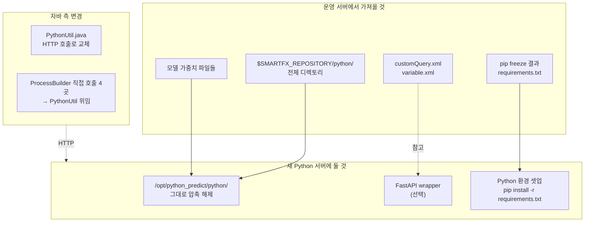

# Python 분리 작업 — 추출 가이드 (한 장)

> **목적**: Python 영역을 별도 서버로 옮길 때 **어디서 / 무엇을** 가져와야 하는지
> 한 페이지로 정리. 파일 경로, 라인 번호, 가져갈 단위까지 명시.

---

## 1. 운영 서버에서 가져올 Python 파일들 (`.py`)

⚠ **이 .py 파일들은 디코딩된 자바 소스에는 없음**. 운영 SmartFx 서버의
디스크에서 직접 복사해야 함.

**원본 위치 (운영 서버):**
```
$SMARTFX_REPOSITORY/python/
```
환경변수 `SMARTFX_REPOSITORY` 가 가리키는 디렉토리 하위의 `python/` 폴더 전체.

### 가져올 파일 목록

| 가져올 파일 (절대경로) | 호출하는 자바 위치 | 비고 |
|---|---|---|
| `python/atlas_hid/deadlock_hub.py` | AmosMinBatch.java:406 | working dir = `python/atlas_hid/` |
| `python/atlas_hid/app/` (디렉토리 전체) | 위와 동일 | deadlock_hub 가 import 하는 모듈 |
| `python/atlas_hid/data/` | 위와 동일 | CSV 입력 디렉토리 (런타임 생성) |
| `python/star_idc/standard_detector.py` | AmosMinBatch.java:848 | working dir = `python/star_idc/` |
| `python/star_idc/boundary_batch.py` | AmosBoundryBatch.java:506 | 위와 동일 |
| `python/star_idc/app/` | 위 두 .py 가 import 하는 모듈 | |
| `python/star_idc/data/` | | CSV 입력 |
| `python/star_event/3DO_PRETIME_TEST3.py` | AmosMinBatch.java:1113 | working dir = `python/star_event/` |
| `python/star_event/app/` | | |
| `python/star_event/data/` | | CSV 입력 |
| `python/star_event/output/` | | 인자 `-o ./output` |
| `python/HUB_ROOM_*.py` | HubroomTransPredictBatch.java:249 | **N개** (모델 마다, 동적 결정) |
| `python/Q_TRANSFER_PREDICTOR_10m.py` | QTransferPredictBatch.java:311 (default) | |
| `python/Q_TRANSFER_*.py` | 위와 동일 | **N개** (모델 마다, 동적 결정) |
| `python/SERVER_RESOURCE_MODEL.py` | ServerResourceApmBatch.java:369 | |
| `python/data/APMWEEKDATA.csv` 위치 | 위와 동일 | CSV 입력 (런타임 생성) |
| `python/HUBROOM_PIVOT_DATA.csv` 위치 | HubroomTransPredictBatch.java:117 | CSV 입력 |

### 어떻게 한 번에 가져오나

```bash
# 운영 서버에서:
cd $SMARTFX_REPOSITORY
tar czf python_all.tar.gz python/
# 이걸 새 서버로 옮긴다
```

또는 정확히 알 필요 없으면 **`python/` 디렉토리 통째로 복사**.

---

## 2. 동적 모델 목록은 어떻게 알아내나

`HUB_ROOM_*.py` 와 `Q_TRANSFER_*.py` 는 자바 코드에 파일명이 안 박혀있음.

### 조회 위치 1: `customQuery.xml`

`$SMARTFX_REPOSITORY/customQuery.xml` 안의 다음 쿼리 ID 결과를 보면 모델 목록을 알 수 있음:

| 쿼리 ID | 사용 자바 | 의미 |
|---|---|---|
| `HUB_ROOM_INPUT_DATA` | HubroomTransPredictBatch:124 | Hub-room 입력 데이터 + 모델 정보 |
| `HUB_ROOM_MODEL_LIST` (추정) | HubroomTransPredictBatch._preparePredictor | 모델 목록 (FILE_NM 컬럼) |
| `Q_TRANSFER_MODEL_LIST` (추정) | QTransferPredictBatch._preparePredictor | 모델 목록 |

### 조회 위치 2: 환경 변수 XML

`$SMARTFX_REPOSITORY/variable.xml` 안의 다음 키 확인:

| 키 | 사용처 |
|---|---|
| `Q_TRANSFER_MODEL_MAPPER_DEFAULT` | QTransferPredictBatch:282 (default model 파일명) |
| `VHL_OFF_PLUS_DATA` | HubroomTransPredictBatch:238 (예측 인자) |
| `APM_PREDICT_OUTPUT_RANGE` | ServerResourceApmBatch:367 (예측 일수) |

### 조회 위치 3: 직접 파일 시스템 스캔

```bash
ls $SMARTFX_REPOSITORY/python/HUB_ROOM_*.py
ls $SMARTFX_REPOSITORY/python/Q_TRANSFER_*.py
```

→ **결국 파일시스템을 보는 게 가장 정확.**

---

## 3. 자바에서 가져갈 (혹은 참고할) 7개 파일

분리 작업의 **참고용 자바 코드**. 새 서버 구축할 때는 안 가져가도 되지만,
Python 호출 시그니처/입출력 규약을 확인하려면 필요.

| 파일 | 라인 | 봐야 할 메서드 |
|---|---|---|
| `util/PythonUtil.java` | 19-150 | `executeWithParam()` — HTTP 응답 규약 (JSON Array) |
| `util/FilePathUtil.java` | 12 | `PYTHON_FILE_PATH` — 디렉토리 prefix |
| `batch/AmosMinBatch.java` | 395-503, 835-947, 1100-1180 | `_predictor_atlas_hid/idc/event` — 입력 CSV 생성 + Python 호출 |
| `batch/AmosBoundryBatch.java` | 495-548 | `_predictor_star_idc_data` |
| `batch/HubroomTransPredictBatch.java` | 117-260 | `_createInputData` + `_predictor` |
| `batch/QTransferPredictBatch.java` | 270-330 | `_selectDisplayedPrediction` + `_predictor` |
| `batch/ServerResourceApmBatch.java` | 335-385 | CSV 생성 + Python 호출 |

이 7개 파일은 이미 `python_separation/java_sources/` 에 복사되어 있음.

---

## 4. 각 .py 가 기대하는 입출력 규약

운영 서버에서 `.py` 를 가져온 후, **그대로 두면** 자바와 호환됨.
별도 서버로 옮길 때는 다음 규약을 깨지 않으면 됨:

### 4.1 deadlock_hub.py

| 항목 | 값 |
|---|---|
| 실행 위치 | `python/atlas_hid/` 에서 `python deadlock_hub.py` |
| 입력 | `./data/atlas_hid_inout_data_output.csv` (현재 디렉토리 기준) |
| CSV 컬럼 | `EVENT_DT, HID_1_FROM_SUM, HID_2_FROM_SUM, ..., HID_N_FROM_SUM` |
| 출력 | **stdout** 에 JSON 한 줄: `[[features...], [anomaly...]]` 2중 Array |
| stderr | 디버그 메시지만 (JSON 깨지면 자바 실패) |
| 명령행 인자 | 없음 |

### 4.2 standard_detector.py

| 항목 | 값 |
|---|---|
| 실행 위치 | `python/star_idc/` |
| 입력 | `./data/star_idc_inout_data_output.csv` |
| 출력 | stdout JSON `[[features...], [anomaly...]]` (또는 단일 Object 도 허용) |
| 명령행 인자 | 없음 |

### 4.3 boundary_batch.py

| 항목 | 값 |
|---|---|
| 실행 위치 | `python/star_idc/` |
| 입력 | (Python 측이 자체 조회 — 자바가 CSV 안 줌) |
| 출력 | **stdout 결과 안 받음** — exit code 0 이면 성공 |
| 명령행 인자 | 없음 |

### 4.4 3DO_PRETIME_TEST3.py

| 항목 | 값 |
|---|---|
| 실행 위치 | `python/star_event/` |
| 명령행 인자 | `python 3DO_PRETIME_TEST3.py {csv절대경로} -o ./output` |
| 입력 | sys.argv[1] 의 CSV 경로 |
| 출력 | stdout JSON `[[features...], [anomaly...]]` (현재 자바 측 적재 코드는 주석 처리됨) |

### 4.5 HUB_ROOM_*.py (동적)

| 항목 | 값 |
|---|---|
| 실행 위치 | `python/` (PYTHON_FILE_PATH 직속) |
| 명령행 인자 | `python {모델파일.py} {errorVhlState} {errorAddData}` |
| 입력 | `python/HUBROOM_PIVOT_DATA.csv` (자바가 생성) |
| 출력 | stdout JSON 1중 Array `[{row1}, {row2}, ...]` |

### 4.6 Q_TRANSFER_*.py (동적)

| 항목 | 값 |
|---|---|
| 실행 위치 | `python/` |
| 명령행 인자 | 없음 (Python 이 자체 DB 조회) |
| 출력 | stdout JSON 1중 Array |

### 4.7 SERVER_RESOURCE_MODEL.py

| 항목 | 값 |
|---|---|
| 실행 위치 | `python/` |
| 명령행 인자 | `python SERVER_RESOURCE_MODEL.py {output_range}` (예: "7") |
| 입력 | `python/data/APMWEEKDATA.csv` (자바가 생성) |
| 출력 | stdout JSON 1중 Array |

---

## 5. 별도 서버 운영에 필요한 부가 자원

운영 서버에서 같이 챙겨야 할 것:

| 자원 | 위치 | 용도 |
|---|---|---|
| Python 인터프리터 + 패키지 | 운영 서버의 `python` 명령 | pandas/numpy/scikit-learn 등 |
| `requirements.txt` (있다면) | `python/` 하위 어딘가 | 의존성 명세 |
| 모델 가중치 파일 | `python/{atlas_hid,star_idc,...}/models/` 등 | 학습된 모델 (.pkl, .h5, .pt 등) |
| 환경변수 / 설정 파일 | `python/` 하위 `.env`, `config.yml` 등 | Python 측 설정 (DB 접속 정보 등) |
| Logpresso/Oracle 접속 라이브러리 | Python 측 | Q_TRANSFER 등이 자체 DB 조회 시 필요 |

→ 운영 서버에서 `python/` 전체 + Python 인터프리터 환경 (가능하면 `pip freeze > requirements.txt`) 을 함께 가져가는 게 안전.

---

## 6. 가져간 후 별도 서버에서 그대로 실행하는 법

`.py` 파일들이 **변경 없이 그대로 돌아가도록** 하려면, 별도 서버에서도 동일한
디렉토리 구조와 작업 디렉토리를 유지하면 됨.

### 단순한 방식 — cron 으로 직접 실행

```bash
# 새 서버에 동일 디렉토리 구조 복원
mkdir -p /opt/python_predict
tar xzf python_all.tar.gz -C /opt/python_predict
# 결과: /opt/python_predict/python/atlas_hid/deadlock_hub.py ...

# cron 등록 예
* * * * * cd /opt/python_predict/python/atlas_hid && python deadlock_hub.py > /var/log/predict/deadlock_hub.log 2>&1
```

⚠ 이 경우 **자바와 분리되긴 하지만 입력 CSV 를 누가 만들어주냐** 가 문제.
자바가 더 이상 CSV 를 그 디스크에 안 쓰므로, 다음 중 하나로 해결:
- (a) Python 측이 직접 Logpresso 조회해서 CSV 자체 생성하도록 수정
- (b) NFS 공유 마운트로 자바 서버의 CSV 디렉토리를 mount
- (c) 자바가 CSV 를 S3/MinIO 에 업로드 → Python 이 다운로드

### 권장 방식 — REST 서비스로 래핑

`.py` 들을 함수화해서 FastAPI 로 노출:

```
/opt/python_predict/
├── original/                 ← 운영서버에서 가져온 .py 그대로
│   ├── atlas_hid/deadlock_hub.py
│   ├── star_idc/standard_detector.py
│   └── ...
├── service/                  ← 새로 작성
│   ├── main.py               (FastAPI)
│   ├── routers/
│   │   ├── deadlock_hub.py   (original 의 .py 를 import 하여 wrap)
│   │   └── ...
│   └── requirements.txt
└── docker/Dockerfile
```

자세한 서비스 코드는 `04_SEPARATION_STRATEGY.md §5` 참조.

---

## 7. 가져갈 자료 체크리스트 (운영 서버 → 새 서버)

운영자가 실제로 옮길 때 사용할 체크리스트:

- [ ] `$SMARTFX_REPOSITORY/python/` 디렉토리 전체 (tar.gz)
- [ ] `$SMARTFX_REPOSITORY/customQuery.xml` (Python 측이 참조할 수 있음)
- [ ] `$SMARTFX_REPOSITORY/variable.xml` (환경 변수)
- [ ] 운영 서버의 Python 인터프리터 버전 (`python --version`)
- [ ] `pip freeze` 출력 (의존성 목록)
- [ ] 모델 가중치 파일 (대용량 .pkl/.h5/.pt 가 있다면 위치 확인)
- [ ] Logpresso 접속 정보 (Python 측이 직접 조회 시 필요)
- [ ] Oracle/MongoDB 접속 정보 (필요 시)
- [ ] cron 또는 스케줄러 설정 (현재 운영 서버에서 어떻게 트리거되는지)

---

## 8. 한눈에 요약



---

## 9. 관련 문서 빠른 링크

- 호출부 5개 배치 라인별 상세 → [02_INVOCATION_SITES.md](02_INVOCATION_SITES.md)
- 7개 스크립트 인벤토리 / 입출력 규약 → [03_SCRIPTS_INVENTORY.md](03_SCRIPTS_INVENTORY.md)
- 5-Phase 마이그레이션 가이드 (FastAPI 예시 코드 포함) → [04_SEPARATION_STRATEGY.md](04_SEPARATION_STRATEGY.md)
- 자바 측 변경 파일/라인 매트릭스 → [05_AFFECTED_FILES.md](05_AFFECTED_FILES.md)

자바 원본 소스 (참고): `java_sources/` 폴더.
