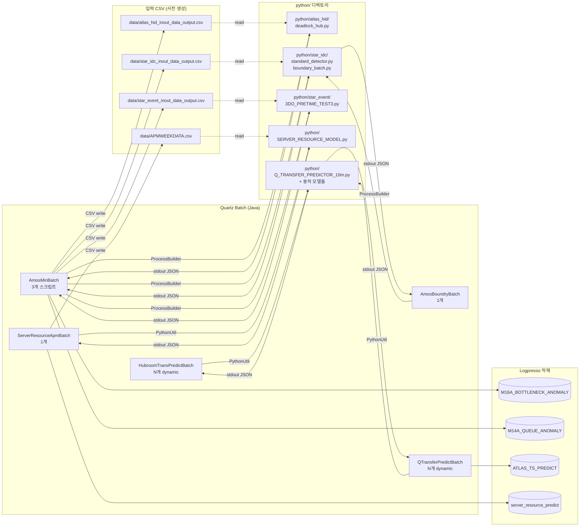
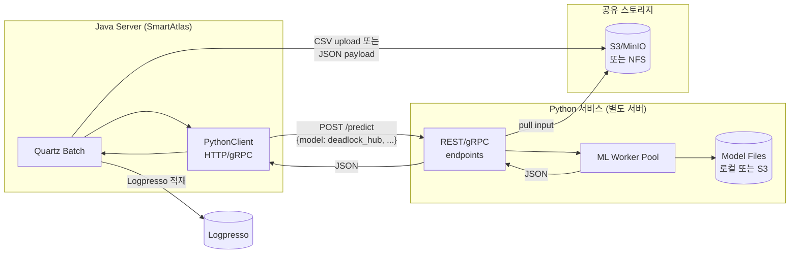

# SmartAtlas 파이썬 영역 분리 가이드

> **목적:** SmartAtlas 자바 코드에서 외부 Python 스크립트를 호출하는 모든 부분을
> 식별하고, 이 영역을 **독립 서비스 (예: REST API / RPC) 로 분리** 하기 위한
> 코드 위치 / 입출력 / 분리 방안을 빠짐없이 정리한 문서.
>
> **현재 구조:** 자바 → `ProcessBuilder` 로 로컬 `python` 실행 → stdout 의 JSON 파싱 → Logpresso 적재
>
> **분리 후 목표:** 자바 → HTTP/gRPC 호출 → Python 서비스 → JSON 응답 → Logpresso 적재

---

## 📑 문서 인덱스

| 문서 | 내용 |
|---|---|
| [README.md](README.md) (이 파일) | 개요, 전체 매핑, 분리 전략 |
| [01_PythonUtil.md](01_PythonUtil.md) | `PythonUtil.java` 핵심 클래스 분석 (실행 메커니즘) |
| [02_INVOCATION_SITES.md](02_INVOCATION_SITES.md) | 5개 배치의 Python 호출부 상세 (라인별) |
| [03_SCRIPTS_INVENTORY.md](03_SCRIPTS_INVENTORY.md) | 7개 Python 스크립트 인벤토리 (입력 CSV / 출력 JSON) |
| [04_SEPARATION_STRATEGY.md](04_SEPARATION_STRATEGY.md) | 분리 전략 (REST API 설계, 단계별 마이그레이션) |
| [05_AFFECTED_FILES.md](05_AFFECTED_FILES.md) | 영향 받는 파일 목록 + 수정 위치 |

---

## 🎯 한 줄 요약

| 항목 | 값 |
|---|---|
| Python 실행 진입점 | `util/PythonUtil.java` (151줄) |
| Python 경로 상수 | `util/FilePathUtil.java:12` (`PYTHON_FILE_PATH = $SMARTFX_REPOSITORY/python`) |
| Python 호출 배치 | **5개** (Amos*/Hubroom*/QTransfer*/ServerResource*) |
| Python 스크립트 | **7개** (`deadlock_hub.py`, `standard_detector.py`, `3DO_PRETIME_TEST3.py`, `boundary_batch.py`, `Q_TRANSFER_PREDICTOR_10m.py`, `SERVER_RESOURCE_MODEL.py`, + 동적 모델 N개) |
| 입출력 방식 | **stdin 미사용** / **stdout = JSON Array** / 입력은 사전 생성된 **CSV 파일** |
| 실행 위치 제약 | **Windows 경로 (`\`) 하드코딩** (`FilePathUtil.java:61`) |
| 결과 적재 | Logpresso 테이블 (`M16A_BOTTLENECK_ANOMALY`, `M14A_QUEUE_ANOMALY`, `ATLAS_TS_PREDICT`, `server_resource_predict` 등) |

---

## 🗺 전체 호출 지도



---

## 📦 영향 받는 자바 파일 (정확히 7개)

| 파일 | 역할 | 라인 |
|---|---|---|
| `util/PythonUtil.java` | Python 실행 핵심 유틸 | 151 |
| `util/FilePathUtil.java` | Python 경로 상수 정의 | (해당 라인 10-12) |
| `batch/AmosMinBatch.java` | 3종 Python 스크립트 호출 | 1213 |
| `batch/AmosBoundryBatch.java` | boundary_batch.py 호출 | 542 |
| `batch/HubroomTransPredictBatch.java` | 동적 Python 모델 호출 (HUB_ROOM) | 308 |
| `batch/QTransferPredictBatch.java` | 동적 Python 모델 호출 (Q_TRANSFER) | 1774 |
| `batch/ServerResourceApmBatch.java` | SERVER_RESOURCE_MODEL.py 호출 | 539 |

상세는 [05_AFFECTED_FILES.md](05_AFFECTED_FILES.md) 참조.

---

## 🔍 호출 패턴 두 가지

### A. `PythonUtil.executeWithParam(...)` 사용 (권장 표준)

```
[Java] → PythonUtil.executeWithParam(fileName, stderrFlag, params...)
        → ProcessBuilder + python {fileName}
        → stdout 읽음 → JSON Array 파싱
        → List<Map<String,Object>> 반환
```

사용처:
- `HubroomTransPredictBatch.java:249`
- `QTransferPredictBatch.java:311`
- `ServerResourceApmBatch.java:369`

### B. ProcessBuilder 직접 사용 (AmosMinBatch / AmosBoundryBatch)

```
[Java] → new ProcessBuilder("python", "{file.py}", ...)
        → .directory(workingDir) ← FILE_PATH_ATLAS_HID 등
        → .start()
        → BufferedReader 로 stdout 직접 읽음
        → JSON Array 파싱
```

사용처:
- `AmosMinBatch.java:406, 848, 1113` (3개)
- `AmosBoundryBatch.java:506`

→ **분리 시 두 패턴을 하나로 통합 권장** (단일 HTTP 클라이언트로 대체).

---

## 🚨 현재 구조의 핵심 제약 (분리 동기)

1. **Windows 경로 하드코딩** (`FilePathUtil.java:61`)
   ```java
   return String.format("%s\\%s", REPOSITORY_PATH, fileName);
   ```
   → Linux/Mac 운영 불가, 컨테이너화 어려움

2. **로컬 Python 인터프리터 의존**
   `python` 명령어가 자바 프로세스의 PATH 에 있어야 함 → 환경마다 다름

3. **모델 파일 동기화 문제**
   각 자바 인스턴스가 자기 디스크에 모델 파일을 가져야 함 → 모델 업데이트 시 전수 배포 필요

4. **stdout 파싱 의존성**
   Python 스크립트가 print 한 줄을 그대로 JSON 으로 파싱 → 디버그 print 한 줄로 전체 실패

5. **CSV 임시 파일 의존**
   자바가 디스크에 CSV 쓰고 → 파이썬이 읽음. 파일 시스템 공유 필수.

6. **동기 차단**
   `process.waitFor()` 로 Python 끝날 때까지 Quartz 스레드 점유.

7. **장애 격리 부재**
   Python 프로세스 죽으면 자바 측 로그만 남음. 재시도 없음.

---

## 🎯 분리 후 목표 아키텍처



상세 마이그레이션 단계는 [04_SEPARATION_STRATEGY.md](04_SEPARATION_STRATEGY.md) 참조.

---

## ⏱ 분리 작업 우선순위

| 순위 | 작업 | 영향 | 난이도 |
|---:|---|---|---|
| 1 | `PythonClient` HTTP 인터페이스 정의 | 모든 호출처 통일 | 중 |
| 2 | `PythonUtil` 을 어댑터로 변환 | 기존 호출부 무변경 | 하 |
| 3 | `AmosMinBatch`, `AmosBoundryBatch` 의 ProcessBuilder 를 `PythonUtil` 위임으로 변경 | 코드 일관성 | 하 |
| 4 | CSV 디스크 의존 → 메모리 전송 (Multipart 또는 JSON) | 인프라 단순화 | 중 |
| 5 | Python 서비스 구축 (FastAPI 권장) | 신규 서버 | 상 |
| 6 | 모델 파일 중앙 저장소 (S3/MinIO) | 배포 자동화 | 중 |
| 7 | Quartz 스케줄을 Python 서비스에 위임 옵션 검토 | 결합도 추가 감소 | 상 |

---

## 📊 통계

| 항목 | 수치 |
|---|---:|
| Python 호출 자바 파일 | 7 |
| Python 호출 코드 위치 (line) | 약 12 곳 |
| Python 스크립트 (정적) | 7 개 (이름 식별) |
| Python 스크립트 (동적 — `pyInfoList` 로부터 로딩) | N 개 (`HUB_ROOM_*.py`, Q-Transfer 모델들) |
| CSV 임시 파일 | 4 종 (`atlas_hid_inout_data_output.csv`, `star_idc_inout_data_output.csv`, `star_event_inout_data_output.csv`, `APMWEEKDATA.csv`) |
| 결과 Logpresso 테이블 | 최소 4 (`M16A_BOTTLENECK_ANOMALY`, `M14A_QUEUE_ANOMALY`, `ATLAS_TS_PREDICT`, `server_resource_predict`) |

---

*상세는 각 문서 참조.*
