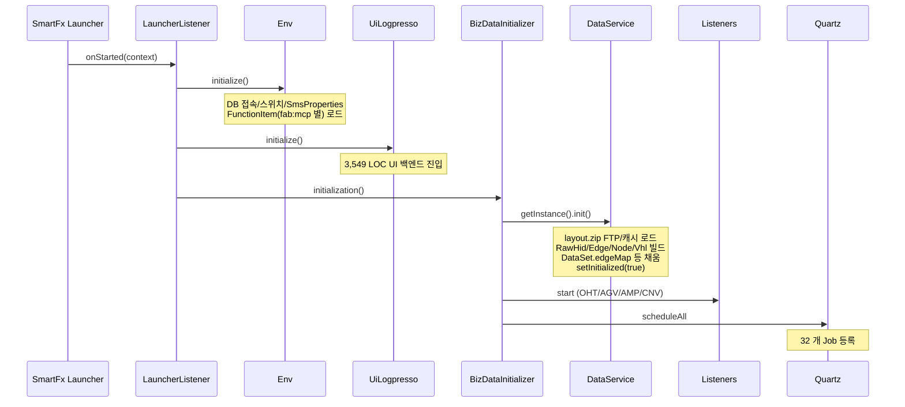
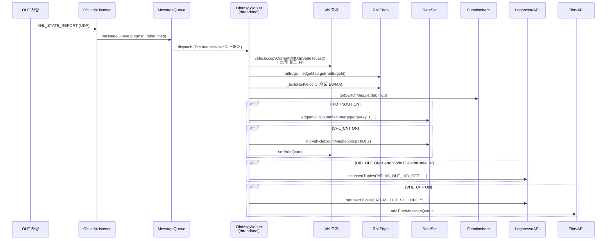
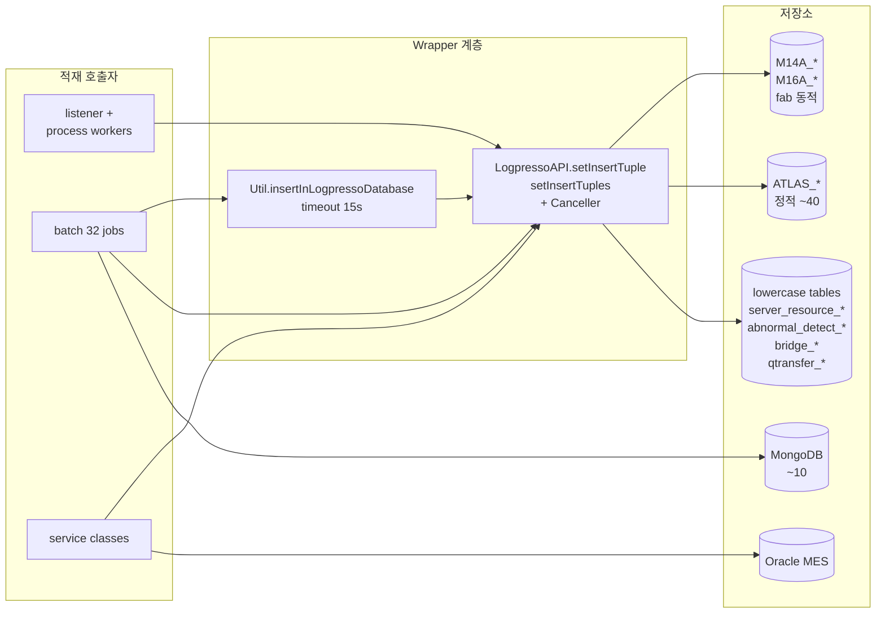

# SmartAtlas 시스템 전체 아키텍처

> 176개 파일에 흩어진 시스템을 한 장으로 이해하기 위한 통합 개요.
> 패키지별 상세는 `01_*.md` ~ `07_*.md` 참조.

---

## 1. 시스템 정체

**SmartAtlas** = SK하이닉스 반도체 FAB 의 **자동 반송 시스템** (Automated Material Handling, AMHS) 의 **모니터링/분석 백엔드 서버**.

- 운반 차량: **OHT** (Overhead Hoist Transport, 천장 레일 차량)
- 보조 운반: **AGV** (Automated Guided Vehicle, 바닥 자율 주행)
- 컨베이어: **CNV** (Stocker 간 연결 컨베이어)
- 입출고: **Stocker**, **STB**, **포트**, **FIO**, **EQP** (제조 장비)

이 모든 장비의 실시간 상태를 수신해 **인메모리로 그래프 상태를 유지**하고,
다양한 주기로 **DB(Logpresso/MongoDB/Oracle) 에 적재**하며,
이상치 / 예측 / 알림을 **TIB·SMS·HTTP** 로 외부에 전달.

---

## 2. 4계층 아키텍처

```mermaid
flowchart TB
    subgraph L1["L1 — 수신 (listener/)"]
        direction LR
        OHT_R[OhtUdpListener<br/>UDP 1500B]
        AGV_R[AgvUdpListener<br/>UDP]
        AMP_R[AmpListener<br/>TCP STX/ETX]
        CNV_R[CnvSocketIOListener<br/>Socket.IO]
    end

    subgraph L2["L2 — 처리 (process/, 스레드풀)"]
        direction LR
        OHT_W[OhtMsgWorker]
        AMP_W[AmpMsgWorker]
        CNV_W[CnvMsgWorker]
        UI_W[UiMsgWorker]
    end

    subgraph L3["L3 — 도메인 (data/, map/, navi/)"]
        DS[(DataService<br/>singleton)]
        DSET[DataSet<br/>50+ Map]
        GRAPH[map/<br/>RailEdge·Node·Vhl]
        NAV[navi/<br/>Dijkstra]
        DS --> DSET
        DSET --> GRAPH
        GRAPH --> NAV
    end

    subgraph L4["L4 — 외부 (db/, comm/, batch/)"]
        direction LR
        LP[(Logpresso<br/>~50 tables)]
        MG[(MongoDB<br/>~10 collections)]
        OR[(Oracle MES)]
        TIB[TibRV bus]
        SMS[SMS API]
        PY[Python 예측]
    end

    L1 --> L2
    L2 --> L3
    L3 -.timer.-> BATCH[batch/<br/>Quartz × 32]
    L3 --> L4
    BATCH --> L4
    L4 -.layout.zip / MES.-> L3
```

---

## 3. 부트스트랩 (서버 기동 순서)



---

## 4. 실시간 메시지 처리 — 핵심 사이클

OHT 차량이 매 100~500ms 단위로 UDP 패킷을 보냄. 한 패킷이 처리되는 사이클:



---

## 5. 인메모리 도메인 모델 (가장 중요한 부분)

```mermaid
classDiagram
    class DataService {
        -singleton
        +fabPropertiesMap
        +ohtAlarmCodeListMap
        +tibrvSenderMap
        +getDataSet()
    }
    class DataSet {
        +edgeMap (key=edgeId)
        +vhlMap (key=vhlId)
        +railEdgeMap (key=railEdgeId)
        +hidVehicleCountMap
        +edgeInOutCountMap
        +hidOffRecordMap
        +stageCommandMap
        +hid2PortMap
        ...50+ maps
    }
    class FabProperties {
        +mcpPropertiesMap
        +mapDir (layout.zip 경로)
    }
    class McpProperties {
        +mcp75Config
        +dbProperties
    }
    class Mcp75Config {
        +rawHidMap
        +rawEdgeMap
        +rawNodeMap
        +rawVhlMap
        +rawStationMap
        ...14 maps
    }
    class AbstractEdge {
        +fabId
        +fromNodeId
        +toNodeId
        +length
        +velocity
    }
    class RailEdge {
        +hidId
        +maxVelocity
        +portIdList
        +addVelocity(EWMA)
    }
    class Vhl {
        +hidId = -1 (init)
        +fabId
        +railEdgeId
        +VhlUdpState (inner)
    }

    DataService o-- DataSet
    DataService o-- FabProperties : fab 별
    FabProperties o-- McpProperties : mcp 별
    McpProperties --> Mcp75Config
    DataSet o-- AbstractEdge : edgeMap
    AbstractEdge <|-- RailEdge
    AbstractEdge <|-- CnvEdge
    AbstractEdge <|-- "..."
    DataSet o-- Vhl : vhlMap
```

핵심: 모든 실시간 상태는 `DataService.getInstance().getDataSet()` 의 50+ Map 에 보관.
배치는 이 맵들을 매 분/시간/일 단위로 drain 또는 snapshot 해 DB 에 옮긴다.

---

## 6. 32개 배치 카테고리 한 눈에

```mermaid
flowchart LR
    subgraph CAT["batch/ 카테고리"]
        direction TB
        C1[마스터 갱신]
        C2[큐 flush 분 단위]
        C3[모니터링]
        C4[예측·ML]
        C5[Bridge 판정]
        C6[MES/Oracle 연동]
        C7[대시보드]
    end

    C1 --> CB1[DataSetRefreshBatch<br/>UpdatingDbMasterDataBatch<br/>UpdatingDbMachineListBatch<br/>HidEdgeInOutUpdateMasterBatch]

    C2 --> CB2[HidEdgeInOutQueueFlushBatch<br/>AmpBufferFlushBatch<br/>VhlCntBatch / Cnt10/30/60<br/>OhtPerformanceTimeMin/HourBatch<br/>TrafficBatch / RailVibrationBatch]

    C3 --> CB3[MonitoringControlBatch<br/>AlertingSystemStatus<br/>SwitchSystemBatch<br/>SystemMessageDetectBatch<br/>ServerResourceApmBatch]

    C4 --> CB4[AmosMinBatch (Python ×3)<br/>QTransferPredictBatch<br/>HubroomTransPredictBatch<br/>AbnormalDetectBatch<br/>AmosBoundryBatch]

    C5 --> CB5[BridgeLayoutBatch<br/>BridgeLayoutDetailBatch (24 알람)<br/>BridgeJudgeRangeBatch]

    C6 --> CB6[MesLotHisBatch<br/>ItsmChangeRequestBatch<br/>RailCutRefreshBatch<br/>CnvTaskBatch]

    C7 --> CB7[QTransferDashBoardItemBatch]
```

---

## 7. DB 적재 흐름 — 어디서 어디로



상세 인벤토리: `../LOGPRESSO_SAVE_INVENTORY.md` 참조.

---

## 8. 외부 인터페이스 요약

| 인터페이스 | 방향 | 프로토콜 | 사용 |
|---|---|---|---|
| OHT | in | UDP 1500B | 차량 상태 (100ms~) |
| AGV | in | UDP | AGV 상태 |
| AMP | in | TCP STX/ETX | AMP/AGV 통합 |
| CNV | in | Socket.IO | 컨베이어 |
| UI | in/out | TIB XML | 화면 요청/응답 |
| Layout | in | FTP | layout.zip 다운로드 |
| MES | in/out | Oracle JDBC | 생산 데이터 |
| Logpresso | out | Native | 실시간/배치 적재 |
| MongoDB | in/out | Native | 마스터/캐시 |
| TIB | out | Rendezvous | 알림/이벤트 |
| SMS | out | HTTP | 알람 SMS |
| Python | out | shell exec | ML 예측 스크립트 |

---

## 9. FAB / MCP 별 독립성

시스템은 다음 단위로 데이터를 **독립적으로** 관리:

- **FAB 단위**: M14A, M14B, M14C, M16A, M16B, M16C, M16D ...
  - `FabProperties` 인스턴스 1 개씩
  - 자체 layout.zip
  - DB 테이블 prefix (예: `M14A_ATLAS_HID_INOUT`)
- **MCP 단위 (FAB 하위)**: MCP01, MCP02 ...
  - `McpProperties` 인스턴스
  - 자체 layout.xml 영역
  - 자체 `FunctionItem` (기능 ON/OFF)

따라서 같은 코드가 **모든 (FAB, MCP) 조합에 대해 동시 실행**되며, key 는 항상
`fabId + ":" + mcpName` 형태로 전 시스템에서 일관되게 사용됨.

---

## 10. 핵심 키 패턴 (사방에서 등장)

| 키 패턴 | 의미 | 예 |
|---|---|---|
| `{fabId}:{mcpName}` | FAB+MCP 단위 | `M14A:MCP01` |
| `{fabId}:{mcpName}:{HID 3자리}` | HID 슬롯 | `M14A:MCP01:005` |
| `{fabId}:VHL:{mcpName}:{vhlNo}` | 차량 | `M14A:VHL:MCP01:00123` |
| `{fabId}:CARRIER:{...}` | 캐리어 | |
| `{prevHID}:{currHID}:{fab}:{mcp}:{...}` | edgeInOutCountMap 키 | `005:007:M14A:MCP01:...` (11 토큰) |
| `{fabId}:send:amos` | TIB sender | |
| `{fabId}:send:` | 모든 TIB sender like-match | |

---

## 11. 동시성 모델

- **수신부**: listener 들은 각자 단일 IO 스레드 → 메시지를 `MessageQueue` 에 넣음
- **디스패처**: `BizDataInitializer` 가 큐에서 꺼내 `ThreadPool.execute(MsgWorkerRunnable)` 로 분배
- **처리부**: 여러 워커가 병렬 실행. 같은 차량의 메시지가 다른 워커에 분산될 수 있음 → **차량 단위 순서 보장 없음** (운영상 영향 가능)
- **DataSet Maps**: 거의 대부분 `ConcurrentHashMap`. `merge`/`compute`/`putIfAbsent` 패턴 광범위 사용
- **배치**: Quartz 스레드. 일부 배치는 `@DisallowConcurrentExecution` 미부착 → 이전 실행과 겹칠 가능성
- **DB**: `LogpressoAPI` 내부에 `Canceller` (ScheduledExecutor) 로 timeout 시 강제 종료

---

## 12. 코드베이스 통계

| 항목 | 값 |
|---|---|
| 패키지 디렉토리 | 22 |
| Java 파일 | 176 |
| 총 LOC (대략) | 50,000+ |
| 가장 큰 단일 클래스 | `DataService.java` (5,500 LOC) |
| Logpresso 적재 테이블 | ~50 종 |
| MongoDB 컬렉션 | ~10 종 |
| Quartz 배치 | 32 개 |
| FunctionType 스위치 | 20+ 종 |
| Listener | 4 (OHT/AGV/AMP/CNV) |
| Worker 종류 | 4 (OHT/AMP/CNV/UI) |
| Edge 종류 | 8 (Rail/Cnv/Agv/Long/BranchJoin/StkRm/Transfer/Station) |
| Node 종류 | 8 (Rail/EqpPort/FioPort/CnvPort/StkPort/StkRm/StkShelf/Stb) |
| 설비 종류 | 6 (Oht/Stocker/StbGroup/Conveyor/Fio/AmpUnit) |

---

## 13. 분석 문서 매핑 (이 시스템 ↔ 문서)

| 시스템 컴포넌트 | 분석 문서 | 섹션 |
|---|---|---|
| LauncherListener / 부트스트랩 | `01_bootstrap_service_env.md` | §1, §12 |
| Env / FunctionItem 스위치 | `01_*` | §9, §10 |
| Service 5종 | `01_*` | §3~§7 |
| listener 4종 | `03_process_listener.md` | §1 |
| process worker 4종 | `03_*` | §2 |
| OHT 메시지 디테일 | `03_*` | §2.4 (별도) |
| batch 32개 | `02_batch.md` | §1~§32 |
| DataSet 50+ Maps | `04_data_model.md` | §3.0 (별도) |
| Mcp75Config 14 Maps | `04_*` | §1 |
| Eqp 6 서브타입 | `04_*` | §2 |
| RailEdge / 그래프 | `05_map_graph.md` | §2~§3 |
| Vhl / Carrier 인터페이스 | `05_*` | §4 |
| Dijkstra | `06_navi_queryformat.md` | §1 |
| 쿼리 DSL | `06_*` | §2 |
| DataService 싱글톤 | `07_util_comm_db.md` | §1.A |
| LogpressoAPI | `07_*` | §3 |
| MongoDB Linq | `07_*` | §3 |

---

## 14. 다음 분석/개선 시 권장 사항

1. **단일 책임 분리**: `DataService` (5,500 LOC), `UiLogpresso` (3,549 LOC), `Util` (1,304 LOC) 는 도메인별 분할 권장
2. **DTO 표준화**: 11 토큰 `:` 구분 String 키 (HID_INOUT) 같은 패턴을 typed record 로 변경
3. **스위치 의존성 명시화**: `HID_INOUT ⊃ VHL_CNT` 같은 숨겨진 의존성을 `@DependsOn` 으로 명시
4. **fab 하드코딩 제거**: `M14A_QUEUE_ANOMALY`, `M16A_BOTTLENECK_ANOMALY` 등
5. **테스트 흔적 제거**: `test_*`, `bridge_layout_test`, `bridge_layout_tmp` 정리
6. **fail-loud 도입**: flush 실패 시 무로그 → metric 노출
7. **동시 실행 방어**: `@DisallowConcurrentExecution` 일괄 부착 검토
8. **Dead code 정리**: `RouteResult`, `extractCommonFilterJobHistory` 등

---

*상세는 패키지별 문서 참조.*
