# SmartAtlas 부트스트랩 / 서비스 / 환경설정 패키지 상세 분석

> 분석 대상: SK하이닉스 반도체 FAB OHT 관리 시스템 (SmartAtlas)
> 분석 범위: `com.skhynix.smartatlas` 루트 (Launcher, BizEventHandler) + `service` + `environment` 패키지

---

## §0 개요 (Overview)

SmartAtlas 는 SmartFX 런처(`smartfx.launcher`) 프레임워크 위에 동작하는 Java 서버 애플리케이션이다. 본 분석 대상의 11개 파일은 **시스템 부트스트랩, 외부 통신 서비스, 환경/설정 로딩**을 담당하는 핵심 계층이다.

### 패키지 구조

```
com.skhynix.smartatlas
├── LauncherListener.java          ── SmartFX 런처 시작 후크 (엔트리포인트)
├── BizEventHandler.java           ── Service 호출 AOP-like 이벤트 핸들러
│
├── service/
│   ├── AmosService.java           ── @Service("AMOS_SERVICE") - UI/Alarm 비즈니스 서비스
│   ├── BizDataInitializer.java    ── FAB/MCP UDP 리스너 구성 및 메세지 디스패처 부트
│   ├── HttpService.java           ── REST/OkHttp POST (sync/async) 헬퍼
│   ├── TibrvService.java          ── TIBCO Rendezvous Pub/Sub 송수신 래퍼
│   └── UiLogpresso.java           ── @Service("USER_IF_LOG") - UI 조회용 거대 통합 서비스
│
└── environment/
    ├── Env.java                   ── Settings/FabSet/Reset properties 전역 캐시
    └── type/
        ├── DbProperties.java      ── DB 접속 정보 VO
        ├── FunctionItem.java      ── Fab×Mcp 별 기능 ON/OFF 스위치
        └── SmsProperties.java     ── SMS 임계치 & 수신자 VO
```

### 부트스트랩 전체 한 줄 요약

`LauncherListener.onStarted()` → `Env.initialize()`(Settings 로드) → `UiLogpresso.initialize()`(enable) → SmartFX BeanFactory 가 `USER_IF_LOG` 빈 생성 → `new BizDataInitializer().initialization()`(FabProperties 기반 OHT/AGV/CNV 리스너 생성 → start → MsgDispatcher 쓰레드 기동).

### 외부 의존 핵심

| 영역 | 라이브러리/프레임워크 |
| ---- | --------------------- |
| 컨테이너 | `com.skhynix.smartfx` (`@Service`, `@Component`, `@Singleton`, `BizExecutionContext`, `LauncherEventListenerSupport`) |
| 메세징 | `com.tibco.tibrv` (TIBCO Rendezvous) |
| HTTP | `okhttp3` |
| 로그저장소 | `com.logpresso.client` (Tuple), `MongoDB` (BSON, MongodbAPI) |
| XML | `org.dom4j` |
| Util  | `org.apache.commons.lang3.StringUtils`, `com.google.gson.Gson`, `net.jodah.expiringmap` |

---

## §1 `LauncherListener.java` — 런처 시작 후크

**경로:** `main/java/com/skhynix/smartatlas/LauncherListener.java`

### 1.1 한 줄 요약
SmartFX 런처가 부팅 완료될 때 호출되는 `onStarted` 콜백. 환경 로드 → UI 서비스 enable → 핵심 빈 강제 생성 → 비즈 데이터 초기화의 4단계를 수행한다.

### 1.2 주요 상수/필드
| 라인 | 항목 | 설명 |
|------|------|------|
| L14 | `private final Logger logger` | SLF4J 로거 |

### 1.3 메서드 시그니처
| 라인 | 시그니처 | 동작 |
|------|---------|------|
| L17-29 | `protected void onStarted(LauncherContext context)` | 1) `super.onStarted(context)` 호출(L18). 2) `Env.initialize()` 로 Settings/FabSet/Reset properties + DB properties 로딩(L20). 3) `UiLogpresso.initialize()` 로 정적 `isEnabled=true` 설정(L21). 4) `BizExecutionContext.beanFactory().getBean("USER_IF_LOG")` 로 UiLogpresso 빈을 강제 인스턴스화(L23-24). 5) `new BizDataInitializer().initialization()` 호출(L26). |

### 1.4 외부 의존성
- `com.skhynix.smartatlas.environment.Env`
- `com.skhynix.smartatlas.service.BizDataInitializer`, `service.UiLogpresso`
- `com.skhynix.smartfx.launcher.api.LauncherContext`, `LauncherEventListenerSupport`
- `com.skhynix.smartfx.server.api.BizExecutionContext`

### 1.5 호출 관계
- **호출자:** SmartFX 런처 (외부 프레임워크). 런처 설정 파일에 `LauncherListener` 가 등록되어 있을 것으로 추정.
- **호출 대상:** `Env.initialize()`, `UiLogpresso.initialize()`, `BizExecutionContext.beanFactory().getBean(...)`, `BizDataInitializer.initialization()`.

### 1.6 흐름
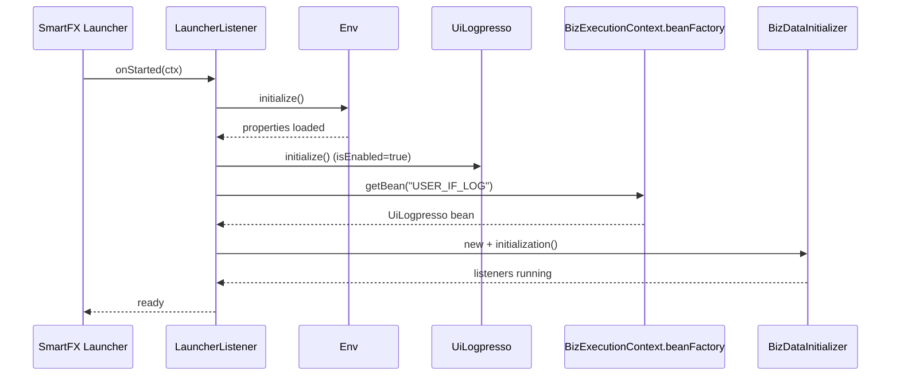

---

## §2 `BizEventHandler.java` — 서비스 호출 이벤트 후크

**경로:** `main/java/com/skhynix/smartatlas/BizEventHandler.java`

### 2.1 한 줄 요약
SmartFX의 `ServiceInvokeEventHandler` 구현체. 모든 `@Service` 호출의 before/after/onSuccess/onError 시점에 `serviceId` 를 DEBUG 로그로 기록한다 (AOP-like cross-cutting concern).

### 2.2 주요 필드
| 라인 | 항목 | 설명 |
|------|------|------|
| L14 | `private final Logger logger` | 인스턴스 로거 |

### 2.3 어노테이션
- `@Component` (L11) – SmartFX 빈 등록
- `@Singleton` (L12) – 단일 인스턴스

### 2.4 메서드 시그니처 (4개 모두 `ServiceInvokeEventHandler` 콜백)
| 라인 | 시그니처 | 동작 / 메모 |
|------|---------|-------------|
| L17-19 | `void beforeInvoke(ServiceInvokeData)` | DEBUG 로그 출력. **버그성**: 메세지 문자열이 "afterInvoke:" 로 잘못 들어가 있음 |
| L22-24 | `void onSuccess(ServiceInvokeData, Object returnValue)` | DEBUG 로그. 메세지가 "beforeInvoke:" 로 표시 (오기) |
| L27-29 | `void onError(ServiceInvokeData, Throwable cause)` | "onError: " 로그 |
| L32-34 | `void afterInvoke(ServiceInvokeData)` | DEBUG 로그. "onSuccess: " 로 표시 (오기) |

> **품질 노트**: 4개 후크 모두 메세지 라벨이 서로 뒤바뀌어 있다. (`beforeInvoke→"afterInvoke"`, `onSuccess→"beforeInvoke"`, `afterInvoke→"onSuccess"`)

### 2.5 외부 의존성
- `com.skhynix.smartfx.annotation.Component`, `Singleton`
- `com.skhynix.smartfx.server.api.ServiceInvokeData`, `ServiceInvokeEventHandler`

### 2.6 호출 관계
- **호출자:** SmartFX 컨테이너 (등록된 모든 `@Service` 메서드 호출 시점에 자동 호출)
- **호출 대상:** SLF4J Logger 만 사용

```mermaid
flowchart LR
    A[@Service method invocation] -->|intercepted| B[BizEventHandler.beforeInvoke]
    B --> C[actual service body]
    C -->|success| D[onSuccess]
    C -->|error| E[onError]
    D --> F[afterInvoke]
    E --> F
```

---

## §3 `service/AmosService.java` — AMOS 비즈니스 서비스

**경로:** `main/java/com/skhynix/smartatlas/service/AmosService.java`

### 3.1 한 줄 요약
`@Service("AMOS_SERVICE")` 로 노출되는 비즈니스 서비스. 알람 임계치 파라미터 CRUD(Logpresso `AMOS_ALARM_PARAMETER` 테이블) 와 UI 용 컨베이어 테이블 조회를 제공한다.

### 3.2 주요 필드 / 상수
| 라인 | 항목 | 설명 |
|------|------|------|
| L33 | `Logger logger` | SLF4J |
| L34 | `String MethodLog = "AMOS_SERVICE#{} : elapsed time={}ms, query={}"` | 로그 템플릿 |
| L37 | `static Map<String, Map> mapEqpCache` | 미사용/캐시 placeholder (raw type) |

### 3.3 메서드 시그니처
| 라인 | 시그니처 | 동작 |
|------|---------|------|
| L39-41 | `String hello()` | "hi" 반환 (헬스체크) |
| L43-53 | `boolean alarmParameter(String fabId, String limitType, int value)` | (1) 메모리 `DataService.getDataSet().getAlarmLimitMap()` 에 `fabId:limitType → value` 갱신 (L45). (2) `Tuple` 빌드 후 `LogpressoAPI.setInsertTuple("AMOS_ALARM_PARAMETER", tuple, 100)` 호출(L47-52). |
| L55-74 | `int getAlarmParameter(String fabId, String limitType)` | Logpresso 쿼리 `table AMOS_ALARM_PARAMETER \| search FAB_ID=="%s" and LIMIT_TYPE=="%s" \| sort -_time \| limit 1 \| fields VALUE` 실행 (L59). 결과가 비면 0 반환(L61-64). 가장 최신 VALUE int 반환. |
| L76-106 | `DataTable queryAllCnvTableForUI()` | UI 그리드용 `DataTable` 생성. 컬럼: `id, type, portNodeIdList, isN2, processTypeSet, cnvLayoutStr` (L79-85). `DataService.getDataSet().getConveyorMap()` 의 모든 `Conveyor` 를 순회하며 row를 채움 (L88-103). |

### 3.4 외부 의존성
- `com.logpresso.client.Tuple`
- `com.skhynix.smartatlas.data.Carrier.PROCESS_TYPE`, `data.eq.Conveyor`, `data.eq.Eqp`
- `com.skhynix.smartatlas.db.logpresso.LogpressoAPI`
- `com.skhynix.smartatlas.util.DataService`
- `com.skhynix.smartfx.annotation.Service`
- `com.skhynix.smartfx.dataaccessfx.{DataRow,DataTable,DataTableFactory}`
- `com.google.gson.*` (선언만, 본문 미사용 import)
- `com.skhynix.smartfx.linkfx.channel.ChannelType` (미사용 import)

### 3.5 호출 관계
- **호출자:** SmartFX RPC 클라이언트(UI), `@Service("AMOS_SERVICE")` 빈명으로 조회.
- **호출 대상:** `LogpressoAPI`, `DataService.getDataSet()`, `DataTableFactory`.

### 3.6 흐름 (alarmParameter)
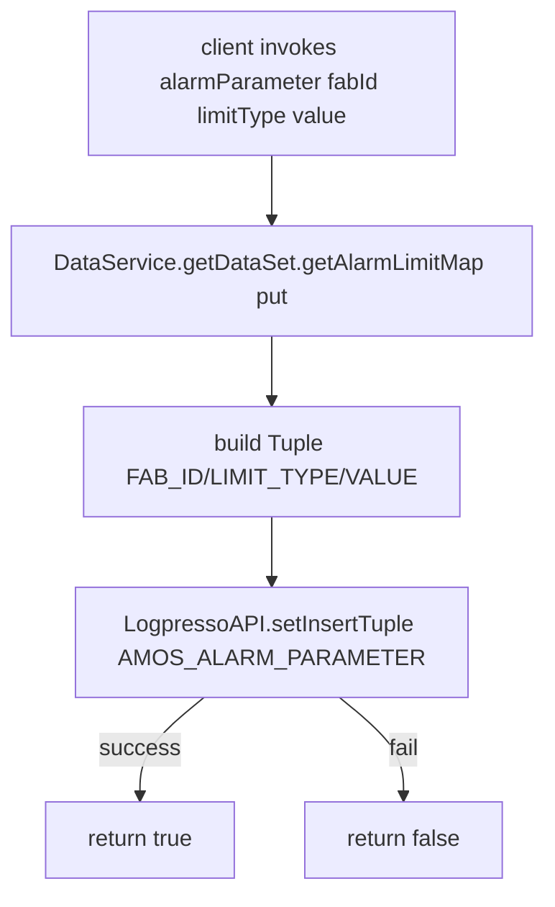

---

## §4 `service/BizDataInitializer.java` — Fab 리스너/디스패처 부트

**경로:** `main/java/com/skhynix/smartatlas/service/BizDataInitializer.java`

### 4.1 한 줄 요약
부트스트랩의 가장 핵심. FabSet properties 로부터 `FabProperties` 맵을 구축하고, **#1 OHT UDP 리스너 생성 → #2 리스너 start → #3 메세지 디스패처 쓰레드 기동** 의 3단계를 수행한다.

### 4.2 주요 필드
| 라인 | 항목 | 설명 |
|------|------|------|
| L39 | `Logger logger` | 인스턴스 로거 |
| L40 | `static long ohtSeq = 0` | OHT 메세지 시퀀스 (Atomic 아님, 단일 디스패처 쓰레드에서만 ++ 되므로 안전) |

### 4.3 메서드 시그니처
| 라인 | 시그니처 | 단계 / 동작 |
|------|---------|-------------|
| L43-68 | `void initialization()` | (1) `Env.getFabsetProperties()` 읽음(L47). (2) `DataService.getInstance().initialization(properties)` (L49) – FabProperties/Mcp/Tibrv 구성. (3) `fabPropertiesMap` 비면 skip(L53-54). (4) `addStartFab(map)` 호출(L56). (5) 모든 fabId 에 대해 `_init(fabId)` (L59-61). (6) `_startWorker()` (L64). 소요시간 로그(L67). |
| L72-81 | `void addStartFab(ConcurrentMap<String,FabProperties> map)` | OHT UDP 리스너 생성 → `DataService.setOhtUdpListenerMap` → `_startListening()` 호출. (AGV 부분은 변수 선언만 존재 L74) |
| L84-120 | `private ConcurrentHashMap<String,OhtUdpListener> _createOhtUdpListener(...)` | **#1**: 각 FabProperties → 각 Mcp 마다 `OhtUdpListener` 생성. mcp.ip 에 `,` 가 포함되어 멀티 IP 인 경우, 같은 port 를 공유하는 listener 가 이미 있으면 `addListenMcpIp(fabId, mcpName, ip)` 로 추가(L97-108), 없으면 새로 생성(L99-103). 단일 IP 면 단순 `new OhtUdpListener(fabId, mcpName, port)` (L110). key 포맷: `fabId.mcpName` (L95). |
| L123-145 | `private void _startListening(...)` | **#2**: fabId 별 (a) OHT UDP 리스너 `start()` (L131-137), (b) `FabProperties.getCnvSocketIOListenerMap` 의 `CnvSocketIOListener.listenStart()` (L140-143). |
| L148-223 | `private void _startWorker()` | **#3**: 1000개 max, 1초 TTL `ExpiringMap` 메세지 캐시 빌드(L149-154). "Msg Dispatcher" 쓰레드 시작(L156). 내부에서 `ThreadPool("WorkerRunnableQueue", Env.getUdpQThreadPoolSize())` 생성(L158, size=100). 무한 루프(L162): `DataService.isDataServiceRunning()` 체크 → `DataService.queue.take()` 로 `Msg` 디큐(L169) → type 별 분기(L176). **OHT**: 캐시 키(`fabId+mcpName+message`)로 1초 dedup, 미존재 시 `OhtMsgWorkerRunnable` 제출(L177-195). **CNV**: `CnvMsgWorkerRunnable` (L196-202). **AMP**: `AmpMsgWorkerRunnable` (L203-209). **UI**: `UiMsgWorkerRunnable` (L210-216). |
| L225-249 | `private void _init(String fabId)` | fabId 별 INIT 메세지 전송. `DataService.getTibrvSenderLikeMap(fabId+":send:")` 의 모든 tibrvKey 에 대해 `LayoutUtil.buildLayoutMessageDataMap(SEND_SUB_SUBJECT.INIT, ...)` 로 페이로드 생성 → `TibrvSendMsg` 만들어 `DataService.addTibrvMessageQueue()` 에 enqueue. |

### 4.4 외부 의존성
- `com.skhynix.smartatlas.data.FabProperties`, `data.McpProperties`, `data.Msg`, `data.TibrvSendMsg`
- `com.skhynix.smartatlas.environment.Env`
- `com.skhynix.smartatlas.listener.{AgvUdpListener, CnvSocketIOListener, OhtUdpListener}`
- `com.skhynix.smartatlas.process.{AmpMsgWorkerRunnable, CnvMsgWorkerRunnable, OhtMsgWorkerRunnable, UiMsgWorkerRunnable}`
- `com.skhynix.smartatlas.process.OhtMsgWorkerRunnable.OHT_TIB_STATE`
- `com.skhynix.smartatlas.service.TibrvService.SEND_SUB_SUBJECT`
- `com.skhynix.smartatlas.util.{AleadyClosedException, DataService, LayoutUtil, ThreadPool}`
- `net.jodah.expiringmap.{ExpirationPolicy, ExpiringMap}`

### 4.5 호출 관계
- **호출자:** `LauncherListener.onStarted()` (L26).
- **호출 대상:** `Env`, `DataService`, `OhtUdpListener`, `CnvSocketIOListener`, `ThreadPool`, `OhtMsgWorkerRunnable`/`CnvMsgWorkerRunnable`/`AmpMsgWorkerRunnable`/`UiMsgWorkerRunnable`, `LayoutUtil.buildLayoutMessageDataMap`, `TibrvSendMsg`.

### 4.6 흐름

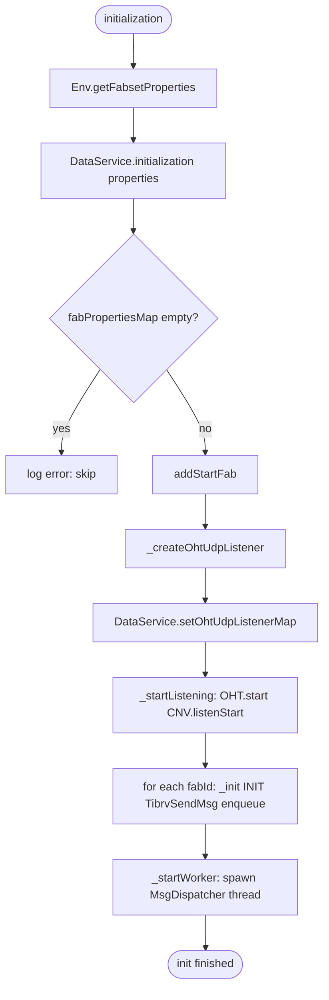

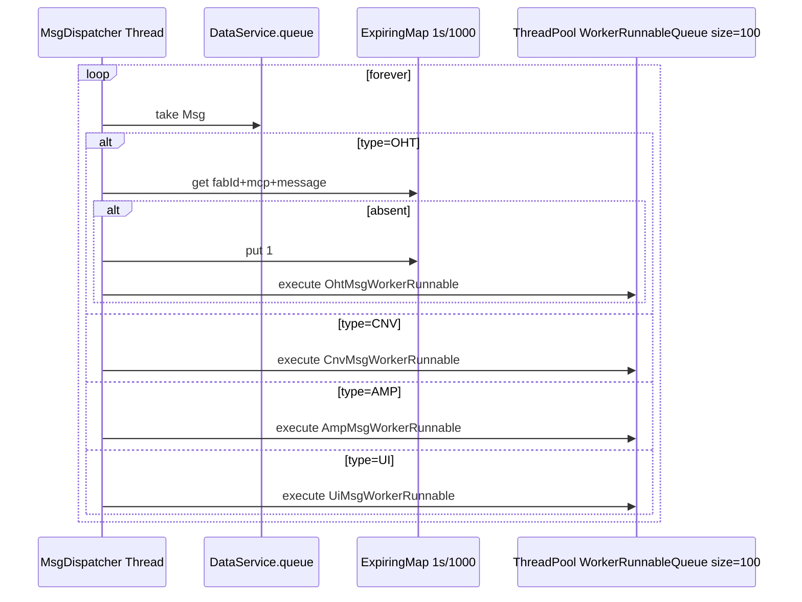

---

## §5 `service/HttpService.java` — REST(OkHttp) 헬퍼

**경로:** `main/java/com/skhynix/smartatlas/service/HttpService.java`

### 5.1 한 줄 요약
OkHttp3 기반의 **JSON POST** 유틸리티. 동기/비동기 호출 모두 `Map<String,Object>` 응답으로 정규화하며 5xx/4xx 표준 `HttpStatus` enum을 내장한다.

### 5.2 주요 필드
| 라인 | 항목 | 설명 |
|------|------|------|
| L22 | `Logger logger` | SLF4J |
| L23 | `Gson gson` | Gson 인스턴스 |
| L24-41 | `Type MAP_TYPE` | `ParameterizedType` 익명 구현, `Map<String,Object>` 타입 토큰. `gson.fromJson(json, MAP_TYPE)` 에 사용 (L212) |

### 5.3 메서드 시그니처
| 라인 | 시그니처 | 동작 |
|------|---------|------|
| L43 | `HttpService()` | no-op 생성자 |
| L52-58 | `static Map<String,Object> post(url, payload, header)` | timeout=10s, sync. `post(url, payload, header, 10, false)` 위임 |
| L67-73 | `static Map<String,Object> asyncPost(url, payload, header)` | timeout=10s, async |
| L75-120 | `static Map<String,Object> post(url, parameter, header, int timeout, boolean isAsynchronous)` | **#1 헤더** Content-Type 강제 주입(L87) → 헤더 add (L89-91). **#2 바디** `gson.toJson(parameter)` (L98), MediaType null check(L101-105), `RequestBody.create(mediaType, jsonParameter)` (L107). **#3 요청** `_createHttpClient(timeout)` (L112). 분기: async 이면 `_executeAsyncRequest`, 아니면 `_executeRequest` (L119). |
| L122-131 | `static OkHttpClient _createHttpClient(int timeout)` | timeout>0 이면 connect/read Timeout = timeout (초). 아니면 default 클라이언트. |
| L133-150 | `static Map<String,Object> _executeRequest(client, req)` | `newCall(request).execute()` try-with-resources(L139). 성공시 `_formatResponse` (L141), 실패시 warn 로그. IOException 시 INTERNAL_SERVER_ERROR 반환(L145-147). |
| L152-202 | `static Map<String,Object> _executeAsyncRequest(client, req)` | `CountDownLatch(1)` + responses 리스트(L156-157). `newCall.enqueue(Callback)` 의 onFailure 에서 latch.countDown + error 응답(L165-171), onResponse 에서 `_formatResponse` 후 latch.countDown(L175-186). `latch.await(30, SECONDS)` (L190) – 최대 30초 대기. 성공시 첫 응답 반환. |
| L204-227 | `static Map<String,Object> _formatResponse(Response response)` | response body string → `gson.fromJson(MAP_TYPE)` (L212). finally 에서 `responseBody.close()` 보장(L217). |
| L229-234 | `static Map<String,Object> _responseError(HttpStatus, String comment)` | `Map.of("code", code, "message", msg)` 표준 에러 응답 |

### 5.4 내부 enum (L236-271): `HttpStatus`
- 4xx: BAD_REQUEST(400), UNAUTHORIZED(401), FORBIDDEN(403), NOT_FOUND(404), METHOD_NOT_ALLOWED(405), NOT_ACCEPTABLE(406), REQUEST_TIMEOUT(408), CONFLICT(409), GONE(410), UNSUPPORTED_MEDIA_TYPE(415)
- 5xx: INTERNAL_SERVER_ERROR(500), NOT_IMPLEMENTED(501), BAD_GATEWAY(502), SERVICE_UNAVAILABLE(503), GATEWAY_TIMEOUT(504), HTTP_VERSION_NOT_SUPPORTED(505)
- 필드: `code:int`, `message:String`; getter: `getCode()`, `getMessage()`.

### 5.5 외부 의존성
- `okhttp3.*` (Request, RequestBody, Response, OkHttpClient, MediaType, Call, Callback, ResponseBody)
- `com.google.gson.Gson`
- `com.mongodb.lang.NonNull`, `okhttp3.internal.annotations.EverythingIsNonNull` (어노테이션)
- `java.util.concurrent.{CountDownLatch, TimeUnit}`

### 5.6 호출 관계
- **호출자:** `batch.ItsmChangeRequestBatch` 의 ITSM POST 호출 (`ItsmChangeRequestBatch.java:112`). 그 외 잠재적 호출자는 SmartAtlas 내부 외부 API 연동 코드.
- **호출 대상:** OkHttp3 라이브러리, Gson.

### 5.7 흐름
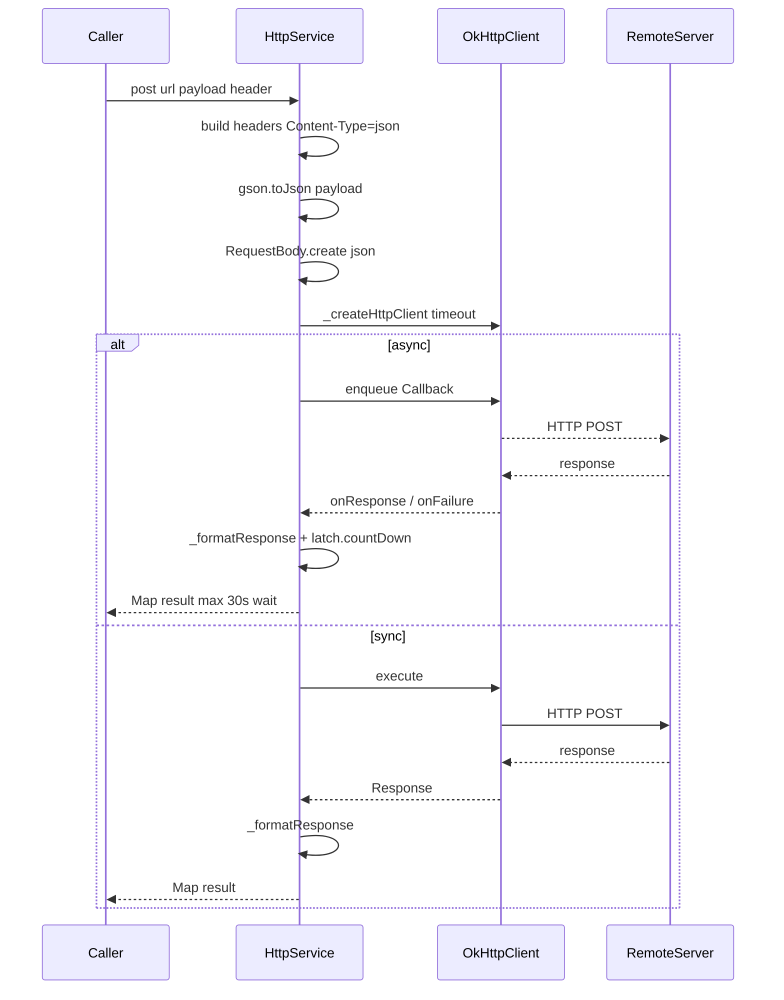

---

## §6 `service/TibrvService.java` — TIBCO Rendezvous Pub/Sub 래퍼

**경로:** `main/java/com/skhynix/smartatlas/service/TibrvService.java`

### 6.1 한 줄 요약
한 개의 `TibrvRvdTransport` + `TibrvQueue` + `TibrvListener` 의 생명주기를 캡슐화하며, **수신: `onMsg` 콜백 → `DataService.queue` 에 enqueue**, **송신: `sendMessage` → `TibrvAPI.send` + Logpresso 로그 적재** 를 수행. CMESSAGE XML 으로부터 service/network 를 GID 로 로드한다.

### 6.2 주요 필드 / 상수
| 라인 | 항목 | 설명 |
|------|------|------|
| L37 | `Logger logger` | SLF4J |
| L38 | `CONFIG_PATH_TEMPLATE = "cmessage/cfg/CMESSAGE_{0}_{1}.xml"` | facId,type 으로 포맷 |
| L39 | `MAX_ENTRIES = 30` | 분당 카운트 LinkedHashMap 의 최대 보존 분 수 |
| L40-43 | `service, network, daemon, subject` | RVD 접속 정보 |
| L44 | `MSG_TYP msgTyp` | OHT/CNV/AMP/UI 등 (`Msg.MSG_TYP`) |
| L45-46 | `facId, fabId` | 소유자 식별자 |
| L48-50 | `TibrvTransport transport`, `TibrvQueue tibrvQueue`, `TibrvMsg tibrvMessage` | Tibrv 핵심 객체 |
| L52 | `int receivedMessageCount` | 현재 분 누적 수신량 |
| L53-64 | `LinkedHashMap receivedMessageCountMap` | LRU(accessOrder=true) MAX_ENTRIES 초과 시 가장 오래된 분 제거 |
| L65 | `boolean initialized` | init 성공 플래그 |

### 6.3 생성자
| 라인 | 시그니처 | 동작 |
|------|---------|------|
| L68-85 | `TibrvService(fabId, facId, subject, daemon, int gid)` | (a) `Env.getEnv()` 호출(L75). (b) `_initSubject(subject)` (L80). (c) `_loadTibrvInfoByGid(facId, type, gid)` 로 XML 에서 SERVICE/NETWORK 추출(L82). (d) `init()` (L84). |
| L88-107 | `TibrvService(fabId, facId, daemon, subject, service, network, MSG_TYP msgTyp)` | service/network 를 직접 받는 오버로드 (XML 사용 안함). |

### 6.4 주요 메서드
| 라인 | 시그니처 | 동작 |
|------|---------|------|
| L109-120 | `private void _initSubject(String subject)` | subject 가 facId 로 시작하면 그대로 사용, 아니면 `"{facId}.{env}.{subject}"` 포맷으로 재구성. |
| L122-148 | `private void _loadTibrvInfoByGid(facId, type, gid)` | `cmessage/cfg/CMESSAGE_{facId}_{type}.xml` 파일 dom4j 로 파싱. gid 와 매칭되는 element 찾아 SERVICE/NETWORK 추출. |
| L150-163 | `private Element _findElementByGid(root, gid)` | root 의 자식 multicast element 들을 순회, `SEQ` 속성과 gid 비교. |
| L165-181 | `private void _extractServiceAndNetwork(Element)` | "SERVICE", "NETWORK" 자식 element 의 텍스트를 필드에 할당. |
| L183-199 | `private void _close()` | tibrvQueue.destroy, transport.destroy, Tibrv.close. 예외시 로그. |
| L204-231 | `public void init()` | `TibrvMsg.setStringEncoding("MS949")` (L207, 한글 인코딩), `Tibrv.open(IMPL_NATIVE)` (L210), `new TibrvRvdTransport(service, network, daemon)` (L219), `new TibrvQueue()` (L220), `new TibrvListener(queue, this, transport, subject, null)` (L221), `initialized=true` (L223). 실패 시 `_close()`. |
| L233-247 | `public void startListen()` | initialized 확인 후 `_listenHandler()` 호출. |
| L249-273 | `private void _listenHandler()` | `_countMessageReceivedPer1Minutes()` 로 카운터 쓰레드 기동(L252). 메인 dispatch 쓰레드 "TibrvThreadPool" 시작 – 무한 `tibrvQueue.dispatch()` (L259), invalid 상태 시 break. |
| L275-281 | `public void sendMessage(String data)` | this.subject 로 전송 |
| L279-281 | `public void sendMessage(String data, String suffixSubject)` | subject+"."+suffix |
| L283-293 | `public void sendMessage(String data, subject, service, network, daemon)` | `TibrvAPI.send(...)` (L287) 호출 후 `_insertLogpresso` 로 결과 기록 |
| L295-317 | `private boolean _insertLogpresso(success, subject, network, service, daemon, data)` | Tuple(RESULT/FAB_ID/FAC_ID/SUBJECT/SERVICE/NETWORK/DAEMON/MESSAGE/ENCODE/ENV) → `LogpressoAPI.setInsertTuple("ATLAS_TIB_SEND_MSG_LOG", tuple, 20)`. |
| L319-345 | `@Override public void onMsg(TibrvListener, TibrvMsg)` | **콜백**: `receivedMessageCount++` (L322). `new Msg(fabId, msgTyp, currentMillis, tibrvMessage.getField("xmlData").data)` (L326-331) → `DataService.queue.add(data)` (L332). `Env.getFabsetProperties().getProperty("CMN.CMN.UDP_MESSAGE_MONITORING")` 이 "TRUE" 이면 `recordQueue.add(data)` 추가 (L335-337). |
| L347-394 | `private void _countMessageReceivedPer1Minutes()` | "TibrvCountMessageReceivedPer1Minutes" 쓰레드. 매 1분 시작 시 60초 정렬 sleep 후 `receivedMessageCountMap.put(timeKey, receivedMessageCount)`, 첫 호출은 isFirstCheck false 라 건너뜀(부분 분 제외). 매번 count=0 리셋. |
| L396-414 | getter 들 (`getService/Network/Daemon/Subject/MessageCount(key)`) | 일반 getter |
| L419-430 | `public static class SEND_SUB_SUBJECT` | 송신 서브 서브젝트 상수: ALARM, INIT, HID_OFF="HIDOFF", VHL_OFF="VHLOFF", RAIL_CUT="RAILCUT", RAIL_VIBRATION="VIBRATION", VHL_AVG_SPEED="VHLSPEED", VHL_CNT="VHLBEING", CNV_INOUT |
| L432-438 | `getFabId(), getFacId()` | getter |

### 6.5 외부 의존성
- `com.tibco.tibrv.*` (Tibrv, TibrvException, TibrvListener, TibrvMsg, TibrvMsgCallback, TibrvQueue, TibrvRvdTransport, TibrvTransport)
- `com.logpresso.client.Tuple`
- `com.skhynix.smartatlas.comm.TibrvAPI` (`send`)
- `com.skhynix.smartatlas.data.Msg`, `Msg.MSG_TYP`
- `com.skhynix.smartatlas.db.logpresso.LogpressoAPI`
- `com.skhynix.smartatlas.environment.Env`
- `com.skhynix.smartatlas.util.DataService`
- `org.dom4j.{Document, Element, io.SAXReader}`

### 6.6 호출 관계
- **호출자(인스턴스 생성):** `DataService.java:561, 570` (initialization 중 fabset properties 에 따라 sender/receiver 인스턴스 생성). 그 후 `getTibrvSenderMap` / `getTibrvReceiverMap` 으로 조회.
- 정적 내부 상수 `SEND_SUB_SUBJECT` 의 사용자: `data.RailCutRecordItem`, `data.VhlOffRecordItem`, `data.HidOffRecordItem`, `data.RailVibrationRecordItem`, `util.LayoutUtil`, 다수 `batch.*Batch` (VhlCnt/VhlCnt10/30/60/RailVibration/Traffic/SystemMessageDetect 등).
- **호출 대상:** Tibrv 네이티브 API, `TibrvAPI.send`, `LogpressoAPI.setInsertTuple`, `DataService.queue`, `DataService.recordQueue`, `Env.getEnv`, `Env.getFabsetProperties`.

### 6.7 흐름

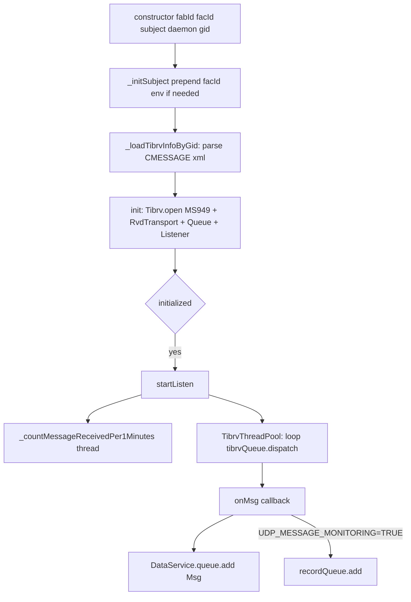

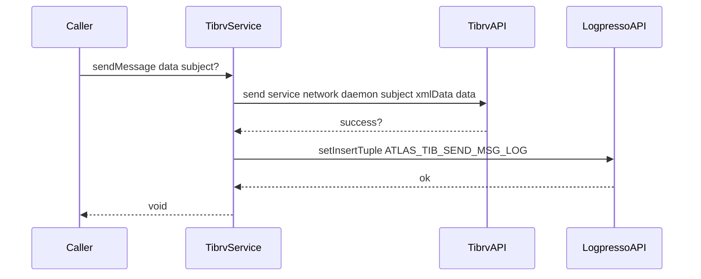

---

## §7 `service/UiLogpresso.java` — UI 통합 조회 서비스 (거대 클래스)

**경로:** `main/java/com/skhynix/smartatlas/service/UiLogpresso.java` (3549 lines)

### 7.1 한 줄 요약
`@Service("USER_IF_LOG")` 빈명으로 등록된 **UI 후처리/조회 핵심 게이트웨이**. Logpresso/MongoDB/MyBatis 3개의 백엔드로 분기되는 MCSLOG, SECS, Transaction, Raw 등 50여개의 조회 API 와 그리드 레이아웃 파일 IO, SSH 원격 MongoDB 운영 명령 등을 제공한다.

### 7.2 주요 필드 / 상수
| 라인 | 항목 | 설명 |
|------|------|------|
| L64 | `Logger logger` | static |
| L65 | `MethodLog = "USER_IF_LOG#{} : userId={}, elapsed time={}ms, query={}"` | 표준 로그 템플릿 |
| L67 | `GRID_LAYOUT_FILE_PATH = "gridLayout"` | 그리드 레이아웃 XML 저장 디렉터리 |
| L69 | `static boolean isEnabled = false` | 모든 API 가 진입 직후 체크하는 게이트 플래그 |

### 7.3 라이프사이클 / 인프라 메서드
| 라인 | 시그니처 | 동작 |
|------|---------|------|
| L71-73 | `static void initialize()` | `isEnabled=true` 로 활성화. `LauncherListener.onStarted` 에서 호출(LL:L21). |
| L75-77 | `boolean isAlive()` | true 반환 (헬스체크) |
| L86-105 | `List<Map<String,Object>> getAsyncResult(String asyncKey, String userId)` | `AsyncUtil.get(asyncKey)` 로 비동기 작업 결과 폴링 |
| L116-135 | `boolean saveGridLayout(key, hasSuffixUserId, contents, userId)` | `hasSuffixUserId==false` 이면 `SecurityUtil.assertAccessLevel(SystemAdministrator)` (L122). 파일명 `key[_userId].xml` 을 `gridLayout/` 하위에 `Util.writeFileString` |
| L144-159 | `String loadGridLayout(key, hasSuffixUserId, userId)` | `Util.readFileString` 으로 그리드 레이아웃 XML 로드 |

### 7.4 MCSLOG Master/Machine 조회 (Mongodb/Logpresso 듀얼 분기 패턴)
| 라인 | 시그니처 | 동작 |
|------|---------|------|
| L167-225 | `List<String> getMasterMachineListAreaNames(site, fabs, hasMongodb, userId)` | hasMongodb=true → `MongodbQueryPool.getQuery("MCSLOG_MACHINELIST_FILTER", args)` → `MongodbAPI.aggregate(fab, tables.get(site,fab), bsonMatch)`. false → `LogpressoMcslogQuery.getTablesCollection(MASTER_MACHINELIST)` + `LogpressoAPI` |
| L226-286 | `getMasterMachineListBayNames(...)` | 위와 동일 패턴, GroupingArea=False |
| L287-372 | `getMasterMachineListType(...)` | 머신 타입 목록 |
| L373-437 | `getMasterMachineListNames(...)` | areaName 으로 필터된 머신 이름 |

### 7.5 LogList API (Total / SECS / Raw / Transaction) – 모두 Mongodb/Logpresso 듀얼 메서드 쌍
| 라인 | 시그니처 | 분류 |
|------|---------|------|
| L438-464 | `getCommMsgNameList(fabSite, userId)` | Comm Msg 이름 목록 |
| L465-491 | `getOperationNameList(fabSite, userId)` | Operation 이름 |
| L492-518 | `getMessageNameList(fabSite, userId)` | Message 이름 |
| L519-631 | `getTotalLogListForMongodb(...)` | Mongo 전체 로그 |
| L632-739 | `getTotalLogList(...)` | Logpresso 전체 로그 |
| L740-798 | `getSecsFabList(...)` | Logpresso SECS Fab 리스트 |
| L799-829 | `getSecsFabListForMongodb(...)` | Mongo SECS Fab |
| L830-908 | `getSecsLogListForMongodb(...)` | Mongo SECS |
| L909-992 | `getSecsLogList(...)` | Logpresso SECS |
| L993-1043 | `getSelectProcessListForMongodb(...)` | Mongo Process List |
| L1044-1127 | `getSelectProcessList(...)` | Logpresso Process List |
| L1128-1232 | `getRawLogListForMongodb(...)` | Mongo Raw Log |
| L1233-1315 | `getRawLogList(...)` | Logpresso Raw Log |
| L1316-1366 | `getTransactionLogAppNameListForMongodb(...)` | Mongo AppName |
| L1367-1407 | `getTransactionLogAppNameList(...)` | Logpresso AppName |
| L1408-1457 | `getTransactionLogTxNameListForMongodb(...)` | Mongo TxName |
| L1458-1499 | `getTransactionLogTxNameList(...)` | Logpresso TxName |
| L1500-1564 | `getTransactionLogItemsForMongodb(...)` | Mongo Tx Items |
| L1565-1719 | `getTransactionLogItems(...)` | Logpresso Tx Items |
| L1720-1793 | `getSystemQueries(id, is_end, is_eof, ...)` | 시스템 쿼리 페이지네이션 |

### 7.6 MCSLOG Resource/Transport 로그 (12 종)
| 라인 | 시그니처 |
|------|---------|
| L1794-1869 | `getMcslogAlarmReportLog(filterJson, hasMongodb, pageNum, ...)` |
| L1870-1945 | `getMcslogMaterialCarrierLocLog(...)` |
| L1946-2021 | `getMcslogResourceMachineLog(...)` |
| L2022-2097 | `getMcslogResourcePortLog(...)` |
| L2098-2173 | `getMcslogResourceShelfLog(...)` |
| L2174-2249 | `getMcslogResourceCraneLog(...)` |
| L2250-2325 | `getMcslogResourceVehicleLog(...)` |
| L2326-2401 | `getMcslogResourceStorageLog(...)` |
| L2402-2477 | `getMcslogTransportReturnLog(...)` |
| L2478-2553 | `getMcslogTransportReturnJobLog(...)` |
| L2554-2629 | `getMcslogTransportReturnCommandLog(...)` |
| L2630-2710 | `getMcslogTransportReturnLogDetail(...)` |
| L2711-2786 | `getMcslogTransportReturnJobFailLog(...)` |
| L2787-2862 | `getMcslogTransportReturnCommandFailLog(...)` |
| L2863-2908 | `getMcslogTransportReturnFailLogReason(...)` |
| L2909-2967 | `getMcslogUnitType(unitName, site, fabs, ...)` |
| L2968-3091 | `getMcslogTransportCompletedCarrierFromToLog(...)` |

위 메서드들 모두 다음 공통 패턴을 따른다:
1. `if (!isEnabled) return null` 가드
2. `long start = System.currentTimeMillis()`
3. `SecurityUtil.assertNull(...)` 인자 검증
4. `LogpressoCommonFilterQuery.extract(filterPropertiesJson, ...)` 혹은 `MongodbCommonFilterQuery.extract(...)` 로 필터 파라미터 추출
5. 백엔드 분기 (hasMongodb)
6. 결과 페이지 메타(`total`, `data`)를 `Map<String,Object>` 로 빌드
7. finally 에서 elapsed time 로그

### 7.7 MongoDB 샘플 / 쿼리 히스토리 / SSH 관리
| 라인 | 시그니처 | 동작 |
|------|---------|------|
| L3092-3245 | `testMongoDbSample(collection, startDate, unitHour, poolSize, ...)` | Mongo 쿼리 풀 성능 테스트 |
| L3246-3352 | `queryLogHistory(startDate, endDate, limit, logLevel, ...)` | 로그 히스토리 조회 |
| L3353-3362 | `String SshMongoDbJsConsoleOutput()` | SSH 콘솔 출력 조회 |
| L3364-3382 | `boolean SshMongoDbJsMaintenanceStatus(ip, serverID, serverPassword)` | 유지보수 상태 조회 (`RemoteCommandUtil` 추정) |
| L3383-3404 | `boolean SshMongoDbJsMaintenanceCommand(ip, id, pwd, ...)` | 유지보수 명령 실행 |
| L3405-3458 | `String SshMongoDbJsCommand(ip, id, pwd, command, ...)` | SSH 임의 명령 실행 |

### 7.8 MyBatis 쿼리 / Repository XML
| 라인 | 시그니처 | 동작 |
|------|---------|------|
| L3459-3465 | `List<String> getAllMybatisQueryFiles(userId)` | `MybatisQueryHandler` 로부터 query xml 파일 목록 |
| L3466-3472 | `List<String> getQueryList(fileName, userId)` | 파일 내 queryId 목록 |
| L3473-3479 | `String getQueryContent(fileName, queryId, userId)` | 쿼리 본문 |
| L3480-3486 | `boolean updateQueryContent(fileName, queryId, content, userId)` | 쿼리 수정 (관리자 권한 필요) |
| L3487-3514 | `String loadRepositoryXml(fileName, userId)` | 리포지토리 XML 로드 |
| L3515-3548 | `boolean saveRepositoryXml(fileName, content, userId)` | 리포지토리 XML 저장 |

### 7.9 외부 의존성 (주요 import, L25-60)
- DB 백엔드: `db.logpresso.LogpressoAPI`, `db.mongodb.MongodbAPI`, `db.mongodb.MongodbQueryPool`, `db.mybatis.MybatisQueryHandler`
- 쿼리 포맷: `queryformat.{LogpressoCommonFilterQuery, LogpressoMcslogQuery, MongodbCommonFilterQuery, MongodbMcslogQuery}`
- 쿼리 타입: `queryformat.type.{ENUM_FABLIST_GROUP, ENUM_RANGE_SEARCH_OPTION, ExtractCommonFilterResult, McslogEiVo, McslogMachineVo, McslogSecsVo, McslogTablesCollection, McslogTotalVo}`
- 쿼리 util: `queryformat.util.LogpressoConditionUtil`
- 일반 util: `util.{AsyncUtil, JsonUtil, MemoryTailerUtil, QueryUtil, ReflectionUtil, RemoteCommandUtil, SecurityUtil, Util, XmlUtil}` + `SecurityUtil.AccessLevel`
- 외부: `org.apache.commons.lang3.StringUtils`, `org.bson.{BsonArray, Document}`, `com.google.gson.{Gson, reflect.TypeToken}`
- 어노테이션: `com.skhynix.smartfx.annotation.Service`

### 7.10 호출 관계
- **호출자:** SmartFX RPC/REST 게이트웨이를 통해 UI(클라이언트)가 `USER_IF_LOG` 빈명으로 호출.
- **선행 부트스트랩:** `LauncherListener.onStarted` (L21) → `UiLogpresso.initialize()` 로 enable, 직후 `beanFactory().getBean("USER_IF_LOG")` 가 인스턴스화.
- **호출 대상:** LogpressoAPI, MongodbAPI, MongodbQueryPool, MybatisQueryHandler, 다수 Util 클래스, RemoteCommandUtil(SSH).

### 7.11 백엔드 분기 패턴 (전형적)

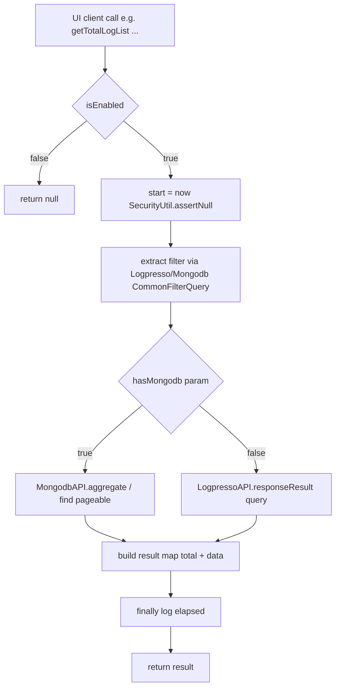

---

## §8 `environment/Env.java` — 환경 / Properties 전역 캐시

**경로:** `main/java/com/skhynix/smartatlas/environment/Env.java`

### 8.1 한 줄 요약
4종의 설정 파일 (`Settings.properties`, `FabSet.properties`, `Reset.properties`, 그리고 XML 들)에 대한 **전역 캐시 + 파일 마지막 수정시간 트래커**. Logpresso/MongoDB 패스워드 자동 암복호화, FAB×MCP 기능 스위치(`FunctionItem`) 보관도 담당하는 정적 클래스.

### 8.2 주요 상수 / 필드
| 라인 | 항목 | 설명 |
|------|------|------|
| L50 | `Logger logger` static | SLF4J |
| L52-53 | `_SettingsPropertiesPath = "{REPOSITORY_PATH}/Settings.properties"` | `FilePathUtil.REPOSITORY_PATH` 기반 |
| L55 | `UDPQ_THREADPOOL_SIZE = 100` | UDP 메세지 처리 스레드풀 사이즈 |
| L56 | `TIBRVQ_THREADPOOL_SIZE = 5` | Tibrv 큐 처리 스레드풀 사이즈 |
| L58 | `_LogpressoPropertiesMap : Map<String, DbProperties>` | fab → DbProps |
| L59 | `_MongodbPropertiesMap : Map<String, DbProperties>` | fab → DbProps |
| L60 | `_LogpressoDecryptKey = "Logpresso.Password"` | 암복호화 키 |
| L61 | `_MongodbDecryptKey = "Mongodb.Password"` | 암복호화 키 |
| L62 | `_AppProperties` | Settings.properties 캐시 |
| L63 | `_SmsProperties` | SMS 임계치 객체 |
| L64 | `_FabsetProperties` | FabSet.properties 캐시 |
| L65 | `_ResetProperties` | Reset.properties 캐시 |
| L67 | `env = ""` | 환경 (예: TEST/PROD) |
| L68 | `site = ""` | 사이트 코드 (예: IC) |
| L70 | `lastModifiedTime: FileTime` | FabSet.properties 마지막 수정시간 |
| L71 | `resetLastModifiedTime: FileTime` | Reset.properties 마지막 수정시간 |
| L72 | `variableDataModifiedTime: Map<String, FileTime>` | XML 5종 추적 |
| L76 | `mapFileLastModifiedTime: ConcurrentMap<String, Map<String, Long>>` | `{fabId}:{mcpName}` → fileName→modifiedDatetime (inactive/layout/station/mcp75cfg) |
| L81 | `switchMap: ConcurrentMap<String, FunctionItem>` | `fabId:mcpName` → FunctionItem 기능 스위치 |
| L83 | `private Env()` | 인스턴스화 금지 |

### 8.3 부트스트랩 메서드
| 라인 | 시그니처 | 동작 |
|------|---------|------|
| L89-109 | `static boolean initialize()` | 순차적으로: (1) `_AppProperties = _loadProperties(SETTINGS_PROPERTIES_PATH)` (2) `loadPropertiesProgram` (3) `loadPropertiesLogpresso` (4) `loadPropertiesMongodb` (5) `reloadFabsetProperties` (6) `loadPropertiesFabset` (7) `reloadResetProperties` (8) `loadEnvProperties` (파일 변경시간 캐시). 예외 시 false. |
| L115-125 | `static void loadPropertiesProgram(properties)` | `Sms.MemoryUsageLimit/CpuUsageLimit/DiskUsageLimit/UdpQueueWarningCount/UdpQueueFailoverCount/TibrvQueueWarningCount/TibrvQueueFailoverCount` 를 ParseUtil 로 파싱, `Sms.Receivers` 는 ","로 split 한 후 `SmsProperties` 생성. |
| L131-165 | `static void loadPropertiesLogpresso(properties)` | `Logpresso.Use` 의 ','로 split 된 fab 마다 `Logpresso.{fab}.Hosts/Port/Id/Password` 추출. **패스워드 자가 암호화**: `CryptoUtil.decrypt(password, key)==null` 이면 평문으로 간주 → `CryptoUtil.encrypt` 후 `writeProperty` 로 Settings.properties 에 쓰기. `DbProperties(hosts.split(","), port||8888, id, password, "")` 저장. |
| L171-197 | `static void loadPropertiesMongodb(properties)` | 위와 동일 패턴, default port 27020, database 포함. |
| L199-207 | `static void loadPropertiesFabset(properties)` | properties null/empty 면 env="NA",site="NA". 아니면 `Env`(기본 "TEST"), `Site`(기본 "IC") 추출. |
| L209-223 | `static void loadEnvProperties()` | FabSet/Reset properties 파일과 5개 XML(VARIABLE_ENV, LOGPRESSO_CUSTOM_QUERY, LOGPRESSO_CUSTOM_QUERY2, ALARM_MESSAGE, OHT_ALARM_MESSAGE) 의 lastModifiedTime 초기화. |

### 8.4 IO 헬퍼
| 라인 | 시그니처 | 동작 |
|------|---------|------|
| L230-261 | `static Properties _loadProperties(String directory)` | 파일 존재 검증 후 `new Properties().load(FileInputStream)`. 파일 부재 시 FileNotFoundException. finally 에서 stream close. |
| L266-285 | `static void writeProperty(String property, String value)` | Settings.properties 의 해당 키 라인을 in-place 갱신. `Files.writeString` 으로 일괄 쓰기. |
| L292-314 | `static FileTime _initializedLastModifiedTime(String directory)` | `Files.readAttributes(path, BasicFileAttributes.class).lastModifiedTime()` |

### 8.5 reload / getter / setter
| 라인 | 메서드 | 설명 |
|------|--------|------|
| L316-320 | `reloadFabsetProperties()` | FabSet 재로드, 실패시 기존 유지 |
| L322-326 | `reloadResetProperties()` | Reset 재로드 |
| L328-374 | getter 들 | `getAppProperties / getSmsProperties / getFabsetProperties / getResetProperties / getMongodbPropertiesMap / getMongodbDecryptKey / getLogpressoPropertiesMap / getLogpressoDecryptKey / getUdpQThreadPoolSize / getTibrvQThreadPoolSize / getEnv / getSite` |
| L376-394 | setter 들 | `setLastModifiedTime / setResetLastModifiedTime / setMapFileLastModifiedTime / setVariableDataModifiedTime` (dictionary 검증 포함) |
| L398-412 | 마지막 수정시간 getter | `getLastModifiedTime / getResetLastModifiedTime / getVariableDataModifiedTime / getMapFileLastModifiedTime` |
| L415-417 | `getSwitchMap()` | switchMap 전체 |
| L419-425 | `getSwitchMap(String key)` | 키 단건 조회 (없으면 null) |

### 8.6 외부 의존성
- `org.apache.commons.lang3.StringUtils`
- `com.skhynix.smartatlas.environment.type.{DbProperties, FunctionItem, SmsProperties}`
- `com.skhynix.smartatlas.util.{CryptoUtil, FilePathUtil, ParseUtil}`
- 표준 nio, Properties, ConcurrentHashMap

### 8.7 호출 관계
- **호출자:** 거의 모든 비즈니스/배치/process/util 클래스. 부트는 `LauncherListener.onStarted` 가 최초 `Env.initialize()` 호출. 이후 `Env.getEnv()`, `Env.getFabsetProperties()`, `Env.getSwitchMap()`, `Env.getUdpQThreadPoolSize()` 등이 광범위하게 사용됨 (예: `TibrvService.java:75,111,314,335`, `BizDataInitializer.java:47,158`, `OhtMsgWorkerRunnable.java:644`, 다수 batch).
- **호출 대상:** `CryptoUtil`(encrypt/decrypt), `FilePathUtil`(다수 경로 상수), `ParseUtil.parseIntOrDefault`, 표준 nio.

### 8.8 흐름

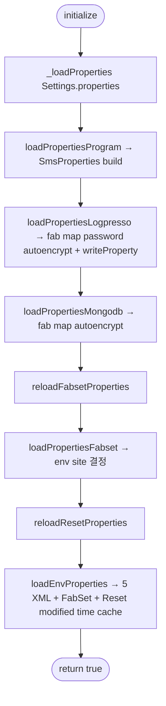

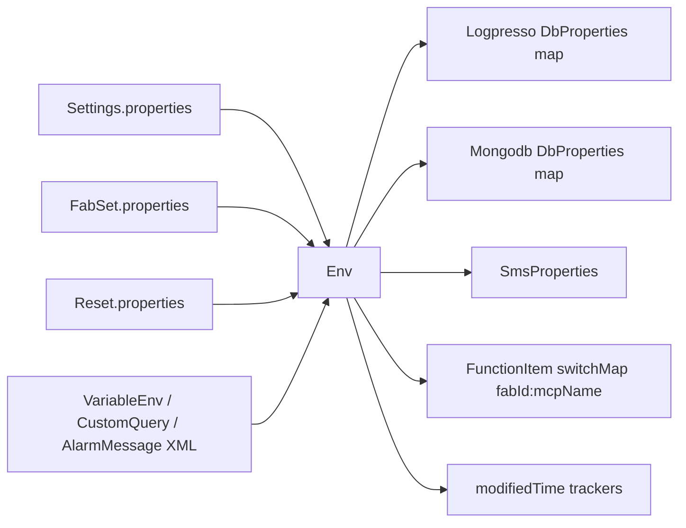

---

## §9 `environment/type/DbProperties.java` — DB 접속 정보 VO

**경로:** `main/java/com/skhynix/smartatlas/environment/type/DbProperties.java`

### 9.1 한 줄 요약
Logpresso 와 MongoDB 양쪽 모두에서 공통으로 사용하는 단순 DB 접속 정보 데이터 클래스 (불변에 가까운 단순 VO).

### 9.2 필드 (L4-8)
| 라인 | 필드 | 의미 |
|------|------|------|
| L4 | `String[] _Hosts` | 호스트 목록 (default empty array) |
| L5 | `int _Port` | 포트 (default -1) |
| L6 | `String _Id` | 접속 계정 |
| L7 | `String _Password` | 암호화 패스워드 |
| L8 | `String _Database` | DB명 (Logpresso 의 경우 "") |

### 9.3 생성자 / Getter
- L10-16: `DbProperties(String[] hosts, int port, String id, String password, String database)` — 5개 필드 전부 할당
- L18-36: `getHosts() / getPort() / getId() / getPassword() / getDatabase()`

### 9.4 외부 의존성
없음 (POJO)

### 9.5 호출 관계
- **생성자 호출:** `Env.loadPropertiesLogpresso` (L154-163), `Env.loadPropertiesMongodb` (L195)
- **사용처:** `Env.getLogpressoPropertiesMap()` / `Env.getMongodbPropertiesMap()` 을 통해 DB 클라이언트 초기화 코드(`db.logpresso.*`, `db.mongodb.*`)에서 호출 추정.

---

## §10 `environment/type/SmsProperties.java` — SMS 알림 임계치 VO

**경로:** `main/java/com/skhynix/smartatlas/environment/type/SmsProperties.java`

### 10.1 한 줄 요약
시스템 리소스(메모리/CPU/디스크) 사용량과 큐(UDP/Tibrv) 임계치를 보관하고, 임계 초과 시 SMS 를 보낼 수신자 전화번호 배열을 가진다.

### 10.2 필드 (L4-11)
| 라인 | 필드 | 의미 |
|------|------|------|
| L4 | `int memoryUsage` | 메모리 사용 임계치(%) |
| L5 | `int cpuUsage` | CPU 사용 임계치(%) |
| L6 | `int diskUsage` | 디스크 사용 임계치(%) |
| L7 | `int udpQueueWarningCount` | UDP 큐 경고 임계 |
| L8 | `int udpQueueFailoverCount` | UDP 큐 failover 임계 |
| L9 | `int tibrvQueueWarningCount` | Tibrv 큐 경고 임계 |
| L10 | `int tibrvQueueFailoverCount` | Tibrv 큐 failover 임계 |
| L11 | `String[] receivers` | SMS 수신자 전화번호 |

### 10.3 생성자 / Getter
- L13-23: 8-인자 생성자
- L25-55: 모든 필드의 getter

### 10.4 외부 의존성
없음 (POJO)

### 10.5 호출 관계
- **생성:** `Env.loadPropertiesProgram` (Env.java L116-124, `Sms.*` properties 8개 + receivers split).
- **사용처:** `Env.getSmsProperties()` 를 통해 모니터링 배치(예: MonitoringControlBatch) 에서 임계치 비교에 사용 추정.

---

## §11 `environment/type/FunctionItem.java` — Fab×Mcp 기능 ON/OFF 스위치

**경로:** `main/java/com/skhynix/smartatlas/environment/type/FunctionItem.java`

### 11.1 한 줄 요약
`fabId + mcpName` 단위로 24종의 기능 플래그(HID_OFF, VHL_OFF, RAIL_CUT, MAP_FILE_REFRESH, VHL_CNT(+10/30/60), STAGE_COMMAND_MONITORING, UDP_MESSAGE_MONITORING, RAIL_VIBRATION, RAIL_TRAFFIC(+SUB/속도/PassCnt/VhlCnt), TIBRV_SEND, CNV_INOUT/TIBRV_SEND, AGV_INOUT/TIBRV_SEND, HID_INOUT)를 관리하는 동적 스위치 VO. `Boolean` 3-상태(null/true/false) 패턴으로 미설정 상태와 false 를 구분한다.

### 11.2 주요 필드
| 라인 | 항목 | 설명 |
|------|------|------|
| L16 | `Logger logger` | 인스턴스 로거 |
| L18 | `String fabId` final | Fab 식별자 |
| L19 | `String mcpName` final | MCP 이름 |
| L21-44 | 24개 `Boolean useXxx = null` | 각 기능 플래그, 미설정시 null. `isUseXxx()` getter 는 `null ? false : value` 패턴 (예: L72-74) |

### 11.3 변경 이력 (주석 L9-13)
- 2025-11-27: `absoluteVelocity, maxVelocity, passCnt, vhlCnt` 스위치 추가
- 2026-02-27: `HID_INOUT` 스위치 추가

### 11.4 생성자
| 라인 | 시그니처 | 동작 |
|------|---------|------|
| L46-49 | `FunctionItem(String fabId, String mcpName)` | 단순 식별자만 받음 (모든 use 플래그 null) |
| L51-62 | `FunctionItem(String fabId, String mcpName, Map<FunctionType, Boolean> mapper)` | mapper 가 null 이면 error 로그 후 빈 상태. 아니면 entry 마다 `setUseFunction(key, value)` 호출 |

### 11.5 isUseXxx getter (24개) — null-safe boolean 변환
- L64-70: `getFabId(), getMcpName()`
- L72-74: `isUseHidOff()`
- L76-78: `isUseHidInout()`
- L80-82: `isUseVhlOff()`
- L84-86: `isUseRailCut()`
- L88-90: `isUseMapFileRefresh()`
- L92-94: `isUseVhlCnt()`
- L96-98: `isUseTibrvSend()`
- L100-102: `isUseStageCommandMonitoring()`
- L104-106: `isUseUdpMessageMonitoring()`
- L108-110: `isUseRailVibration()`
- L112-114: `isUseRailTraffic()`
- L116-118: `isUseRailTrafficSub()`
- L120-122: `isUseVhlCnt10()`
- L124-126: `isUseVhlCnt30()`
- L128-130: `isUseVhlCnt60()`
- L132-134: `isUseRailTrafficAbsoluteVelocity()`
- L136-138: `isUseRailTrafficMaxVelocity()`
- L140-142: `isUseRailTrafficPassCnt()`
- L144-146: `isUseRailTrafficVhlCnt()`
- L148-150: `isUseCnvInout()`
- L152-154: `isUseCnvTibrvSend()`
- L156-158: `isUseAgvInout()`
- L160-162: `isUseAgvTibrvSend()`

모두 동일 패턴: `return useXxx != null && useXxx;`

### 11.6 setter / 통합 getter
| 라인 | 시그니처 | 동작 |
|------|---------|------|
| L164-240 | `void setUseFunction(FunctionType key, Boolean isAvailable)` | 24개 case 분기 + default `_notRegistered(key)`. **버그성**: L217-218 `RAIL_TRAFFIC_PASS_COUNT` case 에 `break;` 가 누락되어 `RAIL_TRAFFIC_VEHICLE_COUNT` 로 fall-through 발생 |
| L242-244 | `boolean getUseFunction(FunctionType key)` | `getUseFunction(key, false)` 위임 |
| L246-414 | `Boolean getUseFunction(FunctionType key, boolean nullable)` | 24개 case 분기. nullable=true 면 원시 Boolean(null 가능) 반환, false 면 `isUseXxx()` 의 null-safe boolean. default 는 `_notRegistered` 후 false. |
| L416-418 | `private void _notRegistered(FunctionType)` | 미등록 키 에러 로그 |

### 11.7 enum `FunctionType` (L420-455)
| 라인 | enum value | key |
|------|-----------|-----|
| L421 | HID_OFF | "HID_OFF" |
| L422 | HID_INOUT | "HID_INOUT" |
| L423 | VHL_OFF | "VHL_OFF" |
| L424 | RAIL_CUT | "RAIL_CUT" |
| L425 | MAP_FILE_REFRESH | "MAP_FILE_REFRESH" |
| L426-429 | VHL_CNT, VHL_CNT_10, VHL_CNT_30, VHL_CNT_60 | |
| L430 | STAGE_COMMAND_MONITORING | |
| L431 | UDP_MESSAGE_MONITORING | |
| L432 | (`ITSM_SCHEDULE_MONITORING` 주석 처리됨) | |
| L433 | RAIL_VIBRATION | |
| L434-439 | RAIL_TRAFFIC (+SUB, +ABSOLUTE_VELOCITY, +MAX_VELOCITY, +PASS_COUNT, +VEHICLE_COUNT) | |
| L440 | TIBRV_SEND | |
| L441-444 | CNV_INOUT, CNV_TIBRV_SEND, AGV_INOUT, AGV_TIBRV_SEND | |

- L446: `private final String key`
- L448-450: 생성자
- L452-454: `getKey()`

### 11.8 외부 의존성
- `org.slf4j.{Logger, LoggerFactory}`
- `java.util.Map`

### 11.9 호출 관계
- **호출자:** `Env.switchMap.put(...)` 로 저장됨 (실제 put 코드는 다른 파일 추정 – 예: `XmlUtil` 등 환경 XML 파싱부). `Env.getSwitchMap(key)` 로 조회.
- **사용처:** 거의 모든 batch (RailTrafficBatch, VhlCntBatch, RailVibrationBatch, MonitoringControlBatch 등)와 OhtMsgWorkerRunnable 가 `getUseFunction(FunctionType.XXX)` 로 기능 게이트.

### 11.10 흐름

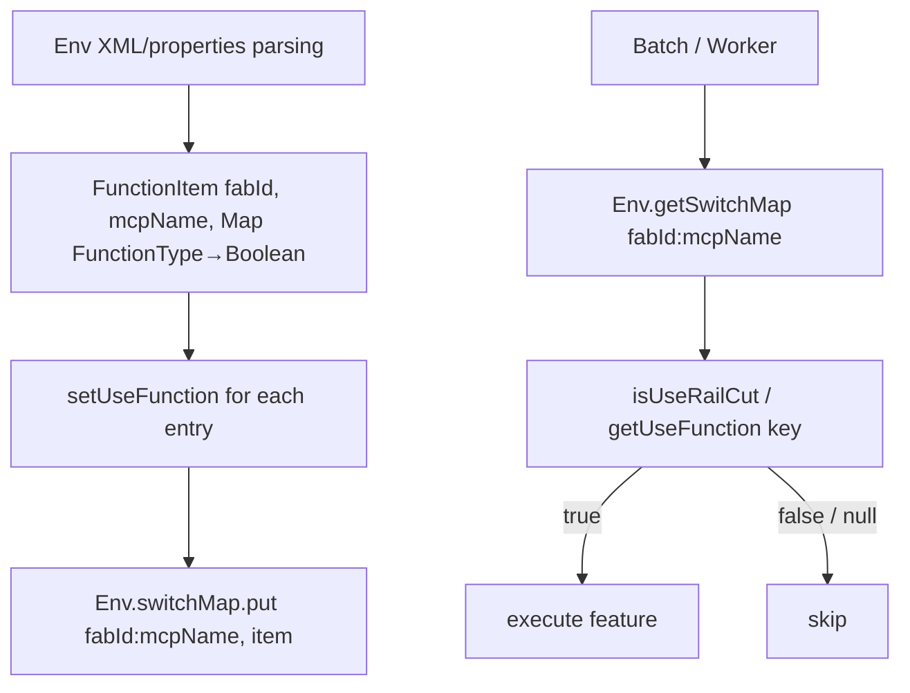

---

## §12 전체 부트스트랩 시퀀스 (Bootstrap Sequence)

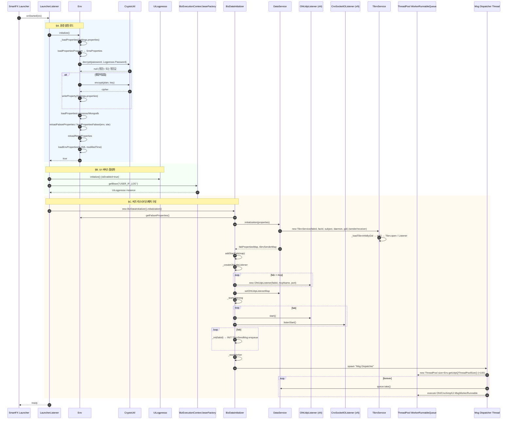

### 부트스트랩 순서 요약 (테이블)

| 단계 | 클래스 | 메서드 | 효과 |
|------|--------|--------|------|
| 1 | LauncherListener | onStarted | SmartFX 가 호출 |
| 2 | Env | initialize | Settings/Fabset/Reset properties + DB 패스워드 자동 암호화 + XML modified time |
| 3 | UiLogpresso | initialize | isEnabled=true |
| 4 | BizExecutionContext | beanFactory.getBean("USER_IF_LOG") | UiLogpresso 빈 인스턴스화 강제 |
| 5 | BizDataInitializer | initialization | 메인 부트 |
| 5-1 | DataService | initialization(props) | FabProperties / TibrvService sender/receiver 생성 |
| 5-2 | BizDataInitializer | _createOhtUdpListener | fab×mcp OHT UDP 리스너 생성 |
| 5-3 | BizDataInitializer | _startListening | OHT UDP start + CNV SocketIO listenStart |
| 5-4 | BizDataInitializer | _init(fabId) | INIT TibrvSendMsg enqueue |
| 5-5 | BizDataInitializer | _startWorker | Msg Dispatcher 쓰레드 + WorkerRunnableQueue ThreadPool(100) 기동 |

### 런타임 메세지 흐름 (참고)

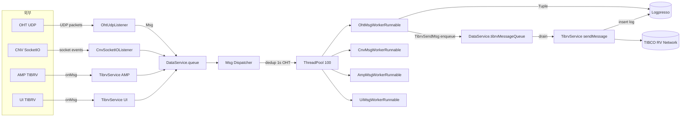

---

## 참고 — 핵심 라인 인덱스 (빠른 점프)

| 파일 | 핵심 시작 라인 |
|------|---------------|
| LauncherListener.java | onStarted: 17 |
| BizEventHandler.java | callbacks: 17, 22, 27, 32 |
| AmosService.java | alarmParameter: 43, getAlarmParameter: 55, queryAllCnvTableForUI: 76 |
| BizDataInitializer.java | initialization: 43, _createOhtUdpListener: 84, _startListening: 123, _startWorker: 148, _init: 225 |
| HttpService.java | post: 75, _executeAsyncRequest: 152, _formatResponse: 204, HttpStatus enum: 236 |
| TibrvService.java | ctor: 68, init: 204, startListen: 233, _listenHandler: 249, onMsg: 319, _insertLogpresso: 295, SEND_SUB_SUBJECT: 419 |
| UiLogpresso.java | initialize: 71, getTotalLogList: 632, getMcslogResource\*Log: 1946+, queryLogHistory: 3246, MyBatis: 3459 |
| Env.java | initialize: 89, loadPropertiesLogpresso: 131, loadPropertiesMongodb: 171, loadEnvProperties: 209, writeProperty: 266 |
| DbProperties.java | ctor: 10 |
| SmsProperties.java | ctor: 13 |
| FunctionItem.java | setUseFunction: 164, getUseFunction: 246, FunctionType enum: 420 |

---

## 발견된 품질 이슈 / 메모

1. **`BizEventHandler` (L17-34)** – 4개 콜백의 로그 라벨이 모두 잘못 바뀌어 있어 로그 분석 시 혼란.
2. **`FunctionItem.setUseFunction` (L217-222)** – `RAIL_TRAFFIC_PASS_COUNT` case 에 `break;` 가 누락되어 `RAIL_TRAFFIC_VEHICLE_COUNT` 로 fall-through. 즉 PASS_COUNT 를 설정하면 의도치 않게 VHL_CNT 도 같은 값으로 덮어쓰여진다.
3. **`AmosService.mapEqpCache` (L37)** – raw type `Map<String, Map>` 으로 선언만 되고 어디서도 사용되지 않음.
4. **`HttpService` 비동기 latch.await 30초 (L190)** – 호출자가 지정한 timeout 과 별개로 30초 hard-cap. 큰 timeout 을 의도해도 30초에서 fail-through.
5. **`Env.initialize` 정적 가변상태 (L67-81)** – 모든 환경값이 static. 멀티테넌시/테스트 격리 곤란.
6. **`BizDataInitializer.ohtSeq` (L40)** – `static long` 비-atomic. 단일 디스패처 쓰레드 환경에 의존하므로 워커풀 변경 시 주의.
7. **`UiLogpresso`** – 3549 라인 단일 클래스. 도메인별 분할(MCSLOG, SECS, Transaction, SSH, MyBatis) 권장 수준.
