# SmartAtlas batch 패키지 상세 분석

본 문서는 `/home/user/ASAS/ALT/decoded_main/java/com/skhynix/smartatlas/batch/` 의 32 개 Quartz Job 클래스를 항목별로 분석한 결과이다. 모든 라인 번호는 원본 `.java` 파일 기준이다.

---

## §0. batch 패키지 개요

batch 패키지는 SmartAtlas 의 **주기 실행 작업 단위 (Quartz `Job`)** 만을 모은 폴더이다. 32 개 클래스가 모두 `org.quartz.Job` 인터페이스를 구현하며, 각자 `execute(JobExecutorContext)` 메서드 안에서

1. `Util.isCurrentIC()` (또는 `DataService.getInstance().getInitialized()`) 로 **현재 IC 노드**인지 확인,
2. 1 분 (`DELAYED_TIME = 60 000 ms`) 을 넘기는 경우 `!!!DELAYED!!!` 경고 로그,
3. 본 작업 (`_run()`) 호출,
4. 결과를 **Logpresso / MongoDB / TIB·RV 큐 / 파일** 중 하나 이상에 적재.

라는 공통 골격을 따른다. 외부 분기 (FAB/MCP 단위 `FunctionItem` 스위치) 가 사용되는 배치는 `Env.getSwitchMap()` 을 순회하여 사용 여부 (`isUseXxx`) 와 `FunctionType` 을 확인한다.

### §0.1 전체 배치 목록

| # | 배치 클래스 | 한줄 요약 | 주요 입력 | 주요 출력 | FunctionType / 스위치 |
|---|---|---|---|---|---|
| 1 | AbnormalDetectBatch | TS Log 의 신규 패턴 (anomaly) 탐지 후 적재 | Logpresso `tsLogPattern`, `tsNewPattern` | Logpresso `ts_log_pattern` | (스위치 없음, `Util.isCurrentIC`) |
| 2 | AlertingSystemStatus | 시스템 자원·큐 임계치 감시 + SMS + Failover | OS MX Bean, `DataService.queue`, ThreadPool | SMS 발송, PowerShell `Move-ClusterGroup` | (없음) |
| 3 | AmosBoundryBatch | STAR IDC 7 일치 데이터 CSV → Python `boundary_batch.py` 학습/탐지 | Oracle `sfx2.aws_idc_data_his`, Logpresso `tsCurrentJobOfM14List`, `bridgeLayoutList` | CSV 파일, (예측 결과 Logpresso 저장은 Python 측) | (`Util.isCurrentIC`) |
| 4 | AmosMinBatch | 분 주기 ATLAS HID / STAR IDC / STAR Event 3 단계 예측 | Logpresso `atlasHidInoutList`, Oracle `sfx2.aws_idc_data_his`, `AWS_IDC_DATA_HIS` | Logpresso `M16A_BOTTLENECK_ANOMALY`, `M14A_QUEUE_ANOMALY` + Python 출력 | (`Util.isCurrentIC`) |
| 5 | AmpBufferFlushBatch | AMP AGV/CNV 버퍼 → MongoDB 적재 | `DataService.getDataSet().getAmpAgvBufferMap()/getAmpCnvBufferMap()` | MongoDB `amp_agv_status_{suffix}`, `amp_cnv_status_{suffix}` | (DataService 초기화 체크) |
| 6 | BridgeJudgeRangeBatch | Bridge layout 1 주일치 통계 → 시그마 판정 범위 계산 | Logpresso `bridgeLayoutWeek` | Logpresso `bridge_judge_range` | (`Util.isCurrentIC`) |
| 7 | BridgeLayoutBatch | Bridge layout 실시간 지표 + 판정 + Hubroom 예측 병합 | Logpresso `bridgeLayout`, `bridgeLayout2`, `bridgeJudgeRange` | Logpresso `bridge_layout_test` | (`Util.isCurrentIC`) |
| 8 | BridgeLayoutDetailBatch | Bridge layout 세부 알람 + 24 종 알람 CD 메시지 빌드 | Oracle (M14A/M14B/M16A), Logpresso 다수 | Logpresso `bridge_layout_tmp`, `bridge_layout_detail` | (`Util.isCurrentIC`) |
| 9 | CnvTaskBatch | CNV Task / LongEdge 버퍼 → Logpresso flush | `DataService.getCnvTaskBufferMap()/getCnvLongEdgeBufferMap()` | Logpresso `ATLAS_HIS_CNV_TASK`, `ATLAS_HIS_CNV_LE_STATE` | (DataService 초기화 체크) |
| 10 | DataSetRefreshBatch | OHT 레이아웃 파일 (`mcp75.cfg`/`layout.zip`/`station.dat`) 변경 감지 → HID/VHL/RailCut 메모리 갱신 + TIB 송신 | FTP layout 파일 | TIB/RV 메시지 | `isUseMapFileRefresh`, `MAP_FILE_REFRESH` |
| 11 | HidEdgeInOutQueueFlushBatch | HID 간 In/Out 전환 카운트 → 팹별 Logpresso 적재 | `DataService.getEdgeInOutCountMap()` | Logpresso `{fabId}_ATLAS_HID_INOUT` | (DataService 초기화 체크) |
| 12 | HidEdgeInOutUpdateMasterBatch | layout.zip 파싱 → HID Edge / HID Info Master 테이블 갱신 | `DataService.getEdgeMap()` (RailEdge), `layout.zip` | Logpresso `{fab}_ATLAS_INFO_HID_INOUT_MAS`, `{fab}_ATLAS_HID_INFO_MAS` | `FunctionType.HID_INOUT` |
| 13 | HubroomTransPredictBatch | HUB Room 전송량 6 단계 (10~35 m) Python 예측 | Logpresso `HUB_ROOM_INPUT_DATA`, `errorVhlVal` | CSV → Python → Logpresso `test_hubroom_predict` | (`Util.isCurrentIC`) |
| 14 | ItsmChangeRequestBatch | ITSM 일일 변경 요청(WORKLOG) REST 수집 | Settings.properties (URL/ID/PW), HTTP POST | Logpresso `qtransfer_dashboard` (via QTransferDashBoardItemBatch.insertLogpressoData) | (`Util.isCurrentIC`) |
| 15 | MesLotHisBatch | MES LOT 다음 공정 예측 → 예상 JobEnd, FAB간/층간 반송량 적재 | Oracle (M16) `MES_LOT_HIS`, Logpresso `ATLAS_LOTPROCTIME_INF` | Logpresso `ATLAS_LOTPROCTIME_INF`, `ATLAS_LOTPROCTIME_FAB_TRANS`, `ATLAS_LOTPROCTIME_FLOOR_TRANS`, 다수 `_LOG` | (`Util.isCurrentIC`) |
| 16 | MonitoringControlBatch | VHL OFF / Stage Command / UDP 메시지 모니터링 | `DataService.getVhlOffMonitoringMap()`, `getStageCommandMap()`, `recordQueue` | Logpresso `ATLAS_OHT_VHL_OFF_ONLY`, `ATLAS_OHT_STG_CMD_MNT`, UDP 파일 | `isUseVhlOff`, `isUseStageCommandMonitoring`, `CMN.CMN.UDP_MESSAGE_MONITORING` |
| 17 | OhtPerformanceTimeHourBatch | 시간당 OHT 메시지 수/시간 적재 | Logpresso `msgCountPerHour`, `msgTimePerHour` | Logpresso `oht_cmd_count`, `oht_time_avg` | (`Util.isCurrentIC`) |
| 18 | OhtPerformanceTimeMinBatch | 분당 OHT 메시지 수/시간 + REP·ASSIGN·TRANSFERRING 임계치 알람 | Logpresso (다수 쿼리) | Logpresso `oht_cmd_count`, `oht_time_avg` | (`Util.isCurrentIC`) |
| 19 | QTransferDashBoardItemBatch | 대시보드용 도넛/경고로그/예측오차 집계 | Logpresso (3 종) | Logpresso `qtransfer_dashboard` | (`Util.isCurrentIC`) |
| 20 | QTransferPredictBatch | Q-Transfer LSTM/IQR/STD/알람 다중 모델 예측 | Logpresso `Q_TRANSFER_INPUT_DATA`, `qTransferGroupData` | Logpresso `test_currentjob_predict`, `ATLAS_TS_PREDICT`, `qtransfer_dashboard` | (`Util.isCurrentIC`) |
| 21 | RailCutRefreshBatch | inactive_SCH_1.dat 파일 변경 시 A/B/C case 분류, TIB 송신 | FTP `inactive_SCH_1.dat`, `RailCutRecordMap` | Logpresso `ATLAS_OHT_RAIL_CUT`, TIB 메시지 | `isUseRailCut` |
| 22 | RailVibrationBatch | IOT_M16A Oracle 진동 데이터 수집 + TIB 송신 | Oracle `IOT_M16A` (`SELECT_VIBRATION`), `RailVibrationRecordMap` | Logpresso `ATLAS_OHT_RAIL_VIBRATION`, TIB 메시지 | `CMN.CMN.RAIL_VIBRATION` |
| 23 | ServerResourceApmBatch | 서버 자원 일일 Oracle 수집 + Prophet 예측 | Oracle `M14APM` (`SELECT_APM_RESOURCE_LIST`), Logpresso `apmDataValid` | Logpresso `server_resource_apm`, `server_resource_predict` | (`Util.isCurrentIC`) |
| 24 | SwitchSystemBatch | FabSet/Reset/Variable XML 파일 변경 감시 후 메모리 reload + UDP 포트 스위칭 + 기능 reset | `*.properties`, `*.xml` 파일 mtime | UDP Listener 재시작, TIB Reset 메시지 | `FunctionType.HID_OFF/VHL_OFF/RAIL_CUT/VHL_CNT` (reset 처리) |
| 25 | SystemMessageDetectBatch | MHS-MCS, MCS-MCP SECS 메시지 / MES JOB 모니터링 / MES Log Pattern 통합 | Logpresso (5 종 쿼리) | Logpresso `abnormal_detect_data` | (`Util.isCurrentIC`) |
| 26 | TrafficBatch | 레일 속도/통과량 1 분 집계 + M14A center 평균 속도 TIB | `DataService.getRailEdgeMap()` | Logpresso `ATLAS_RAIL_TRAFFIC`, TIB `VHL_AVG_SPEED` | `isUseRailTraffic` (+ Sub/MaxVel/Abs/VhlCnt/PassCnt) |
| 27 | UpdatingDbMachineListBatch | Oracle 마스터 데이터 (machine list/typeinfo/unit) MongoDB 동기화 | Oracle `SELECT_MACHINE_LIST/TYPEINFO/UNIT_LIST` | MongoDB `master_machine_list_{suffix}` 등 | (없음, 항상 실행) |
| 28 | UpdatingDbMasterDataBatch | MCSLOG MongoDB 마스터 aggregation (5 단계) | MongoDB `ts_raw_`, `cs_data_`, `ds_data_`, `ei_data_`, `secs_raw_` | 동일 컬렉션에 마스터 생성 | (없음) |
| 29 | VhlCntBatch | HID 별 차량수 적재 (단일 주기) | `DataService.getHidVehicleCountMap()` | Logpresso `ATLAS_OHT_VHL_CNT`, TIB `VHL_CNT` | `isUseVhlCnt` (+ 10/30/60 충돌 시 거부) |
| 30 | VhlCnt10Batch | 위와 동일, 10 분 주기 변형 | 동일 | 동일 | `isUseVhlCnt10` |
| 31 | VhlCnt30Batch | 위와 동일, 30 분 주기 변형 | 동일 | 동일 | `isUseVhlCnt30` |
| 32 | VhlCnt60Batch | 위와 동일, 60 분 주기 변형 | 동일 | 동일 | `isUseVhlCnt60` |

---

## §1. AbnormalDetectBatch

**파일**: `AbnormalDetectBatch.java` (296 라인)

1. **요약**: 트랜잭션 단위로 묶인 TS 로그를 패턴화하고, 이미 등록된 패턴(`tsNewPattern`)과 비교하여 신규 패턴 (`NEW_FUNC_NM_YN`, `NEW_PRCS_SEQ_YN`) 을 검출하여 Logpresso 에 적재.
2. **Quartz Job 구현 여부**: `implements Job` (L15).
3. **execute() 동작 단계**:
   1. `Util.isCurrentIC()` 검증 (L21)
   2. `_run()` 호출 (L26)
   3. 1 분 초과 시 `!!!DELAYED!!!` 경고 (L30~31)
4. **입력**:
   - Logpresso `tsLogPattern` 쿼리 (L58, `getTsLogDataByLogpresso`) — 그중 `STEP == "000-START-{HOST-COMMAND-TRANSPORTJOB-REQUEST}"` 인 `TRANSACTIONID` 만 추출 (L59, L64).
   - Logpresso `tsNewPattern` (L227, 기존 패턴 비교).
5. **출력**: Logpresso 테이블 `ts_log_pattern` (L49, `Util.insertInLogpressoDatabase`).
6. **FunctionType 스위치**: 없음. IC 노드 체크만.
7. **핵심 로직 흐름**:

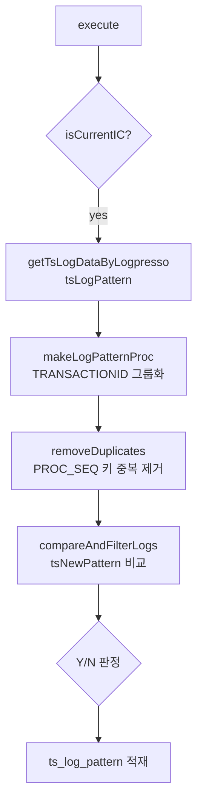
```mermaid
flowchart TD
  A[execute] --> B{isCurrentIC?}
  B -- yes --> C[getTsLogDataByLogpresso<br/>tsLogPattern]
  C --> D[makeLogPatternProc<br/>TRANSACTIONID 그룹화]
  D --> E[removeDuplicates<br/>PROC_SEQ 키 중복 제거]
  E --> F[compareAndFilterLogs<br/>tsNewPattern 비교]
  F --> G{Y/N 판정}
  G --> H[ts_log_pattern 적재]
```

8. **라인 참조**: `execute()` L20-36 / `_run()` L38-54 / `getTsLogDataByLogpresso()` L57-78 / `makeLogPatternProc()` L80-171 / `removeDuplicates()` L199-222 / `compareAndFilterLogs()` L224-294.

---

## §2. AlertingSystemStatus

**파일**: `AlertingSystemStatus.java` (205 라인)

1. **요약**: 시스템 자원(메모리/CPU/디스크)·스레드 풀 큐 길이 감시. 임계치 누적 시 SMS 발송 및 Windows Cluster Failover (`Move-ClusterGroup`).
2. **Job 구현**: `implements Job` (L21).
3. **execute() 단계**:
   1. `Env.getSmsProperties()` 로드 (L36)
   2. `executeGC()` — 10 분 마다 강제 GC (L38, L47-52)
   3. `checkSystemResources()` (L39)
   4. `checkThreadQueue()` × 2 (WorkerRunnableQueue, TibrvQueue, L40-41)
   5. `checkCollection()` × 3 (DataService.queue, tibrvMessageQueue, recordQueue, L42-44)
4. **입력**:
   - `OperatingSystemMXBean` 메모리·CPU (L137-139), 파일 시스템 disk (L155, `new File("/")`)
   - `ThreadPool.getCreatedPool("WorkerRunnableQueue"/"TibrvQueue")` (L40-41)
5. **출력**: Logpresso 적재 없음. **SMS** (`SmsUtil.sendSMS`, L76, L173, L187) 및 **PowerShell `Move-ClusterGroup -Name smartATLAS`** Failover (L197).
6. **FunctionType 스위치**: 없음.
7. **흐름**:

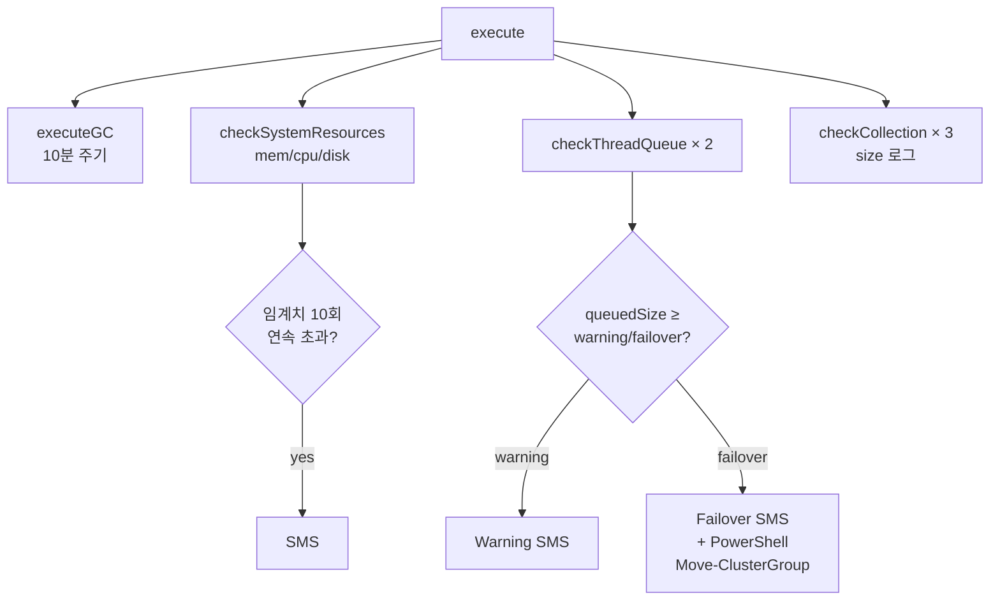
```mermaid
flowchart TD
  A[execute] --> B[executeGC<br/>10분 주기]
  A --> C[checkSystemResources<br/>mem/cpu/disk]
  C --> D{임계치 10회<br/>연속 초과?}
  D -- yes --> E[SMS]
  A --> F[checkThreadQueue × 2]
  F --> G{queuedSize ≥<br/>warning/failover?}
  G -- warning --> H[Warning SMS]
  G -- failover --> I[Failover SMS<br/>+ PowerShell<br/>Move-ClusterGroup]
  A --> J[checkCollection × 3<br/>size 로그]
```

8. **라인 참조**: `execute()` L34-45 / `checkSystemResources()` L54-86 / `checkThreadQueue()` L88-121 / `sendWarningSMS()` L167-179 / `sendExceedSMSAndFailover()` L181-203.

---

## §3. AmosBoundryBatch

**파일**: `AmosBoundryBatch.java` (559 라인)

1. **요약**: M14/M16 의 STAR IDC, TS-M14, Bridge Layout 지표 (총 ~114 개) 를 7 일치 1 분 단위로 CSV 화 → Python `boundary_batch.py` 실행 (학습 + 표준 모델 데이터 갱신).
2. **Job 구현**: `implements Job` (L34).
3. **execute() 단계**:
   1. IC 노드 체크 (L46)
   2. `_run()` (L52) → `setIdcNm()` (지표 리스트 채움) → `_run_star_idc(timeFrom=now-7d, timeTo=now)`
4. **입력**:
   - Oracle `sfx2` DB `STAADM.aws_idc_data_his` (L417, IDC PIVOT 쿼리 L420-441)
   - Logpresso `tsCurrentJobOfM14List` (L460), `bridgeLayoutList` (L475)
5. **출력**: 파일 `${PYTHON}/star_idc/data/star_standardmodel_m41a_data_longterm_test.csv` (L390). Logpresso 직접 적재는 없음 (Python 측에서 별도 저장).
6. **스위치**: 없음.
7. **흐름**:

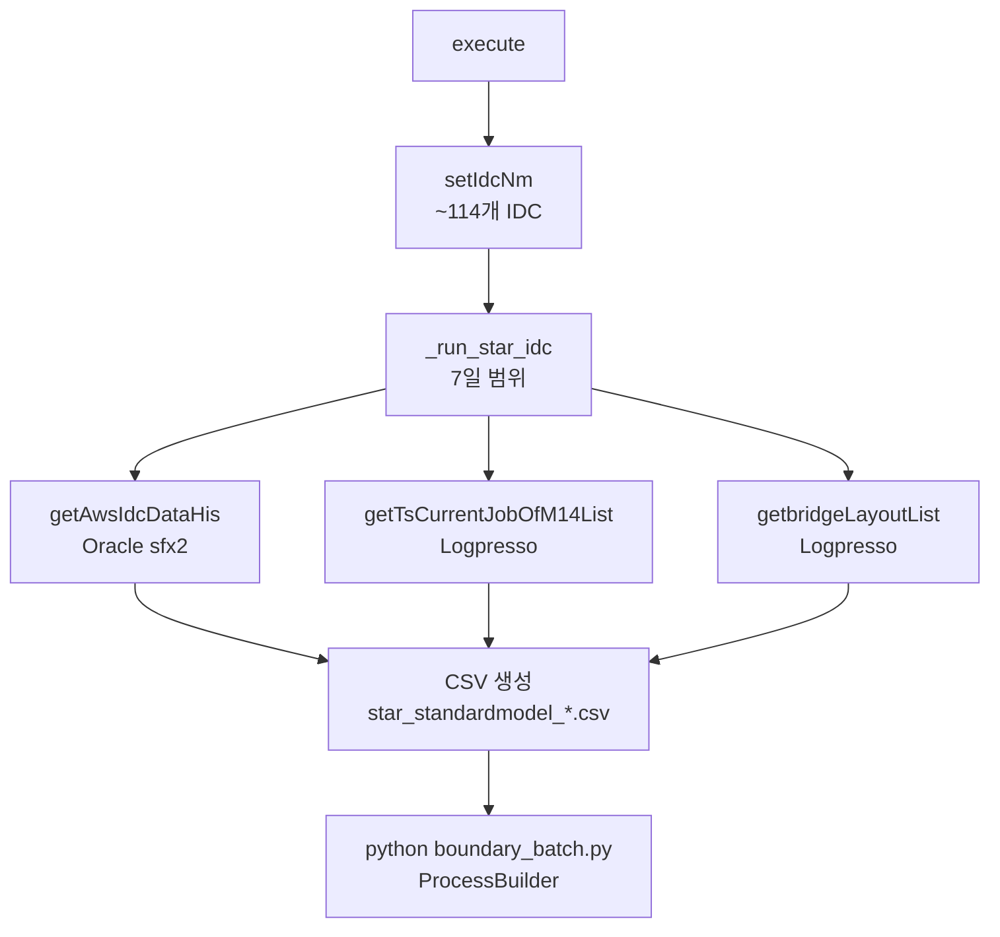
```mermaid
flowchart TD
  A[execute] --> B[setIdcNm<br/>~114개 IDC]
  B --> C[_run_star_idc<br/>7일 범위]
  C --> D[getAwsIdcDataHis<br/>Oracle sfx2]
  C --> E[getTsCurrentJobOfM14List<br/>Logpresso]
  C --> F[getbridgeLayoutList<br/>Logpresso]
  D & E & F --> G[CSV 생성<br/>star_standardmodel_*.csv]
  G --> H[python boundary_batch.py<br/>ProcessBuilder]
```

8. **라인 참조**: `execute()` L44-61 / `_run()` L63-77 / `setIdcNm()` L79-203 / `_run_star_idc()` L209-220 / `_create_star_idc_input_data()` L222-407 / `getAwsIdcDataHis()` L409-454 / `_predictor_star_idc_data()` L495-549.

---

## §4. AmosMinBatch

**파일**: `AmosMinBatch.java` (1213 라인)

1. **요약**: 분 주기 (60 분 윈도우) 로 3 영역 — **ATLAS HID** (M16A BR), **STAR IDC** (M14/M16), **STAR Event** (M16) — 각각 CSV 를 만들어 별도 Python 스크립트로 예측 → 결과를 Logpresso anomaly 테이블에 적재.
2. **Job 구현**: `implements Job` (L35).
3. **execute() 단계**:
   1. IC 체크 (L54)
   2. `_run()` (L60) → `setIdcNm()` → `_run_atlas_hid(now-60m, now)` → `_run_star_idc(...)` → `_run_star_event(...)`
4. **입력**:
   - Logpresso `atlasHidInoutList` (L386, ATLAS HID)
   - Oracle `sfx2.aws_idc_data_his` (L759, STAR IDC), `AWS_IDC_DATA_HIS` SYSDATE-90/1440 (L1064, STAR Event)
   - Logpresso `tsCurrentJobOfM14List`, `bridgeLayoutList`
5. **출력**:
   - Python 스크립트: `deadlock_hub.py` (L406), `standard_detector.py` (L848), `3DO_PRETIME_TEST3.py` (L1113)
   - Logpresso `M16A_BOTTLENECK_ANOMALY` (L543), `M14A_QUEUE_ANOMALY` (L974)
6. **스위치**: 없음.
7. **흐름**:

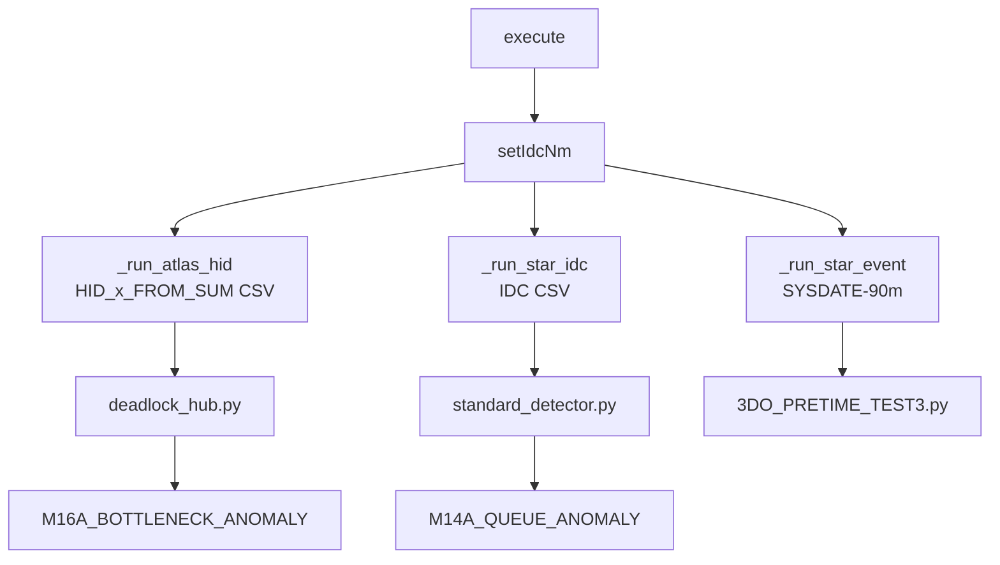
```mermaid
flowchart TD
  A[execute] --> B[setIdcNm]
  B --> C[_run_atlas_hid<br/>HID_x_FROM_SUM CSV]
  C --> C1[deadlock_hub.py]
  C1 --> C2[M16A_BOTTLENECK_ANOMALY]
  B --> D[_run_star_idc<br/>IDC CSV]
  D --> D1[standard_detector.py]
  D1 --> D2[M14A_QUEUE_ANOMALY]
  B --> E[_run_star_event<br/>SYSDATE-90m]
  E --> E1[3DO_PRETIME_TEST3.py]
```

8. **라인 참조**: `execute()` L52-69 / `_run()` L71-91 / `_run_atlas_hid()` L267-279 / `_predictor_atlas_hid()` L395-545 / `_run_star_idc()` L551-562 / `_predictor_star_idc_data()` L837-984 / `_run_star_event()` L990-1000 / `_predictor_star_event_input_data()` L1105-1162.

---

## §5. AmpBufferFlushBatch

**파일**: `AmpBufferFlushBatch.java` (118 라인)

1. **요약**: AMP AGV/CNV 단말이 송신한 상태를 메모리 버퍼에서 꺼내(MongoDB poll), fabId 별로 그룹화 후 MongoDB 컬렉션 (`amp_agv_status_{suffix}`, `amp_cnv_status_{suffix}`) 에 bulk insert.
2. **Job 구현**: `implements Job` (L23).
3. **execute() 단계**:
   1. `DataService` 초기화 체크 (L29)
   2. AGV 버퍼 poll → fabId GroupBy → `MongodbAPI.insertMany` (L37-72)
   3. CNV 버퍼 poll → 동일 처리 (L76-114)
4. **입력**: `DataService.getDataSet().getAmpAgvBufferMap()` (L37), `getAmpCnvBufferMap()` (L78).
5. **출력**: MongoDB `amp_agv_status_{suffix}` (L70), `amp_cnv_status_{suffix}` (L111). Logpresso 코드는 주석 처리 (L55-58).
6. **스위치**: DataService Initialized.
7. **흐름**:

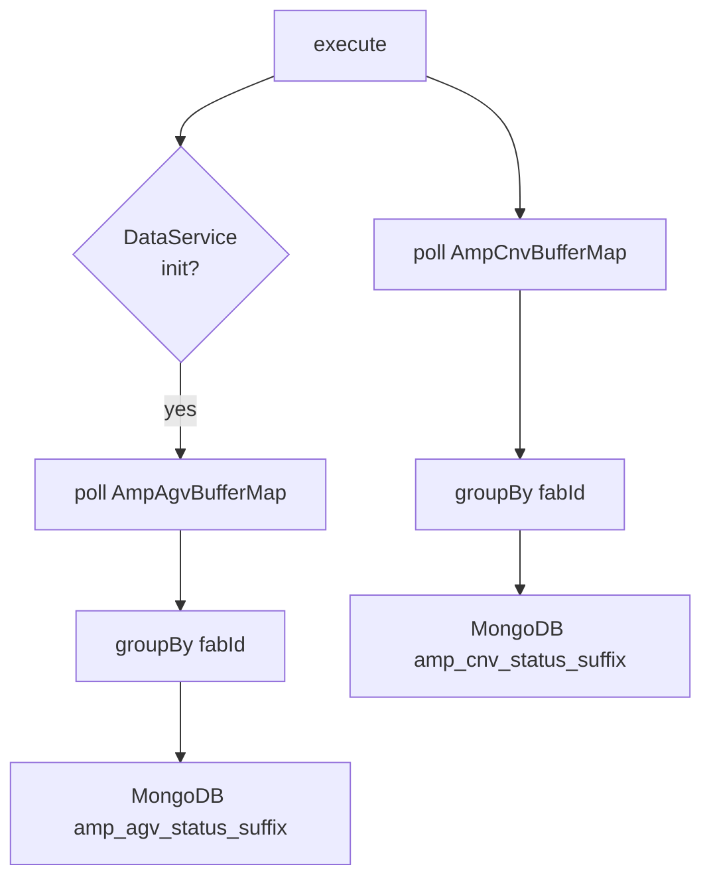
```mermaid
flowchart TD
  A[execute] --> B{DataService<br/>init?}
  B -->|yes| C[poll AmpAgvBufferMap]
  C --> D[groupBy fabId]
  D --> E[MongoDB amp_agv_status_suffix]
  A --> F[poll AmpCnvBufferMap]
  F --> G[groupBy fabId]
  G --> H[MongoDB amp_cnv_status_suffix]
```

8. **라인 참조**: `execute()` L27-117.

---

## §6. BridgeJudgeRangeBatch

**파일**: `BridgeJudgeRangeBatch.java` (246 라인)

1. **요약**: Bridge layout 7 일치 데이터에서 σ-기반 (기본 3σ, QPT 지표는 5σ) 정상 범위 (LOWER/UPPER) 를 계산해 판정용 마스터에 저장.
2. **Job 구현**: `implements Job` (L26).
3. **execute() 단계**:
   1. IC 체크 (L32)
   2. `_run()` (L37)
4. **입력**: Logpresso `bridgeLayoutWeek` (L96), variable `LAYOUT_SIGMA`, `TRIM_VAL`, `CLIP_QPT_VAL`, `QPT_SIGMA_VAL` (L55, L146-148).
5. **출력**: Logpresso `bridge_judge_range` (L85).
6. **스위치**: 없음.
7. **흐름**:

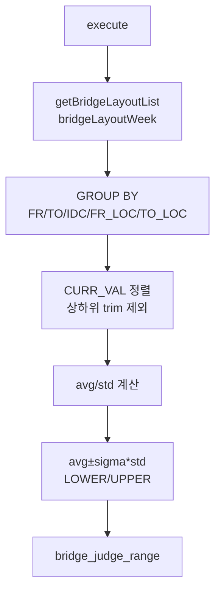
```mermaid
flowchart TD
  A[execute] --> B[getBridgeLayoutList<br/>bridgeLayoutWeek]
  B --> C[GROUP BY<br/>FR/TO/IDC/FR_LOC/TO_LOC]
  C --> D[CURR_VAL 정렬<br/>상하위 trim 제외]
  D --> E[avg/std 계산]
  E --> F[avg±sigma*std<br/>LOWER/UPPER]
  F --> G[bridge_judge_range]
```

8. **라인 참조**: `execute()` L30-48 / `_run()` L50-89 / `detectAnomaly()` L107-232.

---

## §7. BridgeLayoutBatch

**파일**: `BridgeLayoutBatch.java` (357 라인)

1. **요약**: 분 단위 Bridge layout 실시간 지표와 §6 의 판정 마스터를 비교해 `WARN_YN` 부여, OFS/HUBROOM/HUBROOM_PREDICT_xMIN 행을 합쳐 적재.
2. **Job 구현**: `implements Job` (L23).
3. **execute() 단계**:
   1. IC 체크 (L29) → `_run()`
4. **입력**: Logpresso `bridgeLayout` (L121), `bridgeLayout2` (L145), `bridgeJudgeRange` (L302); variable `LAYOUT_SIGMA`.
5. **출력**: Logpresso `bridge_layout_test` (L107).
6. **스위치**: 없음.
7. **흐름**:

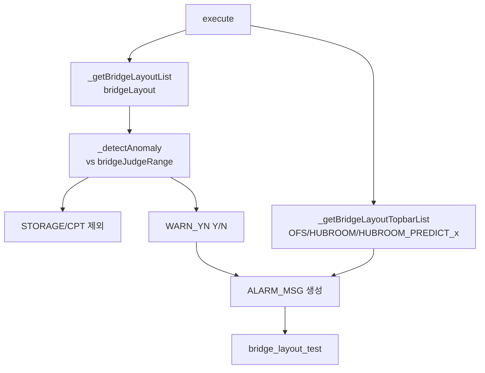
```mermaid
flowchart TD
  A[execute] --> B[_getBridgeLayoutList<br/>bridgeLayout]
  B --> C[_detectAnomaly<br/>vs bridgeJudgeRange]
  C --> D[STORAGE/CPT 제외]
  C --> E[WARN_YN Y/N]
  A --> F[_getBridgeLayoutTopbarList<br/>OFS/HUBROOM/HUBROOM_PREDICT_x]
  E & F --> G[ALARM_MSG 생성]
  G --> H[bridge_layout_test]
```

8. **라인 참조**: `execute()` L28-44 / `_run()` L46-111 / `_getBridgeLayoutList()` L113-139 / `_getBridgeLayoutTopbarList()` L141-261 / `_detectAnomaly()` L295-355.

---

## §8. BridgeLayoutDetailBatch

**파일**: `BridgeLayoutDetailBatch.java` (1667 라인)

1. **요약**: M14A/M14B/M16A Oracle 의 장비/포트/Storage Util 상세 데이터를 분 단위 수집 + Bridge IMAGE 알람 (24 종 `CD0000001x~24`) 판정 + 5 분 지속 검증 (`JUDGE_VAL`) 후 Logpresso 적재.
2. **Job 구현**: `implements Job` (L29).
3. **execute() 단계**:
   1. IC 체크 (L35) → `_run()` (L40)
   2. Oracle 상세 + Logpresso 결합 (L58, L60), STATE 전후 비교 알람 생성 (L91-109)
   3. `bridge_layout_tmp` 적재 (L126)
   4. `getFinalData()` + `validationBridgeAlarm()` → 24 종 알람 (L131)
   5. `bridge_layout_detail` 적재 (L146)
4. **입력**:
   - Oracle 다중 (M16A `SELECT_M16A_STORAGE_UTIL`/`SELECT_M16A_DAT`/`SELECT_MACHINE_DOWN_CNT`/`SELECT_MACHINE_DOWN_CNT2`, M14A `SELECT_M16CNV_DOWN_PORTLIST`/`SELECT_MACHINE_DOWN_CNT`, M14B `SELECT_M14LFT_DOWN_PORTLIST`/`SELECT_MACHINE_DOWN_CNT`)
   - Logpresso `bridgeTimeAverage`, `m16LftTransferCnt`, `m16HubTotalCnt`, `bridgeJudgeRangeQCompleted`, `hubToM16QPTAvg`
   - Variable: `BRIDGE_TIME_LIMIT`, `M16ZT_Q_LIMIT(_2)`, `M16_HUBROOM_TOTAL_LIMIT`, `M16_6F_ZT_MAXCAPA_LIMIT(_2/_3)`, `M16_LFT_PORT_DOWN_RATE`, `M14_CNV_PORT_DOWN_RATE`, `M14_LFT_PORT_DOWN_RATE`, `STORAGE_UTIL_PORT_DOWN`, `STORAGE_UTIL_RATE`
5. **출력**: Logpresso `bridge_layout_tmp` (L126), `bridge_layout_detail` (L146).
6. **스위치**: 없음.
7. **흐름**:

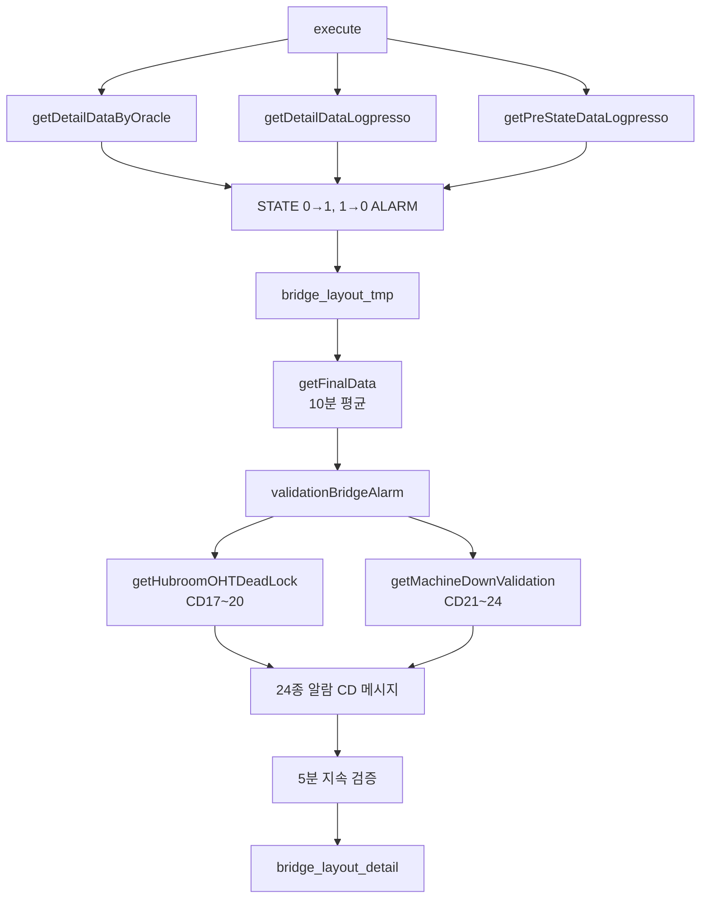
```mermaid
flowchart TD
  A[execute] --> B[getDetailDataByOracle]
  A --> C[getDetailDataLogpresso]
  A --> D[getPreStateDataLogpresso]
  B & C & D --> E[STATE 0→1, 1→0 ALARM]
  E --> F[bridge_layout_tmp]
  F --> G[getFinalData<br/>10분 평균]
  G --> H[validationBridgeAlarm]
  H --> I[getHubroomOHTDeadLock<br/>CD17~20]
  H --> J[getMachineDownValidation<br/>CD21~24]
  I & J --> K[24종 알람 CD 메시지]
  K --> L[5분 지속 검증]
  L --> M[bridge_layout_detail]
```

8. **라인 참조**: `execute()` L33-50 / `_run()` L52-150 / `validationBridgeAlarm()` L153-543 (CD0014~CD0024 분기 L262-523) / `getDetailPortDataValidation()` L545-656 / `getStorageUtilDataValidation()` L658-866 / `getHubroomOHTDeadLock()` L869-1169 / `getMachineDownValidation()` L1173-1323 / `getHubroomDataValidation()` L1325~ / 알람 코드 매핑: `CD00000001~012` (포트, L550-561), `CD00000013/014` (CPT, L1386), `CD00000015/016` (STORAGE, L665-666), `CD00000017~020` (OHT 몰림, L1069-1156), `CD00000021~024` (장비 DOWN, L1279-1317).

---

## §9. CnvTaskBatch

**파일**: `CnvTaskBatch.java` (88 라인)

1. **요약**: CNV Task 와 LongEdge 상태 버퍼를 poll 해 Logpresso 에 flush.
2. **Job 구현**: `implements Job` (L21).
3. **execute() 단계**:
   1. DataService init 체크 (L31)
   2. `getCnvTaskBufferMap().poll()` 반복 (L39)
   3. `JsonUtil.getTupleByJsonElement` → `ATLAS_HIS_CNV_TASK` 적재 (L52)
   4. `getCnvLongEdgeBufferMap().poll()` 반복 (L62)
   5. cost/length 로 speed 계산 → `ATLAS_HIS_CNV_LE_STATE` (L84)
4. **입력**: `DataService.getDataSet().getCnvTaskBufferMap()` (L39), `getCnvLongEdgeBufferMap()` (L62).
5. **출력**: Logpresso `ATLAS_HIS_CNV_TASK` (L25, L52), `ATLAS_HIS_CNV_LE_STATE` (L26, L84).
6. **스위치**: DataService Initialized.
7. **흐름**:

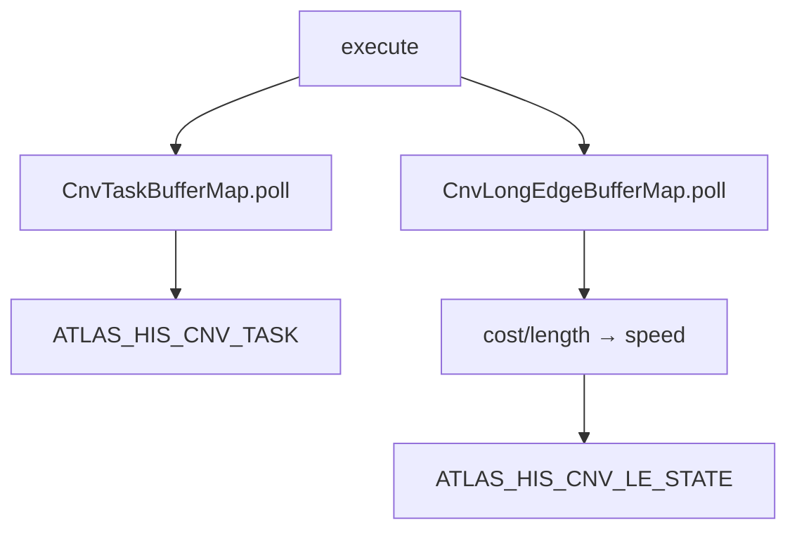
```mermaid
flowchart TD
  A[execute] --> B[CnvTaskBufferMap.poll]
  B --> C[ATLAS_HIS_CNV_TASK]
  A --> D[CnvLongEdgeBufferMap.poll]
  D --> E[cost/length → speed]
  E --> F[ATLAS_HIS_CNV_LE_STATE]
```

8. **라인 참조**: `execute()` L29-87.

---

## §10. DataSetRefreshBatch

**파일**: `DataSetRefreshBatch.java` (337 라인)

1. **요약**: OHT layout 마스터 파일(`mcp75.cfg`, `layout.zip`, `station.dat`, `inactive_SCH_1.dat`) 의 FTP 변경 여부를 확인하고, 다운로드 된 경우 메모리 데이터셋을 새로 로드 후 HID OFF / VHL OFF / RAIL CUT 기존 ABNORMAL 데이터 재송신.
2. **Job 구현**: `implements Job` (L22).
3. **execute() 단계**:
   1. IC 체크 (L28)
   2. `Env.getSwitchMap()` 순회 (L29) → `isUseMapFileRefresh()` 인 fab/mcp 만 (L32)
   3. `_run(fabId, mcpName)` → `_downloader()` → `DataService.newMapLoad()` → `_update()`
4. **입력**: FTP 레이아웃 파일들 (`Util.getAllOhtLayoutFileOverFtp`, L72), 메모리 `HidOffRecordMap`/`VhlOffRecordMap`/`RailCutRecordMap`.
5. **출력**: TIB/RV 메시지 큐 (`DataService.addTibrvMessageQueue`, L100); 직접 Logpresso 적재 없음.
6. **스위치**: `FunctionItem.isUseMapFileRefresh()` (L32). 다운로드된 파일 종류는 `DOWNLOAD_MAP_FILE_TYPE.MCP75CFG/STATION/LAYOUT` (L109, L157, L171, L194, L238, L266, L316).
7. **흐름**:

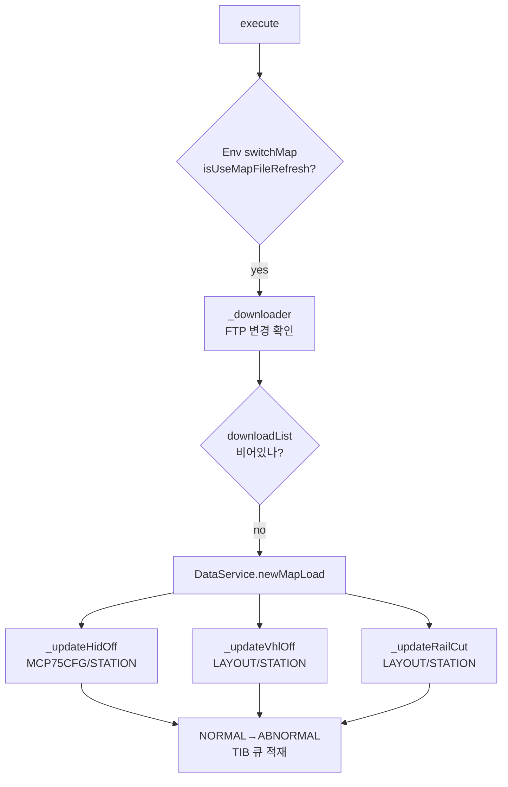
```mermaid
flowchart TD
  A[execute] --> B{Env switchMap<br/>isUseMapFileRefresh?}
  B -->|yes| C[_downloader<br/>FTP 변경 확인]
  C --> D{downloadList<br/>비어있나?}
  D -->|no| E[DataService.newMapLoad]
  E --> F[_updateHidOff<br/>MCP75CFG/STATION]
  E --> G[_updateVhlOff<br/>LAYOUT/STATION]
  E --> H[_updateRailCut<br/>LAYOUT/STATION]
  F & G & H --> I[NORMAL→ABNORMAL<br/>TIB 큐 적재]
```

8. **라인 참조**: `execute()` L27-52 / `_run()` L54-65 / `_downloader()` L67-81 / `_update()` L85-103 / `_updateHidOff()` L105-185 / `_updateVhlOff()` L187-257 / `_updateRailCut()` L259-336.

---

## §11. HidEdgeInOutQueueFlushBatch

**파일**: `HidEdgeInOutQueueFlushBatch.java` (143 라인)

1. **요약**: HID 간 OHT 전환 카운트 (`EdgeInOutCountMap`) 를 분 단위로 fabId 별 Logpresso 테이블에 적재.
2. **Job 구현**: `implements Job` (L26).
3. **execute() 단계**:
   1. DataService init (L32)
   2. `EdgeInOutCountMap` 복사 후 새 ConcurrentHashMap 으로 교체 (L40-44)
   3. 키 파싱 (11 개 콜론 구분, L58-69) → Tuple 작성 → fabId 별 분류
   4. fabId 별 `{fabId}_ATLAS_HID_INOUT` 테이블 insert (L133-138)
4. **입력**: `DataService.getDataSet().getEdgeInOutCountMap()` (L40). 키 포맷: `fromHidId:toHidId:fabId:mcpName:vhlFabId:vhlId:eqpId:vhlCountLimit:vhlPrecaution:freeFlowSpeed:hidValue`.
5. **출력**: Logpresso `{fabId}_ATLAS_HID_INOUT` (예: `M14A_ATLAS_HID_INOUT`, L133).
6. **스위치**: DataService Initialized.
7. **흐름**:

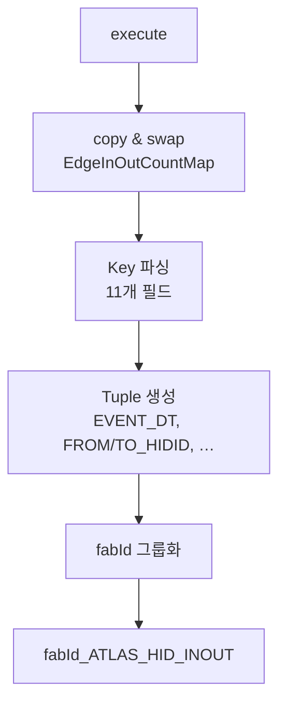
```mermaid
flowchart TD
  A[execute] --> B[copy & swap<br/>EdgeInOutCountMap]
  B --> C[Key 파싱<br/>11개 필드]
  C --> D[Tuple 생성<br/>EVENT_DT, FROM/TO_HIDID, …]
  D --> E[fabId 그룹화]
  E --> F[fabId_ATLAS_HID_INOUT]
```

8. **라인 참조**: `execute()` L30-141.

---

## §12. HidEdgeInOutUpdateMasterBatch

**파일**: `HidEdgeInOutUpdateMasterBatch.java` (275 라인)

1. **요약**: `layout.zip` 의 RailEdge 정보를 파싱해 HID Edge Master 와 HID Info Master 테이블을 fabId/mcpName 별 갱신.
2. **Job 구현**: `implements Job` (L28).
3. **execute() 단계**:
   1. DataService init (L34)
   2. fab/mcp 순회 → `FunctionType.HID_INOUT` 체크 (L79)
   3. `_updateHidEdgeMasterInfo()` (L86) — HID 전환 엣지(IN/OUT/INTERNAL) 추출
   4. `_updateHidInfoMaster()` (L89) — HID 별 RAIL_LEN, FREE_FLOW_SPEED, PORT_CNT 집계
4. **입력**: `DataService.getDataSet().getEdgeMap()` (L71, RailEdge), `fabProperties.getMapDir()` 의 `*.layout.zip` (L60).
5. **출력**: Logpresso `{fabId}_ATLAS_INFO_HID_INOUT_MAS` (L178), `{fabId}_ATLAS_HID_INFO_MAS` (L269).
6. **스위치**: `FunctionType.HID_INOUT` (L79).
7. **흐름**:

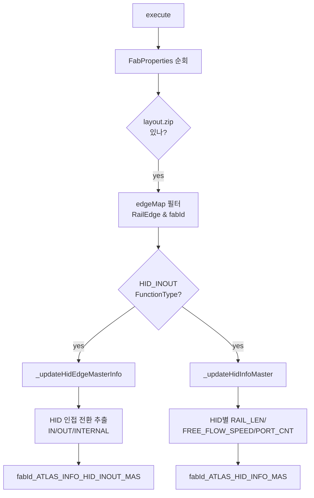
```mermaid
flowchart TD
  A[execute] --> B[FabProperties 순회]
  B --> C{layout.zip<br/>있나?}
  C -->|yes| D[edgeMap 필터<br/>RailEdge & fabId]
  D --> E{HID_INOUT<br/>FunctionType?}
  E -->|yes| F[_updateHidEdgeMasterInfo]
  F --> F1[HID 인접 전환 추출<br/>IN/OUT/INTERNAL]
  F1 --> F2[fabId_ATLAS_INFO_HID_INOUT_MAS]
  E -->|yes| G[_updateHidInfoMaster]
  G --> G1[HID별 RAIL_LEN/<br/>FREE_FLOW_SPEED/PORT_CNT]
  G1 --> G2[fabId_ATLAS_HID_INFO_MAS]
```

8. **라인 참조**: `execute()` L32-94 / `_updateHidEdgeMasterInfo()` L97-183 / `_updateHidInfoMaster()` L185-274.

---

## §13. HubroomTransPredictBatch

**파일**: `HubroomTransPredictBatch.java` (282 라인)

1. **요약**: Hub Room 반송량 예측. CSV (`HUBROOM_PIVOT_DATA.csv`) 생성 → Python 6 단계 (10·15·20·25·30·35 m) 모델 실행 → 결과 Logpresso 적재. VHL OFF 상태 시 입력 데이터 보정.
2. **Job 구현**: `implements Job` (L17).
3. **execute() 단계**:
   1. IC 체크 (L27) → `_run()` (L32)
4. **입력**: Logpresso `HUB_ROOM_INPUT_DATA` (L74-78), `errorVhlVal` (L84), `hubroomPredict` (L134), variable `HUB_ROOM_MODEL_MAPPER`, `VHL_OFF_PLUS_DATA`.
5. **출력**: 파일 `HUBROOM_PIVOT_DATA.csv`, Logpresso `test_hubroom_predict` (L64).
6. **스위치**: 없음.
7. **흐름**:

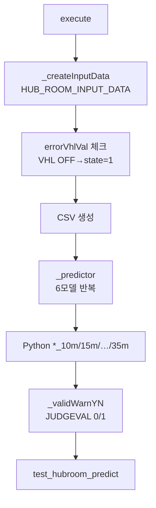
```mermaid
flowchart TD
  A[execute] --> B[_createInputData<br/>HUB_ROOM_INPUT_DATA]
  B --> B1[errorVhlVal 체크<br/>VHL OFF→state=1]
  B1 --> B2[CSV 생성]
  B2 --> C[_predictor<br/>6모델 반복]
  C --> C1[Python *_10m/15m/…/35m]
  C1 --> D[_validWarnYN<br/>JUDGEVAL 0/1]
  D --> E[test_hubroom_predict]
```

8. **라인 참조**: `execute()` L25-42 / `_run()` L48-71 / `_createInputData()` L73-105 / `_validWarnYN()` L114-177 / `_preparePredictor()` L179-221 / `_predictor()` L226-281.

---

## §14. ItsmChangeRequestBatch

**파일**: `ItsmChangeRequestBatch.java` (193 라인)

1. **요약**: 일일 ITSM 시스템에 REST API (Basic 인증) 로 change_request 조회 → 시스템 필터 (`MCS|MES|MCP|RTD|RTS`) → 대시보드 테이블 적재.
2. **Job 구현**: `implements Job` (L26).
3. **execute() 단계**:
   1. IC 체크 (L43) → `_run()` (L48)
4. **입력**: `Settings.properties` (URL/ID/PW, L29, L181-191), HTTP POST `HttpService.post(ITSM_POST_URL, payload, header)` (L112), `table_name=change_request`. Variable `ITSM_CHANGE_SYSTEM_NAME` (L117, 기본 `MCS|MES|MCP|RTD|RTS`).
5. **출력**: `QTransferDashBoardItemBatch.insertLogpressoData()` → Logpresso `qtransfer_dashboard` (L73).
6. **스위치**: 없음.
7. **흐름**:

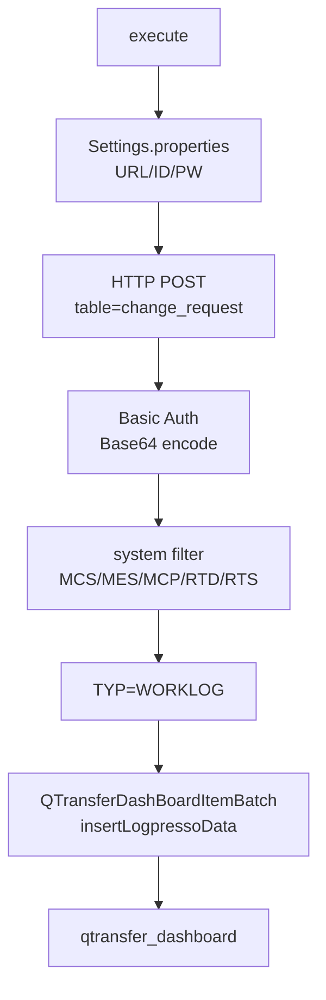
```mermaid
flowchart TD
  A[execute] --> B[Settings.properties<br/>URL/ID/PW]
  B --> C[HTTP POST<br/>table=change_request]
  C --> D[Basic Auth<br/>Base64 encode]
  D --> E[system filter<br/>MCS/MES/MCP/RTD/RTS]
  E --> F[TYP=WORKLOG]
  F --> G[QTransferDashBoardItemBatch<br/>insertLogpressoData]
  G --> H[qtransfer_dashboard]
```

8. **라인 참조**: `execute()` L39-58 / `_run()` L64-78 / `_getParseITSMValue()` L80-179.

---

## §15. MesLotHisBatch

**파일**: `MesLotHisBatch.java` (754 라인)

1. **요약**: MES LOT 시작 데이터를 1 분마다 조회 (Oracle `MES_LOT_HIS`) 후 다음 공정 (`isReturnOper`/`isSetUpSetMo`/`isN2PurgeOper`) 을 찾아 예상 JobEnd 시간을 계산. FAB 간/층간 반송 큐에 분배.
2. **Job 구현**: `implements Job` (L33).
3. **execute() 단계**:
   1. IC 체크 (L72) → `_start()` (L78)
   2. M16 facId 만 처리 (L36, `private final List<String> facIds = List.of("M16")`)
   3. `_run(facId, timeFrom, timeTo)`
   4. mesLotHisList ↔ lotProcTimeInfList 키 비교 → 신규만 jobEndList
   5. 보조 리스트 5 종 로드 (`jobMesLotMasList`, `jobSFabLotMoveMasList`, `jobOperList`, `jobBizLotfutureactInfList`, `jobMesOperMasList`)
   6. 각 LOT 별 다음 공정 탐색 (Return/SetMo/N2Purge/StopPoint)
   7. Logpresso 적재
4. **입력**: Oracle (`MES_LOT_HIS`, `MES_LOT_MAS`, `SFAB_LOT_MOVE_MAS`, `OPER`, `BIZ_LOT_FUTURE_ACT_INF`, `MES_OPER_MAS`), Logpresso `ATLAS_LOTPROCTIME_INF`.
5. **출력**: Logpresso `ATLAS_LOTPROCTIME_INF` (L614), `ATLAS_LOTPROCTIME_OPER_LOG` (L648), `ATLAS_BIZ_LOT_FUTURE_ACT_INF_LOG` (L667), `ATLAS_MES_OPER_MAS_LOG` (L685), `ATLAS_LOTPROCTIME_MES_LOT_MAS_LOG` (L701), `ATLAS_LOTPROCTIME_SFAB_LOT_MOVE_MAS_LOG` (L718), `ATLAS_LOTPROCTIME_FAB_TRANS` (L727), `ATLAS_LOTPROCTIME_FLOOR_TRANS` (L735), `ATLAS_LOTPROCTIME_INFO_LOG` (L751).
6. **스위치**: 없음 (`isCurrentIC`).
7. **흐름**:

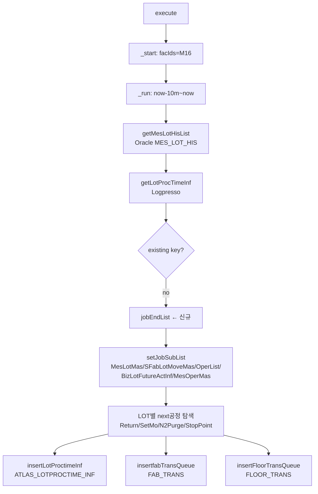
```mermaid
flowchart TD
  A[execute] --> B[_start: facIds=M16]
  B --> C[_run: now-10m~now]
  C --> D[getMesLotHisList<br/>Oracle MES_LOT_HIS]
  D --> E[getLotProcTimeInf<br/>Logpresso]
  E --> F{existing key?}
  F -->|no| G[jobEndList ← 신규]
  G --> H[setJobSubList<br/>MesLotMas/SFabLotMoveMas/OperList/<br/>BizLotFutureActInf/MesOperMas]
  H --> I[LOT별 next공정 탐색<br/>Return/SetMo/N2Purge/StopPoint]
  I --> J[insertLotProctimeInf<br/>ATLAS_LOTPROCTIME_INF]
  I --> K[insertfabTransQueue<br/>FAB_TRANS]
  I --> L[insertFloorTransQueue<br/>FLOOR_TRANS]
```

8. **라인 참조**: `execute()` L70-87 / `_start()` L89-108 / `_run()` L110-308 / `setJobSubList()` L176~ / `isReturnOper()`/`isSetUpSetMo()`/`isN2PurgeOper()` 부근 (~L500~) / `insertLotProctimeInftoLogpresso()` L614 / `insertLogsToLogpresso()` L648~L751 / `insertfabTransQueueToLogresso()` L727 / `insertFloorTransQueueToLogresso()` L735.

---

## §16. MonitoringControlBatch

**파일**: `MonitoringControlBatch.java` (405 라인)

1. **요약**: VHL OFF / Stage Command / UDP 메시지 3 종을 1 개 배치에서 처리 (별도 스레드 `MonitoringControlBatch` 시작 후 fab/mcp 순회).
2. **Job 구현**: `implements Job` (L27).
3. **execute() 단계**:
   1. IC 체크 (L38)
   2. 새 Thread 생성 (L41) → fab/mcp 순회 (L44-53) → `_processVhlOff`, `_processStageCommandMonitoring`
   3. `_processUdpMessageMonitoring()` (L56)
4. **입력**:
   - VHL OFF: `DataService.getDataSet().getVhlOffMonitoringMap()` (L137)
   - Stage Command: `getStageCommandMap()` (L194)
   - UDP: `DataService.getInstance().recordQueue` (L111)
   - `FabSet.properties`: `CMN.CMN.UDP_MESSAGE_MONITORING`==`TRUE` (L108)
5. **출력**:
   - Logpresso `ATLAS_OHT_VHL_OFF_ONLY` (L187), `ATLAS_OHT_STG_CMD_MNT` (L227)
   - 파일: `${udpMessagePath}/udp_message_record_{1~3}.txt` 순환 (L286-291)
6. **스위치**: `isUseVhlOff` (L66), `isUseStageCommandMonitoring` (L87), `CMN.CMN.UDP_MESSAGE_MONITORING` (L108).
7. **흐름**:

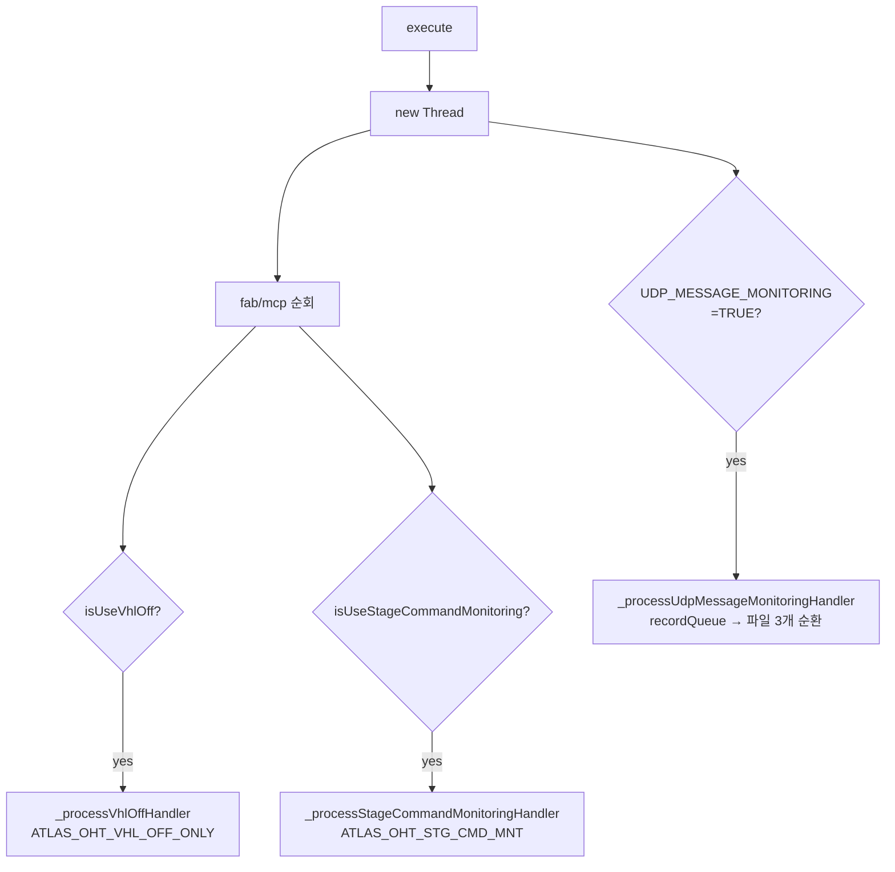
```mermaid
flowchart TD
  A[execute] --> B[new Thread]
  B --> C[fab/mcp 순회]
  C --> D{isUseVhlOff?}
  D -->|yes| D1[_processVhlOffHandler<br/>ATLAS_OHT_VHL_OFF_ONLY]
  C --> E{isUseStageCommandMonitoring?}
  E -->|yes| E1[_processStageCommandMonitoringHandler<br/>ATLAS_OHT_STG_CMD_MNT]
  B --> F{UDP_MESSAGE_MONITORING<br/>=TRUE?}
  F -->|yes| F1[_processUdpMessageMonitoringHandler<br/>recordQueue → 파일 3개 순환]
```

8. **라인 참조**: `execute()` L36-60 / `_processVhlOff*` L65-188 / `_processStageCommandMonitoring*` L86-247 / `_processUdpMessageMonitoring*` L107-302.

---

## §17. OhtPerformanceTimeHourBatch

**파일**: `OhtPerformanceTimeHourBatch.java` (164 라인)

1. **요약**: 매시 OHT 메시지 수/평균 시간을 적재. 6 종 메시지 (REP/ASSIGN/ACQUIRED/TRANSFERRING/DESPOSITED/COMPLETED) 누락 시 0 행 보강.
2. **Job 구현**: `implements Job` (L25).
3. **execute() 단계**:
   1. IC 체크 (L32) → `_run()` (L37)
4. **입력**: Logpresso `msgCountPerHour` (L81), `msgTimePerHour` (L96).
5. **출력**: Logpresso `oht_cmd_count` (L70), `oht_time_avg` (L71).
6. **스위치**: 없음.
7. **흐름**:

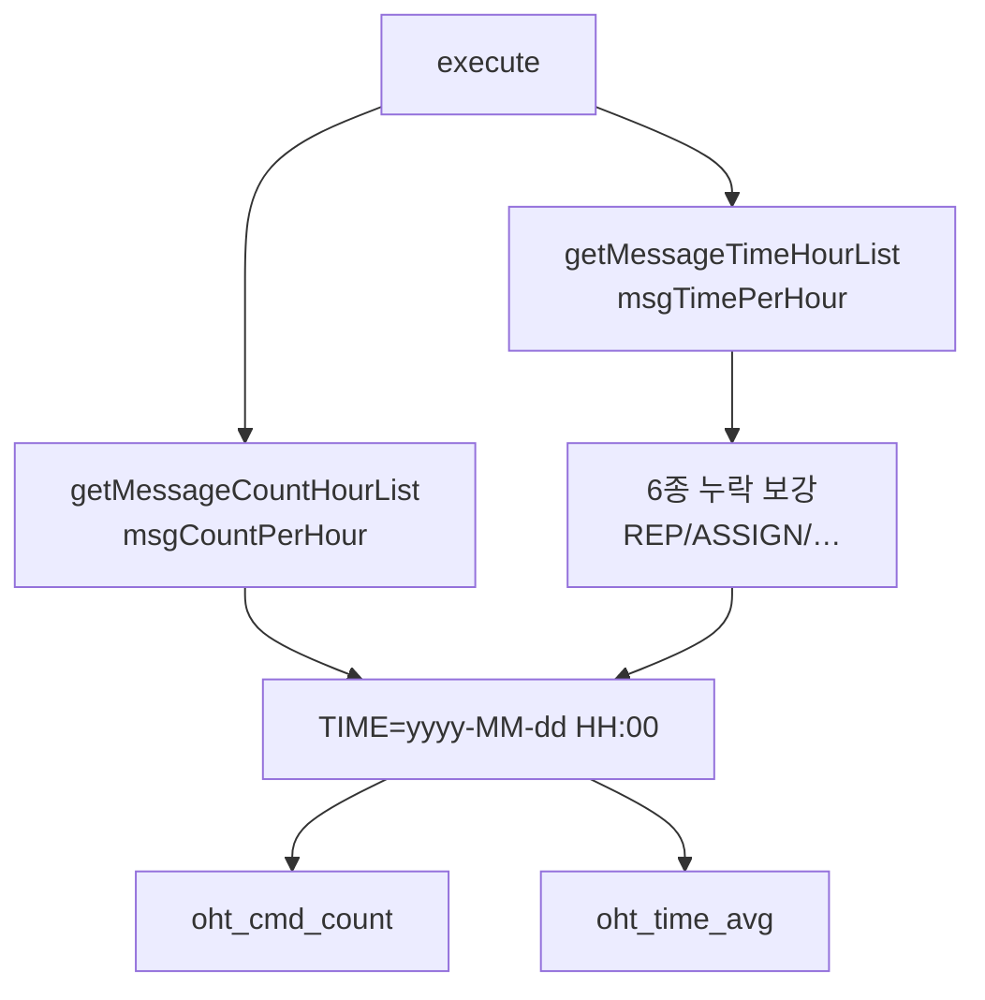
```mermaid
flowchart TD
  A[execute] --> B[getMessageCountHourList<br/>msgCountPerHour]
  A --> C[getMessageTimeHourList<br/>msgTimePerHour]
  C --> D[6종 누락 보강<br/>REP/ASSIGN/…]
  B & D --> E[TIME=yyyy-MM-dd HH:00]
  E --> F[oht_cmd_count]
  E --> G[oht_time_avg]
```

8. **라인 참조**: `execute()` L28-47 / `_run()` L49-75 / `getMessageCountHourList()` L77-89 / `getMessageTimeHourList()` L91-132.

---

## §18. OhtPerformanceTimeMinBatch

**파일**: `OhtPerformanceTimeMinBatch.java` (557 라인)

1. **요약**: 분당 OHT 가동률 + 메시지 수/시간 적재. REP/ASSIGN/TRANSFERRING 에 대해 1 시간 평균 대비 임계치 (`REQ_LIMIT`, `REQ_LIMIT2`, `ASSIGN_LIMIT`, `TRANSFERRING_LIMIT`, `VHL_RATE_LIMIT`) 비교 후 알람 메시지 생성.
2. **Job 구현**: `implements Job` (L26).
3. **execute() 단계**:
   1. IC 체크 (L36) → `_run()` (L41)
4. **입력**: Logpresso `vhlRunRate` (L61), `msgCountPerMin` (L109), `searchOHTCNTHour` (L113), `mesOHTQCntAlarmValid` (L117), `msgTimePerMin` (L271), `msgTimePerHour` (L275), `searchOHTCNT10Min` (L283). Variable: `REQ_LIMIT`, `REQ_LIMIT2`, `ASSIGN_LIMIT`, `TRANSFERRING_LIMIT`, `VHL_RATE_LIMIT`. Alarm 메시지: `REP_ALARM_NAME`, `REP_ALARM_BOLD(2)`, `ASSIGN_TIME_ALARM_NAME`, `ASSIGN_TIME_ALARM_BOLD(2)`, `TRANSFERRING_TIME_ALARM_NAME`, `TRANSFERRING_TIME_ALARM_BOLD(2)`.
5. **출력**: Logpresso `oht_cmd_count` (L83), `oht_time_avg` (L84).
6. **스위치**: 없음.
7. **흐름**:

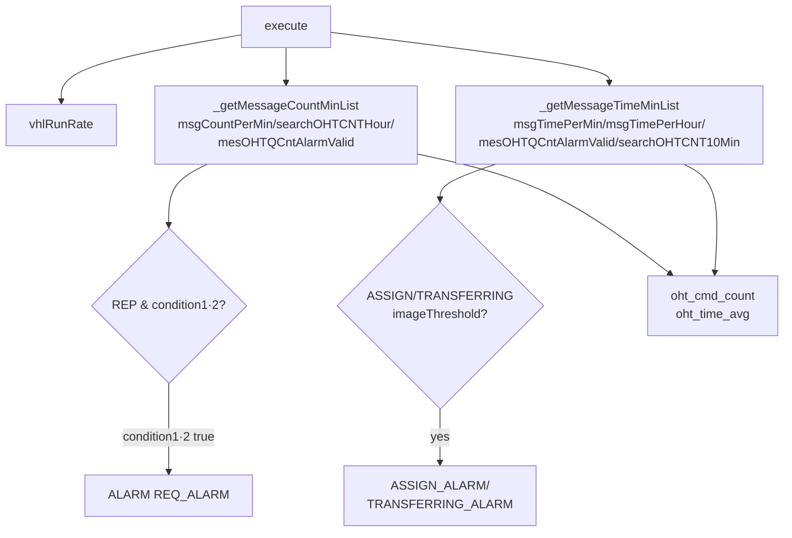
```mermaid
flowchart TD
  A[execute] --> B[vhlRunRate]
  A --> C[_getMessageCountMinList<br/>msgCountPerMin/searchOHTCNTHour/<br/>mesOHTQCntAlarmValid]
  C --> C1{REP & condition1·2?}
  C1 -->|condition1·2 true| C2[ALARM REQ_ALARM]
  A --> D[_getMessageTimeMinList<br/>msgTimePerMin/msgTimePerHour/<br/>mesOHTQCntAlarmValid/searchOHTCNT10Min]
  D --> D1{ASSIGN/TRANSFERRING<br/>imageThreshold?}
  D1 -->|yes| D2[ASSIGN_ALARM/<br/>TRANSFERRING_ALARM]
  C & D --> E[oht_cmd_count<br/>oht_time_avg]
```

8. **라인 참조**: `execute()` L34-51 / `_run()` L53-88 / `_getMessageCountMinList()` L90-244 / `_getMessageTimeMinList()` L246-526.

---

## §19. QTransferDashBoardItemBatch

**파일**: `QTransferDashBoardItemBatch.java` (216 라인)

1. **요약**: 대시보드 표시용 3 종 통계 (Requestor 도넛 / MCS Error Log 카운트 / 예측값 오차) 를 `qtransfer_dashboard` 테이블 한 곳에 적재.
2. **Job 구현**: `implements Job` (L22).
3. **execute() 단계**:
   1. IC 체크 (L30) → `_init()`/`_run()` (L35)
4. **입력**: Logpresso `requestorCount` (L118, `QTRANSFER_REQUESTOR_LIST` 변수 치환), `mcsErrorLogCnt` (L136), `quePredictError` (L150).
5. **출력**: Logpresso `qtransfer_dashboard` (L93).
6. **스위치**: 없음. 다만 정적 메서드 `insertLogpressoData()` (L92) 가 §14 ItsmChangeRequestBatch 와 §20 QTransferPredictBatch 에서도 호출됨.
7. **흐름**:

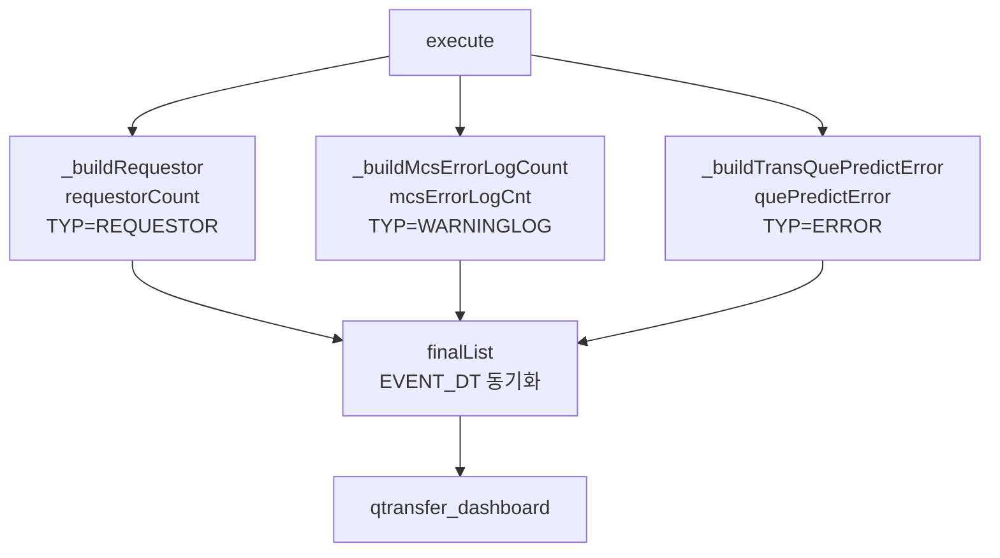
```mermaid
flowchart TD
  A[execute] --> B[_buildRequestor<br/>requestorCount<br/>TYP=REQUESTOR]
  A --> C[_buildMcsErrorLogCount<br/>mcsErrorLogCnt<br/>TYP=WARNINGLOG]
  A --> D[_buildTransQuePredictError<br/>quePredictError<br/>TYP=ERROR]
  B & C & D --> E[finalList<br/>EVENT_DT 동기화]
  E --> F[qtransfer_dashboard]
```

8. **라인 참조**: `execute()` L26-45 / `_run()` L51-90 / `insertLogpressoData()` L92-105 / `_buildRequestor()` L107-130 / `_buildMcsErrorLogCount()` L132-144 / `_buildTransQuePredictError()` L146-159.

---

## §20. QTransferPredictBatch

**파일**: `QTransferPredictBatch.java` (1774 라인)

1. **요약**: Q-Transfer(반송큐) 분당 예측. CSV → 6 단계 Python 모델 (`Q_TRANSFER_PREDICTOR_10m`…`35m`) 실행 → IQR / 표준편차 / LSTM 판정 → 알람 + 상태(STATE/STATE_PER) 분리 적재.
2. **Job 구현**: `implements Job` (L23).
3. **execute() 단계**:
   1. IC 체크 (L33) → `_run()` (L38)
   2. `_buildTransportAlarm()` (L86)
   3. `_createInputData()` → CSV (L88)
   4. `_predictor()` → LSTM 값 (L94)
   5. `_insertPredictionState()` → 대시보드에 STATE 행 (L115)
   6. `_getPivotData()` → IQR/STD 계산 (L118)
   7. LSTM_JUDGE (±10 %) 부여 (L176)
   8. `test_currentjob_predict` 에 적재
4. **입력**: Logpresso `Q_TRANSFER_INPUT_DATA` (L230), `qTransferGroupData` (L456), Variable `Q_TRANSFER_MODEL_MAPPER`, `Q_TRANSFER_MODEL_MAPPER_DEFAULT`.
5. **출력**: Logpresso `test_currentjob_predict` (L222), `ATLAS_TS_PREDICT` (L333), `qtransfer_dashboard` (L439 via `QTransferDashBoardItemBatch.insertLogpressoData`).
6. **스위치**: 없음.
7. **흐름**:

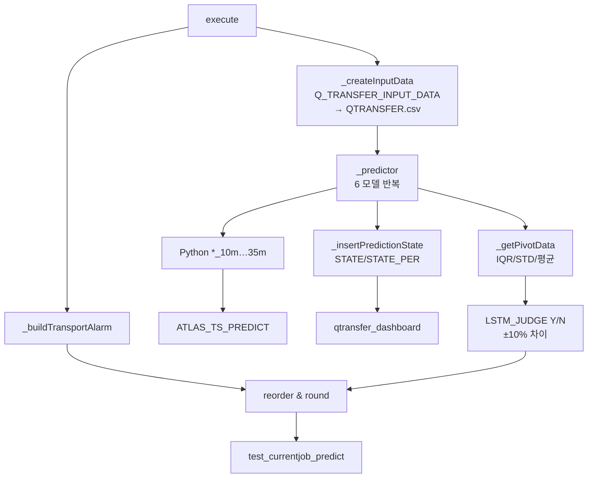
```mermaid
flowchart TD
  A[execute] --> B[_buildTransportAlarm]
  A --> C[_createInputData<br/>Q_TRANSFER_INPUT_DATA<br/>→ QTRANSFER.csv]
  C --> D[_predictor<br/>6 모델 반복]
  D --> D1[Python *_10m…35m]
  D1 --> D2[ATLAS_TS_PREDICT]
  D --> E[_insertPredictionState<br/>STATE/STATE_PER]
  E --> E1[qtransfer_dashboard]
  D --> F[_getPivotData<br/>IQR/STD/평균]
  F --> G[LSTM_JUDGE Y/N<br/>±10% 차이]
  B & G --> H[reorder & round]
  H --> I[test_currentjob_predict]
```

8. **라인 참조**: `execute()` L31-48 / `_run()` L54-226 / `_createInputData()` L228-238 / `_preparePredictor()` L243-275 / `_predictor()` L296-341 / `_insertPredictionState()` L369-443 / `_getPivotData()` L450~ / IQR/STD 계산 L494-... (이후 라인은 동일 패턴).

---

## §21. RailCutRefreshBatch

**파일**: `RailCutRefreshBatch.java` (505 라인)

1. **요약**: FTP `inactive_SCH_1.dat` 변경 감지 후 신규/유지/해소(A/B/C) 3 case 분류 → TIB 메시지 + RailEdge `setAvailable` 갱신 + Logpresso 적재.
2. **Job 구현**: `implements Job` (L28).
3. **execute() 단계**:
   1. IC 체크 (L35) → `_init()` (L36)
   2. switchMap 순회, `isUseRailCut()` 인 fab/mcp 만 (L50)
   3. `_run(fabId, mcpName)` → `_downloader` → `_buildNewRailCutKeySet` → `_updateRailCutHandler` → `_insertLogpresso` + `_addTibSenderWaiting`
   4. `DataService.getDataSet().setRailCutRecordMap(totalData)` (L69)
4. **입력**: FTP `inactive_SCH_1.dat` (`Util.getAllOhtLayoutFileOverFtp`, L160 ~ true,false,false,false,true), 메모리 `RailCutRecordMap`.
5. **출력**: Logpresso `ATLAS_OHT_RAIL_CUT` (L225), TIB `SEND_SUB_SUBJECT.RAIL_CUT` (L192).
6. **스위치**: `isUseRailCut()` (L50), `FunctionType.RAIL_CUT`.
7. **흐름**:

```mermaid
flowchart TD
  A[execute] --> B{isUseRailCut?}
  B -->|yes| C[_downloader<br/>inactive_SCH_1.dat]
  C --> D[_buildNewRailCutKeySet<br/>Mcp75Config.updateRawRailCut]
  D --> E[_updateRailCutHandler]
  E --> E1[CASE A<br/>recovery NORMAL]
  E --> E2[CASE B<br/>new ABNORMAL]
  E --> E3[CASE C<br/>retain]
  E1 & E2 & E3 --> F[_insertLogpresso<br/>ATLAS_OHT_RAIL_CUT]
  E1 & E2 & E3 --> G[_addTibSenderWaiting<br/>RAIL_CUT]
```

8. **라인 참조**: `execute()` L33-75 / `_run()` L88-154 / `_downloader()` L156-169 / `_addTibSenderWaiting()` L171-197 / `_insertLogpresso()` L199-226 / `_buildNewRailCutKeySet()` L256-283 / `_updateRailCutHandler()` L303-444 / `_createRailCutObject()` L449-504.

---

## §22. RailVibrationBatch

**파일**: `RailVibrationBatch.java` (311 라인)

1. **요약**: `IOT_M16A` Oracle DB 의 `SELECT_VIBRATION` 쿼리로 진동 데이터 수집 → 정상 전환 데이터 합산 → Logpresso 적재 및 TIB 메시지 송신.
2. **Job 구현**: `implements Job` (L31).
3. **execute() 단계**:
   1. IC 체크 (L38)
   2. `CMN.CMN.RAIL_VIBRATION == TRUE` 체크 (L41) → `_run()` (L46)
4. **입력**: Oracle `IOT_M16A` (`SELECT_VIBRATION` 쿼리, L118-126), `DataService.getDataSet().getRailVibrationRecordMap()` (L193).
5. **출력**: Logpresso `ATLAS_OHT_RAIL_VIBRATION` (L239, L247), TIB `SEND_SUB_SUBJECT.RAIL_VIBRATION` (L218, 단 `fabId="M14A"` 하드코딩).
6. **스위치**: `CMN.CMN.RAIL_VIBRATION` 프로퍼티 (L41).
7. **흐름**:

```mermaid
flowchart TD
  A[execute] --> B{RAIL_VIBRATION=TRUE?}
  B -->|yes| C[_selectQuery<br/>IOT_M16A SELECT_VIBRATION]
  C --> D[_parsing → RailVibrationRecordItem]
  D --> E[_checkNormalState<br/>키 비교 NORMAL 전환]
  E --> F[_insertLogpresso<br/>ATLAS_OHT_RAIL_VIBRATION]
  F --> G[_sendMessage<br/>TIB RAIL_VIBRATION]
```

8. **라인 참조**: `execute()` L34-57 / `_run()` L70-111 / `_selectQuery()` L114-134 / `_parsing()` L137-176 / `_checkNormalState()` L191-209 / `_sendMessage()` L212-227 / `_insertLogpresso()` L233-251.

---

## §23. ServerResourceApmBatch

**파일**: `ServerResourceApmBatch.java` (401 라인)

1. **요약**: `M14APM` Oracle 에서 APM 자원 (CPU/MEM/JVM 등) 일일 측정 데이터를 가져와 Logpresso 적재 + 7 일치 누적 시 Prophet 모델 (`SERVER_RESOURCE_MODEL.py`) 으로 미래 예측 + 임계치 알람.
2. **Job 구현**: `implements Job` (L27).
3. **execute() 단계**:
   1. IC 체크 (L34) → `_run()` (L39)
   2. `getApmDataByOracle()` → `server_resource_apm` 적재
   3. `getAlarmText(MEAS)` → 임계 초과 시 ALARM 행 추가
   4. `getResourceDataList()` (7 일치 조회), 충분 시 `exectePredictData()` → `server_resource_predict` 적재
4. **입력**: Oracle `M14APM` (`SELECT_APM_RESOURCE_LIST`, L105), Logpresso `apmDataValid` (L125), Variable `APM_PREDICT_INPUT_RANGE`, `APM_PREDICT_OUTPUT_RANGE`, `CPU_OS_LIMIT`, `CPU_USER_LIMIT`, `JVM_CPU_LIMIT`, `JVM_HEAP_LIMIT(2)`, `JVM_THREAD_LIMIT`, `TXN_TIME_LIMIT`.
5. **출력**: Logpresso `server_resource_apm` (L65), `server_resource_predict` (L381), 파일 `data/APMWEEKDATA.csv` (L346).
6. **스위치**: 없음.
7. **흐름**:

```mermaid
flowchart TD
  A[execute] --> B[getApmDataByOracle<br/>M14APM SELECT_APM_RESOURCE_LIST]
  B --> C[server_resource_apm 적재]
  C --> D[getAlarmText MEAS<br/>임계치 비교]
  D --> E[ALARM 행 추가]
  A --> F[getResourceDataList<br/>apmDataValid 7일]
  F --> G{weeks ≥ inputRange?}
  G -->|yes| H[exectePredictData<br/>CSV APMWEEKDATA.csv]
  H --> I[SERVER_RESOURCE_MODEL.py]
  I --> J[getAlarmText PREDICT]
  J --> K[server_resource_predict]
```

8. **라인 참조**: `execute()` L30-49 / `_run()` L51-91 / `getApmDataByOracle()` L94-119 / `getResourceDataList()` L121-133 / `getAlarmText()` L134-312 / `exectePredictData()` L315-388.

---

## §24. SwitchSystemBatch

**파일**: `SwitchSystemBatch.java` (551 라인)

1. **요약**: 운영 중 환경 설정 파일들의 `lastModifiedTime` 을 폴링하여 변경 시 메모리에 반영 (Hot-reload). 3 종류: (1) `FabSet.properties` (UDP 포트 재기동 포함), (2) `Reset.properties` (HID/VHL/RAIL_CUT/VHL_CNT 리셋), (3) `variable.xml`, `customQuery.xml`, `customQuery2.xml`, `alarm_message.xml`, `oht_alarm_message.xml`.
2. **Job 구현**: `implements Job` (L40).
3. **execute() 단계**:
   1. IC 체크 (L46) → `_run()` (L49)
   2. `_readRevisedDocument()` (L64, FabSet)
   3. `_readRevisedResetDocument()` (L65, Reset)
   4. `_readRevisedVariableData()` (L66, XML 5종)
4. **입력**: 파일 `FabSet.properties`, `Reset.properties`, `variable.xml`, `customQuery(2).xml`, `*_alarm_message.xml`.
5. **출력**:
   - 메모리 reload: `XmlUtil.loadVariableEnv()`, `loadLogpressoParm()`, `loadAlarmMessage()`, `loadOhtAlarmMessage()` (L87-99)
   - `Util.reflectSwitch()` (L428) — `Env.switchMap` 갱신
   - UDP Listener 추가/제거/포트 변경 (L460-503)
   - Reset 시 TIB NORMAL 상태 송신 + 데이터 삭제 (L320-421)
6. **스위치**: Reset 처리에서 `FunctionType.HID_OFF/VHL_OFF/RAIL_CUT/VHL_CNT` 분기 (L331-409). `value="TRY"` 인 경우만 reset 수행 → `DONE`/`FAIL` 로 마킹 (L216, L253, L255).
7. **흐름**:

```mermaid
flowchart TD
  A[execute] --> B[_readRevisedDocument<br/>FabSet.properties mtime]
  B --> B1[reflectSwitch]
  B1 --> B2[UDP 추가/삭제/포트변경]
  A --> C[_readRevisedResetDocument<br/>Reset.properties mtime]
  C --> C1[TRY → ONGOING]
  C1 --> C2[_resetFunction]
  C2 --> C2a[HID_OFF NORMAL]
  C2 --> C2b[VHL_OFF NORMAL]
  C2 --> C2c[RAIL_CUT NORMAL]
  C2a & C2b & C2c --> C3[TIB 송신]
  C3 --> C4[DONE/FAIL 마킹]
  A --> D[_readRevisedVariableData]
  D --> D1[variable.xml → loadVariableEnv]
  D --> D2[customQuery.xml → loadLogpressoParm]
  D --> D3[customQuery2.xml → loadLogpressoParm]
  D --> D4[alarm_message.xml → loadAlarmMessage]
  D --> D5[oht_alarm_message.xml → loadOhtAlarmMessage]
```

8. **라인 참조**: `execute()` L44-58 / `_run()` L63-67 / `_readRevisedVariableData()` L72-107 / `_readRevisedResetDocument()` L112-130 / `_readRevisedDocument()` L135-153 / `_confirmFileChanged()` L162-187 / `_resetByProperties()` L199-302 / `_resetFunction()` L320-421 / `_setFunctionByProperties()` L426-435 / `_switchUdp()` L438-505.

---

## §25. SystemMessageDetectBatch

**파일**: `SystemMessageDetectBatch.java` (893 라인)

1. **요약**: MHS↔MCS, MCS↔MCP SECS 메시지, MES JOB Monitoring, MCS SECS warn 로그, MES Job Log Pattern 5 가지 데이터를 분 단위로 통합해 `abnormal_detect_data` 단일 테이블에 적재 (이상 발생 여부 판정 포함).
2. **Job 구현**: `implements Job` (L28).
3. **execute() 단계**:
   1. IC 체크 (L58) → `_run()` (L63)
   2. `_preprocessing()` (이전 값 평균 계산 등, L85)
   3. `_collectData()` (L87) — 5 종 리스트 합산
   4. `abnormal_detect_data` Logpresso 적재 (L89)
4. **입력**: Logpresso `mhsMcsMessage` (L143), `mcsMcpMessage` (L183), 기타 `_getMesJobMonitoring`, `_getMcsSecsWarnLog`, `_getMesJobTsLogPattern`.
5. **출력**: Logpresso `abnormal_detect_data` (L89).
6. **스위치**: 없음.
7. **흐름**:

```mermaid
flowchart TD
  A[execute] --> B[_preprocessing<br/>평균/임계치 계산]
  B --> C[_getMhsMcsMessage<br/>SECS REQ/REP]
  B --> D[_getMcsMcpMessage<br/>SECS RemoteCmd/EventReport]
  B --> E[_getMesJobMonitoring]
  B --> F[_getMcsSecsWarnLog]
  B --> G[_getMesJobTsLogPattern]
  C & D & E & F & G --> H[병합]
  H --> I[abnormal_detect_data]
```

8. **라인 참조**: `execute()` L54-73 / `_run()` L75-90 / `_collectData()` L92-119 / `_getMhsMcsMessage()` L142-180 / `_getMcsMcpMessage()` L182~ / `_validateMesMcsTransportCommandJob()` / `_reflectAlarmField()` 등.

---

## §26. TrafficBatch

**파일**: `TrafficBatch.java` (332 라인)

1. **요약**: RailEdge 별 속도, 통과량, 차량수를 분 단위 집계 후 Logpresso 에 적재. M14A 의 경우 center 범위 평균 속도를 추출해 TIB `VHL_AVG_SPEED` 로 송신.
2. **Job 구현**: `implements Job` (L30).
3. **execute() 단계**:
   1. IC 체크 (L39)
   2. switchMap 순회, `isUseRailTraffic()` 인 fab/mcp 만 (L46)
   3. `M14A:A` 경우 `_preprocess()` (variable `M14A_CENTER_FROM_NODE` 파싱, L74)
   4. `_run(fabId, mcpName, functionItem)` (L59)
4. **입력**: `DataService.getDataSet().getRailEdgeMap()` (L151), variable `M14A_CENTER_FROM_NODE`.
5. **출력**: Logpresso `ATLAS_RAIL_TRAFFIC` (L213), TIB `SEND_SUB_SUBJECT.VHL_AVG_SPEED` (L254).
6. **스위치**:
   - `isUseRailTraffic` (L46)
   - `isUseRailTrafficSub` (L178) → 개별 RailEdge tuple
   - `isUseRailTrafficMaxVelocity` (L296), `isUseRailTrafficAbsoluteVelocity` (L300), `isUseRailTrafficVhlCnt` (L304), `isUseRailTrafficPassCnt` (L308)
7. **흐름**:

```mermaid
flowchart TD
  A[execute] --> B{isUseRailTraffic?}
  B -->|yes| C{M14A:A?}
  C -->|yes| D[_preprocess<br/>M14A_CENTER_FROM_NODE]
  C --> E[_run]
  E --> F[RailEdgeMap 순회]
  F --> G[velocity/maxVel/absVel/vhlCnt/passCnt]
  G --> H{isUseRailTrafficSub?}
  H -->|yes| I[_buildBase tuple]
  F --> J[avgNotIncludeInit<br/>avgForTotal<br/>centerVelocityAvg]
  J --> K[_buildHeaderBase × 2]
  J --> L[_addTibSenderWaiting<br/>VHL_AVG_SPEED M14A]
  I & K --> M[ATLAS_RAIL_TRAFFIC]
```

8. **라인 참조**: `execute()` L37-71 / `_preprocess()` L74-127 / `_run()` L129-218 / `_buildHeaderBase()` L220-239 / `_addTibSenderWaiting()` L247-275 / `_buildBase()` L277-331.

---

## §27. UpdatingDbMachineListBatch

**파일**: `UpdatingDbMachineListBatch.java` (72 라인)

1. **요약**: Oracle 의 마스터 데이터 (`SELECT_MACHINE_LIST`, `SELECT_MACHINE_TYPEINFO`, `SELECT_UNIT_LIST`) 를 MongoDB 컬렉션 (`master_machine_list_{suffix}` 등) 에 동기화.
2. **Job 구현**: `implements Job` (L20).
3. **execute() 단계**:
   1. `Env.getMongodbPropertiesMap().keySet()` 순회 (fab 별, L30)
   2. 3 종 쿼리 실행 후 `MongodbAPI.insertMany` (L39-62)
4. **입력**: Oracle (`SELECT_MACHINE_LIST`/`SELECT_MACHINE_TYPEINFO`/`SELECT_UNIT_LIST` 쿼리 모음).
5. **출력**: MongoDB `master_machine_list_{suffix}`, `master_machine_typeinfo_{suffix}`, `master_unit_list_{suffix}`.
6. **스위치**: 없음 (항상 실행).
7. **흐름**:

```mermaid
flowchart TD
  A[execute] --> B[fab 순회]
  B --> C[SELECT_MACHINE_LIST]
  C --> C1[master_machine_list_suffix]
  B --> D[SELECT_MACHINE_TYPEINFO]
  D --> D1[master_machine_typeinfo_suffix]
  B --> E[SELECT_UNIT_LIST]
  E --> E1[master_unit_list_suffix]
```

8. **라인 참조**: `execute()` L23-70.

---

## §28. UpdatingDbMasterDataBatch

**파일**: `UpdatingDbMasterDataBatch.java` (67 라인)

1. **요약**: MongoDB aggregation 파이프라인 (`MCSLOG_MASTER_PROCESS`) 을 5 단계 (TS_PROCESS, CS_PROCESS, DS_PROCESS, EI_PROCESS) + `MCSLOG_MASTER_MACHINE` 실행해 각 fab 별 마스터 컬렉션을 갱신.
2. **Job 구현**: `implements Job` (L17).
3. **execute() 단계**:
   1. `Env.getMongodbPropertiesMap().keySet()` 순회 (L25)
   2. Type 별 aggregation 호출 (L33-58)
4. **입력**: MongoDB `ts_raw_{suffix}`, `cs_data_{suffix}`, `ds_data_{suffix}`, `ei_data_{suffix}`, `secs_raw_{suffix}`.
5. **출력**: 동일 컬렉션에 마스터 데이터 생성 (`MongodbQueryPool.getQuery("MCSLOG_MASTER_PROCESS")` / `MCSLOG_MASTER_MACHINE`).
6. **스위치**: 없음.
7. **흐름**:

```mermaid
flowchart TD
  A[execute] --> B[fab 순회]
  B --> C[aggregate TS_PROCESS<br/>ts_raw_suffix]
  B --> D[aggregate CS_PROCESS<br/>cs_data_suffix]
  B --> E[aggregate DS_PROCESS<br/>ds_data_suffix]
  B --> F[aggregate EI_PROCESS<br/>ei_data_suffix]
  B --> G[aggregate MCSLOG_MASTER_MACHINE<br/>secs_raw_suffix]
```

8. **라인 참조**: `execute()` L20-65.

---

## §29. VhlCntBatch

**파일**: `VhlCntBatch.java` (149 라인)

1. **요약**: `HidVehicleCountMap` 의 HID 별 차량수를 Logpresso `ATLAS_OHT_VHL_CNT` 에 적재하고 TIB `VHL_CNT` 메시지를 송신. 같은 fab/mcp 에 다른 주기 (`VHL_CNT_10/30/60`) 가 동시에 켜져 있으면 동작 거부.
2. **Job 구현**: `implements Job` (L26).
3. **execute() 단계**:
   1. IC 체크 (L32)
   2. switchMap 순회, `isUseVhlCnt()` 인 fab/mcp 만 (L36)
   3. 충돌 체크 (L42): `isUseVhlCnt10 || isUseVhlCnt30 || isUseVhlCnt60` 이면 거부
   4. `_run(fabId, mcpName)`
4. **입력**: `DataService.getDataSet().getHidVehicleCountMap()` (L75). Key 포맷: `{fabId}:{mcpName}:{hidId}`.
5. **출력**: Logpresso `ATLAS_OHT_VHL_CNT` (L101), TIB `VHL_CNT` (L143).
6. **스위치**: `isUseVhlCnt` (L36), `FunctionType.VHL_CNT_10/30/60` 충돌 검사 (L42).
7. **흐름**:

```mermaid
flowchart TD
  A[execute] --> B{isUseVhlCnt?}
  B -->|yes| C{충돌?<br/>VhlCnt10/30/60}
  C -->|충돌| X[ERROR LOG<br/>return]
  C -->|no| D[HidVehicleCountMap 정렬]
  D --> E[hidId:count 리스트]
  E --> F[ATLAS_OHT_VHL_CNT]
  E --> G[TIB VHL_CNT]
```

8. **라인 참조**: `execute()` L30-72 / `_run()` L74-127 / `_getVhlCntTuple()` L129-138 / `_addTibSenderWaiting()` L140-148.

---

## §30. VhlCnt10Batch

**파일**: `VhlCnt10Batch.java` (135 라인)

1. **요약**: §29 와 동일 로직. 10 분 주기 변형. `isUseVhlCnt10` 만 활성화된 경우 동작.
2. **Job 구현**: `implements Job` (L27).
3. **execute() 단계**:
   1. IC 체크 (L33)
   2. fab/mcp 순회 + `isUseVhlCnt10` (L41)
   3. 충돌 (VhlCnt/30/60) 체크 (L42)
   4. `_run(fabId, mcpName)`
4. **입력**: `HidVehicleCountMap` (L62).
5. **출력**: Logpresso `ATLAS_OHT_VHL_CNT` (L87), TIB `VHL_CNT` (L131).
6. **스위치**: `isUseVhlCnt10` (L41), 다른 3 종 충돌 시 거부.
7. **흐름**: §29 와 동일 (스위치 `isUseVhlCnt10` 사용).
8. **라인 참조**: `execute()` L30-59 / `_run()` L61-113 / `_getVhlCntTuple()` L115-124 / `_addTibSenderWaiting()` L126-134.

---

## §31. VhlCnt30Batch

**파일**: `VhlCnt30Batch.java` (136 라인)

1. **요약**: §29 와 동일 로직. 30 분 주기 변형. `isUseVhlCnt30` 만 활성화 시 동작.
2. **Job 구현**: `implements Job` (L27).
3. **execute() 단계**: `isUseVhlCnt30` 체크 (L41), 충돌 (VhlCnt/10/60) 체크 (L42), `_run`.
4. **입력**: `HidVehicleCountMap` (L62).
5. **출력**: Logpresso `ATLAS_OHT_VHL_CNT` (L88), TIB `VHL_CNT` (L132).
6. **스위치**: `isUseVhlCnt30` (L41).
7. **흐름**: §29 동일.
8. **라인 참조**: `execute()` L30-59 / `_run()` L61-114.

---

## §32. VhlCnt60Batch

**파일**: `VhlCnt60Batch.java` (136 라인)

1. **요약**: §29 와 동일 로직. 60 분 주기 변형. `isUseVhlCnt60` 만 활성화 시 동작.
2. **Job 구현**: `implements Job` (L27).
3. **execute() 단계**: `isUseVhlCnt60` 체크 (L41), 충돌 (VhlCnt/10/30) 체크 (L42), `_run`.
4. **입력**: `HidVehicleCountMap` (L62).
5. **출력**: Logpresso `ATLAS_OHT_VHL_CNT` (L88), TIB `VHL_CNT` (L132).
6. **스위치**: `isUseVhlCnt60` (L41).
7. **흐름**: §29 동일.
8. **라인 참조**: `execute()` L30-59 / `_run()` L61-114.

> **주의**: §29~§32 는 코드가 90 % 이상 동일하지만 사용 스위치만 다르다. `VhlCntBatch` 는 Env.switchMap 을 순회하나 `VhlCnt10/30/60` 은 `DataService.getInstance().getFabPropertiesMap()` 을 사용해 fab/mcp 를 얻는 차이가 있다 (`VhlCntBatch` L33, `VhlCnt10` L34).

---

## §33. 카테고리별 분류

### 33.1 마스터 갱신 / 환경 동기화

| 배치 | 역할 |
|---|---|
| DataSetRefreshBatch | FTP layout 파일 변경 시 메모리 데이터셋 + TIB 재송신 |
| HidEdgeInOutUpdateMasterBatch | layout.zip 파싱 → HID Edge/Info 마스터 테이블 갱신 |
| RailCutRefreshBatch | inactive_SCH_1.dat 변경 감지 → A/B/C case 분류 + TIB |
| SwitchSystemBatch | FabSet/Reset/variable XML hot-reload + UDP 포트 스위치 + 기능 reset |
| UpdatingDbMachineListBatch | Oracle 마스터 → MongoDB 동기화 |
| UpdatingDbMasterDataBatch | MongoDB aggregation 5 단계 마스터 갱신 |
| BridgeJudgeRangeBatch | 7 일치 σ 기반 판정 범위 산출 |

### 33.2 실시간 큐 / 버퍼 flush

| 배치 | 출력 테이블/대상 |
|---|---|
| AmpBufferFlushBatch | MongoDB `amp_agv_status_*`, `amp_cnv_status_*` |
| CnvTaskBatch | Logpresso `ATLAS_HIS_CNV_TASK`, `ATLAS_HIS_CNV_LE_STATE` |
| HidEdgeInOutQueueFlushBatch | Logpresso `{fab}_ATLAS_HID_INOUT` |
| TrafficBatch | Logpresso `ATLAS_RAIL_TRAFFIC` + TIB `VHL_AVG_SPEED` |
| VhlCntBatch / VhlCnt10/30/60Batch | Logpresso `ATLAS_OHT_VHL_CNT` + TIB `VHL_CNT` |

### 33.3 모니터링 / 알람 / 시스템 감시

| 배치 | 감시 대상 |
|---|---|
| AlertingSystemStatus | OS 자원/큐 → SMS + Cluster Failover |
| AbnormalDetectBatch | TS Log 신규 패턴 |
| MonitoringControlBatch | VHL OFF / Stage Command / UDP 큐 |
| SystemMessageDetectBatch | MHS-MCS/MCS-MCP SECS 메시지 + MES Job |
| OhtPerformanceTimeHourBatch | 시간당 OHT 메시지 수/시간 |
| OhtPerformanceTimeMinBatch | 분당 OHT 메시지 임계치 알람 |
| RailVibrationBatch | M16A IOT 진동 (Oracle) |

### 33.4 예측 / 머신러닝

| 배치 | Python / 모델 | 적재 테이블 |
|---|---|---|
| AmosBoundryBatch | `boundary_batch.py` (7 일치 학습) | (Python 측 저장) |
| AmosMinBatch | `deadlock_hub.py`, `standard_detector.py`, `3DO_PRETIME_TEST3.py` | `M16A_BOTTLENECK_ANOMALY`, `M14A_QUEUE_ANOMALY` |
| HubroomTransPredictBatch | `HUB_ROOM_PREDICTOR_10m~35m` 6 모델 | `test_hubroom_predict` |
| QTransferPredictBatch | `Q_TRANSFER_PREDICTOR_10m~35m` 6 모델 | `test_currentjob_predict`, `ATLAS_TS_PREDICT` |
| ServerResourceApmBatch | `SERVER_RESOURCE_MODEL.py` (Prophet) | `server_resource_apm`, `server_resource_predict` |

### 33.5 Bridge / Layout 판정

| 배치 | 출력 |
|---|---|
| BridgeJudgeRangeBatch | `bridge_judge_range` (마스터) |
| BridgeLayoutBatch | `bridge_layout_test` (실시간 비교) |
| BridgeLayoutDetailBatch | `bridge_layout_tmp`, `bridge_layout_detail` (24 알람 코드) |

### 33.6 MES / Oracle 연동

| 배치 | 역할 |
|---|---|
| MesLotHisBatch | MES_LOT_HIS → 다음 공정 예측 + FAB/층간 반송 |
| ItsmChangeRequestBatch | ITSM REST → 대시보드 |
| ServerResourceApmBatch | M14APM Oracle |
| RailVibrationBatch | IOT_M16A Oracle |
| UpdatingDbMachineListBatch | Oracle → MongoDB |

### 33.7 대시보드 데이터 집계

| 배치 | 출력 테이블 |
|---|---|
| QTransferDashBoardItemBatch | `qtransfer_dashboard` |
| ItsmChangeRequestBatch | `qtransfer_dashboard` (TYP=WORKLOG) |
| QTransferPredictBatch | `qtransfer_dashboard` (TYP=STATE) |

---

## §34. 공통 패턴 요약

### 34.1 IC 노드 분기

거의 모든 배치는 `Util.isCurrentIC()` (HA 환경에서 active node 인지 확인) 으로 가드된다. AmpBufferFlushBatch, CnvTaskBatch, HidEdgeInOutQueueFlushBatch, HidEdgeInOutUpdateMasterBatch, UpdatingDbMachineListBatch, UpdatingDbMasterDataBatch 6 개만 `DataService.getInstance().getInitialized()` 또는 무체크 (마스터 동기화 류) 를 사용.

### 34.2 지연 감지

`DELAYED_TIME = 1000 * 60` (1 분) 을 넘기는 경우 `!!!DELAYED!!!` ERROR 로그. 대부분 클래스 상단 상수 또는 `execute()` 내 지역 변수로 선언.

### 34.3 적재 헬퍼

- `Util.insertInLogpressoDatabase(List<Tuple>, tableName, sourceName)` — 대다수
- `LogpressoAPI.setInsertTuples(tableName, list, timeoutSecond)` — fab 별 테이블처럼 동적 이름이 필요한 경우 (예: `{fabId}_ATLAS_HID_INOUT`)
- `MongodbAPI.insertMany(fabId, collection, docs, options)` — AMP/마스터 동기화

### 34.4 Python 호출

`PythonUtil.executeWithParam(pyFile, isReuse [, args])` 가 표준 호출 인터페이스. 단 AmosBoundryBatch, AmosMinBatch 는 별도의 `ProcessBuilder` 를 직접 구성하여 working directory 를 강제 지정 (`processBuilder.directory(workingDir)`).

### 34.5 TIB / RV 송신 패턴

```java
for (String tibrvKey : DataService.getInstance().getTibrvSenderLikeMap(fabId + ":send:").keySet()) {
    DataService.getInstance().addTibrvMessageQueue(tibrvKey, SEND_SUB_SUBJECT.XXX, dataMap);
}
```

TIB 송신 배치: DataSetRefreshBatch, RailCutRefreshBatch, RailVibrationBatch, TrafficBatch, VhlCntBatch(10/30/60), MonitoringControlBatch.

### 34.6 FunctionType 스위치 매핑 (확인된 것)

| FunctionType | 사용 배치 |
|---|---|
| `MAP_FILE_REFRESH` | DataSetRefreshBatch (L32 `isUseMapFileRefresh`) |
| `HID_INOUT` | HidEdgeInOutUpdateMasterBatch (L79) |
| `RAIL_CUT` | RailCutRefreshBatch (L50), SwitchSystemBatch reset (L387) |
| `HID_OFF` | SwitchSystemBatch reset (L332) |
| `VHL_OFF` | SwitchSystemBatch reset (L354), MonitoringControlBatch (`isUseVhlOff` L66) |
| `VHL_CNT`, `VHL_CNT_10/30/60` | VhlCntBatch 4 종, SwitchSystemBatch reset (L405) |
| `RAIL_TRAFFIC` (+ Sub/MaxVel/AbsVel/VhlCnt/PassCnt) | TrafficBatch (L46, L178, L296, L300, L304, L308) |
| `STAGE_COMMAND_MONITORING` | MonitoringControlBatch (L87) |
