# SmartAtlas — process/ · listener/ 패키지 상세 분석

본 문서는 SmartAtlas 시스템의 실시간 메시지 수신·처리 핵심 모듈(listener 4종 + process 4종)에 대한 코드 레벨 상세 분석이다. 모든 라인 번호는 `main/java/com/skhynix/smartatlas/...` 기준이며, 토큰 인덱스·FunctionType 분기·외부 호출(DataService/LogpressoAPI/TibrvAPI)을 빠짐없이 기술한다.

---

## §0. 패키지 개요 + 메시지 종류

### 0.1 두 패키지의 역할 분리

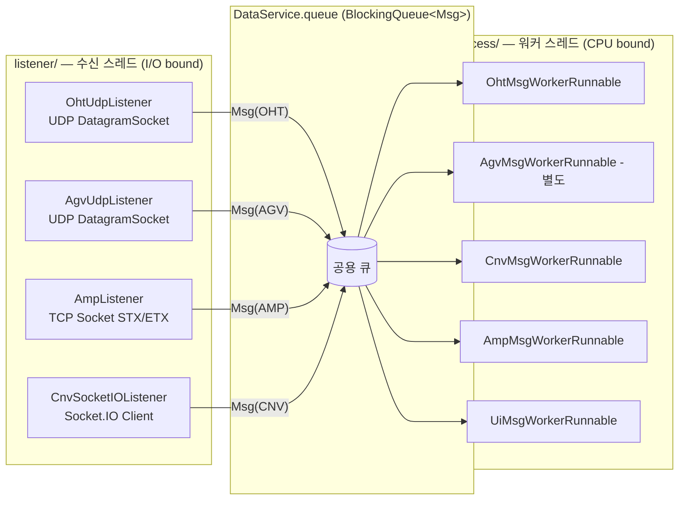

- **listener** 는 외부 디바이스(MCP7/MCP5, AGV, AMP, Conveyor)로부터 raw 메시지를 받아 단지 큐에 적재한다. 절대 비즈니스 로직을 수행하지 않는다.
- **process** 는 `Runnable` 로 ExecutorService 풀에서 실행되며, `Msg` 객체를 받아 파싱·DataSet 갱신·LogpressoAPI 적재·TibrvAPI 송신을 담당한다.

### 0.2 메시지 종류 매트릭스

| 분류 | 프로토콜 | 패킷 포맷 | MSG_TYP | 핵심 분기 키 |
|------|----------|-----------|---------|---------------|
| **OHT** | UDP (Datagram, 1500B buf) | CSV (`,` 구분) | `MSG_TYP.OHT` | `tokens[0]` = MSG_ID (1~51). "2"=VHL_STATE_REPORT 만 처리 |
| **AGV** | UDP (Datagram, 1500B buf) | CSV (`,` 구분) | `MSG_TYP.AGV` | `tokens[1]`="AGV", `tokens[0]`="2" |
| **AMP** | TCP Stream | STX(0x02)…ETX(0x03) 프레임, 내부는 CSV | `MSG_TYP.AMP` | `tokens[1]`="AGV"/"CNV", `tokens[0]`="2" |
| **CNV** | Socket.IO (HTTP/WS) | JSON (`{type, data}`) | `MSG_TYP.CNV` | `jo.type` = tcsEventSet/tcmTransferInfo/UpdateZoneState |
| **UI** | (내부 큐) | XML (SAX) | (UI Worker) | `MESSAGENAME` (UI-UNIT-PORT / UI-MACHINE / UI-MACHINE-STORAGE-CAPACITY / COMMON-AWAKE 등) |

### 0.3 OHT MSG_ID 코드 사전 (`OhtMsgWorkerRunnable.MSG_ID`, L950–960)

| 코드 | 상수명 | 의미 |
|------|--------|------|
| `"1"` | MCP_ONLINE_REPORT | MCP 온라인 보고 |
| `"2"` | VHL_STATE_REPORT | **차량 상태 보고 (실제 처리 대상)** |
| `"3"` | STATION_STATE_REPORT | 스테이션 상태 |
| `"4"` | MACHINE_STATE_REPORT | 머신 상태 |
| `"5"` | MCP7_RESTART_REPORT | MCP7 재기동 |
| `"13"` | POWER_STATE_REPORT | 전원 상태 |
| `"14"` | POWER_STATE_HISTORY_REPORT | 전원 이력 |
| `"15"` | VHL_ROUTE_REPORT | 차량 루트 보고 |
| `"51"` | STATE_REQUEST | 상태 요청 |

`run()` 에서는 오직 `"2"` 만 `_processOhtReport()` 로 분기한다(L99–101). 나머지는 TIBRV 단순 송신만 수행.

---

## §1. listener — UDP/Socket 수신 → 큐잉

### 1.1 `listener/OhtUdpListener.java`

**파일 한 줄 요약**: OHT(MCP) 차량 UDP 메시지를 단일/다중 IP 모드로 수신하여 `DataService.queue` 와 `recordQueue` 에 `Msg(OHT)` 객체를 적재하는 UDP 리스너.

#### 멤버 필드 (L17–30)
| 필드 | 타입 | 설명 |
|------|------|------|
| `logger` | Logger | SLF4J |
| `UDP_LISTENER_STOP_LOG` (L19) | String const | 종료 로그 템플릿 |
| `PORT_OPEN_LOG` (L20) | String const | 포트 오픈 로그 템플릿 |
| `isMultiListener` (L21) | boolean | 한 포트에 여러 FAB IP가 묶이는지 |
| `ipFabMcpNameMap` (L22) | `Map<String,String[]>` | IP → {fabId, mcpName} 매핑 (멀티 모드용) |
| `fabId`, `mcpName` (L23–24) | String | 단일 모드 식별자 |
| `port` (L25) | int | UDP 포트 |
| `isRunning` (L26) | boolean | 스레드 루프 제어 플래그 |
| `receiveThread` (L27) | Thread | 수신 스레드 |
| `socket` (L28) | DatagramSocket | UDP 소켓 |
| `daemon`, `subject` (L29–30) | String | TIB 발송용 (현재 주석 처리됨) |

#### 메서드 시그니처와 동작

| 라인 | 시그니처 | 동작 |
|------|---------|------|
| L32–38 | `OhtUdpListener(String fabId, String mcpName, int port)` | 단일 FAB 생성자. `DataService.getInstance().getFabPropertiesMap()` 에서 daemon/subject 추출 |
| L41–45 | `OhtUdpListener(String fabId, String mcpName, String ipString, int port)` | 멀티 IP 생성자. `addListenMcpIp()` 호출 |
| L47–63 | `addListenMcpIp(...)` | `ipString` 콤마 분리 → `ipFabMcpNameMap` 에 저장. **2개 미만이면 `System.exit(1)`** (L60). `isMultiListener=true` |
| L65–191 | `start()` | `isRunning=true`, "OhtMessageQueuing" 스레드 기동 |
| L193–209 | `_addMessageInAtlasMemory(fabId, mcpName, message)` | `Msg(fabId, MSG_TYP.OHT, currentMs, mcpName, message)` 생성 → `queue.add()`. 환경변수 `CMN.CMN.UDP_MESSAGE_MONITORING=TRUE` 시 `recordQueue` 에도 추가 |
| L212–218 | `stop()` | `isRunning=false` → `_closeSocket()` |
| L220–230 | `_closeSocket()` | `socket.close()` 후 STOP 로그 |
| L232–234 | `_logPortOpened(port)` | 오픈 로그 |
| L236–250 | `getFabId/getMcpName/getPort/setPort` | accessor |

#### 처리 단계 (Mermaid)

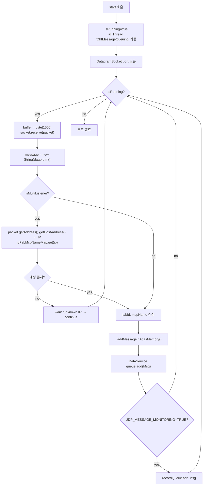

#### 외부 호출
- `DataService.getInstance().getFabPropertiesMap()` (L36–37): daemon/subject 조회
- `DataService.getInstance().queue.add(data)` (L203): 메인 워커 큐
- `DataService.getInstance().recordQueue.add(data)` (L207): 모니터링 기록 큐
- `Env.getFabsetProperties().getProperty("CMN.CMN.UDP_MESSAGE_MONITORING")` (L206)

#### 비고
- L101–103, L137–149 의 `TibrvAPI.send(...)` 는 주석 처리되어 있음 — 송신은 워커(`OhtMsgWorkerRunnable.run` L94–96)로 이전됨
- L116–188 은 과거 단일/멀티 구조의 분리 구현 주석 (현재는 통합)

---

### 1.2 `listener/AgvUdpListener.java`

**파일 한 줄 요약**: AGV UDP 메시지를 수신해 `Msg(AGV)` 로 큐잉하는, OhtUdpListener 와 구조가 동일한 리스너 (MSG_TYP만 다름).

#### 차이점만 정리
- 클래스명/스레드명: `AgvUdpListener` / `"AgvMessageQueuing"` (L69)
- 로그 상수: `AGV_LISTENER_STOP_LOG` (L18), `PORT_OPEN_LOG = "> AGV opened port : {}"` (L19)
- `_addMessageInAtlasMemory()` (L118–134) 내 `MSG_TYP.AGV` 사용 (L121)

#### 멤버 필드 (L17–29)
OhtUdpListener 와 동일 구조(`isMultiListener`, `ipFabMcpNameMap`, `fabId`, `mcpName`, `port`, `isRunning`, `receiveThread`, `socket`, `daemon`, `subject`).

#### 메서드 (라인 매핑)
| 라인 | 메서드 |
|------|--------|
| L31–37 | 단일 생성자 |
| L40–44 | 멀티 IP 생성자 |
| L46–62 | `addListenMcpIp()` |
| L64–116 | `start()` |
| L118–134 | `_addMessageInAtlasMemory()` — **`MSG_TYP.AGV`** |
| L137–143 | `stop()` |
| L145–155 | `_closeSocket()` |
| L157–159 | `_logPortOpened()` |
| L161–175 | getters/setters |

수신 흐름은 §1.1 의 Mermaid 와 동일 (단지 MSG_TYP 만 AGV).

---

### 1.3 `listener/AmpListener.java`

**파일 한 줄 요약**: TCP 소켓으로 AMP(소형 컨베이어/AGV 서버)에 연결해 STX(0x02)·ETX(0x03) 프레임을 파싱하여 `Msg(AMP)` 를 큐잉.

#### 멤버 필드 (L22–25)
| 필드 | 타입 | 설명 |
|------|------|------|
| `logger` | Logger | static |
| `host` (L24) | String | 연결 호스트 |
| `port` (L25) | int | 연결 포트 |

#### 메서드

| 라인 | 시그니처 | 동작 |
|------|---------|------|
| L27–31 | `AmpListener(String urlString)` | `"http://host:port"` 형식 URL 을 `:` 분리하여 host/port 추출 |
| L33–59 | `start()` | 익명 스레드에서 `Socket(host,port)` 연결 → `"GET /\n"` 요청 → `InputStream.read()` 루프 → `parseAndPrint(buffer)` |
| L61–101 | `parseAndPrint(byte[] data)` | STX/ETX 프레임 추출 → UTF-8 String → `Msg(MSG_TYP.AMP)` 생성 → 큐 적재. 반환값은 마지막 처리 인덱스 |

#### STX/ETX 프레임 파싱 흐름

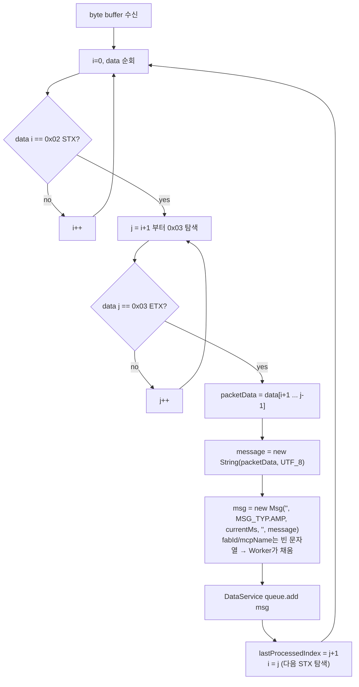

#### 외부 호출
- `DataService.getInstance().queue.add(msg)` (L87)
- Socket I/O (`new Socket(host, port)`, `OutputStream.write("GET /\n")`)

#### 특이사항
- `Msg` 생성시 `fabId`, `mcpName` 모두 **빈 문자열**. 이것은 `AmpMsgWorkerRunnable.run()` 의 L52 `this.eqpId = tokens[2]` → `eqp.getFabId()` 로부터 역추적된다 (L53–61).
- `read(buffer)` 가 EOF(-1)면 루프 종료. 재접속 로직 없음 — 외부 재시도 책임.

---

### 1.4 `listener/CnvSocketIOListener.java`

**파일 한 줄 요약**: Conveyor 서버와 Socket.IO 로 연결, 초기 ZoneInfo 수신 → RawCnvZone 맵 구축 → 이후 실시간 메시지를 `Msg(CNV)` 큐에 적재하는 가장 복잡한 리스너.

#### 멤버 필드 (L38–55)

| 필드 | 라인 | 타입 | 설명 |
|------|------|------|------|
| `logger`, `TAG` | L39–40 | static | 로그 |
| `rawCnvZoneMap` | L41 | `ConcurrentMap<Integer, RawCnvZone>` | zoneId → RawCnvZone |
| `rawHeadZoneIdMap` | L42 | `ConcurrentMap<String, Integer>` | displayName("OUTG…") → zoneId |
| `RV_CONVEYORIO` | L43 | const String | `"_LOCAL.ATLAS.CONVEYOR.IO"` (현재 미사용, 주석) |
| `socket` | L44 | `io.socket.client.Socket` | Socket.IO 클라이언트 |
| `initialized0` | L45 | boolean | 초기 ZoneInfo 수신 완료 |
| `initialized` | L46 | boolean | UpdateZoneState 첫 수신 완료 |
| `fabId`, `cnvId` | L47–48 | String | 식별자 |
| `protocol`, `ip`, `port` | L49–51 | String/int | 접속 URL 컴포넌트 |
| `firstConnect` | L52 | boolean | 최초 연결 여부 |
| `layoutStr` | L53 | String | 초기 zoneJo 의 toString (FabProperties 재사용) |
| `msg_seq` | L55 | static long | 메시지 시퀀스 (현재 미사용) |

#### 메서드

| 라인 | 시그니처 | 동작 |
|------|---------|------|
| L63–81 | `CnvSocketIOListener(fabId, cnvId, urlString)` | URL 파싱하여 protocol/ip/port 세팅 |
| L90–95 | `CnvSocketIOListener(fabId, cnvId, ip, port)` | 직접 ip/port 생성자 |
| L104–259 | `connectAndBuildCnvRawLayout()` | **초기 연결 + ZoneInfo 수신 + RawCnvZone 빌드**. `DataService.loadFab()` 의 conveyor 초기화 단계에서 호출. 핵심 이벤트 핸들러 등록. `initialized==true` 까지 폴링 대기 (L250) |
| L262–315 | `listenStart()` | 초기화 완료 후 실서비스 모드 진입. `INITIAL_REDIS_SUBSCRIBER` emit → `"message"` 이벤트 핸들러에서 `Msg(MSG_TYP.CNV)` 큐 적재 |
| L318–329 | `listenStop()` | 소켓 disconnect/close |
| L331–575 | `buildRawMapData(JSONArray zoneList)` | 각 zone JSON 을 `RawCnvZone` 객체로 변환. LD/QS/Lifter 속성도 빌드 |
| L577–615 | getter/setter | accessors |

#### 초기 연결 + 메시지 수신 흐름

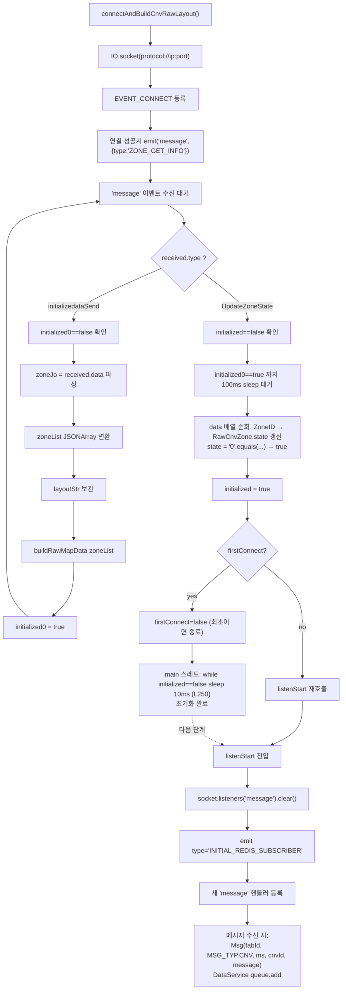

#### buildRawMapData 의 파싱 필드 (L331–575)

각 zone JSON 객체에서 다음 키들을 옵셔널 추출:

| JSON 키 | 변수 | 라인 |
|---------|------|------|
| `Level` | `level` | L349–351 |
| `posX`, `posY` | int | L353–359 |
| `NextZone`, `PrevZone` | int (107109→10709 정정, L368–370) | L361–371 |
| `ZoneDrawCount` | int | L373–375 |
| `ZoneID` | int | L377–379 |
| `PhysicalType` | int | L381–383 |
| `RefDirection` | int | L385–387 |
| `DisplayName` | String. `"OUTG"` 포함 시 `rawHeadZoneIdMap` 추가 | L389–395 |
| `CurrentNode`, `PrevNode`, `LogicalType` | int | L397–407 |
| `AttributeLD.{Included, SensorReversZones}` | `RawCnvLdAttr` 생성 | L429–449 |
| `AttributeQS.{Included, HomeDirection, IsWayPoint, North, South, East, West}` | `RawCnvQsAttr` 생성 | L451–511 |
| `AttributeLifter.{InIncludeZoneID, OutIncludeZoneID, HomeLevel, HomingDirection, HomingClearLimit, LevelZone[]}` | `RawCnvLftAttr` 생성 | L513–569 |

최종 `rawCnvZoneMap.put(rcz.zoneId, rcz)` (L570).

#### 이벤트 핸들러 매핑

| 이벤트 | 라인 | 동작 |
|--------|------|------|
| `Socket.EVENT_CONNECT` | L125–141 | `ZONE_GET_INFO` emit |
| `"message"` (초기) | L143–221 | initializedataSend / UpdateZoneState 분기 |
| `Socket.EVENT_CONNECT_ERROR` | L223–232 | warn log |
| `Socket.EVENT_DISCONNECT` | L234–246 | `initialized0=false, initialized=false` |
| `"message"` (listenStart 후) | L281–309 | **`Msg(MSG_TYP.CNV)` 큐 적재** (L296–303) |

#### 외부 호출
- `DataService.getInstance().queue.add(data)` (L303)
- `IO.socket()`, `socket.emit("message", JSONObject)` (Socket.IO 라이브러리)
- `TibrvAPI` import는 있으나 본문에서는 사용 안 함(주석 처리됨, L288–293)

---

## §2. process — 워커 스레드 처리

### 2.1 `process/AmpMsgWorkerRunnable.java`

**파일 한 줄 요약**: AMP TCP 프레임에서 추출된 CSV 메시지를 파싱해 `eqpId` 로부터 fabId 를 역추적하고, AGV/CNV 분기에 따라 TIBRV 발송 및 `AmpUnit` 버퍼맵 적재.

#### 멤버 필드 (L23–36)
| 필드 | 라인 | 타입 |
|------|------|------|
| `logger` | L23 | static Logger |
| `msg` | L24 | Msg |
| `message` | L25 | String |
| `tokens` | L26 | String[] |
| `eqpId` | L27 | String |
| `eqp` | L28 | Eqp |
| `fabId`, `facId` | L29–30 | String |
| `msgTyp` | L31 | MSG_TYP |
| `daemon`, `subject` | L34–35 | String |
| `fabProperties` | L36 | FabProperties |

#### 메서드

| 라인 | 시그니처 | 동작 |
|------|---------|------|
| L38–40 | `AmpMsgWorkerRunnable(Msg msg)` | 멤버 보관 |
| L43–104 | `run()` | 메인 처리 |
| L106–117 | `processAgvMsg(tokens)` | `tokens[0]=="2"` 시 AmpUnit 생성 → `ampAgvBufferMap` 추가 |
| L119–130 | `processCnvMsg(tokens)` | `tokens[0]=="2"` 시 AmpUnit 생성 → `ampCnvBufferMap` 추가 |
| L132–163 | `setAmpUnit(tokens)` | 토큰 17개 매핑하여 `AmpUnit` 빌드 |

#### AMP CSV 토큰 매핑 (L143–158)

| 인덱스 | 의미 | setter |
|--------|------|--------|
| 0 | kind ("2" 등) | `setKind` |
| 1 | 분류 ("AGV"/"CNV") | run() 분기 (L66, L85) |
| 2 | **eqpId** (설비 ID) | `eqpId` 필드 (L52) |
| 3 | unitId | `setUnitId` |
| 4 | hostId | `setHostId` |
| 5 | status | `setStatus` |
| 6 | carrierDetect | `setCarrierDetect` |
| 7 | carrierDetect2 | `setCarrierDetect2` |
| 8 | errorCode | `setErrorCode` |
| 9 | errorName | `setErrorName` |
| 10 | address | `setAddress` |
| 11 | nextAddress | `setNextAddress` |
| 12 | destAddress | `setDestAddress` |
| 13 | carrierId | `setCarrierId` |
| 14 | carrierId2 | `setCarrierId2` |
| 15 | cycle | `setCycle` |
| 16 | bufferZoneReady | `setBufferZoneReady` |
| 17 | zoneId | `setZoneId` |
| 18 | (mode, 주석) | L159 |
| 19 | (direction, 주석) | L160 |

#### FunctionType 분기 (L64–103)

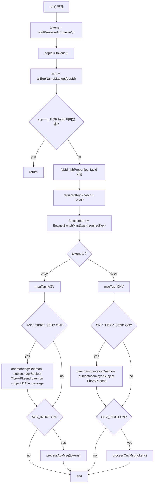

#### 외부 호출
- `DataService.getDataSet().getAllEqpNameMap().get(eqpId)` (L53)
- `DataService.getInstance().getFabPropertiesMap().get(fabId)` (L60)
- `Env.getSwitchMap().get(requiredKey)` (L65)
- `TibrvAPI.send("", "", daemon, subject, "DATA", message)` (L75, L94)
- `DataService.getDataSet().getAmpAgvBufferMap().add(...)` (L111)
- `DataService.getDataSet().getAmpCnvBufferMap().add(...)` (L124)
- LogpressoAPI 호출은 주석으로만 존재 (L165–185)

---

### 2.2 `process/CnvMsgWorkerRunnable.java`

**파일 한 줄 요약**: Conveyor Socket.IO JSON 을 파싱하여 `tcsEventSet`(6종 이벤트)·`tcmTransferInfo`·`UpdateZoneState` 분기로 CnvTask/Carrier/Command/RouteItem 을 갱신하고 Logpresso 버퍼에 적재.

#### 멤버 필드 (L51–61)

| 필드 | 라인 | 타입 |
|------|------|------|
| `logger` | L51 | static |
| `msgSeq` | L52 | long (-1 초기) |
| `msg` | L53 | String (raw JSON) |
| `fabId` | L54 | String |
| `cnvId` | L55 | String |
| `cnv` | L56 | Conveyor |
| `jo` | L57 | JsonObject (파싱 결과) |
| `receivedMilli` | L58 | long |
| `eqpId` | L59 | String |
| `daemon`, `subject` | L60–61 | String |

#### 생성자 (L69–89)
- 인자: `(fabId, eqpId, msg, receivedMilli)`
- `allEqpNameMap.get(eqpId)` 로 Eqp 조회 → `Conveyor` 캐스팅
- `cnvId = cnv.getId()`, `msgSeq = cnv.getMsgSeqAndIncrement()`
- daemon = `conveyorDaemon`, subject = `conveyorSubject + "." + eqpId` (L82–83)
- `jo = JsonParser.parseString(msg).getAsJsonObject()` (L85)

#### `run()` (L91–114) — FunctionType 분기

| FunctionType | 동작 | 라인 |
|--------------|------|------|
| `TIBRV_SEND` | `TibrvAPI.send("", "", daemon, subject, "DATA", msg)` | L100–103 |
| `CNV_INOUT` | `processMsg()` 호출 | L106–109 |

requiredKey 는 `fabId + ":" + eqpId` (L97).

#### `processMsg()` (L116–497) — JSON type 분기

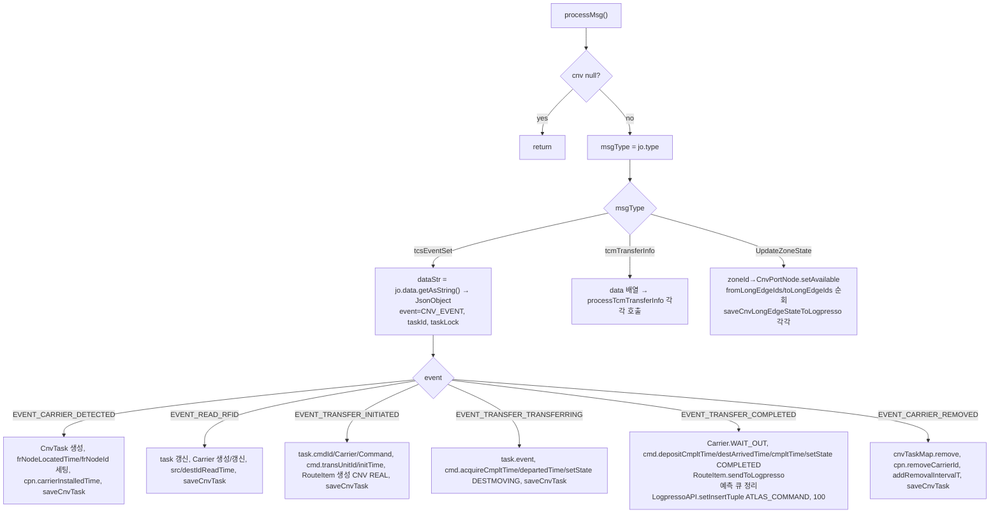

#### `tcsEventSet` 이벤트별 핵심 동작 (라인 매핑)

| CNV_EVENT | 라인 | 핵심 동작 |
|-----------|------|---------|
| EVENT_CARRIER_DETECTED | L146–163 | 새 CnvTask 생성, `Location` 으로 CnvPortNode 조회, frNodeLocatedTime/frNodeId 설정 |
| EVENT_READ_RFID | L164–202 | task 갱신, Carrier(`CARRIER:<carrierId>`) 생성, fr노드 매칭 시 `srcIdReadTime` 아니면 `destIdReadTime` |
| EVENT_TRANSFER_INITIATED | L203–261 | jobId/cmdId 추적, `cmd.transUnitId`, `cmd.initTime`, `RouteItem(ROUTE_ITEM_TYPE.REAL, ROUTE_ITEM_DET_TYPE.CNV)` 생성 |
| EVENT_TRANSFER_TRANSFERRING | L262–278 | cmd state → `DESTMOVING` |
| EVENT_TRANSFER_COMPLETED | L279–385 | Carrier.WAIT_OUT, cmd → `COMPLETED`, 마지막 RouteItem 비용 계산 + `sendToLogpresso`, JobMap 예측 큐에서 제거, **`LogpressoAPI.setInsertTuple("ATLAS_COMMAND", mapCmdDataSet, 100)`** (L362) |
| EVENT_CARRIER_REMOVED | L386–405 | `cnvTaskMap.remove`, cpn.addRemovalIntervalT, carrierRemovedTime |

#### `processTcmTransferInfo` (L499–641)
경로 이동 처리:
- `ZoneIDCurrent` / `ZoneIDTo` / `ZoneIDJunctions` 추출
- 마지막 노드(`lastCpn`) vs 현재 노드(`cpn`) 가 다르면 `DijkstraCnvFromToPath(lastCpn, cpn, carrierId)` 로 CnvEdge 리스트 산출 (L579)
- 각 CnvEdge 에 비용 가산 (`addCost(cost)`), headCpn/tailCpn carrierInstalledTime 갱신
- LongEdge 가 바뀌면 새 `RouteItem` 생성, 이전 RouteItem 은 `sendToLogpresso()` (L600)
- 최종 `saveCnvLongEdgeStateToLogpresso(leId)` (L617)

#### `saveCnvTaskToLogpresso` (L643–686)
- `task` 를 `cnvTaskBufferMap` 에 추가(L649). 실제 Logpresso insert 는 별도 Batch 가 수행.
- 주석된 코드를 보면 과거엔 직접 `LogpressoAPI.setInsertTuple("ATLAS_HIS_CNV_TASK", ...)` (L647) + TIB 발송했음.

#### `saveCnvLongEdgeStateToLogpresso` (L688–724)
- LongEdge 의 cost/속도 계산 → `cnvLongEdgeBufferMap` 추가(L704). Batch insert.

#### 외부 호출 정리

| 라인 | 호출 |
|------|------|
| L70 | `DataService.getDataSet().getAllEqpNameMap()` |
| L82–83 | `DataService.getInstance().getFabPropertiesMap().get(fabId).getConveyorDaemon/Subject()` |
| L98 | `Env.getSwitchMap().get(requiredKey)` |
| L102 | `TibrvAPI.send("", "", daemon, subject, "DATA", msg)` |
| L148 etc | `DataService.getDataSet().getCnvTaskMap().put/get/remove` |
| L186 etc | `DataService.getDataSet().getCarrierMap()` |
| L221 etc | `DataService.getDataSet().getJobMap()` |
| L228 etc | `DataService.getDataSet().getCommandMap()` |
| L249–251 | `DataService.getDataSet().getRouteItemMap()` |
| L362 | `LogpressoAPI.setInsertTuple("ATLAS_COMMAND", mapCmdDataSet, 100)` |
| L351 | `DataService.getDataSet().getLongEdgeMap()` |
| L455 | `DataService.getInstance().getFabPropertiesMap().get(fabId)` |
| L579 | `new DijkstraCnvFromToPath(lastCpn, cpn, carrierId)` |
| L649 | `DataService.getDataSet().getCnvTaskBufferMap().add(...)` |
| L704 | `DataService.getDataSet().getCnvLongEdgeBufferMap().add(...)` |

---

### 2.3 `process/UiMsgWorkerRunnable.java`

**파일 한 줄 요약**: AMOS 측에서 발생하는 UI XML 메시지(`UI-UNIT-PORT/SHELF`, `UI-MACHINE`, `UI-MACHINE-STORAGE-CAPACITY`, `COMMON-AWAKE` 등)를 SAX 로 파싱해 Eqp/Stocker/StbGroup/Port 가용성 갱신 및 TIB 송신 큐에 적재.

#### 멤버 필드 (L42–46)
| 필드 | 라인 | 타입 |
|------|------|------|
| `logger` | L42 | static |
| `msg` | L44 | String (XML) |
| `fabId` | L45 | String |

#### 메서드

| 라인 | 시그니처 | 동작 |
|------|---------|------|
| L47–50 | 생성자 `(fabId, msg)` | 멤버 보관 |
| L52–55 | `toString()` | 디버그 출력 |
| L58–60 | `run()` | `processMsg()` 위임 |
| L63–291 | `processMsg()` | XML SAX 파싱 + switch(MESSAGENAME) |
| L293–312 | `static sendUdp(map)` | 현재 전부 주석 (UDP Logpresso 송신 비활성) |
| L314–432 | `static sendPortReservedInfo(an, isAvailable)` | 포트 가용성/예약 잡 계산 및 UI 발송 |
| L434–447 | `static _addTibSenderWaiting(actionType, dataMap, site, fabId, mcpName)` | TIB 송신 큐에 메시지 적재 |

#### MESSAGENAME 분기 (L75–287)

| MESSAGENAME | 라인 | 동작 |
|-------------|------|------|
| `UI-UNIT-PORT`, `UI-UNIT-SHELF` | L76–103 | `<DATA>` → UNITNAME/STATE/OCCUPIED/BANNED 추출. `unitName` 가 `.AFC.*_OP` 패턴이면 `_OP` 제거(L87–89). `getNodePortMap().get(unitName)` → AbstractNode 조회. OCCUPIED='F' & EqpPortNode 이면 모든 carrierId 제거. `isAvailable = (STATE=="INSERVICE" && BANNED=="F")`. → `sendPortReservedInfo(an, isAvailable)` |
| `UI-MACHINE` | L104–133 | MACHINENAME/STATE/CONNECTIONSTATE/CONTROLSTATE 추출. `eqp.setAvailable(INSERVICE && ONLINEREMOTE && CONNECTED)`. `_addTibSenderWaiting("UpdateEqp", ...)` |
| `UI-MACHINE-STORAGE-CAPACITY` | L134–245 | StbGroup/Stocker/Eqp 분기. MAXCAPACITY/CURRENTCAPACITY/FULLUP 갱신. UpdateStbGroup/UpdateStocker/UpdateEqp TIB 송신 |
| `COMMON-CARRIERTRANSPORT-AWAKE`, `COMMON-AWAKE` | L246–286 | CARRIERNAME → Carrier 조회 → Job.setWakeupTime. RoutePredictor 호출은 주석 처리됨 |

#### `sendPortReservedInfo()` (L314–432) 의 로직 흐름

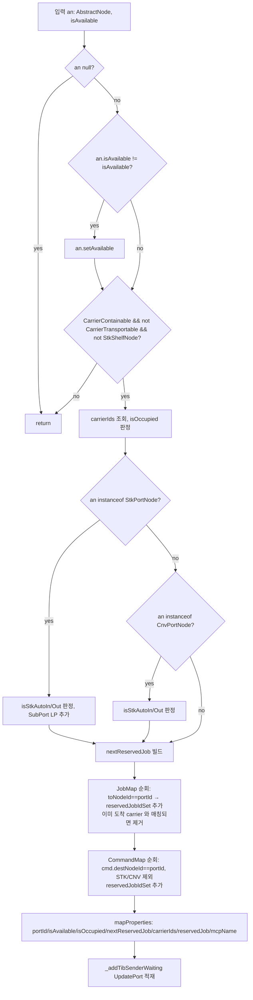

#### `_addTibSenderWaiting` (L434–447)
- type = `MSG_TYP.UI + "." + actionType` (예: `UI.UpdatePort`)
- `DataService.getInstance().getTibrvSenderLikeMap(fabId + ":send:amos")` 키 순회
- 각 키에 대해 `addTibrvMessageQueue(tibrvKey, type, SEND_MSG_FORMAT.JSON, dataMap)`

#### 외부 호출
- `DataService.getDataSet().getNodePortMap()` (L90)
- `DataService.getDataSet().getAllEqpNameMap()` (L111, L146)
- `DataService.getDataSet().getCarrierMap()` (L251, L359)
- `DataService.getDataSet().getJobMap()` (L255, L374)
- `DataService.getDataSet().getCommandMap()` (L389)
- `DataService.getDataSet().getCarrierContainableByCarrierLoc(...)` (L267)
- `Env.getSite()` (L126, L180, L218, L238, L417)
- `DataService.getInstance().getTibrvSenderLikeMap(...)` / `addTibrvMessageQueue(...)` (L439–445)

---

### 2.4 `process/OhtMsgWorkerRunnable.java` — **시스템 핵심**

**파일 한 줄 요약**: OHT(MCP7/5) UDP CSV 메시지를 차량 상태 보고("2")로 인식해 Vhl 객체 갱신, RailEdge 속도 계산, HID/VHL OFF 알람 감시, Stage Command 모니터링, HID 구간별 차량 수 집계, Logpresso/TIB 송신을 수행하는 OHT 처리 엔진.

#### 멤버 필드 (L48–60)

| 필드 | 라인 | 타입 | 설명 |
|------|------|------|------|
| `logger` | L49 | static Logger | |
| `MSG_ID_IDX` | L50 | static final int = 0 | tokens[0] 위치 |
| `message` | L51 | final String | raw 메시지 |
| `receivedMilli` | L52 | final long | 수신 시각 |
| `messageSequence` | L53 | final long | 메시지 순번 |
| `fabId`, `facId`, `mcpName` | L54–56 | final String | |
| `daemon`, `subject` | L57–58 | String | TIB 송신용 |
| `tibrvMap` | L60 | static ConcurrentHashMap<String, OHT_UDP_TIB> | 차량별 마지막 TIB payload 캐시 |

#### 내부 클래스/상수

##### `MSG_ID` (L950–960)
§0.3 의 표와 동일.

##### `VHL_STATE_REPORT` (L962–986) — **OHT 메시지 토큰 인덱스 전체 매핑**

| 인덱스 | 상수명 | 의미 (한글 주석) | run-time 사용 |
|--------|--------|------------------|----------------|
| 0 | `TXT_ID_IDX` | 텍스트 id (=MSG_ID) | `messageId` 분기 (L88) |
| 1 | `MCP_NM_IDX` | mcp 명칭 | (참조용) |
| **2** | `VHL_ID_IDX` | **vehicle 명** (예: V00001) | `vhlName` (L135), vehicleKey 빌드 |
| **3** | `STATE_IDX` | **차량 상태** | `VHL_STATE.getValue` (L161, L249). REMOVING 시 초기화 분기 |
| 4 | `FULL_IDX` | 재하 정보 | 주석(L245) |
| **5** | `ERROR_CODE_IDX` | **error code** | `errorCode` (L243). HID_OFF/VHL_OFF 알람 키 |
| 6 | `ONLINE_IDX` | 통신 상태 | 주석(L246) |
| **7** | `ADDRESS_IDX` | **현재 번지** | `address` → `railNodeId` (L218–221) |
| **8** | `DISTANCE_IDX` | **현재 번지로부터의 거리** | `distance` (L239–242) — ×100L |
| **9** | `NEXT_ADDRESS_IDX` | **다음 번지** | `nextAddress` → `nextRailNodeId` (L222–225) |
| **10** | `RUN_CYCLE_IDX` | **실행 cycle** | `RUN_CYCLE.getValue` (L247) |
| **11** | `VHL_CYCLE_IDX` | **vehicle 실행 cycle 진척** | `VHL_CYCLE.getValue` (L248) |
| 12 | `CARRIER_ID_IDX` | carrier id | 주석(L233–235) |
| 13 | `DESTINATION_IDX` | destination | 주석(L236–238) |
| **14** | `EM_STATUS_IDX` | **e/m 상태** | REMOVING 시 `setEmStatus(binaryStringToByte)` (L192) |
| **15** | `GROUP_ID_IDX` | **group id** | REMOVING 시 `setGroupId` (L193) |
| 16 | `SOURCE_PORT_IDX` | 반송원 port | 주석(L250–252) |
| **17** | `DEST_PORT_IDX` | **반송처 port** | `destinationPortId` (L226), Stage Command Monitoring 용 |
| 18 | `PRIORITY_IDX` | 반송 우선도 | 주석(L258–260) |
| **19** | `DET_STATUS_IDX` | **작업 상태 상세** | `VHL_DET_STATE.getValue` (L217). 103(STAGE_MOVING) 감지 |
| **20** | `RUN_DISTANCE_IDX` | **대차 주행거리** | `runDistance` (L261) |
| 21 | `CMD_ID_IDX` | command id | (현재 미사용) |
| 22 | `BAY_NM_IDX` | bay 명칭 | (현재 미사용) |

##### `OHT_TIB_STATE` (L989–1001)
- `NORMAL`, `ABNORMAL` 두 값.

##### `OHT_UDP_TIB` 내부 클래스 (L1003–1014)
- `daemon`, `subject`, `message` 필드. `tibrvMap` value.

#### 생성자 (L62–80)
- 인자: `(fabId, message, mcpName, receivedMilli, messageSequence)`
- `FabProperties` → `facId` 추출(L73)
- `daemon`/`subject` 는 `getMcpPropertiesMap().get(mcpName)` 에서 추출 (L78–79)

#### `run()` (L82–103) — 진입

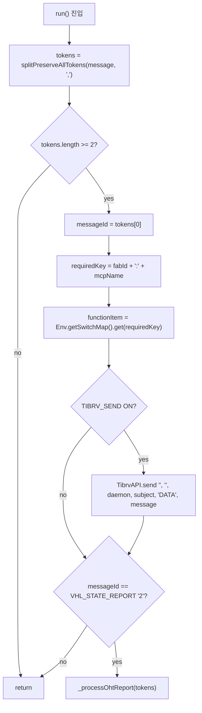

#### `_updateTibrvMap(vhlName, daemon, subject, message)` (L110–115)
- `key = fabId + "." + mcpName + "." + vhlName`
- `tibrvMap.put(key, new OHT_UDP_TIB(...))`. 현재 호출처가 없어 보임(미사용).

#### `_processOhtReport(tokens)` (L117–172)

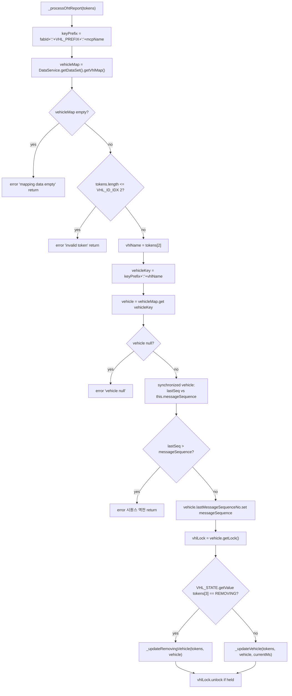

**시퀀스 역전 가드(L146–153)**: 워커가 OUT-OF-ORDER 로 실행될 가능성을 차단. `lastMessageSequenceNo` 보다 작은 메시지는 폐기.

#### `_updateRemovingVehicle(tokens, vehicle)` (L177–207)

차량이 라인에서 빠질 때 Vhl 객체 초기화:

| 필드 | 값 |
|------|----|
| `copyCurrentVhlUdpStateToLast()` | 마지막 상태 보존 (L178) |
| `railNodeId, udpCarrierId, destStationId, destPortId, nextRailNodeId, railEdgeId, sourcePortId, commandId` | "" 빈 문자열 |
| `distance, priority, runDistance` | 0 |
| `full, online` | false |
| `runCycle, vhlCycle` | `NONE` |
| `state` | `VHL_STATE.REMOVING` |
| `receivedTime` | `receivedMilli` |
| `emStatus` | `Util.binaryStringToByte(tokens[14])` |
| `groupId` | `tokens[15]` |
| `detailState` | `VHL_DET_STATE.NONE` |

마지막 RailEdge 에서 차량 ID 제거 + `addHistory()` (L202–206).

#### `_updateVehicle(tokens, vehicle, systemsDateTime)` (L215–385) — **핵심 단계**

##### 1단계: 토큰 파싱 (L217–261)

| 변수 | 토큰 인덱스 | 변환 |
|------|--------------|------|
| `detailStatus` | 19 | `VHL_DET_STATE.getValue` (L217) |
| `address` | 7 | `Util.getIntOrZero` (L218) |
| `railNodeId` | (계산) | `DataSet.address2RailNodeId(fabId, mcpName, address)` (L219–221) |
| `nextAddress` | 9 | int (L222) |
| `nextRailNodeId` | (계산) | `DataSet.address2RailNodeId` (L223–225) |
| `destinationPortId` | 17 | `Util.getTokenSafely` (L226) |
| `railEdgeId` | (계산) | `DataSet.address2RailEdgeId(fabId, mcpName, railNodeId, nextRailNodeId)` (L227–232) |
| `distance` | 8 | double × 100L (L239–242) |
| `errorCode` | 5 | `Util.getTokenSafely` (L243) |
| `runCycle` | 10 | `RUN_CYCLE.getValue` (L247) |
| `vhlCycle` | 11 | `VHL_CYCLE.getValue` (L248) |
| `vhlState` | 3 | `VHL_STATE.getValue` (L249) |
| `runDistance` | 20 | `Long.parseLong` (L261) |

##### 2단계: Vhl 객체 setter (L264–286)
- `copyCurrentVhlUdpStateToLast()` (L264)
- 모든 필드 갱신: address/nextAddress/railNodeId/distance/errorCode/nextRailNodeId/runCycle/vhlCycle/state/receivedTime/destPortId/detailState/runDistance/railEdgeId
- carrierId/destStationId/full/online/emStatus/groupId/sourcePortId/priority 는 주석 처리(L268–284)

##### 3단계: RailEdge 조회 + 속도 계산 (L289–299)
```java
edgeMap.get(railEdgeId) instanceof RailEdge → _buildRailVelocity(vehicle, railEdge)
```
else 면 error log 후 return.

##### 4단계: FunctionType 별 분기 (L301–367)

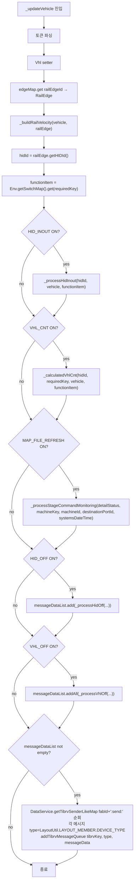

#### `_processStageCommandMonitoring` (L392–428) 상세

작업 상태 상세(`detailState`) 가 `STAGE_MOVING` (코드 103) 인지 추적하여 ABNORMAL/NORMAL 표시.

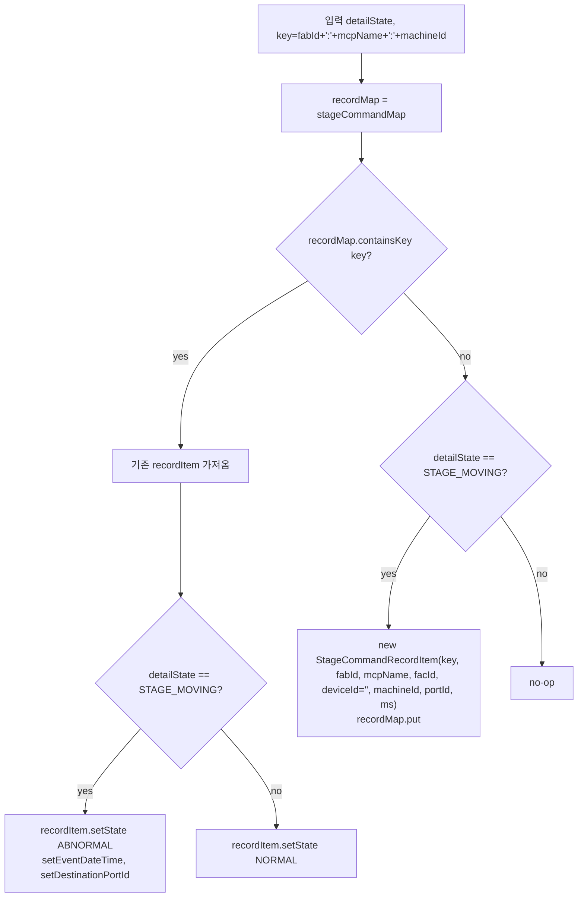

#### `_calculatedVhlCnt` (L440–463) 상세

HID 구간별 차량 수 카운팅.

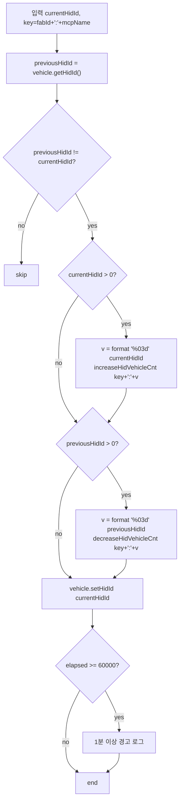

#### `_processHidInout` (L473–522) 상세

HID 전환 이벤트 집계 (테이블 3 적재).

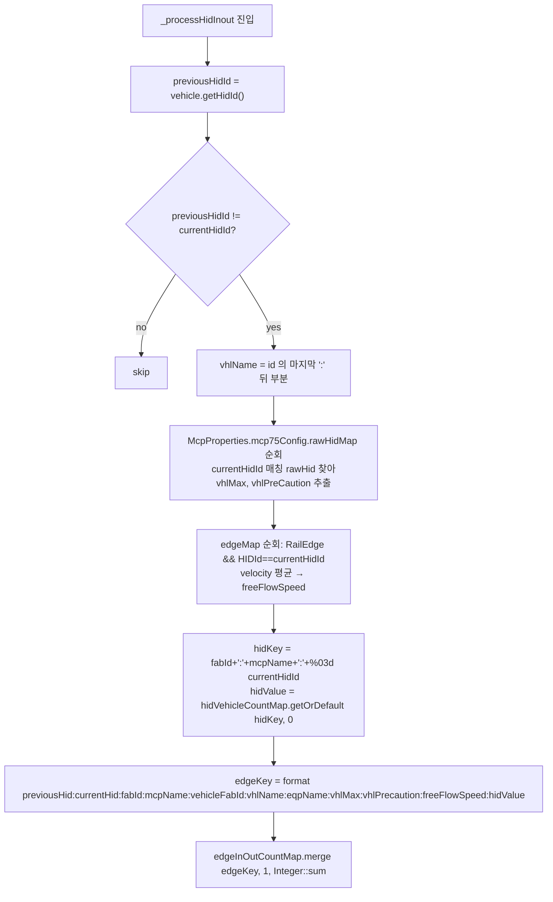

**주의**: `_processHidInout` 와 `_calculatedVhlCnt` 모두 `vehicle.getHidId()` 를 읽는다. 호출 순서는 `_processHidInout` 이 먼저(L310–312) → `_calculatedVhlCnt` 가 나중(L316–323). 즉 `_processHidInout` 가 집계용 캡처를 먼저 하고, 그 다음 `_calculatedVhlCnt` 가 카운터 업데이트와 `vehicle.setHidId(currentHidId)` 를 수행한다.

#### `_processHidOff` (L533–611) 상세

특정 HID 구간 OFF 알람 처리.

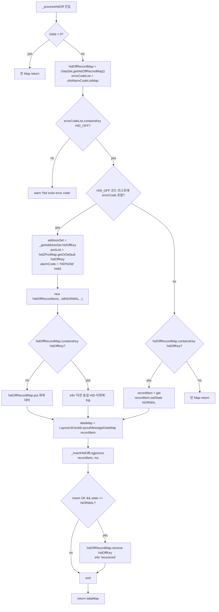

##### `_insertHidOffLogpresso` (L633–653)
Logpresso `ATLAS_OHT_HID_OFF` 테이블에 Tuple insert:

| 키 | 값 |
|----|----|
| FAB_ID | `recordItem.getFabId()` |
| MCP_NM | `recordItem.getMcpName()` |
| ALARM_CD | `errorCode` |
| EVENT_DT | event 시각 문자열 |
| HID_ID | `hidId` |
| ADDR_LST | `getHidAreaAddressString()` |
| PORT_LST | `getAffectedPortString()` |
| ENV | `Env.getEnv()` |
| STATE | NORMAL/ABNORMAL |
| RECOVERY_DT | NORMAL 시만 `yyyy-MM-dd HH:mm:ss` |

→ `LogpressoAPI.setInsertTuples("ATLAS_OHT_HID_OFF", List.of(tuple), 20)` (L652).

#### `_processVhlOff` (L665–760) 상세

차량 자체 OFF 알람 (오류코드 기반).

`vhlOffKey = fabId + ":" + mcpName + ":" + machineId`,
`deviceId = machineId + ":" + currentAddress + ":" + errorCode`.

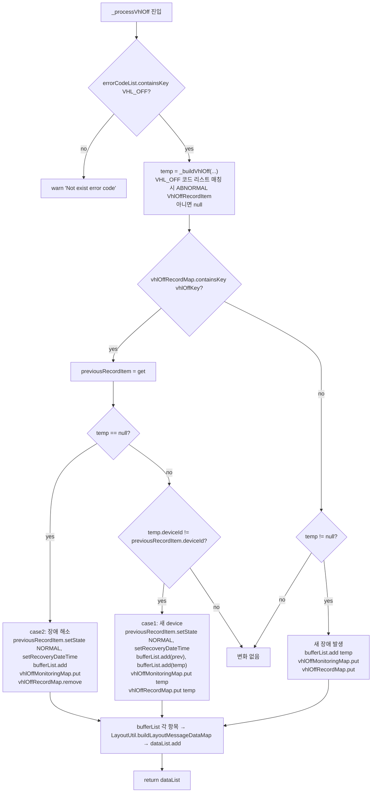

##### `_buildVhlOff` (L775–811)
- errorCode 가 VHL_OFF 코드 리스트에 있으면:
  - `Navigator navigator = new Navigator(railEdge)` (L789)
  - `addressSet = navigator.getAffectedRailSet()` (L790)
  - `portList = navigator.getAffectedPortSortedList()` (L791)
  - 새 `VhlOffRecordItem(..., OHT_TIB_STATE.ABNORMAL, errorCode, systemsDateTime)` 반환
- 아니면 `null` 반환.

#### `_buildRailVelocity(vehicle, railEdge)` (L819–845)
- `lastRailEdge = railEdgeMap.get(vehicle.getLastUdpState().railEdgeId)` (L826)
- 분기 후보(같은 fromNode 다른 toNode) 시 lastRailEdge 에서 차량 제거 + last state 의 railEdgeId 를 현재 railEdgeId 로 갱신 (L832–841)
- `_setRailEdgeVelocity(vehicle, railEdge, lastRailEdge)` 호출 (L844)

#### `_setRailEdgeVelocity` (L847–915)

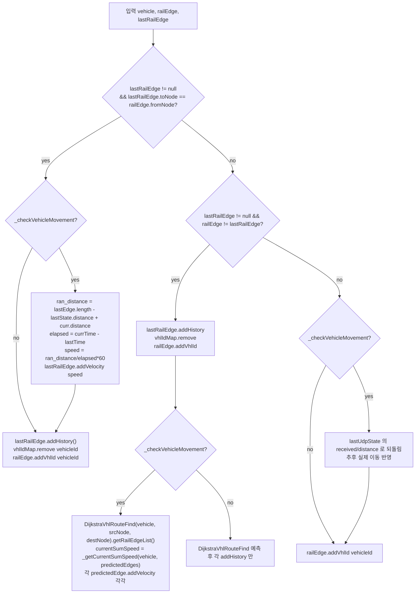

##### `_getCurrentSumSpeed` (L917–930)
- `distanceSum = Σ predictedEdge.getLength() - lastState.distance + curr.distance`
- `return distanceSum / totalElapsedMilli * 60.0`

##### `_checkVehicleMovement(vehicle)` (L932–948)
다음 모든 조건 AND:
1. `(currTime - lastTime) < 60 * 1000` (1분 이내)
2. `state ∈ {RUN, OBS_BZ_STOP, JAM, E84_TIMEOUT}`
3. `runCycle == lastRunCycle` && `vhlCycle == lastVhlCycle`
4. `runCycle ∈ {ACQUIRE, DEPOSIT}`
5. `vhlCycle ∈ {ACQUIRE_MOVING, DEPOSIT_MOVING}`

#### FunctionType 사용 매트릭스 (OhtMsgWorker)

| FunctionType | 사용 위치 | 의미 |
|--------------|-----------|------|
| `TIBRV_SEND` | run() L94 | UDP 원본 메시지를 TIB 로 단순 송신 |
| `HID_INOUT` | _updateVehicle L310 | HID 구간 진출입 카운트 집계 |
| `VHL_CNT` | _updateVehicle L316 | HID 구간별 차량 수 카운터 |
| `MAP_FILE_REFRESH` | _updateVehicle L327 | Stage Command Monitoring 활성 |
| `HID_OFF` | _updateVehicle L339, _processHidOff L550 | HID OFF 알람 처리 + Logpresso `ATLAS_OHT_HID_OFF` |
| `VHL_OFF` | _updateVehicle L354, _buildVhlOff L786 | VHL OFF 알람 처리 |

#### 외부 호출 정리 (OhtMsgWorker)

| 라인 | 호출 |
|------|------|
| L69 | `DataService.getInstance().getFabPropertiesMap().get(fabId)` |
| L78–79 | `getMcpPropertiesMap().get(mcpName).getDaemon/Subject()` |
| L92 | `Env.getSwitchMap().get(requiredKey)` |
| L95 | `TibrvAPI.send("", "", daemon, subject, "DATA", message)` |
| L121 | `DataService.getDataSet().getVhlMap()` |
| L203 | `DataService.getDataSet().getRailEdgeMap()` |
| L219 | `DataSet.address2RailNodeId(fabId, mcpName, address)` |
| L227 | `DataSet.address2RailEdgeId(fabId, mcpName, railNodeId, nextRailNodeId)` |
| L289 | `DataService.getDataSet().getEdgeMap()` |
| L307 | `Env.getSwitchMap()` |
| L371 | `DataService.getInstance().getTibrvSenderLikeMap(fabId + ":send:")` |
| L379 | `DataService.getInstance().addTibrvMessageQueue(tibrvKey, type, messageData)` |
| L399 | `DataService.getDataSet().getStageCommandMap()` |
| L447 | `DataService.getDataSet().increaseHidVehicleCnt(...)` |
| L452 | `DataService.getDataSet().decreaseHidVehicleCnt(...)` |
| L486 | `DataService.getInstance().getFabPropertiesMap().get(...).getMcpPropertiesMap().get(...)` (mcp75Config) |
| L500 | `DataService.getDataSet().getEdgeMap()` (RailEdge 평균 속도) |
| L513 | `DataService.getDataSet().getHidVehicleCountMap()` |
| L520 | `DataService.getDataSet().getEdgeInOutCountMap().merge(...)` |
| L546 | `DataService.getDataSet().getHidOffRecordMap()` |
| L548 | `DataService.getInstance().getOhtAlarmCodeListMap()` |
| L555 | `DataService.getDataSet().getHid2PortMap()` |
| L592 | `LayoutUtil.buildLayoutMessageDataMap(recordItem)` |
| L652 | `LogpressoAPI.setInsertTuples("ATLAS_OHT_HID_OFF", List.of(tuple), 20)` |
| L678 | `DataService.getDataSet().getVhlOffRecordMap()` |
| L679 | `DataService.getDataSet().getVhlOffMonitoringMap()` |
| L789 | `new Navigator(railEdge)` |
| L880 | `new DijkstraVhlRouteFind(vehicle, sourceNode, destinationNode)` |

---

## §3. 메시지 흐름 전체 (수신 → DB 적재/TIB 송신)

### 3.1 통합 시퀀스 (OHT 기준)

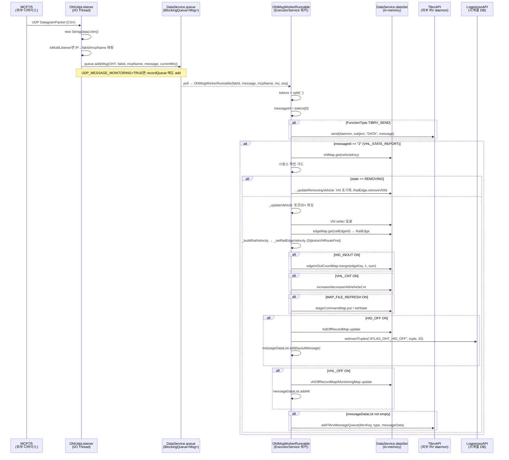

### 3.2 통합 시퀀스 (CNV 기준)

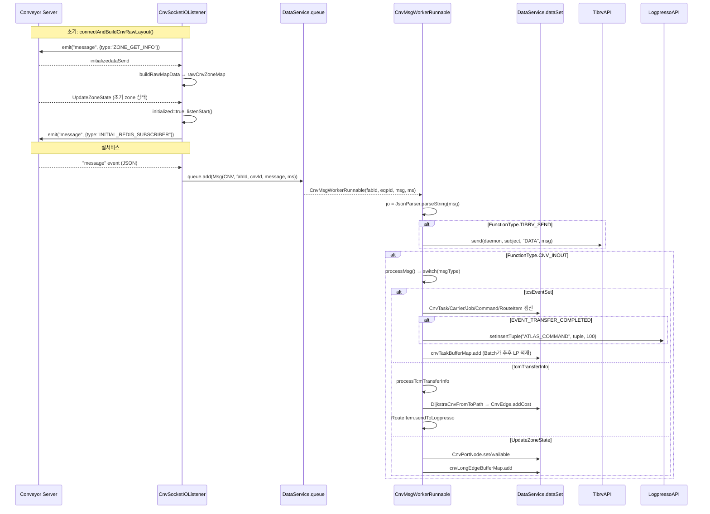

### 3.3 통합 시퀀스 (AMP 기준)

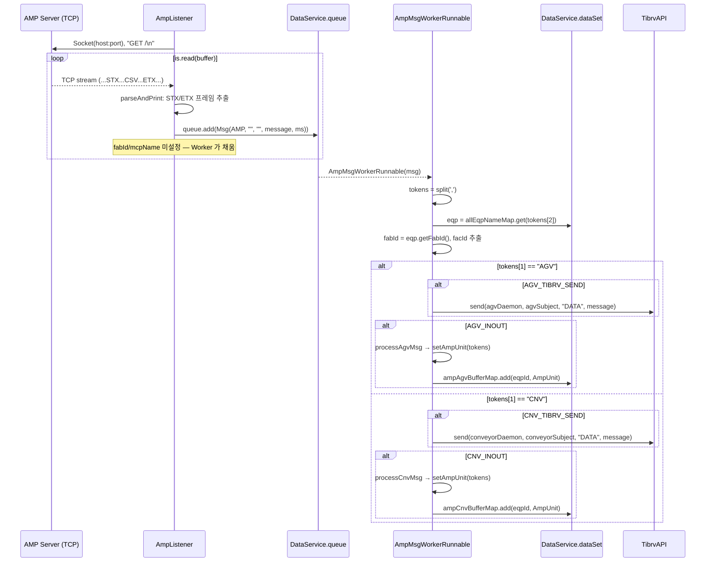

### 3.4 통합 시퀀스 (UI / AGV)

- **AGV**: listener 가 `Msg(AGV)` 로 queue 적재. (AGV 전용 워커는 본 분석 대상이 아니나, AgvUdpListener 가 적재한 메시지는 다른 dispatcher 가 `MSG_TYP.AGV` 로 분배.)
- **UI**: UiMsgWorkerRunnable 은 외부 listener 없이 **내부 다른 모듈**(예: TIB RV subscriber 혹은 별도 dispatcher)이 XML 메시지를 받아 `new UiMsgWorkerRunnable(fabId, msg)` 로 직접 ExecutorService 에 제출. SAX 파싱 후 `MESSAGENAME` 분기 → DataSet 업데이트 → `_addTibSenderWaiting` 으로 TIB 송신 큐 적재.

### 3.5 데이터 적재 경로 요약

| 데이터 | 즉시 LP 적재 | 버퍼 → Batch LP 적재 | TIB 송신 |
|--------|---------------|----------------------|----------|
| OHT VhlState | — | (Vhl 자체는 휘발성 — RailEdge.addHistory 가 통계 누적) | requiredKey TIBRV_SEND 시 원본 |
| OHT HID_OFF | `ATLAS_OHT_HID_OFF` (L652) | — | `messageDataList` (LayoutUtil) |
| OHT VHL_OFF | — | (LogpressoAPI 직접 호출 안 보임 — vhlOffMonitoringMap 활용) | `messageDataList` |
| CNV tcsEvent (COMPLETED) | `ATLAS_COMMAND` (L362) | `cnvTaskBufferMap`, `cnvLongEdgeBufferMap` | (현재 코드는 주석) |
| CNV tcmTransferInfo | — | `RouteItem.sendToLogpresso` (L600) | — |
| AMP AGV/CNV | — | `ampAgvBufferMap`, `ampCnvBufferMap` | requiredKey AGV/CNV_TIBRV_SEND 시 원본 |
| UI | — | — | `UI.UpdateEqp/UpdatePort/UpdateStocker/UpdateStbGroup` |

### 3.6 큐 / 맵 단위 정리

| 자료구조 | 위치 | 생성자 | 소비자 |
|----------|------|--------|--------|
| `DataService.queue` | DataService | 모든 listener | 메인 dispatcher → 워커 생성 |
| `DataService.recordQueue` | DataService | OhtUdpListener, AgvUdpListener (옵션) | monitoringControlBatch |
| `DataSet.vhlMap` | DataSet | (초기 로드) | OhtMsgWorker._processOhtReport |
| `DataSet.cnvTaskMap` | DataSet | CnvMsgWorker (CARRIER_DETECTED) | CnvMsgWorker, batch |
| `DataSet.cnvTaskBufferMap` | DataSet | CnvMsgWorker.saveCnvTaskToLogpresso | Batch (LP insert) |
| `DataSet.cnvLongEdgeBufferMap` | DataSet | CnvMsgWorker.saveCnvLongEdgeStateToLogpresso | Batch |
| `DataSet.ampAgvBufferMap`, `ampCnvBufferMap` | DataSet | AmpMsgWorker.processAgvMsg/processCnvMsg | Batch |
| `DataSet.hidOffRecordMap` | DataSet | OhtMsgWorker._processHidOff | OhtMsgWorker (회복 감지), batch |
| `DataSet.vhlOffRecordMap`, `vhlOffMonitoringMap` | DataSet | OhtMsgWorker._processVhlOff | OhtMsgWorker, batch |
| `DataSet.stageCommandMap` | DataSet | OhtMsgWorker._processStageCommandMonitoring | OhtMsgWorker, monitoring batch |
| `DataSet.hidVehicleCountMap` | DataSet | _calculatedVhlCnt (increase/decrease) | _processHidInout (read) |
| `DataSet.edgeInOutCountMap` | DataSet | _processHidInout (merge +1) | batch |
| `OhtMsgWorkerRunnable.tibrvMap` (static) | OhtWorker | `_updateTibrvMap` (현재 미사용) | (미사용) |

---

## 부록: FunctionType 사용처 종합 매트릭스

| FunctionType | 사용 워커 | 사용 라인 | 효과 |
|--------------|-----------|-----------|------|
| `TIBRV_SEND` | OhtMsgWorker / CnvMsgWorker | L94 / L100 | 원본 메시지 TIB 송신 |
| `AGV_TIBRV_SEND` | AmpMsgWorker | L71 | AGV 원본 TIB 송신 |
| `CNV_TIBRV_SEND` | AmpMsgWorker | L90 | CNV 원본 TIB 송신 |
| `AGV_INOUT` | AmpMsgWorker | L79 | AmpUnit AGV 버퍼 적재 |
| `CNV_INOUT` | AmpMsgWorker / CnvMsgWorker | L98 / L106 | 컨베이어 메시지 처리 활성 |
| `HID_INOUT` | OhtMsgWorker._updateVehicle | L310 | HID 진출입 카운트 |
| `VHL_CNT` | OhtMsgWorker._updateVehicle | L316 | HID 구간별 차량 수 |
| `MAP_FILE_REFRESH` | OhtMsgWorker._updateVehicle | L327 | Stage Command Monitoring 활성 |
| `HID_OFF` | OhtMsgWorker | L339, L550, L551 | HID OFF 알람 + Logpresso |
| `VHL_OFF` | OhtMsgWorker | L354, L685, L786 | VHL OFF 알람 |

분기 키 `requiredKey` 패턴:
- OHT: `fabId + ":" + mcpName` (L91, L303)
- CNV(Worker): `fabId + ":" + eqpId` (L97)
- AMP: `fabId + ":AMP"` (L64)
- 조회: `Env.getSwitchMap().get(requiredKey)` → `FunctionItem`, 그 위에 `getUseFunction(FunctionType)` 로 boolean.

---

## 부록: 클래스 의존성 요약

| 워커 | 핵심 의존 |
|------|----------|
| OhtMsgWorker | DataService, Env, TibrvAPI, LogpressoAPI, Vhl, RailEdge, RailNode, Navigator, DijkstraVhlRouteFind, LayoutUtil, Util, HidOffRecordItem, VhlOffRecordItem, StageCommandRecordItem, RawHid, McpProperties |
| CnvMsgWorker | DataService, Env, TibrvAPI, LogpressoAPI, Conveyor, Carrier, Command, CnvTask, Job, RouteItem, CnvPortNode, CnvEdge, LongEdge, DijkstraCnvFromToPath, FabProperties |
| AmpMsgWorker | DataService, Env, TibrvAPI, AmpUnit, Eqp, FabProperties, FunctionItem |
| UiMsgWorker | DataService, Env, SAXReader/Document/Node (dom4j), Carrier, Command, Job, Eqp, Stocker, StbGroup, CnvPortNode, EqpPortNode, StkPortNode, StkShelfNode, AbstractNode, TibrvSendMsg.SEND_MSG_FORMAT |
| OhtUdpListener / AgvUdpListener | DataService, Env, Msg, MSG_TYP, DatagramSocket |
| AmpListener | DataService, Msg, MSG_TYP, Socket |
| CnvSocketIOListener | DataService, TibrvAPI(import만), io.socket.client.Socket/IO, RawCnvZone, Msg, MSG_TYP |
