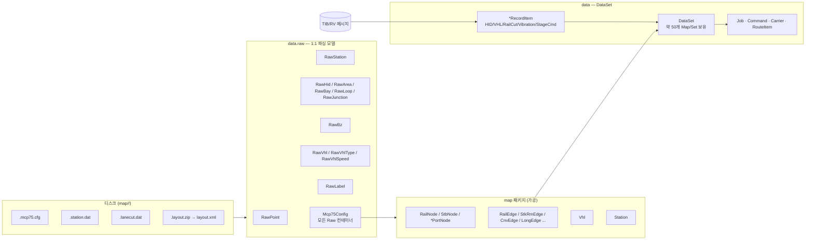
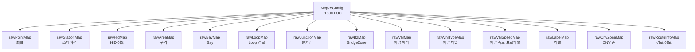
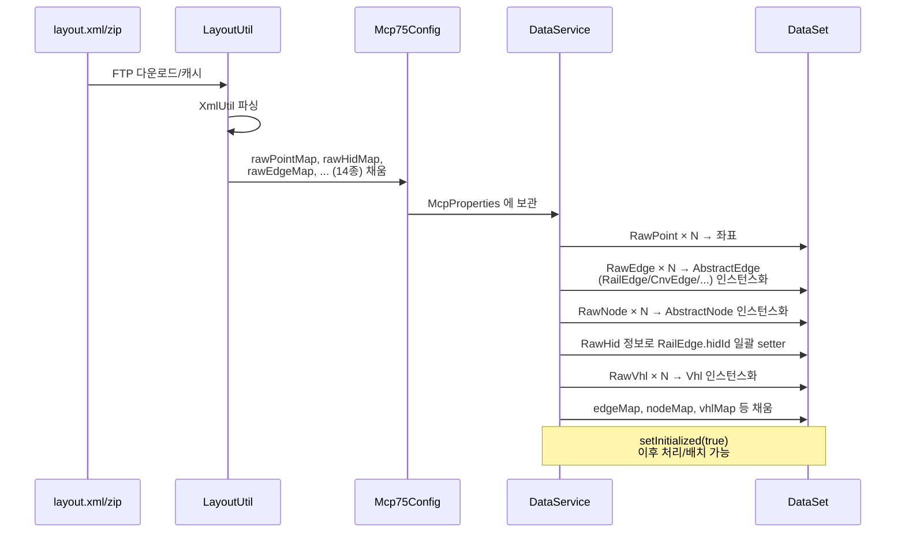
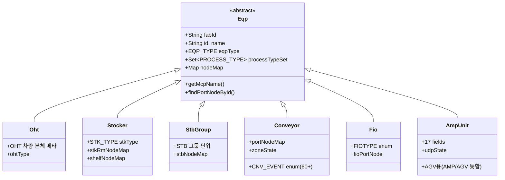
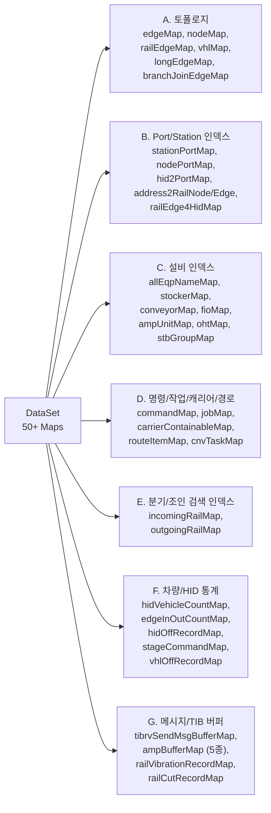
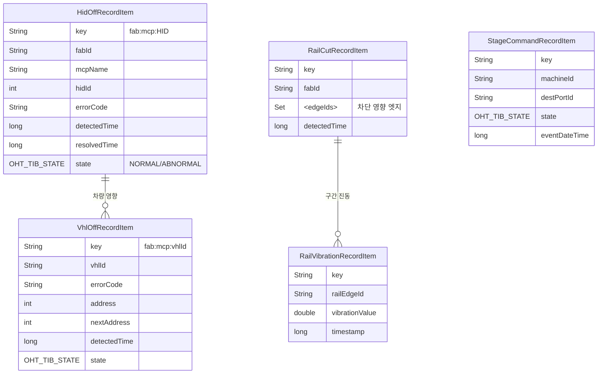
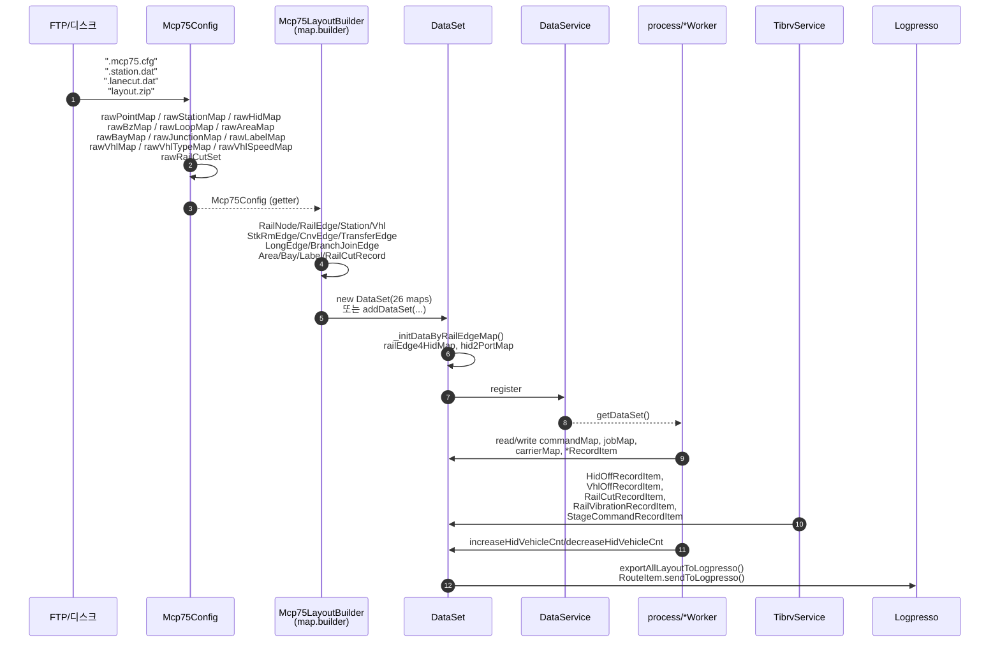
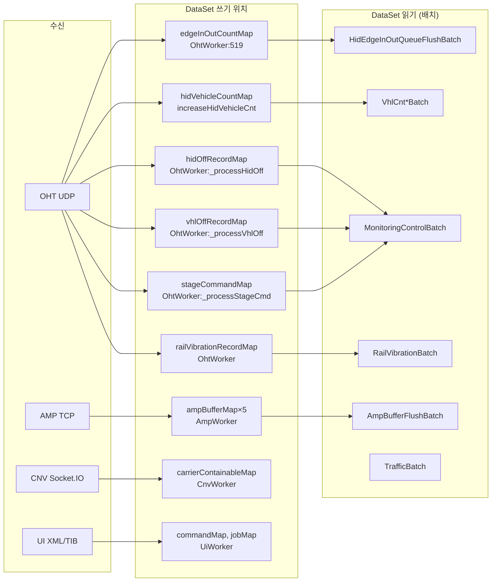
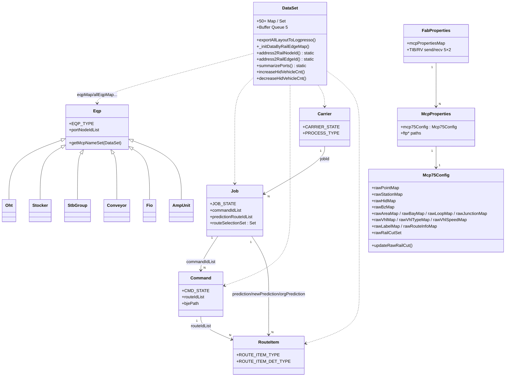
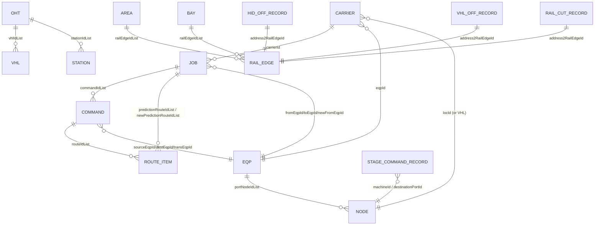

# SmartAtlas 데이터 모델 패키지 상세 분석

> 분석 대상 (47 파일)
> - `main/java/com/skhynix/smartatlas/data/` (23)
> - `main/java/com/skhynix/smartatlas/data/eq/` (7)
> - `main/java/com/skhynix/smartatlas/data/raw/` (17)

---

## §0. 패키지 개요

SmartAtlas 의 데이터 계층은 세 개의 서브패키지로 구성된다.

| 패키지 | 역할 | 대표 클래스 |
|---|---|---|
| `data.raw` | Daifuku MCP75 컨트롤러가 생성한 **원본 layout 파일** (`*.mcp75.cfg`, `*.station.dat`, `*.lanecut.dat`, `*.layout.zip`)을 파싱한 1:1 모델 | `Mcp75Config`, `RawPoint`, `RawStation`, `RawHid`, `RawBz`, `RawArea`, `RawBay`, `RawLoop`, `RawJunction`, `RawVhl(*)`, `RawLabel`, `RawRouteInfo`, `RawCnvZone` |
| `data.eq` | OHT/STK/CNV/EQP/STBGROUP/AGV 등 **설비 상위 모델** (`Eqp` 추상 베이스 상속) | `Eqp`, `Oht`, `Stocker`, `StbGroup`, `Conveyor`, `Fio`, `AmpUnit` |
| `data` | Raw 데이터에서 빌드되어 런타임에 갱신되는 **가공/실시간 데이터** 및 `DataSet` 통합 컨테이너 | `DataSet`, `Job`, `Command`, `Carrier`, `RouteItem`, `Area`, `Bay`, `CnvTask`, `OhtStats`, `*RecordItem`, … |

### 데이터 흐름 한눈에



### 외부에서 접근하는 DataSet 주요 getter (`grep "getDataSet().get*Map()"` 결과)

```
getAlarmLimitMap / getAllEqpMap / getAllEqpNameMap / getAmpAgvBufferMap / getAmpCnvBufferMap
getAreaMap / getCarrierContainableMap / getCarrierMap / getCnvEdgeMap / getCnvLongEdgeBufferMap
getCnvPortNodeNoMap / getCnvTaskBufferMap / getCnvTaskMap / getCommandMap / getConveyorMap
getEdgeInOutCountMap / getEdgeMap / getHidOffRecordMap / getHidVehicleCountMap / getJobMap
getLongEdgeMap / getNodeMap / getNodePortMap / getRailCutRecordMap / getRailEdgeMap
getRailVibrationRecordMap / getRouteItemMap / getStageCommandMap / getStationMap
getStationPortMap / getStbGroupMap / getStkRmEdgeMap / getStockerMap / getTransferEdgeMap
getVhlIdMap / getVhlMap / getVhlOffMonitoringMap / getVhlOffRecordMap
```

---

## §1. `data/raw` — `layout.xml` 원본 데이터 (Mcp75Config 가 핵심 컨테이너)

### §1.0 Mcp75Config 의 14개 ConcurrentMap 구조



### §1.1 Raw → Map(그래프) → DataSet 빌드 흐름




원본 `*.cfg/*.dat/*.xml` 의 토큰 1:1 모델이다. **Setter 가 거의 사용되지 않는 immutable 성격**.

### 1.1 `Mcp75Config.java` (1163줄) — Raw 데이터 루트 컨테이너

**한 줄 요약**: `mcp75.cfg / station.dat / lanecut.dat / layout.xml` 4종 파일을 정규식·DOM 으로 파싱하여 모든 Raw 객체를 자기 자신의 14개 Map/Set 에 적재하는 거대 ETL.

**필드 (모두 `ConcurrentMap`)** — 절대 라인 41-55

| 필드 | 타입 | 의미 |
|---|---|---|
| `pulseRate` | double (L38) | 펄스→거리 변환계수 |
| `vhlSpeedType` | String (L39) | 차량 속도 테이블 키 |
| `slidePortDist` | double = 10.0 (L40) | 포트 슬라이드 픽셀 거리 |
| `rawPointMap` | `<Integer,RawPoint>` (L41) | 키=address |
| `rawStationMap` | `<Integer,RawStation>` (L42) | 키=stNo |
| `rawVhlMap` | `<String,RawVhl>` (L43) | 키=vhlId |
| `rawVhlTypeMap` | `<Integer,RawVhlType>` (L44) | 키=type |
| `rawVhlSpeedMap` | `<String,Map<Integer,RawVhlSpeed>>` (L45) | 키=speedType→level |
| `rawAreaMap` | `<String,RawArea>` (L46) | 키=`id:subId` |
| `rawBayMap` | `<String,RawBay>` (L47) | 키=`id:subId` |
| `bayNameIdMap` | `<String,int[2]>` (L48) | bayName→{id,subId} |
| `rawJunctionMap` | `<String,RawJunction>` (L49) | 키=`id:subId` |
| `rawHidMap` | `<String,RawHid>` (L50) | 키=`id:subId` |
| `rawBzMap` | `<String,RawBz>` (L51) | 키=BZ id 문자열 |
| `rawLoopMap` | `<String,RawLoop>` (L52) | 키=`id:subId` |
| `rawRouteInfoMap` | `<String,RawRouteInfo>` (L53) | 키=`fromBay:toBay` (현재 코드는 주석 처리, L750-786) |
| `rawLabelMap` | `<String,RawLabel>` (L54) | 키=label name |
| `rawRailCutSet` | `Set<String>` (L55) | `"00001-00002"` 형식 |

**주요 메서드/단계** — 파싱 섹션 라인:

1. `mcp75.cfg` 파싱 — `[MCP75_LAYOUT@*]` 블록 (L136-469)
   - `POINT = ` 정규식 → `RawPoint` 생성 (L141-159)
   - `STATION = ` 정규식 → `RawStation` 생성 (L160-191)
   - `<ZONE>` 블록 안에서 `"LOOP"` / `"HID"` / `"AREA"` / `"BAY"` / `"JUNCTION"` 분기 (L192-466)
2. `[MCP75_VEHICLE]` 블록 (L470-536) — `VEHICLE=` → `RawVhl`, `<TYPE>` 블록 → `RawVhlType`, `PULSE_RATE/VHL_SPEED_TYPE` 단일 필드
3. `[MCP75_BZ]` 블록 (L537-625) — `<BZ>` 블록의 `BZ_CODE`, `BZ`, `QUEUE`, `FD`, `HID`, `HID_UNIT`, `STOP_POINT` 토큰을 inner-class 로 변환
4. `[MCP75_VEHICLE_SPEED]` 블록 (L626-658) — speedType 별 `SPEED=` 토큰
5. `station.dat` 재파싱 (L691-748) — `STATION = ` 토큰만 추출 (중복은 덮어쓰기, try-catch L715-743)
6. `_formatNewRawRailCut()` (L1102-1158) — `lanecut.dat` 의 `LANE=` 토큰을 `"%05d-%05d"` 로 포맷팅하여 `rawRailCutSet` 적재. `updateRawRailCut()`(L1160) 으로 30초 주기 갱신
7. `layout.zip` 의 `layout.xml` 파싱 (L806-947) — dom4j 로 `RawPoint` 의 `cad-x/y/z`, `draw-x/y` 와 `RawStation` 의 `slide` 보정, `RawLabel` 좌표 계산. `RawStation` 의 `drawX/drawY` 는 head/tail RawPoint 좌표 + 슬라이드 보정으로 계산 (L892-931)

**Raw → Raw 빌드 의존성**: `RawPoint` ← layout.xml(cad/draw), `RawStation.drawX/Y` ← `RawPoint.draw+slide`. `RawLabel` ← `RawPoint.draw` 누적.

**읽는 곳 (외부)**: `McpProperties.mcp75Config` 가 인스턴스를 보유 → `Mcp75LayoutBuilder` (map 패키지) 가 모든 getter (L950-1100) 를 호출해 `RailNode/RailEdge/Station/Vhl` 등을 생성.

---

### 1.2 `RawPoint.java` (203줄)

**요약**: MCP layout 의 단일 주소(노드)를 표현. 양쪽 이웃 주소·거리·속도, 좌표(CAD/Draw) 보유.

| 필드 | 타입 | 의미 (라인) |
|---|---|---|
| `address` | int (L10) | 고유 주소 (RailNode 의 핵심 키) |
| `stNo` | int (L11) | 부착된 RawStation 번호 |
| `leftAddress/leftDistance/leftSpeed` | int/double/int (L12-14) | 좌측 이웃 |
| `rightAddress/rightDistance/rightSpeed` | int/double/int (L15-17) | 우측 이웃 |
| `viaPoint` | boolean (L18) | 경유점 여부 |
| `stopResetPoint` | int (L19) | 정지/리셋 등록점 |
| `drawX/Y, cadX/Y/Z` | double | 좌표 (layout.xml 으로 보정) |
| **static** `map` | `Map<Integer,RawPoint>` (L9) | 생성자에서 self-register |

**생성자**: L26-52 (10인자), `map.put(this.address, this)` 로 정적 캐싱.
**빌드**: `Mcp75Config.parsePoint()` (L147-159). 좌표는 layout.xml 후처리 (L840-845).
**소비**: `Mcp75LayoutBuilder` 에서 `RailNode` 변환, `RailEdge` 의 length/velocity 계산.

---

### 1.3 `RawStation.java` (378줄)

**요약**: 22개 토큰 station 1개. 카트 적재·이송 위치의 모든 속성 (priority, group, type, location, slide 등).

핵심 필드 (L6-31): `stNo, stationType, waitAllowed, portId, transportCarrierType, bumpAllowed, address_no, invMgtCategory, stationGroup1/2, portGroup, stationLocation, comment, standbyPriority, parkingPriority, forcedOutputDestinationPriority, leftDistance, rightDistance, allowableSimultaneousOutputCount, slide, eqStationAtTheSameLocation, stbLeftAtTheSameLocation, stbRightAtTheSameLocation, drawX, drawY, SLIDE_THRESHOLD=100000`.

**열거**:
- `STATION_TYPE` (L288): `DEPOSIT, ACQUIRE, DUAL_ACCESS, DUMMY, MAINTENANCE`
- `INV_MGT_CATEGORY` (L306): `CATEGORY0..5`
- `PORT_LOCATION` (L325): `CENTER, LEFT, RIGHT`
- `STATION_LOCATION` (L327): `NO_CONDITION, LEFT_BRANCH, RIGHT_BRANCH`

**주요 메서드**: `getPortLocation()` (L272-286) — slide·comment 기반으로 LEFT/RIGHT/CENTER 결정.

**빌드**: `Mcp75Config` L160-191 (mcp75.cfg) + L710-743 (station.dat 덮어쓰기) + L856-858 (slide 보정) + L892-931 (drawX/Y 계산).
**소비**: `Station` 가공 객체로 변환되어 `DataSet.stationMap/stationPortMap` 에 적재.

---

### 1.4 `RawHid.java` (123줄)

**요약**: HIGHWAY ID (HID) 존(zone). 진입(loop entry)·진출·차량 한계·자동 폐쇄 임계치 보유.

| 필드 | 타입 | 의미 (라인) |
|---|---|---|
| `id, subId` | int (L7-8) | 키 = `id:subId` |
| `loopEntrySet` | `Set<LoopEntry>` (L9) | 진입 루프 정보 |
| `exitSet` | `Set<Integer[]>` (L10) | 진출 lane (start,end) |
| `vhlMax` | int (L11) | 최대 차량수 |
| `vhlPreCaution` | int (L12) | 경고 임계치 |
| `zoneCarrierType` | int (L13) | 캐리어 타입 |
| `autoCloseSet` | `Set<Integer[]>` (L14) | 자동 폐쇄 lane |
| `autoCloseVhlCntDisable/Restore` | int (L15-16) | 폐쇄 진입/복구 차량수 |

**빌드**: `Mcp75Config` L244-308 `<ZONE>` 블록의 `"HID"` 분기.
**소비**: `Mcp75LayoutBuilder` 에서 `RailEdge.hidId` 세팅, `DataSet.railEdge4HidMap/hid2PortMap` 빌드 (`DataSet._initDataByRailEdgeMap`, L497-535).

---

### 1.5 `RawArea.java` (205줄)

**요약**: AREA 존 (논리적 영역). 차량 max/avg/min, idleVhl max/avg/min, parkDistance 등.

핵심 필드 (L9-23): `id, subId, entrySet, exitSet, vhlMax, vhlPreCaution, vhlAvg, vhlMin, idleVhlMax/Avg/Min, name, parkDistance(-1), areaSearchDistance, zoneCarrierType`.

**빌드**: `Mcp75Config` L309-381 `<ZONE>` "AREA" 분기.
**소비**: `Area` 객체 생성 (`DataSet.areaMap`).

---

### 1.6 `RawBay.java` (104줄)

**요약**: BAY 존. inner-class `RawBayPort{startPoint,endPoint,name}` 형식의 entry/exit Set 보유.

핵심 필드 (L8-15): `id, subId, fabId, name, entrySet:Set<RawBayPort>, exitSet:Set<RawBayPort>, zoneCarrierType`.
**inner class** `RawBayPort` (L69-79): public `startPoint, endPoint, name`.

**빌드**: `Mcp75Config` L382-432 `<ZONE>` "BAY" 분기 — 동시에 `bayNameIdMap.put(name,{id,subId})` 도 수행.
**소비**: `Bay` 객체 (`DataSet.bayMap`).

---

### 1.7 `RawLoop.java` (76줄)

**요약**: LOOP 존.

필드 (L7-13): `id, subId, entrySet:Set<Integer[]>, exitSet:Set<Integer[]>, name, zoneCarrierType, runningAreaType=1`.

**빌드**: `Mcp75Config` L200-243 `"LOOP"` 분기.
**소비**: `Mcp75LayoutBuilder` 에서 loop 기반 area 계산.

---

### 1.8 `RawJunction.java` (74줄)

**요약**: JUNCTION (분기/합류). `id, subId, entrySet, exitSet, vhlPreCaution(=1), zoneCarrierType`.

**빌드**: `Mcp75Config` L433-466.
**소비**: `BranchJoinEdge` 생성 시 사용.

---

### 1.9 `LoopEntry.java` (54줄)

**요약**: `RawHid` 의 `loopEntrySet` 원소. `entryLaneStart, entryLaneEnd, setZcu:String, entrySettingNo`.
**빌드**: `Mcp75Config` L259-272 `LOOP_ENTRY=` 토큰.

---

### 1.10 `RawBz.java` (252줄)

**요약**: BZ (Buffer Zone) 정의. inner-class 4개 보유 (ObzQueue, StopPoint, HidInfo, Fd).

필드 (L7-14): `code(="53"), id, obzQueueList, hidInfo, fdList, stopPointList, schedulerId=1, territoryNo=1`.

**상수 BZ code** (L15-23): `BZ_CODE="53", HID_CODE="92", AD_CODE="91", FD_CODE="91", FFU_CODE="93", HID_UNIT_CODE="94", OHT_LIFTER_CODE="57", CDP_CODE="9A", GRID_HID_CODE="9D"`.

**inner classes**:
- `ObzQueue(no, mcpZoneNo, stopAddresses[])` (L41-70)
- `StopPoint(stopAddr, passageDirection:byte)` (L72-92)
- `HidInfo(machineId, hid1or2, mcpZoneNo, machineTypeCode, extendedMachineId, hidSynchUnit)` (L94-150)
- `Fd(machineId, fd1or2, laneStartPoint, laneEndPoint)` (L152-189)

**빌드**: `Mcp75Config` L537-625 `[MCP75_BZ]` `<BZ>` 블록.

---

### 1.11 `RawVhl.java` (69줄)

**요약**: 단일 차량 정의.
필드 (L6-10): `vhlId, type, loopId, idReadEnabled:boolean, maskDetectionEnabled:boolean`.
**빌드**: `Mcp75Config` L478-487. **소비**: `Vhl` (map.Vhl) 생성.

---

### 1.12 `RawVhlType.java` (140줄)

**요약**: 차량 type 정의.
필드 (L4-13): `type, vhlCode, carrierType, runningAreaType, minDistance(=1400L), offlineTimer(=30000L), carrierTypeMoving:boolean, vhlCodeName(≤16B), varVhlType, bumpDisableCarrierType`.
**빌드**: `Mcp75Config` L488-530 `<TYPE>` 블록.

---

### 1.13 `RawVhlSpeed.java` (35줄)

**요약**: `level→speed` 단일 엔트리. `level, speed`.
**빌드**: `Mcp75Config` L626-658 `[MCP75_VEHICLE_SPEED]` 의 `SPEED = level, speed;` 토큰.
**컨테이너**: `Mcp75Config.rawVhlSpeedMap : <speedTypeName, <level,RawVhlSpeed>>`.

---

### 1.14 `RawLabel.java` (87줄)

**요약**: layout.xml 의 label.Label 노드 1개. immutable.
필드 (L25-28): `address, x, y, label`.
**빌드**: `Mcp75Config` L867-890 (layout.xml dom4j 처리, `RawPoint.draw + 라벨 오프셋`).

---

### 1.15 `RawEdge.java` (19줄)

**요약**: 가장 작은 immutable 클래스. `fromNode:int, toNode:int, railEdgeId:String` final 3개 필드. address 쌍과 RailEdge id 매핑용 헬퍼.

---

### 1.16 `RawCnvZone.java` (130줄)

**요약**: Conveyor zone 단일 노드. **현재 Mcp75Config 에서 직접 생성하는 코드는 없음** — Conveyor 빌드 시 별도로 사용. inner-classes 3개 (`RawCnvLdAttr`, `RawCnvQsAttr`, `RawCnvLftAttr`).

필드 (L8-25): `eqpNm, level, posX, posY, nextZone, prevZone, zoneDrawCount, zoneId, physicalType, refDirection, displayName, currentNode, prevNode, logicalType, ldAttr, qsAttr, lftAttr, state(=true)`. inner-class:
- `RawCnvLdAttr(included, sensorReversZones[])` (L66)
- `RawCnvQsAttr(included, homeDirection, isWayPoint, north/south/east/west:int[])` (L77)
- `RawCnvLftAttr(inIncludeZoneId, outIncludeZoneId, homeLevel, homingDirection, homingClearLimit, levelZoneList)` (L105)

---

### 1.17 `RawRouteInfo.java` (112줄)

**요약**: 라우팅 사전 정의 (from-bay → to-bay, via points).
필드 (L6-16): `id, fabId, fromBay, toBay, vhlType, minPriority, maxPriority, outPort, entryPort, viaPoints:int[], mcpName`.
**빌드**: `Mcp75Config` 의 route.dat 파싱은 **현재 주석 처리** (L750-786). `Job.routeSelectionSet : Set<RawRouteInfo>` 으로 런타임에 채워짐 (Job.java L111).

---

## §2. `data/eq` — 설비 종류

`Eqp` 추상 베이스를 상속하는 6개 + AGV 용 AmpUnit. `EQP_TYPE` enum 1개.

### 2.0 설비 클래스 상속 트리



설비 타입별 EQP_TYPE enum 값: `STK`, `STBGROUP`, `EQP`, `FIO`, `OHT`, `CONVEYOR`, `AGV`


### 2.1 `Eqp.java` (432줄) — 모든 설비의 베이스 클래스

**한 줄 요약**: 모든 설비의 공통 속성 + 포트 노드 검색·MCP 매핑 유틸 보유.

**필드** (L33-47):

| 필드 | 타입 | 의미 |
|---|---|---|
| `fabId, id, name` | String | |
| `eqpType` | `EQP_TYPE` enum (L73) | `STK, STBGROUP, EQP, FIO, OHT, CONVEYOR, AGV` |
| `processTypeSet` | `Set<PROCESS_TYPE>` | (Carrier.PROCESS_TYPE) |
| `portNodeIdList` | `ConcurrentLinkedQueue<String>` | port node id 목록 |
| `isAvailable, isUpdate(transient)` | boolean | |
| `firstPortNodeId, lastPortNodeId` | String (L40-41) | lazy 캐싱 |
| `mcpNameSet, connectedFabMcpSet` | `Set<String>` (L43-44) | |
| `detEqpTyp, eqpGrpNm, mcsBayNm` | String (L45-47) | |

**주요 메서드**:
- `getFirstPortNodeId(DataSet)` (L156-181), `getAvailableFirstPortNodeId()` (L183-199), `getLastPortNodeId()` (L227-246) — `portNodeIdList` sorted iterate, `EqpPortNode.isInlinePort()` 제외
- `getConnectedAnyRailNodeId()` (L201-221) — station→railEdge→longEdge 추적
- `getMcpNameSet(DataSet)` / `getConnectedFabMcpSet(DataSet)` (L260-399) — port 종류별 (`EqpPortNode/StbNode/RailNode/FioPortNode/StkPortNode/CnvPortNode`) station 또는 railNode 의 mcpName 수집
- `removeCarrierId(String)` (L144-150) — 자신의 모든 portNode 에서 carrier 제거
- `toJsonString()` (L119-121)

**서브타입 매핑**: `DataSet.eqpMap(EQP)`, `fioMap(FIO)`, `ohtMap(OHT)`, `stbGroupMap(STBGROUP)`, `stockerMap(STK)`, `conveyorMap(CONVEYOR)`, `agvAmpAgvMap(AGV)`. **모두 합쳐서** `allEqpMap` / `allEqpNameMap` (이름 인덱스).

---

### 2.2 `Oht.java` (139줄)

**요약**: OHT(천장 호이스트) MCP 단위 그룹. `Eqp` 상속, `EQP_TYPE=OHT, processTypeSet={ALL}, mcsBayNm="NA"`.

추가 필드 (L11-22): `vhlIdList:ConcurrentLinkedQueue<String>, stationIdList, controlState, tscState, alarmState, receivedTime, lastControlState, lastTscState, lastAlarmState, lastReceivedTime, mcpName`.

**오버라이드**: `removeCarrierId()` (L123-130) — vhlIdList 전체에 위임.

---

### 2.3 `Stocker.java` (189줄)

**요약**: STK 설비. shelf/rm 노드 보유, MCS 로부터 capa 수신.
필드 (L15-21): `shelfNodeId, rmId, isN2, stkType:STK_TYPE, isFull, maxCapaCnt(-1), occupancyCnt(-1)`.
**enum** `STK_TYPE` (L126): `NA, PODZIPTOWER, LIFTER, ZIPTOWER, INTERAILSEMITS, INTERLAYER, RETICLE, INTERRAILSTORAGE` — `PredictionPara` 에서 트랜스 가중치 키로 사용.

`getMaxCapaCnt()` / `getOccupancyCnt(DataSet)` (L138-181) — `StkShelfNode` 로부터 lazy 산정.
`removeCarrierId()` 오버라이드 (L108-124) — 포트+rmNode+shelfNode 에서 모두 제거.

---

### 2.4 `StbGroup.java` (120줄)

**요약**: STB (StandBy) Group. N2/일반 구분.
필드 (L14-17): `isN2, isFull, maxCapaCnt(-1), occupancyCnt(-1)`.
**메서드**: `getAvailableStbNodeList()` (L33-48), `getAnyAvailableStbNode()` (L50-58) — port 중 `isEmpty && isAvailable && !isReaderPort` 조건 필터. capa 산정은 `Stocker` 와 동일 패턴.

---

### 2.5 `Conveyor.java` (202줄)

**요약**: 컨베이어 설비. 메시지 시퀀스·zone 그룹·이벤트 코드 enum 다수.
필드 (L12-14): `conveyorLayout:String, msgSeq:AtomicLong, cnvGroupNodeIdMap:<String,Queue<String>>`.
**inner static** `CNV_EVENT_CD` (L57-80) — 이벤트 코드 String 상수 모음.
**enum** `CNV_EVENT` (L84-194) — 약 60+ 알람/이벤트/경고 코드 (E84, motion, tcm, dcm 등). 정적 `numberEventMap` 으로 string→enum 매핑.
**메서드**: `getMsgSeqAndIncrement()` (L51-55), `getValue(numberString)` static (L185).

---

### 2.6 `Fio.java` (38줄)

**요약**: FIO (Fan-In/Out) 설비. 가장 가벼움.
필드 (L11): `fioType:FIOTYPE` (= `NORMAL` 또는 `VM`).
생성자 (L13-29): `isVm` 인자에 따라 `FIOTYPE.VM` 설정.

---

### 2.7 `AmpUnit.java` (168줄)

**요약**: AGV/AMP 메시지 단위 (`EQP_TYPE.AGV`). MCS가 외부 메시지에서 받은 unit 단위 데이터를 1:1로 매핑.

필드 (L11-31) — **모두 String** (메시지 토큰 그대로):
- `kind`(0:메시지타입), `unitId`(3:설비ID), `hostId`(4), `status`(5: 1=RUN/2=STOP/3=ERROR/4=PM)
- `carrierDetect`(6: 0/1), `carrierDetect2`(7: AGV 2캐파 용)
- `errorCode`(8), `errorName`(9)
- `address`(10), `nextAddress`(11), `destAddress`(12)
- `carrierId`(13), `carrierId2`(14: AGV 2캐파)
- `cycle`(15: 3=Load, 5=Unload, 기타=이동중), `bufferZoneReady`(16), `zoneId`(17)
- `createdAt` (인스턴스 생성시각, L31, ms.SSS 포맷, L42-50)

**소비**: `DataSet.agvAmpAgvMap` + `ampAgvBufferMap/ampCnvBufferMap` 큐를 통해 외부로 흘림.

---

## §3. `data/` — 가공/실시간 데이터

`DataSet` 은 자체적으로 거대해 별도 큰 섹션 §3.0 으로 다룬다. 나머지는 §3.1 이하.

---

### §3.0 `DataSet.java` (1445줄) — 시스템 전역 단일 컨테이너

> `DataService.getDataSet()` 로 전역 접근. 모든 처리 코드가 본 컨테이너의 Map 을 읽고/쓴다.

#### 3.0.0 컬렉션 6개 그룹 분류 (전체 50+)



#### 3.0.1 ID 접두사 상수 (L130-159)

```
STK, STB_GROUP=SBG, EQP, FIO, OHT, VHL, CNV
RAIL_NODE=RN, RAIL_EDGE=RE, TRANS_EDGE=TE, STK_RM_EDGE=SRE, CNV_EDGE=CE,
LONG_EDGE=LE, BRANCHJOIN_EDGE=BJE
STK_PORT_NODE=SPN, CNV_PORT_NODE=CPN, STK_RM_NODE=SRN, STK_SHELF_NODE=SSN,
STB_PORT_NODE=SBN, EQP_PORT_NODE=EPN, FIO_PORT_NODE=FPN
STATION=ST, CARRIER, COMMAND=CMD, JOB, ROUTE_ITEM=RI, LABEL=LB
AREA=AR, BAY=BA, AGV
```

ID 포맷 예: `M14A:RN:A:01000` (L912-922 `address2RailNodeId`), `M14A:RE:A:M14A:RN:A:01000-M14A:RN:A:01001` (L929-957 `address2RailEdgeId`).

#### 3.0.2 모든 컬렉션 필드 (총 50개 가까이)

> 라인은 선언 위치. K/V 의미 → "변경 위치(메서드)" → "외부 소비처" 순.

##### (A) Map · Edge / Node / Vhl / 기본 토폴로지

| 필드 | 타입 | 키 | 값 | 라인 | 변경 위치 | 주요 소비 |
|---|---|---|---|---|---|---|
| `railEdgeMap` | `<String, RailEdge>` | RE id | RailEdge | L63 | 생성자 `putAll` (L222), `addDataSet` (L379), `_initDataByRailEdgeMap` (L497) | `RailNode` 라우팅, `Mcp75LayoutBuilder` |
| `stkRmEdgeMap` | `<String, StkRmEdge>` | SRE id | StkRmEdge | L64 | L232, L380 | Stocker 라우팅 |
| `cnvEdgeMap` | `<String, CnvEdge>` | CE id | CnvEdge | L65 | L233, L381 | Conveyor 처리 |
| `transferEdgeMap` | `<String, TransferEdge>` | TE id | TransferEdge | L66 | L234, L382 | acquire/deposit 모델 |
| **`edgeMap`** | `<String, AbstractEdge>` | edge id | union (Rail+StkRm+Trans+Cnv+Agv) | L67 | L238-242, L385-389 | 모든 edge 일괄 조회 |
| `longEdgeMap` | `<String, LongEdge>` | LE id | LongEdge | L68 | L235, L383 | 경로 단위 |
| `vhlMap` | `<String, Vhl>` | VHL id | Vhl | L69 | L243, L390 | 차량 상태 |
| `branchJoinEdgeMap` | `<String, BranchJoinEdge>` | BJE id | BranchJoinEdge | L70 | L338, L411 | OHT 분기점 |
| `agvEdgeMap` | `<String, AgvEdge>` | AGV edge id | AgvEdge | L121 | L237, L384 | AGV 라우팅 |

##### (B) Station / Node / Port 인덱스

| 필드 | 타입 | 키 | 값 | 라인 | 변경 위치 |
|---|---|---|---|---|---|
| `stationMap` | `<String, Station>` | station Id | Station | L73 | L244, L391 |
| `stationPortMap` | `<String, Station>` | portId | Station | L75 | L267-273, L417-423 (생성 직후) |
| `nodeMap` | `<String, AbstractNode>` | node Id | AbstractNode | L77 | L245, L392 |
| `nodePortMap` | `<String, AbstractNode>` | portName/SubPort name | AbstractNode | L79 | L276-317, L425-471 (생성자, instanceof 분기) |
| `cnvPortNodeNoMap` (final) | `<String, CnvPortNode>` | `eqpId:zoneNo` | CnvPortNode | L120 | L315, L468 |
| `carrierContainableMap` | `<String, CarrierContainable>` | `fabId:nodeName` | CarrierContainable | L81 | L319-322, L473-476 |
| `carrierTransportableMap` | `<String, CarrierTransportable>` | `fabId:rmName` 또는 `fabId:vhlName` | StkRmNode 또는 Vhl | L83 | L306, L324-328 |
| `labelMap` | `<String, Label>` | label id | Label | L104 | L335, L489 |

##### (C) 설비 인덱스

| 필드 | 타입 | 키 | 값 | 라인 |
|---|---|---|---|---|
| `eqpMap` | `<String, Eqp>` | EQP id | Eqp | L85 |
| `fioMap` | `<String, Fio>` | FIO id | Fio | L87 |
| `ohtMap` | `<String, Oht>` | OHT id | Oht | L89 |
| `allEqpMap` | `<String, Eqp>` | id | union (eqp+fio+oht+stbGroup+stocker+conveyor+amp) | L91 |
| `allEqpNameMap` | `<String, Eqp>` | name | Eqp | L93 — `parallelStream.forEach` (L261, L409) |
| `stbGroupMap` | `<String, StbGroup>` | SBG id | StbGroup | L94 |
| `stockerMap` | `<String, Stocker>` | STK id | Stocker | L95 |
| `conveyorMap` | `<String, Conveyor>` | CNV id | Conveyor | L96 |
| `agvAmpAgvMap` | `<String, AmpUnit>` | AGV id | AmpUnit | L122 |
| `portAliasSetMap` | `<String, Set<String>>` | port | alias set | L97 |
| `portAliasListMap` (final) | `<String, List<String>>` | port | alias list | L98 |

##### (D) 명령·작업·캐리어·경로

| 필드 | 타입 | 키 | 값 | 라인 |
|---|---|---|---|---|
| `commandMap` | `<String, Command>` | CMD id | Command | L99 |
| `carrierMap` | `<String, Carrier>` | carrier id | Carrier | L100 |
| `jobMap` | `<String, Job>` | JOB id | Job | L101 |
| `cnvTaskMap` | `<String, CnvTask>` | task id | CnvTask | L102 |
| `routeItemMap` | `<String, RouteItem>` | RI id | RouteItem | L103 |

##### (E) 분기/조인 검색 인덱스

| 필드 | 타입 | 키 | 값 | 라인 |
|---|---|---|---|---|
| `fromNode2Edge` | `<String, List<AbstractEdge>>` | fromNode id | edge list | L107 |
| `toNode2Edge` | `<String, List<AbstractEdge>>` | toNode id | edge list | L108 |

##### (F) 차량 상태 통계

| 필드 | 타입 | 키 | 값 | 라인 |
|---|---|---|---|---|
| `vhlStateMap` | `<String, Double>` | state name | 비율 | L110 |
| `vhlDetStateMap` | `<String, Double>` | det state name | 비율 | L111 |
| `vhlCycleMap` | `<String, Double>` | cycle | 비율 | L112 |
| `vhlRunCycleMap` | `<String, Double>` | run cycle | 비율 | L113 |
| `areaVhlCountMap` | `<String, Double>` | area | vhlCount | L115 |
| `edgeInOutCountMap` | `<String, Integer>` | edge id | in/out count | L116 |

##### (G) Area/Bay

| 필드 | 타입 | 키 | 값 | 라인 |
|---|---|---|---|---|
| `areaMap` | `<String, Area>` | AR id | Area | L117 |
| `bayMap` | `<String, Bay>` | BA id | Bay | L118 |

##### (H) Buffer 큐 (Logpresso/AGV/AMP 처리용)

| 필드 | 타입 | 라인 | 용도 |
|---|---|---|---|
| `cnvLongEdgeBufferMap` | `ConcurrentLinkedQueue<Map.Entry<String,LongEdge>>` | L124 | Conveyor long-edge flush |
| `cnvTaskBufferMap` | `Queue<Entry<String,CnvTask>>` | L125 | CnvTask flush |
| `agvEdgeBufferMap` | `Queue<Entry<String,AgvEdge>>` | L126 | AGV edge flush |
| `ampAgvBufferMap` | `Queue<Entry<String,AmpUnit>>` | L127 | AMP-AGV flush |
| `ampCnvBufferMap` | `Queue<Entry<String,AmpUnit>>` | L128 | AMP-CNV flush |

##### (I) HID/VHL/Rail-Cut/Stage 모니터링 (별도 ConcurrentMap, final)

| 필드 | 타입 | 키 형식 | 값 | 라인 |
|---|---|---|---|---|
| `hidOffRecordMap` (final) | `<String, HidOffRecordItem>` | `{fabId}:{hidId}` | HidOffRecordItem | L165 |
| `vhlOffRecordMap` (final) | `<String, VhlOffRecordItem>` | `{vehicleId}:{stopAddress}:{alarmCode}` | VhlOffRecordItem | L166 |
| `railCutRecordMap` | `<String, RailCutRecordItem>` | `{fabId}:{fromAddress}-{toAddress}` | RailCutRecordItem | L169 |
| `railEdge4HidMap` | `<String, List<String>>` | `{fabId}:{mcpName}:{HHH}` (HID 3자리 zero-pad) | RailEdge id 리스트 | L171 — **`_initDataByRailEdgeMap` L497-535** 에서 생성/갱신 |
| `hid2PortMap` | `<String, List<String>>` | 위와 동일 키 | port-id 리스트 (`summarizePorts` 압축됨, L537-584) | L172 |
| `stageCommandMap` | `<String, StageCommandRecordItem>` | `{fabId}:{machineId}` | StageCommandRecordItem (제적수) | L175 |
| `vhlOffMonitoringMap` | `<String, VhlOffRecordItem>` | (monitoring batch 용) | VhlOffRecordItem | L178 |
| `vehicleCountMap` | `<String, List<String>>` | `{fabId}:{hidId}` | vhl id 리스트 | L182 |
| `hidVehicleCountMap` | `<String, Integer>` | `{fabId}:{hidId}` | 차량 카운트 | L183 — **`increaseHidVehicleCnt(key)` L1418 / `decreaseHidVehicleCnt(key)` L1433** |
| `railVibrationRecordMap` | `<String, RailVibrationRecordItem>` | `{fabId}:{address}` | RailVibrationRecordItem | L186 |
| `alarmLimitMap` | `<String, Integer>` | `{fbcId}:{limit}` | Alarm 기준치 | L189 |

#### 3.0.3 주요 메서드

| 메서드 | 라인 | 역할 |
|---|---|---|
| `DataSet(...)` 26인자 생성자 | L191-341 | 모든 Map putAll + `nodePortMap` 빌드 (instanceof 분기) + `carrierContainableMap`/`carrierTransportableMap` 빌드 + `_initDataByRailEdgeMap` 호출 |
| `addDataSet(...)` | L343-495 | 추가 fab/mcp 의 데이터를 기존 DataSet 에 머지. 동일 로직 + 차량 속도 기본값 보정 |
| `_initDataByRailEdgeMap(Map)` | L497-535 | RailEdge 순회하며 `{fabId}:{mcpName}:{HHH}` 키로 `railEdge4HidMap` 과 `hid2PortMap` 재구축. 후자는 `summarizePorts` 로 압축 |
| `summarizePorts(List<String>)` static | L537-584 | `(.*?)(\d+)$` 정규식으로 prefix-그룹화 → `_getPortNoSummary` 로 연속 번호 `1~5,7` 형식 압축 |
| `_getPortNoSummary(List<Integer>)` static | L586-620 | 정렬·연속 번호 묶어 `1~3,5` 포맷 |
| `address2RailNodeId(fabId,mcpName,addr)` static | L916-922 | `{fab}:RN:{mcp}:{%05d address}` |
| `address2RailEdgeId(fabId,mcpName,from,to)` static | L929-942 (int 버전) + L944-957 (String 버전) | `{fab}:RE:{mcp}:{fromNodeId}-{toNodeId}` |
| `getCarrierContainableByCarrierLoc(locId, fabId)` | L866-874 | nodePortMap 먼저, 없으면 `carrierContainableMap` 으로 폴백 |
| `insertBufferdJsonData(ja, je, limit, flush)` private | L1090-1116 | Logpresso 적재 버퍼: TBLNM 기준으로 grouping 후 `LogpressoAPI.setInsertTuples` 호출 |
| `exportAllLayoutToLogpresso()` | L1118-1322 | 전체 도면 데이터를 `ATLAS_MAS_EDGE/LONGEDGE/BRANCHJOINEDGE/VHL/STATION/NODE/EQP/AREA/BAY` 테이블로 일괄 적재 (instanceof 분기로 노드 6종 정렬) |
| `getRailCutRecordMap(key)` 오버로드 | L1358-1374 | prefix 매칭만 filter |
| `increaseHidVehicleCnt(key)` / `decreaseHidVehicleCnt(key)` | L1418-1444 | HID 별 차량 카운트 ± (외부에서 진입/이탈 이벤트마다 호출) |

#### 3.0.4 어디서 읽고/쓰는가 (외부)

- **빌드 (write)**: `Mcp75LayoutBuilder` (map.builder) 가 생성자 26인자에 모든 데이터를 채워 호출. `DataService` 가 `DataSet` 싱글톤 보관.
- **읽기 (read)**: `DataService.getDataSet().get*Map()` 형태로 거의 모든 모듈이 접근. 특히
  - `process/OhtMsgWorkerRunnable` — `hidOffRecordMap`, `vhlOffRecordMap`, `railCutRecordMap`, `stageCommandMap`, `vhlOffMonitoringMap`, `hidVehicleCountMap` 갱신
  - `process/CnvMsgWorkerRunnable` — `cnvTaskMap`, `cnvTaskBufferMap`, `cnvLongEdgeBufferMap`
  - `process/AmpMsgWorkerRunnable` — `agvAmpAgvMap`, `ampAgvBufferMap/ampCnvBufferMap`
  - `service/TibrvService` — `*RecordItem` 의 알람 송신
  - `RouteItem.sendToLogpresso` (L274-315) — `commandMap`, `carrierMap`
  - `Carrier.getContainerId()` (L315-329) — `allEqpMap`, `carrierContainableMap`
  - `Job.setNewFromNodeId/setToNodeId` — `nodeMap`, `allEqpMap`
  - `Eqp.getMcpNameSet/getConnectedFabMcpSet` — `nodeMap`, `stationPortMap`, `railEdgeMap`, `longEdgeMap`
  - `HidOffRecordItem/VhlOffRecordItem/RailCutRecordItem.getRailEdge()` — `railEdgeMap` + `address2RailEdgeId`

---

### 3.1 `Job.java` (1381줄)

**한 줄 요약**: 1개의 carrier 이송 명세 (lot/router/step/from/to/route prediction). carrier 1 → Job N → Command N.

**주요 필드 그룹**:
- **기본**: `id, carrierId, lotId, createTime, wakeupTime, startTime, endTime, cancelTime` (L35-39, 83-85)
- **commandIdList**: `ConcurrentLinkedQueue<String>` (L41) — Job 1 : Command N
- **newFrom\***: `newFromEqpId, newFromEqpTyp, newFromEqpGrpNm, newFromDetEqpTyp, newFromContainerId, newFromNodeId, newFromFabId` (L42-48) — 다음 명령 시작점
- **from\* (조건)**: `fromFabId, fromEqpTyp, fromDetEqpTyp, fromEqpId, fromEqpGrpNm, fromNodeId` (L51-56)
- **to\* (조건)**: `toFabId, toEqpTyp, toDetEqpTyp, toEqpGrpNm, toNodeGrpId, toEqpId, toNodeId, tmpToNodeId` (L59-80)
- **예측 시간**: `newFromToPredictStartTime, newFromToEtaTime, newFromToMLEtaTime, newFromToPredictedCost, etaTime, vhlErrTime, vhlJamTime, alternatingTime` (L86-95)
- **상태**: `state:JOB_STATE`, `oldState`, `stateTime, oldStateTime` (L91-97). `enum JOB_STATE` (L976): `QUEUED, PROCESSING, ALTERNATING, ALTERNATED, CANCELING, CANCELED, ABORTING, ABORTED, COMPLETED, ERROR, NONE`
- **메타**: `requestor, router, stepId, stepNm, stepTyp, midStepTyp, detStepTyp, batchId, batchSeq` (L98-106)
- **route 컬렉션 (`ConcurrentLinkedDeque<String>`)**: `orgPredictionRouteIdList, predictionRouteIdList, newPredictionRouteIdList, routeSelectLongEdgeIdList, routeSelectPassLongEdgeIdList, fromNodeIdHistory, toNodeIdHistory, idHistory` (L108-122)
- **routeSelectionSet**: `Set<RawRouteInfo>` (L111) — `RawRouteInfo` 의 유일한 런타임 소비처
- **predict 통계 문자열**: `predictAreaVhlCntStr, predictAreaVhlObsCntStr, predictAreaVhlJamCntStr, predictAreaPredictQueueCntStr, predictVhlId, assignedVhlId` (L116-121)
- **합계**: `ppCostSum, ppCntSum` (L123-124), `currentEqpId, currentLocId` (L126-127)

**주요 메서드**:
- 생성자 (L154-216, L218-274) — `fromContainerId` 가 VHL prefix 면 Vhl 의 railNodeId 로 셋, 아니면 자체. `addIdHistory(id)` 호출
- `setId(newId)` (L280-290) — 기존 id 를 `jobMap` 에서 remove 하고 새 id 로 put
- `getNewCommandId(fabId)` (L292-304) — `{fab}:CMD:{jobId suffix}-{seq+1}` 발번 후 `commandIdList` 에 push
- `setNewFromNodeId/setToNodeId` (L393-417, 439-463) — 노드 변경 시 `nodeMap → allEqpMap` 추적하여 새 from/to 의 eqp 정보 (`Type, GrpNm, DetEqpTyp, FabId`) 동기화. `addFromNodeIdHistory/addToNodeIdHistory` 도 호출
- `setState(state)` (L496-501) — old 백업 + currentTimeMillis
- `addNewCommandId, addPredictionRouteId, addNewPredictionRouteId, addPredictionRouteIdList, addNewPredictionRouteIdList` — 컬렉션 add 헬퍼
- L674-973 — `updatePredictionRoute(RouteResult)` / `updateNewPredictionRouteReset` 등이 **현재 주석 처리** 상태 (예측 경로 재계산 로직)

**읽고/쓰는 곳**: `DataSet.jobMap`. `process/*MsgWorker` 들이 명령 진행 단계마다 `setState/setNewFromContainerId/setToNodeId/addNewCommandId/setPredictionRouteIdList` 호출.

---

### 3.2 `Command.java` (764줄)

**요약**: Job 1 : Command N. 1 command = 1 vehicle assignment. 대량의 timestamp 필드 (이송 라이프사이클 단계).

**필드**:
- `id, commandSeq, jobId, carrierId, sourceNodeId, destNodeId, transEqpId, transUnitId, estimatedVhlId` (L19-27)
- `priority(=50)` (L28), `lotId` (L52)
- **타임스탬프 14개**: `sourceInstalledTime, createTime, initTime, alternatingTime, alternatedTime, assignTime, sourceArrivedTime, acquireStartTime, acquireCmpltTime, departedTime, destArrivedTime, depositStartTime, depositCmpltTime, cmpltTime` (L29-42)
- **시도 횟수**: `assignCnt, acquireTryCnt, depositTryCnt` (L43-45)
- **결과**: `replyCode(-1), resultCode(-1)` (L46-47)
- `state:CMD_STATE`, `stateTime` (L48, 77)
- `routeIdList:ConcurrentLinkedDeque<String>` (L50)
- **source/dest 메타**: `sourceEqpTyp, sourceDetEqpTyp, sourceEqpId, sourceEqpGrpNm, sourceAreaName`, `destEqpTyp, destDetEqpTyp, destEqpId, destEqpGrpNm, destAreaName` (L54-64)
- **step**: `stepId, stepNm, stepTyp, midStepTyp, detStepTyp` (L66-70)
- `elapsed, ranDistance` (L72-73), `bjePath:ConcurrentLinkedDeque<String>` transient (L75)
- `inserted` transient flag (L18)

**enum** `CMD_STATE` (L466-490): `NONE, REQUESTED, QUEUED, ACQMOVING, ACQUIRING, DESTMOVING, DEPOSITING, OUTPORTMOVING, COMPLETED, CANCELING, CANCELED, ABORTING, ABORTED, UPDATING, PAUSED, STOREDALT`. 주석 (L468-481) 으로 각 상태 의미 명시 ("명령내린 상태", "Reply 받은 상태", "들어올리는 중", "목적지 이동중", "스토커 출고 포트 이동중" 등).

**메서드**:
- `setCmpltTime(t)` (L326-332) — `elapsed = cmpltTime - createTime` 자동 산정
- `setState(state)` (L382-387) — `stateTime = currentTimeMillis`. `oldState` 보존은 주석 처리됨
- `addRouteId(routeId), addRouteIdList(deque), setRouteIdList(deque)` (L405-421)
- `flush()` (L462) — Redis 적재 (현재 비어 있음, 주석 처리)
- `fillOhtDetailHistory()` (L542-598) **주석 처리** — source/dest node 에서 Eqp 추적, Job 에서 step 정보 복사, routeIdList 순회하여 거리 산정·BJE 경로 누적
- L18 `inserted` (transient) — Logpresso 중복 적재 방지

**읽고/쓰는 곳**: `DataSet.commandMap`. `RouteItem.sendToLogpresso` (L274-315) 에서 carrierId/jobId 추출 시 참조.

---

### 3.3 `Carrier.java` (345줄)

**요약**: Lot/POD/FOUP 등 운반 단위. 위치 (vhl 또는 node), 상태, 우선순위 보유.

**필드** (L15-39):
- transient `lock:ReentrantLock`, `logger`
- 기본: `id, name, eqpId, jobId, cmdId, locId, subType, lotId, router, stepId, batchId, batchSeq, requestor, definiteFlag(="NO"|"N2"|"YES"), priority(=50), installTime, requestedDestFDestPair`
- 상태: `state:CARRIER_STATE, stateTime, oldState, oldStateTime`
- 타입: `processType:PROCESS_TYPE`
- `isN2:boolean`

**enum** `PROCESS_TYPE` (L263-279): `ALL, FOUP, POD, CU, FOSB, CLEANFOUP, WTFOUP, POD_RSP150, POD_RSP200, POD_EUVPELLICLE, POD_EUVNONPELLICLE, WB, WB_CU, RACK, TRAY`.
**enum** `CARRIER_STATE` (L280-298): `NONE, INSTALLED, COMPLETED, WAIT_OUT, ALTERNATE, WAIT_IN, TRANSFERRING`.

**메서드**:
- `setState(state)` (L101-106) — old 백업 + currentTimeMillis 갱신
- `getLock()` (L229-243) — `tryLock(50ms)`, 실패시 null 반환 (호출측은 unlock 금지)
- `unLock()` (L245-247)
- `getContainerId()` (L315-329) — `allEqpMap[eqpId]` → `carrierContainableByCarrierLoc(locId, fabId)` 추적
- `setCmdId/setJobId` (L75-87) — debug 로그 (변경 추적)
- `enableBatchFlush()/disableBatchFlush()` (L252-261) — 현재 no-op (Redis 비활성화)

**읽고/쓰는 곳**: `DataSet.carrierMap`. Tibrv MHS/UI 메시지 처리에서 install/remove 이벤트.

---

### 3.4 `RouteItem.java` (329줄)

**요약**: Job 또는 Command 의 단일 경로 구간. id = `{fab}:RI:{jobOrCmd}:{type}:{detType}:{seq}` (L45).

**필드** (L8-27):
- `fabId, id, jobOrCmdId, routeItemType, routeItemDetType, edgeId, seq, length`
- 시간: `arrivalTime, elpaseIntervalT, itemCost, currentCost`
- 카운트: `futureTransCnt, futureAcqCnt, futureDpstCnt`
- 상태 스냅샷: `vhlStateMapStr, vhlDetStateMapStr, vhlCycleMapStr, vhlRunCycleMapStr`
- transient `inserted`

**enum** `ROUTE_ITEM_TYPE` (L87): `PREDICT, NEWPREDICT, REAL, ORGPREDICT`.
**enum** `ROUTE_ITEM_DET_TYPE` (L88): `IDLEVHL, ACQUIRE, DEPOSIT, STK, TRANS_ACQ, TRANS_DPST, RAIL, CNV`.

**메서드**:
- 두 개의 생성자 (L30-59, L61-85) — `length` 는 `DataService.getDataSet().getLongEdgeMap()[edgeId].getLength()` 로 자동 셋
- `setEdgeId(edgeId)` (L128-132) — edge 변경 시 length 재계산
- `compareTo(o)` (L194-196) — `arrivalTime` 기준 정렬
- `sendToLogpresso()` (L274-315) — `routeItemType == REAL` 일 때만 `Tuple` 적재 (현재 마지막 호출 `LogpressoInsertAPi.getInstance().insertTuple` 도 주석 처리됨)
- `equals()` (L325-329) — id 기준

**읽고/쓰는 곳**: `DataSet.routeItemMap`. Job/Command 가 prediction/newPrediction/real 경로를 만들 때마다 생성·put.

---

### 3.5 `Area.java` (76줄)

**요약**: RawArea 가공판. `id, fabId, name, mcpName, railEdgeIdList:ConcurrentLinkedQueue<String>`.

생성자 2개 (L20-36): name 중심 / railEdgeIdList 중심.
`addRailEdgeId(railEdgeId)` (L64-67) — 큐 추가.

**빌드**: `Mcp75LayoutBuilder` 가 `RawArea` 별로 생성, RailEdge id 를 누적.
**소비**: `DataSet.areaMap`.

---

### 3.6 `Bay.java` (63줄)

**요약**: RawBay 가공판. `id, fabId, name, railEdgeIdList`.
거의 `Area` 와 동일 구조 (mcpName 없음).

---

### 3.7 `CnvTask.java` (235줄)

**요약**: Conveyor 단일 이송 task. 6단계 시간 + 노드/그룹/이벤트.

**필드** (L12-32):
- 시간: `createTime, frNodeLocatedTime, srcIdReadTime, cmdTime, initiatedTime, destIdReadTime, toNodeFixedTime, completedTime, removedTime, lastReceivedMilli`
- 식별: `id, cmdId, carrierId`
- 노드: `frNodeId, currentNodeId, toGroupId, toNodeId`
- `event:CNV_EVENT, reasonCd`
- **static** `lockMap : <String, ReentrantLock>` (L13)

**메서드**:
- 두 개 생성자 (L34-44) — `cmdId/carrierId` 모드와 `createTime` 모드
- `getLock(taskId)` static (L46-68) — 새 lock 생성 또는 기존 락 trylock(50ms). 보안 조치로 finally 에서 unlock (주의: 비정상)
- `unLock(taskId)` static (L70-72)
- `toString()` (L218-226) — 디버그용

**읽고/쓰는 곳**: `DataSet.cnvTaskMap`, `cnvTaskBufferMap`.

---

### 3.7.5 RecordItem 5종 ER (HidOff / VhlOff / RailCut / RailVibration / StageCommand)



각 RecordItem 은 `DataSet` 의 동명 ConcurrentMap 에 보관되며, 키는 모두
`fabId + ":" + mcpName + ":" + (HID/vhl/edge)` 형태로 통일.

### 3.8 `HidOffRecordItem.java` (194줄)

**요약**: HID OFF (HID 차단) 이벤트 1건.

**필드** (모두 final 또는 setter 일부):
- final: `id ({fabId}:{hidId}), fabId, facId, mcpName, deviceId, hidId, eventDateTime, stoppedFromAddress, stoppedToAddress, errorCode, alarmCode` (L16-29)
- mutable: `hidAreaAddress:Set<String>, affectedPort:List<String>, state` (L25-27)

**메서드**:
- 생성자 (L31-61) — 14인자
- `getHidAreaAddressString()/getAffectedPortString()` (L139-153) — `Collectors.joining(",")`
- `getRailEdge()` (L159-180) — `DataSet.address2RailEdgeId` 로 키 생성 후 `railEdgeMap` 조회
- `getAlarmType()` (L107-109) — `SEND_SUB_SUBJECT.HID_OFF` 반환

**읽고/쓰는 곳**: `DataSet.hidOffRecordMap` (L165, final), 키 = `{fabId}:{hidId}`. `OhtMsgWorkerRunnable` 가 HID OFF/ON 메시지로 생성/제거.

---

### 3.9 `VhlOffRecordItem.java` (234줄)

**요약**: 차량 OFF (정지/장애) 이벤트.

**필드** (L17-36):
- final: `id ({vehicleId}:{stopAddress}:{alarmCode}), deviceId, fabId, facId, mcpName, machineId`
- 시간: `eventDateTime:long, recoveryDateTime(-1):long` (20250708 `ATLAS_OHT_VHL_OFF_ONLY` 대응)
- 위치: `stoppedFromAddress, stoppedToAddress`
- mutable: `affectedPort:List<String>, affectedAddress:Set<String>, state, errorCode, isChanged=true, velocity=-1`

**메서드**:
- 14인자 생성자 (L38-67)
- 모든 setter (`setAffectedPort/setStoppedFrom/To/setState/setErrorCode/setEventDateTime/setRecoveryDateTime/setChanged/setVelocity`)
- `getRailEdge()` (L157-178) — HidOff 와 동일 패턴
- `_dateTimeHandler(long)` (L208-213) — `LocalDateTime.format("yyyy-MM-dd HH:mm:ss")`
- `getAlarmType()` (L117-119) → `SEND_SUB_SUBJECT.VHL_OFF`

**읽고/쓰는 곳**: `DataSet.vhlOffRecordMap` (L166, final) 및 `vhlOffMonitoringMap` (L178).

---

### 3.10 `RailCutRecordItem.java` (170줄)

**요약**: 레일 cut 이벤트.

**필드** (L16-28):
- final: `id ({fabId}:{startAddress}-{endAddress}), fabId, facId, mcpName, deviceId, eventDateTime, railCutFromAddress, railCutToAddress, railEdgeId`
- mutable: `affectedAddress:Set<String>, affectedPort:List<String>, state, isModified`

**메서드**:
- 12인자 생성자 (L30-57)
- `getRailEdge()` (L111-128) — `address2RailEdgeId` 패턴
- `getAlarmType()` → `SEND_SUB_SUBJECT.RAIL_CUT`
- `setModify(boolean)/getModify()` (L134-140) — 갱신 추적

**읽고/쓰는 곳**: `DataSet.railCutRecordMap` (L169) 및 prefix-filter 헬퍼 `getRailCutRecordMap(key)` (L1358).

---

### 3.11 `RailVibrationRecordItem.java` (285줄)

**요약**: 레일 진동 이상 이벤트. 대조군(term1) vs 비교군(term2) G-Force.

**필드** (L16-30):
- final: `id, fabId, facId, term1, term2, eventDateTime, address`
- mutable: `x, y, z` (현재값), `avgX, avgY, avgZ` (평균 비교군), `directory:List<String>` (X/Y/Z 순), `state`

**메서드**:
- 14인자 생성자 (L32-63)
- `setEachDirectoryForce(x,y,z)`, `setAvgX/Y/Z`, `setDirectory(String...)` — varargs (L161-184), 중복 제거·정렬
- `getUpDownRate()` (L186-203) — `(term1-term2)/term2 * 100` 반올림 후 `"X / Y / Z"` 포맷
- `getTerm1EachGForce/getTerm2EachGForce` (L205-229) — `"1.2G / 3.4G"` 포맷
- `getEachGForce(boolean)` (L231-243) — directory 순회
- `getGForce(dir, isAverage)` (L245-277) — switch X/Y/Z
- `getAlarmType()` → `SEND_SUB_SUBJECT.RAIL_VIBRATION`

**읽고/쓰는 곳**: `DataSet.railVibrationRecordMap` (L186). 키 = `{fabId}:{address}`.

---

### 3.12 `StageCommandRecordItem.java` (115줄)

**요약**: 특정 포트의 적재 차량 수 모니터링 record. HID/VHL/RailCut 와 달리 port-기준.

**필드** (L9-19, 모두 final 또는 mutable 일부):
- final: `id, fabId, mcpName, facId, deviceId, machineId(=기준 port)`
- mutable: `destinationPortId, prevEventDateTime, eventDateTime, state, isChanged`
- 초기 상태 = `OHT_TIB_STATE.ABNORMAL`, `isChanged=true` (L41-42)

**메서드**: 8인자 생성자 (L22-43), `setEventDateTime(long/Date)` (L69-76) — prev 자동 보존, `setChanged/setState/setDestinationPortId/getEventDateTimeString` 등.

**읽고/쓰는 곳**: `DataSet.stageCommandMap` (L175). 키 = `{fabId}:{machineId}`.

---

### 3.13 `OhtStats.java` (275줄)

**요약**: OHT (MCP 단위) 통계 수치 컬렉터. Logpresso 적재 행 1개.

**필드** (L4-35):
- 식별: `tblNm("ATLAS_OHT_STATS_HIS"), fabId, mcpName`
- 차량 카운트: `vhlCnt, vhlTransferringCnt, vhlStageCnt, vhlAbnormalCnt, vhlE84Cnt, vhlManualCnt, vhlHtStopCnt, vhlOfflineCnt, vhlJamCnt, vhlObsStopCnt`
- TR(transfer) 카운트: `trCnt, trQueuedCnt, trWaitingCnt, trTransferringCnt, trPausedCnt, trCancelingCnt, trAbortingCnt, trUpdatingCnt`
- 지연 분포: `trDelay0_1Cnt, trDelay1_2Cnt, trDelay2_3Cnt, trDelay3_4Cnt, trDelay4_5Cnt, trDelay5OverCnt`
- 평균: `avgAssignSec, avgAcquireSec`

**메서드**: 모두 `addXxxCnt()` 증가 헬퍼 + getter (집계 패턴). avg 만 setter.

**읽고/쓰는 곳**: `process` 의 OHT 통계 배치에서 채워 Logpresso 로 flush.

---

### 3.14 `OhtRegData.java` (203줄)

**요약**: OHT 회귀(regression) 학습 데이터 1행 — LongEdge 기준.

**필드** (L6-23):
- `tblNm("ATLAS_OHT_PARA_REG_DATA"), fabId, mcpName, inTime, elapsed`
- `longEdgeId, vhlId, distancePerVelocity, distance`
- 카운트: `idleVhlCnt, workingVhlCnt, srcStCnt, dstStCnt, junctionCnt, branchCnt, stCnt`
- `myInRunCycle, myOutRunCycle : RUN_CYCLE` (map.Vhl.RUN_CYCLE)

**메서드**: 14인자 생성자 (L25-59) + 모든 getter/setter.

---

### 3.15 `OhtRegBjData.java` (204줄)

**요약**: OHT 회귀 데이터 — BranchJoinEdge 기준. `OhtRegData` 와 거의 동일 구조이나 `longEdgeId` 대신 `branchJoinEdgeId`. `tblNm = "ATLAS_OHT_PARA_REG_BJ_DATA"`.

필드/생성자/메서드 동일 패턴.

---

### 3.16 `PredictionPara.java` (270줄)

**요약**: 라우팅 비용 함수의 가중치·상수 파라미터를 보관하는 **싱글톤**.

**필드** (L19-37):
- `transWeightMap : <"fabId$edgeType$detType", Double>` (L19) — RailEdge/StkRmEdge[LIFTER/ZIPTOWER/PODZIPTOWER/RETICLE/INTERLAYER/NA]/CnvEdge/TransEdge_ACQUIRE/DEPOSIT 별 (L52-71)
- `junctionMultipleMap : <"fabId$mcpName", Double>` (L22) — 기본 2.0 (L74)
- `transOverlapMap : <"fabId$edgeType$detType", Double>` — 기본 2500/5000 (L78-97)
- 단일 파라미터 (L27-37): `lastHisWeight(0.6), idleVhlCntPenalty(3000), workVhlCntPenalty(5000), workDestCntPenalty(5000), afterWegith(0.00211615406878313), predictWeight(0.58382549273309), bias(587.528052005396), useAvgCostStartAfter(180000), predictQueueTimeout(30000), idleMovingVhlStopCost(2000), predictCycle(20)`

**싱글톤 패턴** (L39-46) — Inner-static-holder.

**메서드**:
- 생성자 private — `refreshSinglePara()` 호출 후 fab/mcp 별 가중치 초기화. `getOrCreate(key, path, default)` (L105-107) 은 현재 default 만 반환 (Redis 비활성화)
- `refreshSinglePara()` (L109-122) — 모든 단일 파라미터 reload
- `getTransWeight(fabId, edgeType, detType)` (L124-137), `getJunctionMultiple(fabId, mcpName)` (L139-142), `getTransOverlapIntervalT(fabId, edgeType, detType)` (L144-148)

**읽고/쓰는 곳**: 경로 비용 계산 시 `navi` 패키지에서 호출.

---

### 3.17 `FabProperties.java` (395줄)

#### FabProperties / McpProperties 계층 구조

```mermaid
classDiagram
    class DataService {
        +singleton
        +fabPropertiesMap : Map~fabId, FabProperties~
    }
    class FabProperties {
        +fabId (M14A)
        +facId (M14)
        +mcpName (A)
        +mapDir
        +mcpPropertiesMap : Map~mcp, McpProperties~
        +bridgeFromSet
        +bridgeToSet
        +cnvSocketIOListenerMap
        +ampListener
        +TIB send/recv 설정 (star/amos/mhs/mcs/ui)
    }
    class McpProperties {
        +mcpName
        +mcp75Config
        +dbProperties
    }
    class Mcp75Config {
        +14 ConcurrentMap (Raw*)
    }
    class DbProperties {
        +host, port, user, password
        +schema
    }
    class FunctionItem {
        +useHidInout, useHidOff,
        +useVhlCnt, useVhlOff,
        +useRailCut, ...
    }

    DataService o-- FabProperties : fab 별 N
    FabProperties o-- McpProperties : mcp 별 N
    McpProperties --> Mcp75Config
    McpProperties --> DbProperties
    FabProperties --> FunctionItem : fab:mcp 키
```

**요약**: 1개 Fab 의 모든 외부 연결·MCP 정보 보관. `fabId`(M14A) / `facId`(M14) / `mcpName`(A).

**필드** (L12-63):
- 식별: `fabId, facId, mcpName, mapDir`
- 브릿지/연결: `bridgeFromSet, bridgeToSet, inlineConnectSet : Map<String,Set<String>>`
- MCP: `mcpPropertiesMap : <mcpName, McpProperties>`, `mcpName2OhtNameMap`, `ohtName2McpNameMap`
- CNV: `cnvToApiUrl, cnvSocketIOListenerMap, cnvDaemon, cnvSubject`
- AMP: `ampListener:AmpListener`
- AGV: `agvDaemon, agvSubject`
- **TIB/RV send** (`star`/`amos` 각각 gid, service, network, daemon, subject)
- **TIB/RV recv** (`mhs`/`mcs`/`ui` 각각 동일 5필드)

**메서드**: 모두 단순 getter/setter (TIB/RV gid 는 `Integer→int` 박싱 setter).

**읽고/쓰는 곳**: `DataService.fabPropertiesMap[fabId]`.

---

### 3.18 `McpProperties.java` (166줄)

**요약**: 1개 MCP 단위의 daemon/IP/FTP 경로 + `Mcp75Config` 보유.

**필드** (L6-19): `mcpName, daemon, subject, ip, port(-1), ftpIp, ftpUser, ftpPassword, ftpLaneCutPath, ftpMcp75Path, ftpStationPath, ftpLayoutPath, mcp75Config:Mcp75Config`.

**읽고/쓰는 곳**: `FabProperties.mcpPropertiesMap` 의 값. layout 파일을 FTP 로 받아 `Mcp75Config` 생성 후 set.

---

### 3.19 `DbProperties.java` (37줄)

**요약**: 가장 작은 클래스. DB 연결 정보. `Hosts:String[], Port, Id, Password, Database`. 5인자 생성자만.

---

### 3.20 `Msg.java` (119줄)

**요약**: 외부 수신 메시지의 wrapper.

필드 (L4-8): `fabId, type:MSG_TYP, receivedMilli, message:String, mcpName`.
**enum** `MSG_TYP` (L42-77): `MHS("mhs"), EI("ei"), OHT("oht"), UI("ui"), CNV("cnv"), AGV("agv"), AMP("amp"), ALARM("alarm")`. static `fromString(String)` (L63-77) 으로 lookup.

**생성자** 2개 (L11-39) — `mcpName` 유무 차이.

---

### 3.21 `TibrvSendMsg.java` (52줄)

**요약**: TIB/RV 발신 메시지.

필드 (L6-9): `key, type, data:Map<String,Object>, format:SEND_MSG_FORMAT(=XML)`.
**enum** `SEND_MSG_FORMAT` (L51): `JSON, XML`.
생성자 2개 — format 명시/생략.

---

### 3.22 `FirstEdgeInfo.java` (110줄)

**요약**: LongEdge 의 첫 edge 정보를 담는 DTO. 9개 필드 + 9인자 생성자.

필드 (L4-12): `firstEdgeId, longEdgeId, branchJoinEdgeId, longEdgeDir(-1), longEdgeFromNodeId, longEdgeToNodeId, branchJoinEdgeFromNodeId, branchJoinEdgeToNodeId, branchJoinEdgeDir(-1)`. 모두 getter/setter.

---

## §4. 데이터 흐름 (raw → 가공 → DataSet 적재 → 외부 사용)

### 4.1 단계별 ETL



### 4.1.b 실시간 메시지에 의한 DataSet 변경 경로



### 4.2 Raw → 가공 매핑표

| Raw 모델 | → 가공 (map 패키지) | → DataSet Map |
|---|---|---|
| `RawPoint` | `RailNode` (`RN`) | `nodeMap`, `nodePortMap` |
| `RawStation` | `Station` (`ST`) | `stationMap`, `stationPortMap` |
| `RawHid` | (직접 객체 없음 — `RailEdge.hidId`) | `railEdge4HidMap`, `hid2PortMap`, `hidVehicleCountMap` |
| `RawBz` | (`hidInfo`, `fdList`, `stopPointList` 등을 RailEdge·Vhl 속성에 분배) | — |
| `RawArea` | `Area` (`AR`) | `areaMap` |
| `RawBay` | `Bay` (`BA`) | `bayMap` |
| `RawLoop` | (loop→area 연결, RailEdge.loopId) | — |
| `RawJunction` | `BranchJoinEdge` (`BJE`) 의 기반 | `branchJoinEdgeMap` |
| `RawVhl` | `Vhl` (`VHL`) | `vhlMap` |
| `RawVhlType` | `Vhl.vhlType` 메타 | — |
| `RawVhlSpeed` | `Vhl.speedLevel/maxVelocity` | — (RailEdge 속도 산정 시 사용) |
| `RawLabel` | `Label` (`LB`) | `labelMap` |
| `RawRouteInfo` | (런타임 라우팅 선택지) | `Job.routeSelectionSet` |
| `RawEdge` | (RailEdge id 헬퍼) | — |
| `rawRailCutSet` (Set<String>) | `RailCutRecordItem` | `railCutRecordMap` |

### 4.3 DataSet 컬렉션 변경처 종합표

| Map | 변경 메서드/위치 | 호출 빈도 |
|---|---|---|
| `railEdgeMap/stkRmEdgeMap/cnvEdgeMap/transferEdgeMap/edgeMap/longEdgeMap/agvEdgeMap` | `DataSet(...)` L222-242, `addDataSet(...)` L379-389 | 시동/MCP 추가 시 |
| `vhlMap` | `DataSet(...)` L243, `addDataSet` L390 + 실시간 update | 매 메시지 |
| `stationMap/stationPortMap` | L244/L267, L391/L417 | 시동 |
| `nodeMap/nodePortMap/carrierContainableMap/carrierTransportableMap/cnvPortNodeNoMap` | L245/L276-329, L392/L425-482 | 시동 |
| `eqpMap/fioMap/ohtMap/stbGroupMap/stockerMap/conveyorMap/agvAmpAgvMap/allEqpMap/allEqpNameMap` | L246-261, L393-409 | 시동 |
| `commandMap/jobMap/carrierMap/routeItemMap/cnvTaskMap` | 외부 (`OhtMsgWorkerRunnable`, `CnvMsgWorkerRunnable`, `MhsMsgWorkerRunnable`) | 매 메시지 |
| `hidOffRecordMap/vhlOffRecordMap/railCutRecordMap/railVibrationRecordMap/stageCommandMap/vhlOffMonitoringMap` | 외부 (`OhtMsgWorkerRunnable` 의 알람 처리부) | 알람 발생/해제 시 |
| `railEdge4HidMap/hid2PortMap` | `_initDataByRailEdgeMap()` L497-535 (DataSet 빌드 직후, addDataSet 직후) | 시동 + 추가 fab 등록 시 |
| `hidVehicleCountMap` | `increaseHidVehicleCnt/decreaseHidVehicleCnt` L1418-1444 + 생성자 putAll L221 | 차량 진입/이탈 시 |
| `vhlStateMap/vhlDetStateMap/vhlCycleMap/vhlRunCycleMap/areaVhlCountMap/edgeInOutCountMap` | 외부 (통계 배치) | 주기적 |
| `branchJoinEdgeMap` | L338, L411 | 시동 |
| `areaMap/bayMap/labelMap/portAliasSetMap/portAliasListMap/fromNode2Edge/toNode2Edge` | L230-231/L335-337, L377-378/L484-491 | 시동 |
| `alarmLimitMap` | L265, L415 (생성자 putAll) | 시동 |
| `*BufferMap` (5개 Queue) | `add` (외부) / `flush` 시 drain | 메시지 도착마다 |

### 4.4 클래스 다이어그램 (요약)



### 4.5 ER 관점 (DataSet 내부 키 관계)



### 4.6 외부 사용 요약

| 외부 모듈 | DataSet 컬렉션 (대표) | 작업 |
|---|---|---|
| `map.builder.Mcp75LayoutBuilder` | edge/node/vhl/station/area/bay/label 빌드 → 생성자 호출 | write |
| `process.OhtMsgWorkerRunnable` | `vhlMap, ohtMap, jobMap, commandMap, hidOffRecordMap, vhlOffRecordMap, railCutRecordMap, stageCommandMap, vhlOffMonitoringMap, hidVehicleCountMap, railVibrationRecordMap` | write/update |
| `process.MhsMsgWorkerRunnable` | `carrierMap, jobMap, commandMap` | write |
| `process.CnvMsgWorkerRunnable` | `conveyorMap, cnvTaskMap, cnvTaskBufferMap, cnvLongEdgeBufferMap` | write |
| `process.UiMsgWorkerRunnable` | `nodeMap, jobMap` (조회 위주) | read |
| `process.AmpListener` (AGV) | `agvAmpAgvMap, ampAgvBufferMap, ampCnvBufferMap, agvEdgeMap, agvEdgeBufferMap` | write |
| `service.TibrvService` | `*RecordItem` 의 `getAlarmType()` 으로 send | read |
| `navi.*` (경로 탐색) | `edgeMap, longEdgeMap, branchJoinEdgeMap, fromNode2Edge, toNode2Edge, PredictionPara` | read |
| `db.logpresso.LogpressoAPI` | `exportAllLayoutToLogpresso()` (DataSet.L1118) / `RouteItem.sendToLogpresso()` | read → write to Logpresso |

---

## 부록: 47 파일 인덱스 (한눈에)

| # | 파일 | 줄수 | 카테고리 | 한 줄 요약 |
|---|---|---|---|---|
| 1 | `data/Area.java` | 76 | 가공 | RailEdge 그룹 = 영역 (RawArea→Area) |
| 2 | `data/Bay.java` | 63 | 가공 | RailEdge 그룹 = Bay (RawBay→Bay) |
| 3 | `data/Carrier.java` | 345 | 가공 | 운반 단위 (FOUP/POD/...). State+Lock |
| 4 | `data/CnvTask.java` | 235 | 가공 | Conveyor 이송 task. static lockMap |
| 5 | `data/Command.java` | 764 | 가공 | 1 차량 명령. 14개 시간 + CMD_STATE 16종 |
| 6 | `data/DataSet.java` | 1445 | 가공 | 전역 단일 컨테이너 (Map 50개) |
| 7 | `data/DbProperties.java` | 37 | 설정 | DB 접속 정보 |
| 8 | `data/FabProperties.java` | 395 | 설정 | 1 Fab 의 MCP/CNV/TIB-RV 설정 |
| 9 | `data/FirstEdgeInfo.java` | 110 | DTO | LongEdge 첫 edge 정보 |
| 10 | `data/HidOffRecordItem.java` | 194 | 모니터링 | HID OFF 알람 1건 |
| 11 | `data/Job.java` | 1381 | 가공 | Carrier 이송 명세. Command N개 보유 |
| 12 | `data/McpProperties.java` | 166 | 설정 | 1 MCP daemon/IP/FTP |
| 13 | `data/Msg.java` | 119 | 메시징 | 수신 메시지 wrapper. MSG_TYP 8종 |
| 14 | `data/OhtRegBjData.java` | 204 | 통계 | OHT 회귀 데이터 (BJE) |
| 15 | `data/OhtRegData.java` | 203 | 통계 | OHT 회귀 데이터 (LongEdge) |
| 16 | `data/OhtStats.java` | 275 | 통계 | OHT 상태 통계 카운터 |
| 17 | `data/PredictionPara.java` | 270 | 설정 | 경로 비용 가중치 싱글톤 |
| 18 | `data/RailCutRecordItem.java` | 170 | 모니터링 | 레일 cut 알람 |
| 19 | `data/RailVibrationRecordItem.java` | 285 | 모니터링 | 레일 진동 알람 (term1 vs term2) |
| 20 | `data/RouteItem.java` | 329 | 가공 | 경로 단일 구간 |
| 21 | `data/StageCommandRecordItem.java` | 115 | 모니터링 | port 적재 차량 수 모니터링 |
| 22 | `data/TibrvSendMsg.java` | 52 | 메시징 | TIB/RV 송신 메시지 |
| 23 | `data/VhlOffRecordItem.java` | 234 | 모니터링 | 차량 OFF 알람 |
| 24 | `data/eq/AmpUnit.java` | 168 | 설비 | AGV 메시지 단위 (Eqp 상속) |
| 25 | `data/eq/Conveyor.java` | 202 | 설비 | 컨베이어. CNV_EVENT 60+ enum |
| 26 | `data/eq/Eqp.java` | 432 | 설비 (base) | 모든 설비의 베이스 |
| 27 | `data/eq/Fio.java` | 38 | 설비 | FIO. FIOTYPE={NORMAL,VM} |
| 28 | `data/eq/Oht.java` | 139 | 설비 | OHT MCP 그룹. vhlIdList |
| 29 | `data/eq/StbGroup.java` | 120 | 설비 | StandBy Group. capa 산정 |
| 30 | `data/eq/Stocker.java` | 189 | 설비 | 스토커. STK_TYPE 8종 |
| 31 | `data/raw/LoopEntry.java` | 54 | raw | HID 의 진입 lane info |
| 32 | `data/raw/Mcp75Config.java` | 1163 | raw (루트) | 모든 raw 의 컨테이너 + ETL |
| 33 | `data/raw/RawArea.java` | 205 | raw | AREA 존 raw |
| 34 | `data/raw/RawBay.java` | 104 | raw | BAY 존 raw + RawBayPort inner |
| 35 | `data/raw/RawBz.java` | 252 | raw | BZ raw + ObzQueue/StopPoint/HidInfo/Fd inner |
| 36 | `data/raw/RawCnvZone.java` | 130 | raw | Conveyor zone (LdAttr/QsAttr/LftAttr inner) |
| 37 | `data/raw/RawEdge.java` | 19 | raw | 가장 작은 immutable: fromNode/toNode/railEdgeId |
| 38 | `data/raw/RawHid.java` | 123 | raw | HID 존 raw |
| 39 | `data/raw/RawJunction.java` | 74 | raw | JUNCTION 존 raw |
| 40 | `data/raw/RawLabel.java` | 87 | raw | label.xml 1 라벨 |
| 41 | `data/raw/RawLoop.java` | 76 | raw | LOOP 존 raw |
| 42 | `data/raw/RawPoint.java` | 203 | raw | POINT 1개. static map 자기등록 |
| 43 | `data/raw/RawRouteInfo.java` | 112 | raw | from-bay→to-bay 경로 사전 |
| 44 | `data/raw/RawStation.java` | 378 | raw | STATION 1개 (22 토큰) + 4 enum |
| 45 | `data/raw/RawVhl.java` | 69 | raw | 차량 raw |
| 46 | `data/raw/RawVhlSpeed.java` | 35 | raw | (level, speed) 페어 |
| 47 | `data/raw/RawVhlType.java` | 140 | raw | 차량 type 메타 |
