# 05. SmartAtlas `map/` 패키지 — 그래프 모델 상세 분석

> 대상: `com.skhynix.smartatlas.map.*` (총 26 파일)
> 위치: `main/java/com/skhynix/smartatlas/map/`
> 역할: OHT(Overhead Hoist Transport)가 다니는 **레일 토폴로지(그래프)** 모델. 노드(분기점/포트/셀프) + 엣지(레일/컨베이어/스토커룸/이재) + 차량(Vhl) + 카테고리 인터페이스.

---

## §0 패키지 개요 및 클래스 다이어그램

### 0.1 디렉터리 구성

| 디렉터리 | 파일 수 | 역할 |
|---|---|---|
| `map/` | 6 | 추상 슈퍼클래스(Edge/Node), 인터페이스(Containable/Transportable), Label, Vhl |
| `map/edge/` | 8 | 그래프의 엣지 8종 (RailEdge, CnvEdge, AgvEdge, LongEdge, BranchJoinEdge, StkRmEdge, TransferEdge, Station) |
| `map/node/` | 8 | 그래프의 노드 8종 (RailNode, EqpPortNode, FioPortNode, CnvPortNode, StkPortNode, StkRmNode, StkShelfNode, StbNode) |
| `map/mcslog/` | 4 | MCS 로그 조회용 VO (DTO) |

### 0.2 핵심 개념

- **노드(AbstractNode)** = 그래프 정점. `fromEdgeIds` / `toEdgeIds` 큐로 인접 엣지를 보관 (ID 문자열). 직렬화는 `*Ids` 만, 실체 객체는 transient로 lazy 로드 (`DataService.getDataSet().getNodeMap()`).
- **엣지(AbstractEdge)** = 그래프 간선. `fromNodeId` / `toNodeId` 양 끝 노드 ID. `EDGE_TYPE` enum 으로 7가지(Long/Rail/Stkrm/Trans_Acquire/Trans_Deposit/Cnv/BranchJoin/Agv) 구분.
- **LongEdge** = 노드를 안 거치는 **단순 엣지의 연쇄(macro edge)**. 일반 엣지 N개를 묶어서 비용/예측을 캐싱하는 상위 계층.
- **Station** = 엣지 위에 offset 위치로 얹혀있는 “정거장(반송 위치)”. Edge가 아닌 별도 Bean이지만 `edge/` 패키지에 있음.
- **HID(Hardware ID)** = MCS 하드웨어 인터록 구간 단위. 같은 HID 안의 RailEdge 들에는 같은 `hidId` 가 부여됨 (2025.02 신설).

### 0.3 Mermaid 클래스 다이어그램 — Edge 트리

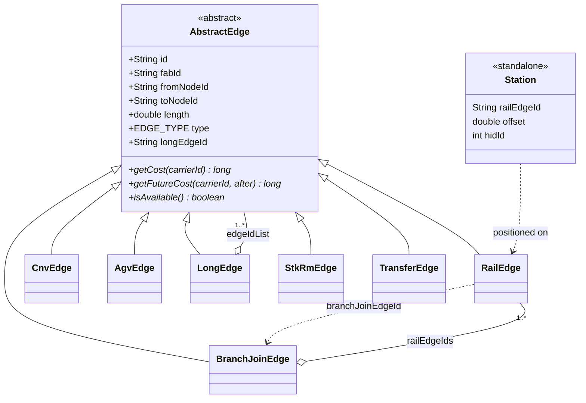

### 0.4 Mermaid 클래스 다이어그램 — Node 트리

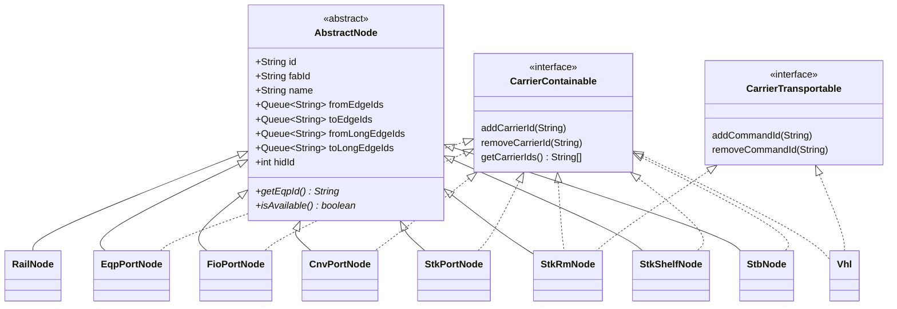

> 주목: **RailNode 는 CarrierContainable 을 구현하지 않는다** — 레일은 정거장이 아니라 “지나가는 길”이기 때문. 실제로 차량을 담는 곳은 Port/Shelf/Stb/Vhl 들이다.

### 0.5 Mermaid — 데이터 흐름 개요

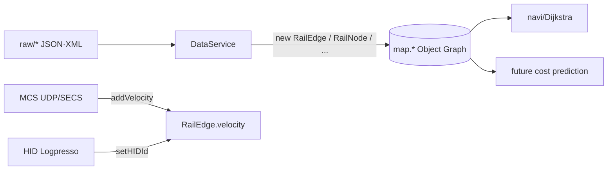

---

## §1 Abstract (Edge, Node)

### 1.1 `AbstractEdge.java` (247 line)

- **요약**: 모든 엣지(레일/컨베이어/스토커룸/이재 등)의 공통 슈퍼클래스. 노드 ID 두 개 + 길이 + 타입 + fabId.
- **부모**: `java.lang.Object` (추상)
- **enum** (L7): `EDGE_TYPE { LONGEDGE, RAILEDGE, STKRMEDGE, TRANSEDGE_ACQUIRE, TRANSEDGE_DEPOSIT, CNVEDGE, BRANCHJOINEDGE, AGVEDGE }`
- **필드 (L9–L25)**:

| 필드 | 타입 | 의미 |
|---|---|---|
| `batchFlush` (L9) | boolean (transient) | Redis batch flush 토글 |
| `id` (L10) | String | 엣지 고유 ID |
| `fabId` (L11) | String | 소속 FAB ID (M14/M16 등) |
| `fromNodeId` (L12) | String | 출발 노드 ID |
| `toNodeId` (L13) | String | 도착 노드 ID |
| `areaName/bayName` (L14–15) | String | Area/Bay 이름 |
| `areaId/bayId` (L16–17) | String | Area/Bay ID |
| `longEdgeId` (L18) | String | 이 엣지를 포함하는 LongEdge ID |
| `length` (L19) | double | 길이(mm) |
| `type` (L20) | EDGE_TYPE | 엣지 종류 |
| `isUpdate` (L21) | boolean | 업데이트 flag |
| `fromNodeFabBit/toNodeFabBit` (L22–23) | int (transient) | 양끝 노드 FAB 비트마스크 캐시 |
| `fromNode/toNode` (L24–25) | AbstractNode (transient) | lazy 로드되는 실체 |

- **추상 메서드** (L89–93):
  - `getCost(carrierId): long` — 운반 비용(ms)
  - `getFutureCost(carrierId, after): long` — `after`(ms) 후 예상 비용
  - `getFutureTransCount(carrierId, after): int` — 같은 시점에 도달할 다른 운반 개수
  - `isAvailable()`, `isAvailable(PROCESS_TYPE)` — 가용성
- **주요 메서드**:
  - `changed(AbstractEdge oe)` L27 — diff용 변경 감지(fabId/from/to/area/bay/longEdgeId/length/type 비교)
  - `getFromNode()/getToNode()` L212/L240 — lazy 로 `DataService.getDataSet().getNodeMap()` 조회 후 캐시
  - `getFromNodeFabBit()/getToNodeFabBit()` L220/L230 — `DataService.getFabBits()` 결과 캐시

### 1.2 `AbstractNode.java` (463 line)

- **요약**: 모든 노드(레일 분기/이재 포트/쉘프/Stb)의 공통 슈퍼클래스. 인접 엣지 ID 큐 + 인접 LongEdge ID 큐.
- **부모**: `java.lang.Object` (추상)
- **필드 (L22–49)**:

| 필드 | 타입 | 의미 |
|---|---|---|
| `batchFlush` (L22) | boolean (transient) | |
| `fabId, id, name` (L23–25) | String | 식별자 |
| `fromEdgeIds` (L26) | Queue<String> | 들어오는 엣지 ID들 (직렬화) |
| `fromEdges` (L27) | Queue<AbstractEdge> (transient) | 캐시 실체 |
| `toEdgeIds / toEdges` (L28–29) | 동일 패턴 | 나가는 엣지 |
| `fromLongEdgeIds / fromLongEdges` (L30–31) | Queue | LongEdge 인입 |
| `toLongEdgeIds / toLongEdges` (L32–33) | Queue | LongEdge 인출 |
| `fromRailLongEdgeIds / fromRailLongEdges` (L34–35) | Queue | LongEdge 중 **레일 only** 인입 (`:RN:` 패턴 매칭) |
| `toRailLongEdgeIds / toRailLongEdges` (L36–37) | Queue | LongEdge 중 레일 only 인출 |
| `isJunction` (L38) | boolean | 합류점 |
| `isBranch` (L39) | boolean | 분기점 |
| `isTerminal` (L40) | boolean | 단말(말단) — 포트/쉘프/Stb 등 `isTerminal=true` |
| `isTeConnection` (L41) | boolean | TE 접속 |
| `areaName/bayName/areaId/bayId` (L42–45) | String | |
| `isUpdate` (L46) | boolean (transient) | |
| `mcpName` (L47) | String | MCP(Material Control Point) 명 |
| `hidId` (L49) | int | **2025.02.17 추가** — HID 그룹 ID. -1=unknown |

- **추상 메서드** (L123–126): `getEqpId/setEqpId/isAvailable/setAvailable`
- **주요 메서드**:
  - `isJunction()` L203, `isBranch()` L207 — 실제로는 `fromEdgeIds.size() > 1` / `toEdgeIds.size() > 1` 로 동적 판정
  - `getFromRailLongEdgeIds()` L152, `getToRailLongEdgeIds()` L182 — RailNode 인스턴스만 정규식 `.+:RN:.+:RN:.+` 으로 레일 LongEdge만 필터링 후 캐시
  - `getMcpName(DataSet ds)` L330 — instanceof 분기로 EqpPort/Stb/RailNode/FioPort/StkPort/CnvPort 각각 다르게 MCP 이름 결정
  - `setHidId/getHidId` L455/L459

---

## §2 Edge 8종

### 2.1 `RailEdge.java` (486 line) ★ 가장 중요

- **요약**: OHT가 실제로 달리는 **단선 레일 한 구간** (노드-노드). MCS의 모든 차량 위치 메시지가 이 엣지에 매핑됨.
- **부모**: `AbstractEdge`
- **enum** (L428): `RAIL_DIRECTION { NONE, LEFT, RIGHT }`

#### 2.1.0 RailEdge ↔ 주변 객체 관계도

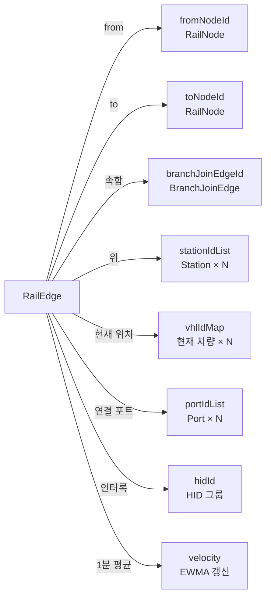

#### 2.1.1 필드 (L24–42)

| 필드 | 타입 | 의미 |
|---|---|---|
| `logger` (L24) | Logger (transient) | |
| `branchJoinEdgeId` (L25) | String | 이 레일이 속한 BranchJoinEdge ID (분기/합류 묶음) |
| `stationIdList` (L26) | ConcurrentLinkedQueue<String> | 이 레일 위에 얹힌 Station들의 ID. `RailEdge` ↔ `Station` 관계는 1:N |
| `vhlIdMap` (L27) | ConcurrentHashMap<String,Integer> | **현재 이 레일 위에 있는 차량 ID 집합**. Value(Integer)는 사용되지 않음 (사실상 Set). VHL UDP의 railEdgeId 갱신 시 이전 엣지에서 remove + 새 엣지에 add |
| `isAvailable` (L28) | boolean | 가용성 (장애 시 false) |
| `maxVelocity` (L29) | double | 최대 속도 (m/min). config로 로드 |
| `velocity` (L30) | double | **현재 평균 주행속도 (m/min)**. `addVelocity()` 로 EWMA 갱신 |
| `lastVelocity` (L31) | double | 직전 velocity (히스토리) |
| `hisCnt` (L32) | long (transient) | velocity 갱신 횟수 카운터. 0이면 첫 샘플로 덮어씀, ≥1이면 EWMA |
| `loopId` (L33) | int | 루프 ID (POD 전용 루프 등 격리에 사용). -1=일반 |
| `hidId` (L34) | int | **HID(Hardware ID)**. 같은 인터록 구간의 레일끼리 동일. -1=unknown. **DataService.java:3157 `railEdge.setHIDId(hidId)`** 에서 HID 그룹 계산 후 일괄 부여 |
| `zcuId` (L35) | String | ZCU(Zone Control Unit) ID |
| `facId` (L36, final) | String | Facility ID (생성자 인자, immutable) |
| `mcpName` (L37) | String | MCP 명 |
| `railDir` (L38) | RAIL_DIRECTION | 분기 방향 (NONE/LEFT/RIGHT). 분기점에서 어느 쪽으로 가는 엣지인지 |
| `fromAddress` (L39, final) | int | 시작 노드 주소(번호) |
| `toAddress` (L40, final) | int | 끝 노드 주소 |
| `portIdList` (L41) | List<String> | 이 레일이 서비스하는 포트 ID 목록 |
| `changedVelocity` (L42) | boolean | 속도 변경 감지 플래그 (초기값 배제용) |

#### 2.1.2 생성자 (L83)

```java
RailEdge(fabId, id, facId, mcpName, fromNodeId, toNodeId, ignoredBatchFlush,
         length, isUpdate, railDir, fromAddress, toAddress)
```
- `super(...)` 로 `EDGE_TYPE.RAILEDGE` 고정.
- `facId/fromAddress/toAddress` 는 final.

#### 2.1.3 주요 메서드 — 비용/속도

- `getCost(String carrierId)` L107:
  ```
  cost(ms) = length(mm) / (velocity(m/min) * 1000 / 60 / 1000)
          = length / (velocity * 1/60)
  ```
  velocity ≤ 0 이면 1로 보정.
- `getVhlCountCost()` L115 — `cost + idleVhlCnt*p1 + workVhlCnt*p2 + workDestCnt*p3` (`PredictionPara`).
- **`addVelocity(double velocity)` L308** — 핵심 갱신 로직:
  - NaN/Infinite 무시
  - `< 1.5` → 1.5로 clamp
  - `> maxVelocity` → maxVelocity로 clamp
  - `hisCnt > 0` 인 경우: `velocity = velocity * w + newVelocity * (1-w)` (`PredictionPara.lastHisWeight` 가중 EWMA)
  - 첫 샘플(`hisCnt == 0`)은 그대로 덮어쓰기
  - `changedVelocity = true`
- `addHistory()` L330 — `hisCnt++` (호출자가 `addVelocity` 후 별도로 누적)

#### 2.1.4 velocity 가 갱신되는 외부 경로

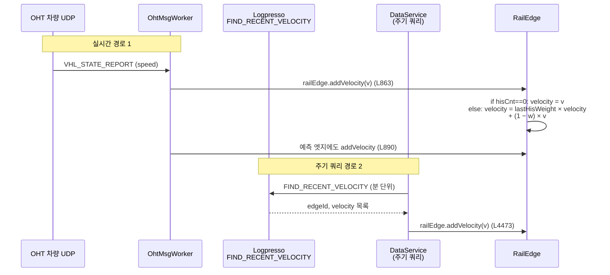

- **`DataService.java:4473`**: 주기적으로 `FIND_RECENT_VELOCITY` 쿼리(Logpresso)로 최근 실측 속도를 가져와 `railEdge.addVelocity(velocity)` 호출.
- **`OhtMsgWorkerRunnable.java:863, 890`**: OHT UDP 메시지에서 차량 속도(speed) 수신 시, 차량이 머문 마지막 RailEdge / 예측 엣지에 `addVelocity()` 누적.

#### 2.1.5 HIDId 가 갱신되는 경로

- **`DataService.java:3157`** `railEdge.setHIDId(hidId)`:
  - HID 그룹 빌드 단계에서, `mcpName` 별로 HID 구역 추출 → 그 구역에 속한 RailEdge ID 목록(`mapRailEdgeId`)을 모두 모은 뒤 **일괄 동일 hidId 부여**.
  - 이후 `_insertHidDataIntoLogpresso(tmpHidMap)` 로 Logpresso에 적재.
  - 결과: 같은 HID 인터록 구간의 모든 RailEdge 가 동일한 `hidId` 를 갖게 됨 → 차량 위치 추적 시 “지금 HID-X 구간에 몇 대 있는가” 같은 집계가 가능.

#### 2.1.6 부가 메서드

- `getCurrentVhlStateMap/DetStateMap/CycleMap/RunCycleMap` L168/L183/L199/L215 — `vhlIdMap.keySet()` 순회하며 차량 상태별 카운트 집계
- `isToJunctionEdge()` L234 — 도착 노드가 RailJunction 인가
- `getDensity()` L438 — vhl 길이 합 / 레일 길이 × 100 (M14: 784+300mm, M16: 943+300mm 차량 길이)
- `getFutureCost / getFutureTransCount / getFutureAcqCount / getFutureDpstCount` (L230, L375, L387) — 모두 자기 LongEdge로 위임

#### 2.1.7 다른 객체와의 관계

```
RailNode --(toEdgeIds)--> RailEdge --(toNodeId)--> RailNode
RailEdge.branchJoinEdgeId --> BranchJoinEdge
RailEdge.stationIdList --> Station[]
RailEdge.vhlIdMap --> Vhl[] (현재 점유 차량)
RailEdge.portIdList --> EqpPort/StkPort/FioPort/CnvPort
LongEdge.edgeIdList contains RailEdge.id
```

---

### 2.2 `LongEdge.java` (899 line)

- **요약**: 단순 엣지(RailEdge/CnvEdge/StkRmEdge/TransferEdge) 여러 개를 **노드 통과 없이 한 줄로 묶은 macro edge**. 비용 예측·캐싱·history 큐 단위.
- **부모**: `AbstractEdge`
- **필드 (L50–62)**:

| 필드 | 타입 | 의미 |
|---|---|---|
| `direction` (L50, final) | int | 방향 (0/1 등) |
| `edgeIdList` (L51) | ConcurrentLinkedQueue<String> | 묶은 엣지들의 ID 순차 |
| `estimatedCmdIdPassTimeMap` (L52) | ConcurrentMap<String,Long> | 명령 ID별 예상 통과 시각 |
| `last1HourCost` (L53) | long | 최근 1시간 평균 비용 |
| `transWeight` (L54) | double | 운반 가중치 |
| `acqTransWeight` (L55) | double | 회수 운반 가중치 |
| `dpstTransWeight` (L56) | double | 배달 운반 가중치 |
| `junctionMultiple` (L57) | double | 분기점 배수 |
| `transOverlapIntervalT` (L58) | double | 운반 겹침 인터벌 |
| `lastParaRefreshTime` (L59) | long | 파라미터 새로고침 시각 |
| `pathPredictQueue` (L60) | PriorityBlockingQueue<RouteItem> | **경로 예측 큐** — 미래에 이 엣지를 지날 RouteItem들 |
| `firstEdgeType` (L61) | EDGE_TYPE | 첫 엣지의 타입 (캐시) |
| `edgeList` (L62) | ConcurrentLinkedQueue<AbstractEdge> (transient) | edgeIdList의 실체 캐시 |

- **타입 분기 비용 계산 — `getFutureCost(carrierId, after)` L249**:
  - `RAILEDGE`: 합류 LongEdge가 있으면 양쪽 transCount 합산 후 `junctionMultiple` 적용. `cost + (transCnt + otherTransCnt) * transWeight * junctionMultiple + acqCnt*acqTransWeight + dpstCnt*dpstTransWeight`
  - `TRANSEDGE_ACQUIRE` L317: 이미 할당된 차량이 있으면 0, 아니면 `avgTransferCost + avgVhlCallCost + transCnt*transWeight`
  - `TRANSEDGE_DEPOSIT` L371: `avgTransferCost + transCnt*transWeight`
  - `CNVEDGE` L376: `getCost + transCnt*transWeight`
  - `STKRMEDGE` L391: From/To RM 구분, 현재 이동 중 carrier면 남은 시간 사용
- `getFutureTransCount(carrierId, after)` L564 — 동일하게 firstEdgeType별 분기, `pathPredictQueue` 순회하면서 ETA가 `[after-overlap, after+window]` 범위 안에 들어오는 RouteItem 카운트
- `getFutureAcqCount` L681 / `getFutureDpstCount` L737 — to 노드의 모든 from/to LongEdge 중 ACQUIRE/DEPOSIT 타입만 합산
- `getCost(carrierId)` L491 — `edgeList` 의 cost 단순 합
- `getPPCost()` L504 — `cost * 0.7 + pathPredictQueue.size() * 50/5000` (penalty)
- `addPredictItem(RouteItem)` L841 / `removePredictItem` L845 — pathPredictQueue 조작
- `getDensity()` L865 — RailEdge 묶음일 때만 차량 점유 밀도 %

---

### 2.3 `CnvEdge.java` (107 line)

- **요약**: **컨베이어 한 구간**. 평균 운반 인터벌 기반 단순 모델.
- **부모**: `AbstractEdge`
- **필드**:
  - `avgTransferIntervalT = 150` (L10) — 평균 운반 인터벌(ms). [300, 30000] 범위 clamp.
- **생성자** L21 — `EDGE_TYPE.CNVEDGE` 고정.
- **메서드**:
  - `getCost()` L37 = `avgTransferIntervalT`
  - `getFutureCost/getFutureTransCount` L38/L42 — LongEdge로 위임
  - `addCost(long)` L54 — clamping은 있지만 실제 EWMA 갱신은 주석처리
  - `getAvgTransferIntervalT/setAvgTransferIntervalT` L64/L74 — getter/setter 모두에서 clamp
  - `isAvailable()` L100 = from/to 노드가 둘 다 available

---

### 2.4 `AgvEdge.java` (97 line)

- **요약**: AGV(Automated Guided Vehicle) 운반 구간. `CnvEdge` 와 거의 동일 구조(다른 EDGE_TYPE).
- **부모**: `AbstractEdge`
- **필드**: `avgTransferIntervalT = 150` (L9)
- **생성자** L11 — `EDGE_TYPE.AGVEDGE`.
- **메서드** 구조는 CnvEdge 와 100% 동일 (단, 타입만 다름). 사실상 코드 복제.

---

### 2.5 `BranchJoinEdge.java` (178 line)

- **요약**: **분기/합류 구간에 속한 RailEdge들을 한 묶음으로 보는 macro edge**. 차선이 두 갈래로 갈렸다 다시 모이는 등의 구간 단위로 비용/속도를 통합.
- **부모**: `AbstractEdge`
- **필드 (L11–16)**:
  - `railEdgeIds: ConcurrentLinkedQueue<String>` — 묶인 RailEdge ID들
  - `cost: long = -1` — 누적 비용 캐시
  - `isAvailable: boolean = false`
  - `velocity / maxVelocity: double = -1`
  - `vhlCount: int = -1`
- **메서드**:
  - `getCost(carrierId)` L52 — `railEdgeIds` 순회 합산
  - `getVelocity()` L107 — `length / cost * 60` (m/min 환산)
  - `getMaxVelocity()` L124 — 첫 호출 시 묶인 레일들 중 max
  - `getVhlCount()` L142 — 묶인 레일들의 vhlIdMap 합
  - `isAvailable()` L81 — 모두 available 일 때만 true
  - `getMcpName()` L26 — from 노드의 mcpName
  - `getDensity()` L152 — 차량 점유 밀도

---

### 2.6 `StkRmEdge.java` (319 line)

- **요약**: **스토커 룸(Stocker Room) 내부 운반 엣지**. StkPortNode ↔ StkShelfNode 사이의 로봇 운반.
- **부모**: `AbstractEdge`
- **필드 (L29–34)**:
  - `eqpId: String` — 어느 스토커 장비인지
  - `avgTransferCost: long = 7000` — 평균 운반 시간(ms)
  - `isFromRm: boolean` — `true`=룸→포트(out), `false`=포트→룸(in)
  - `isBridgeRmEdge: boolean` — 두 RM 간 bridge 엣지인지
  - `currentMovingCarrierIds: Set<String>` — 현재 운반 중인 carrier ID
  - `stkType: Stocker.STK_TYPE (transient)` — 스토커 타입 (lazy)
- **메서드**:
  - `getStockerType()` L86 — lazy, isFromRm에 따라 from/to 노드의 eqpId로 `DataService.getDataSet().getStockerMap()` 조회
  - `getCost(carrierId)` L122 — `avgTransferCost + StkPortNode.avgRemovalIntervalT` (포트 쪽 인접일 때)
  - `addCost(long)` L219 — `avgTransferCost = EWMA`. 결과가 100s 초과면 7000으로 리셋
  - `addCurrentMovingCarrierId/removeCurrentMovingCarrierId` L271/L279

---

### 2.7 `TransferEdge.java` (355 line)

- **요약**: **이재(transfer) 엣지** — Station ↔ RailNode 사이의 OHT pickup/drop 동작. ACQUIRE(회수)와 DEPOSIT(배달) 두 종류.
- **부모**: `AbstractEdge`
- **필드 (L13–19)**:
  - `fromStation: String`, `toStation: String`
  - `avgTransferCost: long = 7000`
  - `avgVhlCallCost: long = 20000` — 차량 호출(이동) 평균 비용
  - `isAcqEdge: boolean` — true=ACQUIRE(회수), false=DEPOSIT(배달)
  - `assignedVhlCarrierId: String` — `vhlId-carrierId` 포맷 (할당된 차량+carrier)
- **생성자** L55, L73 — `isAcqEdge ? TRANSEDGE_ACQUIRE : TRANSEDGE_DEPOSIT`. `init()` 에서:
  - DEPOSIT + 컨베이어 노드 (`:CPN:` 포함) → avgTransferCost = 12000
  - ACQUIRE + 컨베이어 노드 → avgVhlCallCost = 60000, avgTransferCost = 15000 (컨베이어→OHT→컨베이어 경로 억제용)
- **메서드**:
  - `getCost(carrierId)` L240 = `avgTransferCost`
  - `addAvgTransferCost(newCost)` L265 — EWMA
  - `addVhlCallCost(newCost)` L334 — EWMA. 60초 초과는 60초로 cap

---

### 2.8 `Station.java` (532 line) — 엣지가 아닌 “정거장” 엔티티

- **요약**: 레일 엣지 위 특정 offset 위치에 있는 **반송 위치(이재 포인트)**. 차량이 멈춰 carrier를 acquire/deposit하는 지점. (엣지/노드가 아닌 standalone Bean이지만 패키지상 `edge/` 안)
- **부모**: 없음
- **enum** (L315): `STATION_CARRIER_STATE { UNKNOWN, ASSIGN_WAIT, ASSIGNED, NO_CARRIER }`
- **필드 (L9–49)**:

| 필드 | 타입 | 의미 |
|---|---|---|
| `batchFlush` (L9) | boolean (transient) | |
| `fabId, id, mcpName` (L10–12) | String | |
| `railNodeId` (L13) | String | 인접 레일 노드 |
| `portId` (L14) | String | 연결된 포트 ID (EqpPort 등) |
| `carryType` (L15) | int | carry 타입 (0/1/5/9/A) |
| `areaName/bayName/areaId/bayId` (L16–19) | String | |
| `offset` (L20) | double | 레일 엣지 시작점부터의 offset(mm) |
| `railEdgeId` (L21) | String | 이 스테이션이 얹힌 RailEdge |
| `stationType` (L22) | STATION_TYPE | (raw.RawStation 의 enum 재사용) |
| `acquireTransferEdgeId/depositTransferEdgeId` (L23–24) | String | 이 스테이션 ↔ railNode 의 TransferEdge ID들 |
| `avgAssignCost` (L25) | long | 평균 할당 비용 (초기 24000) |
| `avgReassignCount/reassignCount` (L26–27) | double/int | 재할당 횟수 |
| `firstAssignCost` (L28) | long | 첫 할당 비용 |
| `receivedTime` (L29) | long | |
| `lastAvg*` (L30–32) | | 이전 통계 |
| `drawX/drawY` (L33–34) | double | UI 좌표 |
| `isAvailable / lastIsAvailable` (L35–36) | boolean | |
| `carrierId / lastCarrierId` (L37, L43) | String | 현재/직전 점유 carrier |
| `outGoingCmdId` (L38) | String | 송출 명령 ID |
| `incommingCmdIdMap` (L39) | ConcurrentHashMap<String,Long> | 진입 예정 명령 ID → 등록 시각 |
| `carrierState / lastCarrierState` (L40, L44) | STATION_CARRIER_STATE | |
| `destPortId / lastDestPortId` (L41, L45) | String | |
| `assignedVhl / lastAssignedVhl` (L42, L46) | String | |
| `isUpdate` (L47, transient) | boolean | |
| `hidId` (L49) | int | HID ID. setter는 -1 미만 입력 시 -1로 보정(L526) |

- **주요 메서드**:
  - `addIncommingCmdId/removeIncommingCmdId` L498/L512
  - `getHidId/setHidId` L522/L526
- **다른 객체 관계**: `Station ↔ RailEdge`(소속), `Station ↔ RailNode`(railNodeId), `Station ↔ Port`(portId), `Station ↔ TransferEdge`(acquire/deposit edge).

---

## §3 Node 8종

### 3.0 노드별 역할/구현 인터페이스 매트릭스

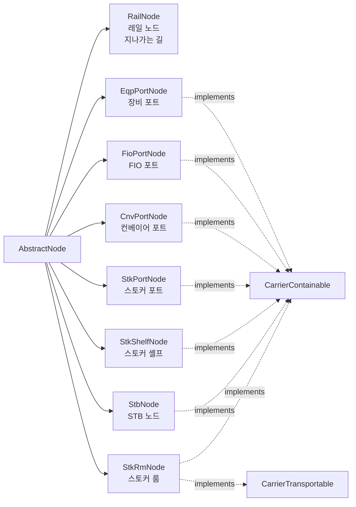

`RailNode` 만 Containable/Transportable 둘 다 미구현 (단순 통과 지점).
`StkRmNode` 만 Transportable 도 함께 구현 (스토커 룸은 command queue 보유).


### 3.1 `RailNode.java` (234 line)

- **요약**: 레일 위의 한 지점(분기점/합류점/일반 통과점). OHT 위치의 기본 좌표.
- **부모**: `AbstractNode` (interface 없음 — CarrierContainable X)
- **필드 (L12–23)**:
  - `drawX/drawY: double` — UI 좌표
  - `cadX/cadY/cadZ: double` — 실제 CAD 좌표
  - `eqpId: String` (보통 "")
  - `isRailBranch: boolean` — 분기점(나가는 길이 2개 이상)
  - `isRailJunction: boolean` — 합류점(들어오는 길이 2개 이상)
  - `leftEdgeId / rightEdgeId: String` — 분기 시 좌/우 레일 엣지 ID
  - `toRailEdges: Queue<RailEdge> (transient)` — 캐시
  - `address: int` — 노드 주소(번호)
- **생성자** L81 — `super(fabId, id, name, null, null, null, null, isUpdate)` — fromEdgeIds/toEdgeIds 등은 빌더가 나중에 채움
- `isAvailable()` L173 — **항상 true** (레일은 노드 자체로는 막힘 없음, 차단은 RailEdge가 담당)

---

### 3.2 `EqpPortNode.java` (188 line)

- **요약**: 일반 **장비 포트** (단일 carrier 보유 가능). 차량이 carrier 한 개를 올리거나 내리는 지점.
- **부모**: `AbstractNode` + `CarrierContainable`
- **필드 (L15–20)**:
  - `processTypeSet: Set<PROCESS_TYPE>`
  - `carrierId: String` — 현재 carrier 1개
  - `isAvailable: boolean = true`
  - `isInlinePort: boolean`
  - `occupiedTime: long`
  - `eqpId: String`
- `init()` L95 에서 `isTerminal=true` 강제 — 모든 EqpPortNode 는 단말
- `addCarrierId/removeCarrierId` L152/L157 — 단일 carrier 슬롯 (덮어쓰기)
- `getCarrierIds()` L162 — carrierId 비어있으면 length=0 배열

---

### 3.3 `FioPortNode.java` (209 line)

- **요약**: **FIO(Foup Inlet Outlet) 포트** — 여러 SubPort(LP/BP/OP)를 가진 멀티 포트. AUTO/MANUAL access mode.
- **부모**: `AbstractNode` + `CarrierContainable`
- **enum**: `FIO_SUB_PORT_TYPE{LP,BP,OP}`, `FIO_SUB_PORT_ACCESSMODE{AUTO,MANUAL}`, `FIO_PORT_INOUT_TYPE{IN,OUT,BOTH}`
- **필드 (L15–20)**:
  - `processTypeSet: Set<PROCESS_TYPE>`
  - `eqpId: String`
  - `carrierIdList: ConcurrentLinkedQueue<String>` — **다수 carrier**
  - `isAvailable: boolean`
  - `inOutType: FIO_PORT_INOUT_TYPE`
  - `subPortList: ConcurrentLinkedQueue<SubPort>`
- **내부 클래스 SubPort** L153: `type/name/accessmode`, `Comparable<SubPort>` 구현
- `init()` L101 — `isTerminal=true`
- `addCarrierId/removeCarrierId` L117/L124 — 중복 체크 후 add/remove

---

### 3.4 `CnvPortNode.java` (382 line)

- **요약**: **컨베이어 포트** — Zone/Bed/Input/Output/QS/InLft/OutLft/Lft 타입을 갖는 컨베이어 노드. 단일 carrier 슬롯이지만 처리 로직 복잡.
- **부모**: `AbstractNode` + `CarrierContainable`
- **enum**: `CNV_NODE_TYPE{ZONE,BED,INPUT,OUTPUT,QS,INLFT,OUTLFT,LFT}`, `CNV_REF_DIR{UP,DOWN,LEFT,RIGHT}`
- **필드 (L15–37)**:
  - `eqpId/zoneNo/containingZoneId1/2/currentNodeId/prevNodeId/groupId/level: 다양`
  - `displayFabId/displayMcpName: String` — UI 표시용 (실제 fabId와 다를 수 있음)
  - `drawX/drawY: double`
  - `type: CNV_NODE_TYPE`, `dir: CNV_REF_DIR`
  - `carrierIdList: ConcurrentLinkedQueue<String>` — 단일 슬롯처럼 사용 (`addCarrierId` 시 clear 후 add — L189)
  - `maxCapaCnt: int`
  - `avgRemovalIntervalT: long` — [0, 120000] 범위, 벗어나면 30000으로 reset (L210)
  - `processTypeSet: Set<PROCESS_TYPE>`
  - `isAvailable: boolean`
  - `carrierInstalledTime/destPointedTime/carrierRemovedTime: long = -1` — 타임스탬프
- **메서드**:
  - `addCarrierId` L188 — **clear 후 add** (단일 carrier slot 강제)
  - `addRemovalIntervalT(long)` L217 — EWMA로 평균 운반 인터벌 누적

---

### 3.5 `StkPortNode.java` (277 line)

- **요약**: **스토커 포트** — 스토커와 외부(레일/컨베이어)를 잇는 포트. 다수 SubPort 보유.
- **부모**: `AbstractNode` + `CarrierContainable`
- **enum**: `STK_SUB_PORT_TYPE{LP,BP,OP}`, `STK_PORT_INOUT_TYPE{IN,OUT}`
- **필드 (L16–26)**:
  - `eqpId: String`
  - `subPortList: ConcurrentLinkedQueue<SubPort>` — SubPort(type,name)
  - `carrierIdList: ConcurrentLinkedQueue<String>` — 다수 carrier
  - `maxCapaCnt: int`
  - `avgRemovalIntervalT: long = 30000L` — [0, 120000] clamp
  - `floorNo: int` — 층 번호 (다층 스토커)
  - `processTypeSet: Set<PROCESS_TYPE>`
  - `isAvailable: boolean`
  - `inOutType: STK_PORT_INOUT_TYPE`
  - `ohtFabId: String`, `ohtMcpNm: String` — OHT 측 fabId/mcpName (포트가 다른 fab의 OHT에 연결될 때)
- `addCarrierId/removeCarrierId` L142/L150 — 중복 체크 후 list add/remove

---

### 3.6 `StkRmNode.java` (216 line)

- **요약**: **스토커 룸(가상 노드)** — 한 스토커 안의 모든 셀프를 대표하는 가상 노드. CarrierContainable + CarrierTransportable 둘 다 구현 (carrier와 command 모두 보유).
- **부모**: `AbstractNode` + `CarrierContainable` + `CarrierTransportable`
- **필드 (L16–20)**:
  - `eqpId/carrierIdList/commandIdList/isAvailable/maxCapaCnt`
- **메서드**:
  - `addCommandId/removeCommandId` L160/L203
  - `cleanCommandIdList()` L166 — DataService.isBlocked 가드 후, commandMap/jobMap/carrierMap 조회로 없는/유효하지 않은 cmdId 제거
  - `addCarrierId/removeCarrierId` L143/L150

---

### 3.7 `StkShelfNode.java` (214 line)

- **요약**: **스토커 셀프** — 스토커 내부의 한 칸. Carrier가 실제로 보관되는 자리.
- **부모**: `AbstractNode` + `CarrierContainable`
- **필드 (L14–19)**:
  - `eqpId/carrierIdList/maxCapaCnt/isAvailable/processTypeSet/isN2`
- `init()` L109 — `isTerminal=true`
- `isN2()` L162 — `DataService.getStockerMap().get(eqpId).isN2()` 위임 (런타임 조회)
- `addCarrierId/removeCarrierId` L191/L200

---

### 3.8 `StbNode.java` (216 line)

- **요약**: **STB(Stocker Buffer) 노드** — N2 환경, Reader 포트 여부 등을 갖는 버퍼.
- **부모**: `AbstractNode` + `CarrierContainable`
- **필드 (L15–21)**:
  - `processTypeSet: Set<PROCESS_TYPE>`
  - `carrierId: String` — 단일 슬롯
  - `isAvailable: boolean = true`
  - `isN2: boolean` — N2 분위기 여부
  - `eqpId: String`
  - `occupiedTime: long`
  - `isReaderPort: boolean`
- `init()` L116 — `isTerminal=true`
- `getProcessTypeSet()` L186 — 비어있으면 `DataService.getStbGroupMap().get(eqpId).getProcessTypeSet()` 폴백
- `addCarrierId/removeCarrierId` L199/L204 — 단일 슬롯

---

## §4 기타 — Label, Vhl, Carrier* 인터페이스

### §4.0 Carrier 이동 흐름 (Containable / Transportable 인터페이스)

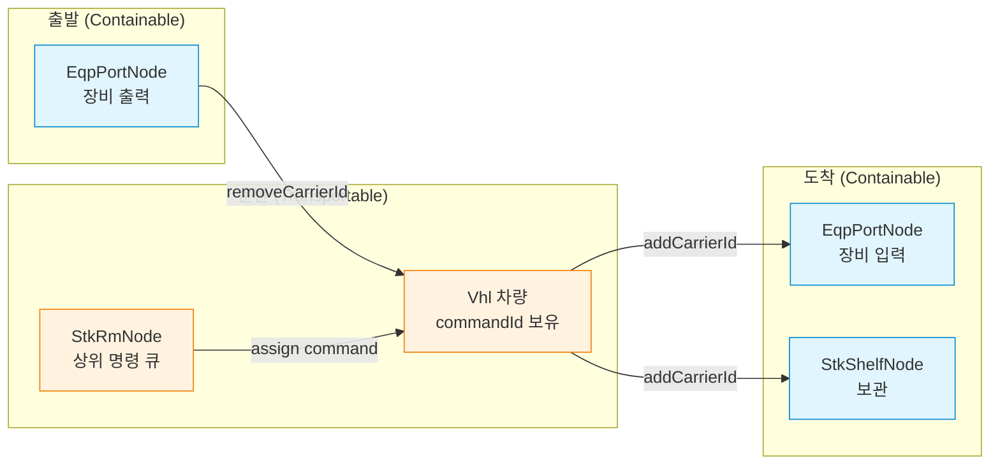

`Containable` = "carrier 를 담을 수 있는 슬롯" (포트/셸프/차량 등 어디든 carrier 1개 보유)
`Transportable` = "command 를 수행해 carrier 를 이동시키는 주체" (Vhl, StkRm)


### 4.1 `CarrierContainable.java` (10 line)

- **요약**: “carrier를 담을 수 있는 객체”의 마커 인터페이스. 노드 7종 + Vhl 이 구현.
- **메서드**:
  - `getName()/getId()/getEqpId()`
  - `addCarrierId(String)`, `removeCarrierId(String)`
  - `getCarrierIds(): String[]`

### 4.2 `CarrierTransportable.java` (8 line)

- **요약**: “carrier를 운반할 수 있는 객체”의 마커 인터페이스. **StkRmNode + Vhl** 만 구현. (포트는 정적이라 제외)
- **메서드**:
  - `getId()/getEqpId()`
  - `addCommandId(String)`, `removeCommandId(String)`

### 4.3 `Label.java` (87 line)

- **요약**: 맵 위에 표시할 텍스트 라벨 (UI용). RawLabel에서 변환.
- **부모**: 없음. final 필드만(immutable).
- **필드 (L26–31)**: `id/mcpName/address/x/y/label` 전부 final
- **생성자** L33 — RawLabel을 받아 그대로 복사
- 단순 DTO. 비즈니스 로직 없음.

### 4.4 `Vhl.java` (536 line) — **차량(Vehicle = OHT)**

#### Vhl 상태 전이 (VHL_STATE / VHL_DET_STATE / VHL_CYCLE / RUN_CYCLE)

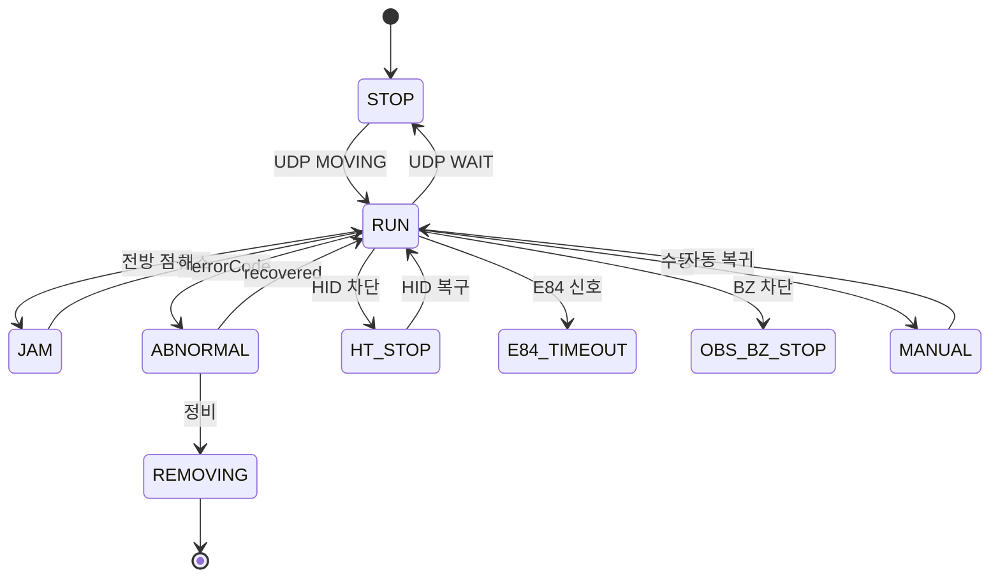

#### Vhl 클래스 구성

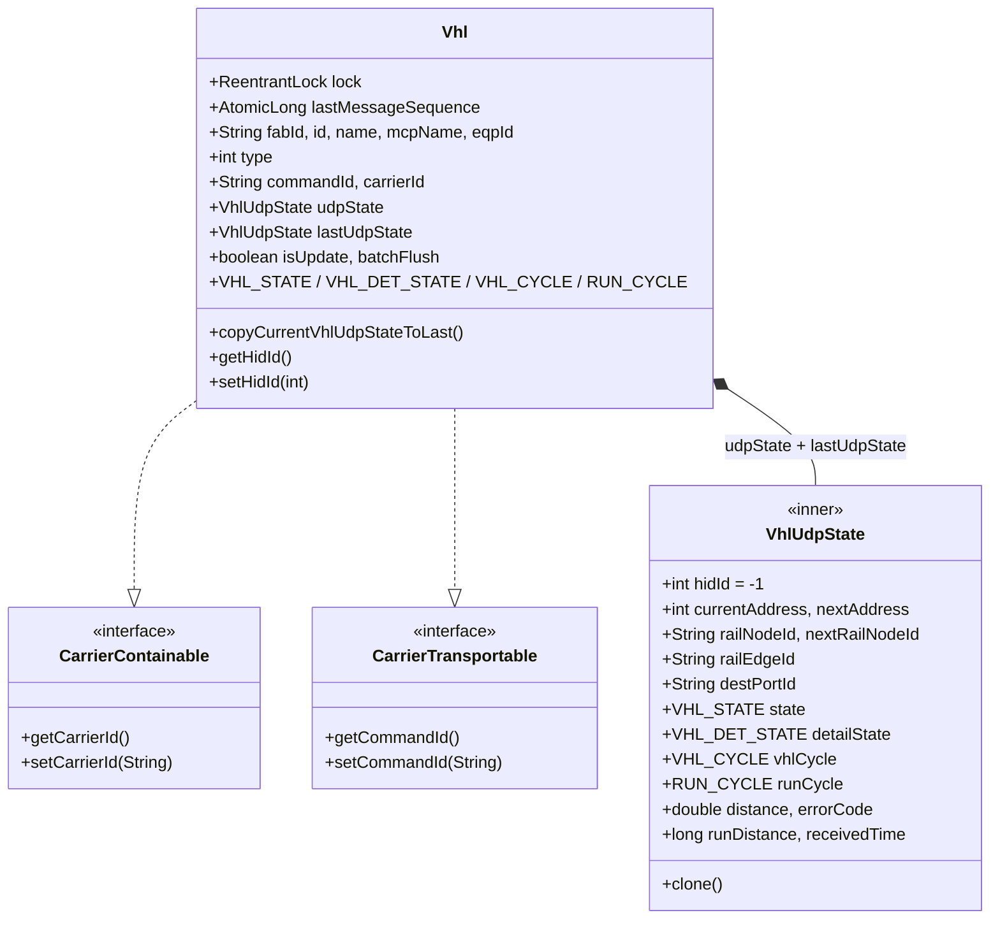

- **요약**: 한 대의 OHT. Carrier 한 개 보유(Containable) + Command 한 개 수행(Transportable). UDP 상태를 담는 `VhlUdpState` 를 내부에 둠.
- **부모**: `Object` + `CarrierContainable, CarrierTransportable`
- **enum**:
  - `VHL_STATE` L205: RUN/STOP/ABNORMAL/MANUAL/REMOVING/OBS_BZ_STOP/JAM/HT_STOP/E84_TIMEOUT
  - `VHL_DET_STATE` L238: NONE/WAIT/STAGE_WAIT/STANDBY_WAIT/DEPOSIT_SIG_WAIT/ACQ_WAIT/MAP_WAIT/MOVING/PARKING_UTS_MOVING/STAGE_MOVING/STANDBY_MOVING/BALANCE_MOVING/PARKING_MOVING
  - `RUN_CYCLE` L275: NONE/POSITION_DETECT/MOVING/ACQUIRE/DEPOSIT/SAMPLING/FLOOR_TRANS/WHEELDRIVE/MANUAL_CONTROL/DRIVE_TEACHING/TRANS_TEACHING/TEST_1/TEST_2/TEST_3/BUILDING_TRANS/EVACUATION
  - `VHL_CYCLE` L315: NONE/MOVING/ACQUIRE_MOVING/ACQUIRING/DEPOSIT_MOVING/DEPOSITING/MAINT_MOVING/WAITING/INPUT

- **필드 (L15–28)**:

| 필드 | 타입 | 의미 |
|---|---|---|
| `lock` (L15) | ReentrantLock(true) (transient) | 공정 락 |
| `lastMessageSequence` (L16) | AtomicLong (transient) | UDP 시퀀스 카운터 |
| `fabId/id/name/mcpName/eqpId` (L17–21) | String | 식별자 |
| `type` (L22) | int | 차량 종류 |
| `commandId` (L23) | String | 현재 수행 명령 |
| `carrierId` (L24) | String | 현재 적재 carrier |
| `udpState` (L25, final) | VhlUdpState | 현재 UDP 상태 |
| `lastUdpState` (L26) | VhlUdpState | 직전 UDP 상태 (clone) |
| `isUpdate` (L27, transient) | boolean | |
| `batchFlush` (L28) | boolean | |

- **내부 클래스 `VhlUdpState`** L430 (Cloneable):

| 필드 | 의미 |
|---|---|
| `vehicleId` | |
| `udpCarrierId` | UDP가 인식한 carrier id |
| `state: VHL_STATE = REMOVING` | |
| `isFull, errorCode, isOnline` | |
| `railNodeId, distance, nextRailNodeId, railEdgeId` | **현재 위치** |
| `runCycle, vhlCycle` | |
| `destStationId, receivedTime` | |
| `emStatus: byte`, `groupId` | |
| `sourcePortId, destPortId, priority` | |
| `detailState: VHL_DET_STATE` | |
| `runDistance: long` | 누적 주행거리 |
| `hidId: int = -1` | **차량이 위치했던 HID 기억** |
| `currentAddress: int = -1`, `nextAddress: int = -1` | 현재/다음 노드 주소 |
| `crossPointId` | 교차점 |

- **메서드 흐름**:
  - `copyCurrentVhlUdpStateToLast()` L62 — 매 UDP 갱신 후 lastUdpState 백업
  - `getLock()` L471 — `tryLock(50ms)`, 실패 시 null 반환 (호출자가 락 미획득 시 처리)
  - `addCarrierId/removeCarrierId` L348/L353 — 단순 setter (carrierId 1개)
  - `addCommandId/removeCommandId` L367/L372 — commandId가 일치할 때만 제거
  - `getHidId/setHidId` L529/L533 — udpState.hidId 위임

---

## §5 `mcslog/` — MCS 로그 조회용 VO (DTO)

이 4개 파일은 **그래프 모델과 무관**. MCS Log Web UI에서 조회 조건을 받아 서버로 보내는 **검색 폼 VO**.

### 5.1 `TotalVo.java` (235 line) — 통합 로그 조회

- **필드**: `fabSite`, page(`pageNum/rowNum`), machine(`areaName/bayName/machineType/machineName`), `fab`, `level`, `searchOption(AND/OR)`, `process/thread/gtxnId/transactionId/messageName/comMsgName/operationName/carrier/commandId/unit/text/fulltext/key`, M14 별칭(`messageName_m, comMsgName_m, operationName_m`), 시간(`from/to/table`)
- 단순 getter/setter만.

### 5.2 `SecsVo.java` (150 line) — SECS 통신 로그

- **필드**: `fabSite/pageNum/rowNum/fab/level/host`, `carrier/vehicle/secs/carrierLoc/commandId/transferport/sourceport/destport/text/secsTextConditionCheckBox`, `from/to`

### 5.3 `EiVo.java` (102 line) — EI(Equipment Interface) 로그

- **필드**: `fabSite/pageNum/rowNum/fab/level/host/log`, `process/text/eiTextConditionCheckBox`, `from/to`

### 5.4 `MachineVo.java` (55 line) — 장비 검색 폼

- **필드**: `fabSite/machineType/selectFab/selectType/areaName/bayName`
- 가장 단순. 6.28 fabSite 추가 주석.

---

## §6 그래프 빌드 과정 (raw → map 객체)

### 6.1 전체 흐름

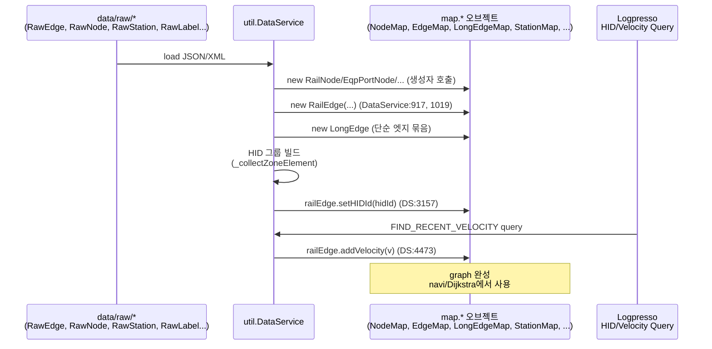

### 6.2 주요 빌드 진입점 (DataService.java 안에서 호출되는 위치)

- `DataService.java:917` — `final RailEdge railEdge = new RailEdge(...)` — 첫 번째 RailEdge 생성 루프
- `DataService.java:1019` — `final RailEdge railEdge = new RailEdge(...)` — 두 번째 (다른 FAB / 다른 path)
- `DataService.java:3140–3157` — `_collectZoneElement` 호출 후 `tmpRailEdgeMap` 에서 RailEdge 꺼내 동일한 `hidId` 일괄 부여 → Logpresso에 적재 (`_insertHidDataIntoLogpresso`)
- `DataService.java:4470–4473` — Logpresso `FIND_RECENT_VELOCITY` 결과로 모든 RailEdge에 `addVelocity` 호출 (EWMA 갱신)

### 6.3 실행 시 빌드 단계 요약

1. **raw 로드**: `RawEdge/RawNode/RawStation/RawLabel/RawHid/...` JSON 로드
2. **노드 생성**: RailNode/EqpPortNode/FioPortNode/CnvPortNode/StkPortNode/StkRmNode/StkShelfNode/StbNode 생성, `DataSet.nodeMap`에 등록
3. **엣지 생성**: RailEdge/CnvEdge/StkRmEdge/TransferEdge/AgvEdge 생성. 각 엣지에 `fromNodeId/toNodeId` 셋팅.
4. **노드-엣지 결선**: 각 노드의 `fromEdgeIds/toEdgeIds` Queue에 엣지 ID 추가
5. **LongEdge 빌드**: 단순 엣지 N개를 연결 가능한 한 줄로 묶어 LongEdge 생성. 각 단순 엣지의 `longEdgeId` 셋팅. 노드의 `fromLongEdgeIds/toLongEdgeIds` Queue 채움.
6. **BranchJoinEdge 빌드**: 분기/합류 구간의 RailEdge 묶음 식별 후 BranchJoinEdge 생성. RailEdge.`branchJoinEdgeId` 셋팅.
7. **Station 빌드**: RawStation → Station 변환, `railEdgeId/offset/portId` 결선. RailEdge.`stationIdList`에 추가.
8. **HID 빌드**: HID 구역별로 RailEdge 모음 → `setHIDId(hidId)` 일괄 호출 → Logpresso 적재
9. **velocity 초기 로드**: Logpresso 쿼리 → `addVelocity()` (서비스 시작 시점에 최근 운행 데이터 반영)

### 6.3.b 빌드 시퀀스 다이어그램

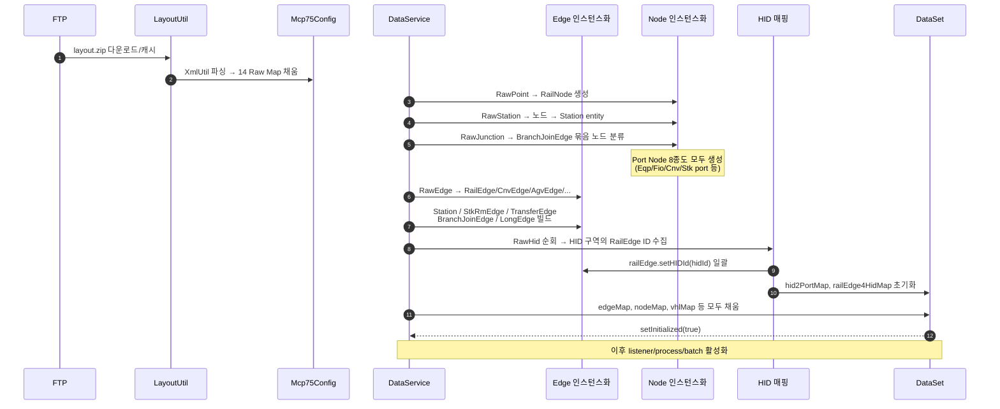

### 6.4 런타임 갱신 경로

| 무엇이 갱신되는가 | 어디서 | 어떻게 |
|---|---|---|
| `RailEdge.velocity` | OhtMsgWorkerRunnable:863, 890 (UDP) + DataService:4473 (Logpresso) | `addVelocity(v)` EWMA |
| `RailEdge.vhlIdMap` | UDP 차량 위치 갱신 시 | `addVhlId/removeVhlId` |
| `Vhl.udpState.railEdgeId` | UDP 메시지 | `setRailEdgeId` |
| `RailEdge.hidId` | 부팅 시점 1회 | `setHIDId` (DataService:3157) |
| `LongEdge.pathPredictQueue` | 경로 계산 시 | `addPredictItem/removePredictItem` |
| `Station.incommingCmdIdMap` | 명령 발행/취소 시 | `addIncommingCmdId/removeIncommingCmdId` |
| `Station.carrierState` | UDP MGM 이벤트 | setter |
| `Vhl.udpState.*` | UDP 매 메시지 | setter들 |

---

## 부록 A. RailEdge 핵심 필드 매트릭스 (요청 사항 정리)

| 필드 | 라인 | 초기값 | 갱신 위치 | 의미 |
|---|---|---|---|---|
| `HIDId` (`hidId`) | RailEdge.java:34 | -1 | DataService.java:3157 (부팅 시 HID 그룹 빌드) | 같은 인터록 구간의 레일끼리 동일. -1=unknown |
| `velocity` | RailEdge.java:30 | -1 | `addVelocity()` (RailEdge.java:308) ← OhtMsg(:863,:890) + DataService(:4473 Logpresso) | 현재 평균 속도 (m/min). EWMA |
| `maxVelocity` | RailEdge.java:29 | -1 | config 로드 시 setter | 최대 속도. velocity의 cap |
| `lastVelocity` | RailEdge.java:31 | -1 | addVelocity 안에서 setLastVelocity(this.velocity) | 직전 velocity |
| `portIdList` | RailEdge.java:41 | new ArrayList | 그래프 빌드 시 setter | 이 레일이 서비스하는 포트 ID 목록 |
| `fabId` | AbstractEdge.java:11 | "" | 생성자 | 소속 FAB |
| `fromNodeId/toNodeId` | AbstractEdge.java:12–13 | "" | 생성자 | 양 끝 노드 ID |
| `branchJoinEdgeId` | RailEdge.java:25 | "" | BranchJoin 빌드 시 setter | 소속 BranchJoinEdge |
| `vhlIdMap` | RailEdge.java:27 | empty CHM | addVhlId/removeVhlId (UDP) | 현재 점유 차량 |
| `loopId` | RailEdge.java:33 | -1 | config setter | 격리 루프 ID |
| `zcuId` | RailEdge.java:35 | "" | config setter | ZCU ID |
| `facId` | RailEdge.java:36 (final) | 생성자 인자 | — | Facility ID |
| `railDir` | RailEdge.java:38 | 생성자 인자 | setter | 분기 방향 |
| `fromAddress/toAddress` | RailEdge.java:39–40 (final) | 생성자 인자 | — | 노드 주소 번호 |
| `stationIdList` | RailEdge.java:26 | empty CLQ | 그래프 빌드 시 add | 얹힌 Station들 |

---

## 부록 B. CarrierContainable / CarrierTransportable 구현 매트릭스

| 클래스 | Containable | Transportable | carrier 슬롯 | command 슬롯 |
|---|---|---|---|---|
| RailNode | ✗ | ✗ | — | — |
| EqpPortNode | ✓ | ✗ | 1 (단일 String) | — |
| FioPortNode | ✓ | ✗ | N (List) | — |
| CnvPortNode | ✓ | ✗ | 1 (List지만 add시 clear) | — |
| StkPortNode | ✓ | ✗ | N (List) | — |
| StkRmNode | ✓ | ✓ | N | N |
| StkShelfNode | ✓ | ✗ | N | — |
| StbNode | ✓ | ✗ | 1 | — |
| Vhl | ✓ | ✓ | 1 | 1 |

---

## 부록 C. 26개 파일 라인 합계 점검

```
map/                 6 files,   1151 lines  (AbstractEdge 247 + AbstractNode 463 + Carrier* 18 + Label 87 + Vhl 536 — 일부 카운트는 wc -l 기준)
map/edge/            8 files,   2973 lines  (Rail 486 + Long 899 + Cnv 107 + Agv 97 + BranchJoin 178 + StkRm 319 + Trans 355 + Station 532)
map/node/            8 files,   1936 lines  (Rail 234 + EqpPort 188 + FioPort 209 + CnvPort 382 + StkPort 277 + StkRm 216 + StkShelf 214 + Stb 216)
map/mcslog/          4 files,    542 lines  (Total 235 + Secs 150 + Ei 102 + Machine 55)
------------------------------------------------
Total:              26 files,  ~6602 lines (wc -l 6802 — 빈줄/주석 포함)
```

— 끝 —
