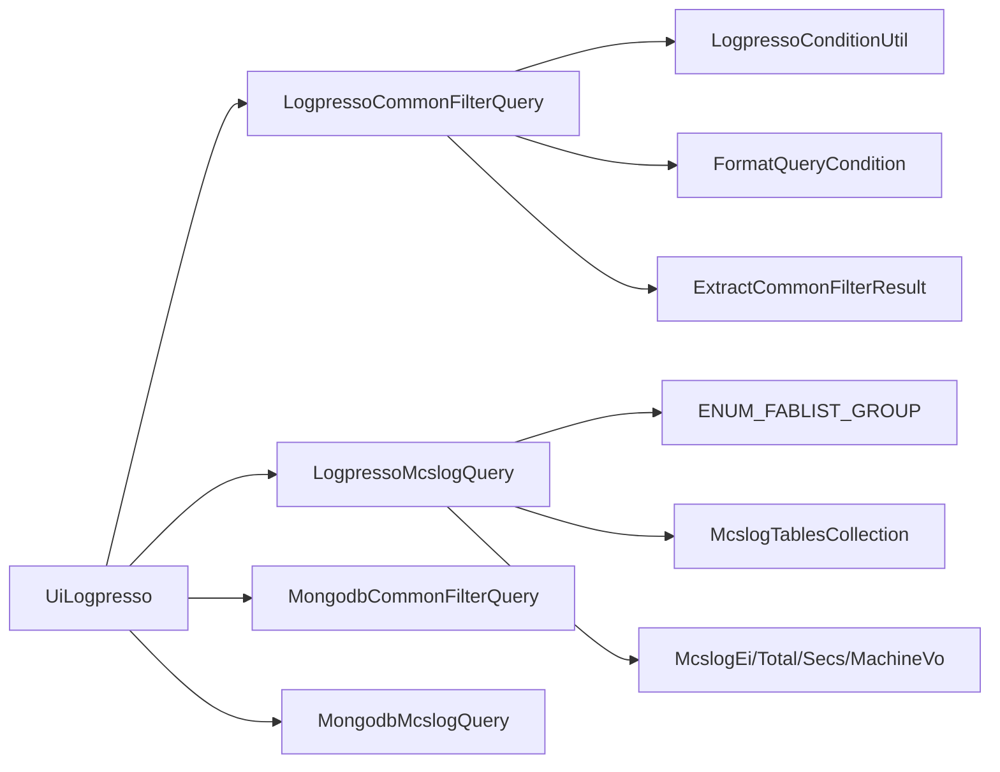
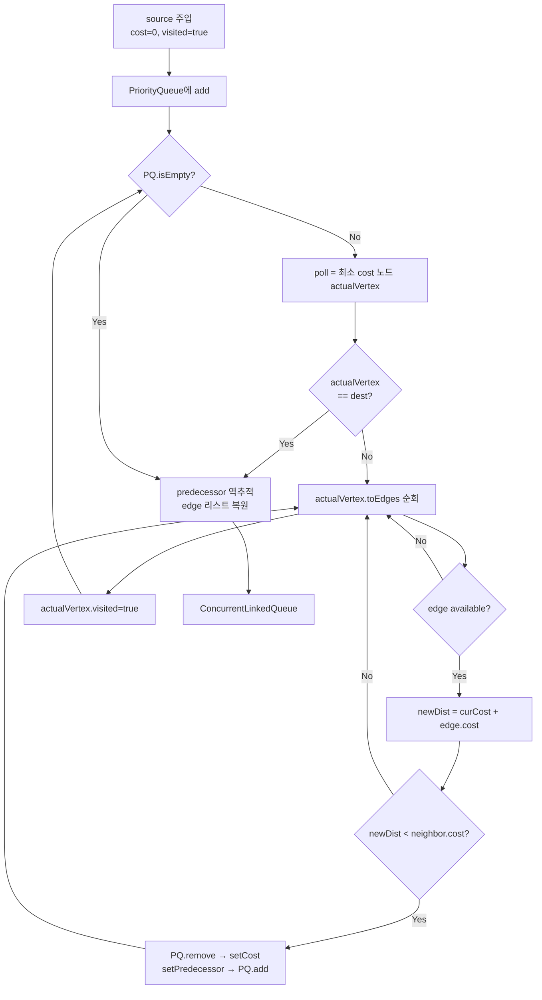
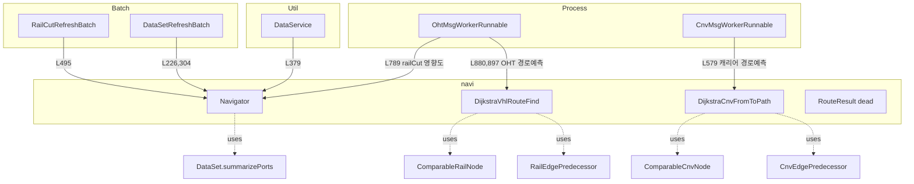
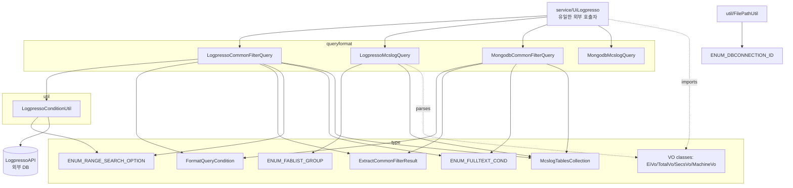
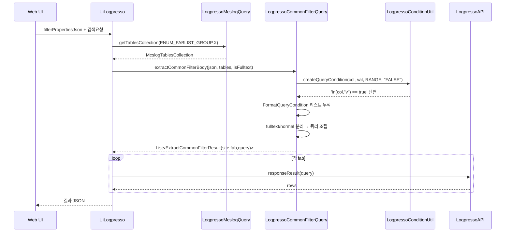

# SmartAtlas — navi / queryformat 패키지 상세 분석

분석 대상: 24개 파일 (navi 8 + queryformat 4 + queryformat/type 11 + queryformat/util 1)

루트:
- `/home/user/ASAS/ALT/decoded_main/java/com/skhynix/smartatlas/navi/`
- `/home/user/ASAS/ALT/decoded_main/java/com/skhynix/smartatlas/queryformat/`

---

## §0. 두 패키지 개요

### 0.1 navi/ 패키지
SmartAtlas Fab 내부 OHT(Overhead Hoist Transport) 및 컨베이어 차량의 **경로 탐색** 알고리즘.
- 두 종류의 Dijkstra 최단경로 구현:
  - `DijkstraVhlRouteFind` — Rail 그래프 위에서 비클(OHT) 경로 예측.
  - `DijkstraCnvFromToPath` — Cnv(컨베이어) 그래프 위에서 캐리어 경로 예측.
- `Navigator` — 단순 BFS 기반 RailCut 영향도 (cut된 RailEdge 한 변경 → 영향 받는 인접 Rail/Port 집합) 추적기. Dijkstra와 무관, 별도 알고리즘.
- `RouteResult` — Job별 예측 경로 결과 컨테이너 (PathItem 리스트). 현재 대부분의 호출부는 주석처리(`Job.java:28`, `LongEdge.java:34`)되어 deprecated 상태.

### 0.2 queryformat/ 패키지
UI에서 입력된 필터 조건(JSON)을 SK하이닉스 로그 분석 DB(**Logpresso**) 및 **MongoDB**에서 실행 가능한 쿼리 문자열로 변환하는 **쿼리 빌더 DSL**.
- 4개 메인 빌더:
  - `LogpressoCommonFilterQuery` — 작업이력/명령이력/공통필터 Logpresso 쿼리.
  - `LogpressoMcslogQuery` — Mcs 로그 (TS/EI/CS/DS/SECS 등) 테이블 조회용 Logpresso 쿼리.
  - `MongodbCommonFilterQuery` — 위의 MongoDB 대응판.
  - `MongodbMcslogQuery` — 단순 fab→suffix 매퍼.
- `type/` 11개: VO/ENUM 정의.
- `util/LogpressoConditionUtil` — `in()`, `==`/`!=`, `and`/`or` 조건문 빌더.
- 외부 단일 호출자는 `service/UiLogpresso.java` (한 곳에서 모두 사용).



---

## §1. navi/ 패키지 (8 파일)

### 1.1 알고리즘 시각화 — Dijkstra 흐름



핵심: **lazy-deletion 없는 정통 Dijkstra**. `PQ.remove(cn)` 후 `setCost(new)` → `PQ.add(cn)`을 통해 우선순위 갱신.

---

### 1.2 ComparableRailNode.java (54 lines)
**1줄 요약**: Rail 그래프 Dijkstra용 PriorityQueue 엔트리 — RailNode + cost + visited + predecessor를 묶고 cost 오름차순 비교.

**필드** (L6–9):
- `double cost` — 현재 누적 cost.
- `RailNode node` — 실제 노드.
- `boolean visited` — 방문 여부.
- `RailEdgePredecessor predecessor` — 역추적용 이전 엣지 정보.

**public 메서드**:
- `ComparableRailNode(RailNode node, double cost, boolean visited)` L11
- `int compareTo(ComparableRailNode o)` L17 — **`Double.compare(this.cost, o.getCost())`** (min-heap 동작)
- `getCost/setCost` L21,25 / `getNode/setNode` L29,33 / `isVisited/setVisited` L37,41 / `getPredecessor/setPredecessor` L45,49

**핵심 로직**: `Comparable<ComparableRailNode>` 구현으로 `PriorityQueue<ComparableRailNode>`에서 자동 정렬.

**사용처**: `DijkstraVhlRouteFind` 내부 전용.

---

### 1.3 ComparableCnvNode.java (45 lines)
**1줄 요약**: 컨베이어 Dijkstra용 PriorityQueue 엔트리 (`CnvPortNode` 버전).

**필드** (L6–9): cost / `CnvPortNode node` / visited / `CnvEdgePredecessor predecessor`.

**public 메서드**:
- 생성자 L10
- `compareTo(ComparableCnvNode)` L16 — RailNode 버전과 동일한 `Double.compare(cost, o.cost)` (L17).
- getter/setter 8개 (L19–42).

**핵심 로직**: ComparableRailNode와 데이터타입만 다르고 구조 동일.

**사용처**: `DijkstraCnvFromToPath` 내부 전용.

---

### 1.4 RailEdgePredecessor.java (22 lines)
**1줄 요약**: Dijkstra 경로 역추적을 위해 "어느 RailEdge로 이 노드에 왔는가 + 그때 누적 cost"를 보관하는 immutable 페어.

**필드** (L6–7): `final RailEdge railEdge`, `final double cost`.

**public 메서드**:
- `RailEdgePredecessor(RailEdge re, double cost)` L9
- `double getCost()` L14
- `RailEdge getRailEdge()` L18

**핵심 로직**: 도착지에서 source까지 `getPredecessor()` 체인을 따라가며 RailEdge 시퀀스를 복원 (DijkstraVhlRouteFind L110–116).

**사용처**: `ComparableRailNode.predecessor`, `DijkstraVhlRouteFind`.

---

### 1.5 CnvEdgePredecessor.java (28 lines)
**1줄 요약**: 컨베이어 버전 predecessor. CnvEdge + cost를 보관 (mutable, setter 있음).

**필드** (L6–7): `CnvEdge ce`, `double cost`.

**public 메서드**:
- `CnvEdgePredecessor(CnvEdge ce, double cost)` L8
- `getCost()/setCost(double)` L13,16
- `getCe()/setCe(CnvEdge)` L20,24

**차이점**: RailEdgePredecessor와 달리 final이 아님 — 코드 정리가 덜 된 흔적. 실제 setter는 외부에서 호출되지 않음.

**사용처**: `ComparableCnvNode.predecessor`, `DijkstraCnvFromToPath`.

---

### 1.6 DijkstraVhlRouteFind.java (125 lines)
**1줄 요약**: OHT(Vhl) 비클의 출발–목적 RailNode 간 최단 경로를 Dijkstra로 탐색하여 RailEdge 큐를 반환.

**필드** (L17–21):
- `Map<RailNode, ComparableRailNode> nodeToComparableMap` — RailNode → wrapper 매핑 (방문 캐시).
- `final RailNode destinationNode, sourceNode`
- `final Vhl vehicle`

**public 메서드**:
- `DijkstraVhlRouteFind(Vhl vehicle, RailNode sourceNode, RailNode destinationNode)` L23 — null 체크만 수행, 실제 탐색 안 함.
- `ConcurrentLinkedQueue<RailEdge> getRailEdgeList()` L38 — 실 알고리즘 호출 진입점.

**알고리즘 단계별** (L38–123):
1. 초기화 (L42–48): source를 `cost=0, visited=true`로 PQ에 add.
2. 메인 루프 (L50–98):
   - `actualVertex = PQ.poll()` (현재 최소 cost). L52
   - `actualVertex == dest`이면 break. L54
   - `actualVertex.node.getToRailEdges()` 순회. L61
     - edge null/unavailable이면 skip. L62–71
     - 이웃 노드 wrapper를 `computeIfAbsent`으로 가져옴 (없으면 `Double.POSITIVE_INFINITY`로 신규). L75–78
     - 이웃이 미방문일 때만 relax. L80
     - **cost 함수: `railEdge.getVhlCountCost()`** — RailEdge에 현재 머무는 비클 수 기반 cost (혼잡도). L81
     - `newDist < neighbor.cost` 이면 PQ에서 제거 → cost/predecessor 갱신 → 재삽입. L86–93
   - `actualVertex.setVisited(true)`. L97
3. 경로 복원 (L100–122):
   - dest map에 없으면 빈 큐 반환. L100
   - dest부터 `getPredecessor()` 체인을 거슬러 올라가며 `Deque.addFirst()`로 RailEdge 누적. L107–116
   - source→dest 순서로 큐에 옮겨 반환. L118

**의사코드**:
```
PQ ← {source(cost=0)}
while PQ not empty:
    u ← PQ.extractMin()
    if u == dest: break
    for edge in u.toRailEdges:
        v ← edge.toNode
        if v unvisited:
            alt ← u.cost + edge.vhlCountCost
            if alt < v.cost:
                PQ.decreaseKey(v, alt)
                v.predecessor ← (edge, alt)
    u.visited ← true
path ← []
n ← dest
while n.predecessor exists:
    path.prepend(n.predecessor.edge)
    n ← edge.fromNode
return path
```

**외부 호출자**:
- `/process/OhtMsgWorkerRunnable.java:880, 897` — `predictedEdges = new DijkstraVhlRouteFind(vehicle, sourceNode, destinationNode).getRailEdgeList();`

---

### 1.7 DijkstraCnvFromToPath.java (126 lines)
**1줄 요약**: 컨베이어(캐리어) 경로 Dijkstra — CnvPortNode 그래프에서 carrierId 기반 최단 경로 탐색.

**필드** (L20–22):
- `Map<CnvPortNode, ComparableCnvNode> nodeToComparableMap`
- `CnvPortNode dest, source`
- `String carrierId`

**public 메서드**:
- `DijkstraCnvFromToPath(CnvPortNode source, CnvPortNode dest, String carrierId)` L29 — null/같음 검사 후 종료. dest==source 케이스 명시적 처리(L39).
- `ConcurrentLinkedQueue<CnvEdge> getCnvEdgeList()` L48 — 실제 탐색.

**알고리즘 동작** (L48–125): DijkstraVhlRouteFind와 거의 동일한 구조, 다만:
- 이웃 노드 획득에 `getNodeMap().get(edge.getToNodeId())` 사용 (Vhl 버전은 `edge.getToNode()` 직접). L76
- `TransferEdge`는 명시적으로 skip (L64) — Cnv 그래프에는 환승 엣지가 있어서 거름.
- cost 함수 차이: **`edge.getCost("")`** (CnvEdge 자체 cost). L84
- 빈 nodeMap 항목은 `computeIfAbsent`이 아닌 명시적 if-null 패턴 (L78–81) — Vhl 버전과 비교 시 코드 스타일 차이 (오래된 버전).

**복원 단계** (L104–117): dest부터 predecessor 체인을 따라 `ConcurrentLinkedDeque.addFirst()` → 순방향 큐로 복사 반환. `ce.getFromNode()`로 노드 이동 (L110).

**carrierId 용도**: 코드 주석(L87)에 따르면 "Carrier 종류별 통행 가능 경로 판단" 의도였으나 현재는 로그용으로만 사용.

**외부 호출자**:
- `/process/CnvMsgWorkerRunnable.java:579` — `ConcurrentLinkedQueue<CnvEdge> edgeList = new DijkstraCnvFromToPath(lastCpn, cpn, carrierId).getCnvEdgeList();`

---

### 1.8 Navigator.java (251 lines)
**1줄 요약**: **Dijkstra와 무관**한 RailEdge 단절(railCut) 시 영향 받는 인접 Rail/Port를 from/to 양방향 DFS로 추적·수집.

**필드** (L21–22):
- `Set<String> affectedRailSet` — 영향 받는 Rail 주소 집합.
- `List<String> portSortedList` — 영향 받는 Port id 리스트 (요약 형식).

**public 메서드**:
- `Navigator(RailEdge railEdge)` L24 — 생성자에서 즉시 `searchRailAffected(railEdge)` 호출.
- `void searchRailAffected(RailEdge railEdge)` L33 — 메인 진입점.
- `Set<String> getAffectedRailSet()` L223
- `List<String> getAffectedPortSortedList()` L227

**private 메서드**:
- `void initialize()` L28 — 두 컬렉션 clear.
- `Item _searchRailAffectedBasedOnFromNode(RailNode fromNode, Item item, int overTrackCount)` L127 — fromNode 기준 **역방향 DFS**. `isRailBranch=true`(분기점)이거나 더 이상 진행 못 할 때 종료. overTrackCount > 1000 시 abort. L138.
- `Item _searchRailAffectedBasedOnToNode(RailNode toNode, Item item, int overTrackCount)` L175 — toNode 기준 **정방향 DFS**. `isRailJunction=true`(병합점)에서 종료.

**핵심 로직** (`searchRailAffected` L33–124):
1. cut된 railEdge의 `address` 자체를 `affectedRailSet`에 추가. L54
2. `abstractToNode`가 RailNode이면 정방향 추적 (`_searchRailAffectedBasedOnToNode`). L56–74
3. `abstractFromNode`가 RailNode이면 역방향 추적 (`_searchRailAffectedBasedOnFromNode`). L76–94
4. 두 결과의 addressSet/portList를 머지.
5. portList 중복제거 후 `DataSet.summarizePorts(portList)`로 압축. L99–108
6. 최종 결과를 두 필드에 저장. L116–117

**내부 클래스 Item** (L231–250): `addressSet` + `portList` 누적 버퍼.

**외부 호출자**:
- `/util/DataService.java:379` — `Navigator navigator = new Navigator(railEdge); item.setAffectedAddress(navigator.getAffectedRailSet()); item.setAffectedPort(...);` (L381–382)
- `/process/OhtMsgWorkerRunnable.java:789–791` — RailCut 메시지 수신 시 영향도 계산.
- `/batch/RailCutRefreshBatch.java:495–497` — 주기적 RailCut 새로고침 배치.
- `/batch/DataSetRefreshBatch.java:226, 304` — DataSet 새로고침 시 자동 호출.

---

### 1.9 RouteResult.java (61 lines)
**1줄 요약**: Job의 예측 경로 결과 컨테이너 — PathItem 리스트, 총 cost, route 선택 정보 보관. 1000개 초과 시 예외 발생.

**필드** (L11–16):
- `List<PathItem> path` — 경로의 각 단위 엣지 정보.
- `double totalCost` (public)
- `Set<RawRouteInfo> routeSelectionSet` (public)
- `List<String> routeSelectionLongEdgeIdList` (public)
- `long pathCnt` — 누적 아이템 수.
- `boolean pathRangeOverLogged` — 초과 알림 1회 발생 가드.

**내부 정적 클래스 `PathItem`** (L20–31):
- `String longEdgeId`
- `double cost`
- `boolean routeSelection`
- 두 생성자: 기본 + `(String, double)`.

**public 메서드**:
- `RouteResult()` L18
- `List<PathItem> getPath()` L33
- `void addPathItem(PathItem pi) throws Exception` L37 — 1000개 초과 시 `Exception("PathRangeOver1000")` throw.
- `void addPathItemList(List<PathItem> pis) throws Exception` L49 — 일괄 추가, 동일한 1000개 가드.

**외부 호출자** (모두 **주석 처리**됨, 사실상 dead code):
- `/data/Job.java:28, 29, 674, 893`
- `/map/edge/TransferEdge.java:186, 187`
- `/map/edge/LongEdge.java:34, 324`

상태: RouteResult는 import만 살아 있고 활용 코드 전부 주석 처리 — 이전 경로 예측 기능이 대체되었음을 시사.

---

## §2. queryformat/ 패키지 (16 파일)

### 2.1 ENUM 값 표

| ENUM | 값 | 의미 / 용도 | 파일:라인 |
|------|------|------------|----------|
| `ENUM_DBCONNECTION_ID` | `M16A` ("mcs_m16a.xml"), `M14A` ("mcs_m14a.xml"), `M14B` ("mcs_m14b.xml"), `M14APM` ("apm_m14.xml"), `M14_VIEW_MES` ("m14_view_mes.xml"), `M16_VIEW_MES` ("m16_view_mes.xml"), `DEFAULT` ("NODATA") | XML mapper 파일명 매핑. `fromString(id)` 미일치 시 DEFAULT 반환 | type/ENUM_DBCONNECTION_ID.java:4–10 |
| `ENUM_FABLIST_GROUP` | `ALARM`, `TRANSPORT`, `MATERIAL`, `RESOURCE`, `MASTER`, `JOBCOMPLETED`, `MASTER_MACHINELIST`, `MASTER_UNITLIST` | Logpresso 테이블 그룹(ts_alarm_*, ts_transport_* 등). `LogpressoMcslogQuery.getTablesCollection(group)` 키로 쓰임 | type/ENUM_FABLIST_GROUP.java:4 |
| `ENUM_FULLTEXT_COND` | `TRUE`, `FALSE` | 해당 조건을 fulltext 인덱스 검색 대상에 포함할지 표시 | type/ENUM_FULLTEXT_COND.java:4 |
| `ENUM_RANGE_SEARCH_OPTION` | `EXACT`, `RANGE` | EXACT="abc" / RANGE="*abc*" — 부분일치 모드 | type/ENUM_RANGE_SEARCH_OPTION.java:3 |

---

### 2.2 type/ENUM_DBCONNECTION_ID.java (33 lines)
**1줄 요약**: Mcs DB 연결 ID enum과 그에 매핑되는 MyBatis mapper XML 파일명을 보관.

**public 메서드**:
- `String fileName()` L19 — 매핑된 XML 파일명.
- `static ENUM_DBCONNECTION_ID fromString(String id)` L23 — 대소문자 무시 검색, 미일치 시 `DEFAULT`.

**외부 호출자**: `/util/FilePathUtil.java:6, 41` — `ENUM_DBCONNECTION_ID.fromString(connectionId)`.

---

### 2.3 type/ENUM_FABLIST_GROUP.java (6 lines)
**1줄 요약**: Logpresso 테이블의 8가지 카테고리(이벤트/전송/자재/리소스/마스터 등) 식별 enum.

**값**: ALARM, TRANSPORT, MATERIAL, RESOURCE, MASTER, JOBCOMPLETED, MASTER_MACHINELIST, MASTER_UNITLIST.

**용도**: `LogpressoMcslogQuery.initSiteFabTablesMap()`에서 `Map<ENUM_FABLIST_GROUP, McslogTablesCollection>` 키로 쓰임 (L440–608).

**외부 호출자**: `UiLogpresso.java:182, 241, 301, 388, 1812, 1888, 1964, 2040, 2116, 2192, 2268, 2344, 2420, 2496…` — 거의 모든 조회 메서드에서 사용.

---

### 2.4 type/ENUM_FULLTEXT_COND.java (5 lines)
**1줄 요약**: 조건문이 Logpresso fulltext 인덱스 대상인지 여부 (TRUE/FALSE).

**용도**: `FormatQueryCondition.isFulltextCondition` 필드값, `LogpressoCommonFilterQuery.extractCommonFilterBody`에서 fulltext-vs-normal 분리 로직 (L1056–1067).

---

### 2.5 type/ENUM_RANGE_SEARCH_OPTION.java (5 lines)
**1줄 요약**: 문자열 매칭 모드 — `EXACT` (==) vs `RANGE` (와일드카드 `*str*`).

**용도**: `LogpressoConditionUtil.createQueryCondition*` 메서드 인자.

---

### 2.6 type/ExtractCommonFilterResult.java (25 lines)
**1줄 요약**: extractCommonFilterBody가 fab별로 반환하는 결과 튜플 — (site, fab, query 문자열).

**필드** (L4–6): `final String _Site, _Fab, _Query`.

**public 메서드**:
- `ExtractCommonFilterResult(String site, String fab, String query)` L8
- `getSite()` L14 / `getFab()` L18 / `getQuery()` L22

**용도**: `LogpressoCommonFilterQuery.extractCommonFilterBody`, `MongodbCommonFilterQuery.extractCommonFilterBody`의 리턴 원소. UiLogpresso는 각 fab별로 별도 DB 호출 시 site/fab 메타와 쿼리 본문을 분리해서 사용.

---

### 2.7 type/FormatQueryCondition.java (21 lines)
**1줄 요약**: 단일 조건문 + "fulltext인가" 플래그를 묶은 경량 immutable 객체.

**필드** (L4–5): `public final String condition`, `public final ENUM_FULLTEXT_COND isFulltextCondition`.

**public 메서드**:
- `FormatQueryCondition(String condition)` L7 — fulltext flag = null.
- `FormatQueryCondition(String condition, ENUM_FULLTEXT_COND isFulltextCondition)` L12
- `String toString()` L18 — condition 자체를 반환.

**빌드 로직**: 호출부(`LogpressoCommonFilterQuery`, `MongodbCommonFilterQuery`)에서 필터 그룹별로 `new FormatQueryCondition("in(col, \"v1\", \"v2\") == true", ENUM_FULLTEXT_COND.TRUE)` 형태로 누적. 마지막 단계에서 isFulltextCondition==TRUE인 것만 모아 `| fulltext` 절을, 나머지는 `| search` 절을 만듦 (LogpressoCommonFilterQuery.java L1056–1067).

---

### 2.8 type/McslogTablesCollection.java (24 lines)
**1줄 요약**: site→fab→tableName 이중 Map의 thin wrapper. `(site, fab)`로 즉시 테이블명 조회.

**필드** (L6): `final Map<String, Map<String, String>> _Tables`.

**public 메서드**:
- `McslogTablesCollection(Map<String, Map<String, String>> mapSiteFabTables)` L8
- `Map<String, String> get(String site)` L12
- `String get(String site, String fab)` L16 — 2-key lookup, site 미존재 시 null.

**용도**: `LogpressoMcslogQuery._SiteFabTablesMap` (private static, L398에서 init) 각 ENUM_FABLIST_GROUP에 대해 하나씩 보관됨.

---

### 2.9 type/McslogEiVo.java (126 lines) — EI 로그 검색 VO
**1줄 요약**: EI(External Interface) 원시 로그 검색의 모든 필터 필드를 담는 VO (페이지/Fab/Level/Host/Log/조건/시간).

**필드**:
- `fabSite` L6 — site (IC, M14, M15, M11, WX 중 하나).
- 페이징: `pageNum`, `rowNum` L9–10.
- Fab/Level/Host/Log 리스트: `List<String>` L13–18.
- 조건: `process`, `text`, `eiTextConditionCheckBox` L21–23.
- 시간: `from`, `to` L26–27.

**public 메서드**: getter/setter 페어 (L30–124).

**사용처**: `LogpressoMcslogQuery.getRawLogListQueryParser(McslogEiVo eiVo)` L990 → UI 호출자: `UiLogpresso.java:1259`.

---

### 2.10 type/McslogMachineVo.java (65 lines) — Machine 조회 VO
**1줄 요약**: Machine 리스트(Area/Bay/MachineType) 조회 VO.

**필드**:
- `fabSite` L7
- `List<String> machineType, selectFab, selectType` L9–11
- `areaName`, `bayName` L12–13

**public 메서드**: getter/setter 페어 (L16–63).

**사용처**: `LogpressoMcslogQuery.getAreaBayQueryParser(McslogMachineVo)` L1195, `getMachineQueryParser(McslogMachineVo)` L1242. UI: `UiLogpresso.java:200, 260, 320, 409, 749, 1053`.

---

### 2.11 type/McslogSecsVo.java (181 lines) — SECS 로그 VO
**1줄 요약**: SECS 통신 로그 검색의 모든 조건 VO (Carrier/Vehicle/Port/CommandID 등).

**필드**:
- `fabSite` L6, 페이징 L9–10, Fab L13, Level/Host L16–17.
- 조건: `carrier`, `vehicle`, `secs`, `carrierLoc`, `commandId`, `transferport`, `sourceport`, `destport`, `text`, `secsTextConditionCheckBox` L21–30.
- 시간: `from`, `to` L33–34.

**public 메서드**: getter/setter 페어 (L37–179).

**사용처**: `LogpressoMcslogQuery.getSecsLogListQueryParser(McslogSecsVo)` L1977. UI: `UiLogpresso.java:936`.

---

### 2.12 type/McslogTotalVo.java (286 lines) — 통합 로그 VO (최대)
**1줄 요약**: 통합 로그 조회(Total log)의 모든 조건을 담는 풀세트 VO — Machine, Fab, Level, 다양한 조건, M14 별도 필드 포함.

**필드**:
- `fabSite` L7, 페이징 L10–11.
- Machine: `areaName`, `bayName`, `machineType[]`, `machineName[]` L14–17.
- Fab L20, Level L23.
- 조건: `searchOption(AND/OR)`, `process`, `thread`, `gtxnId`(M16 Global Tx), `transactionId`, `messageName`, `comMsgName`, `operationName`, `carrier`, `commandId`, `unit`, `text`, `fulltext`, `key[]` L27–40.
- M14 통합: `messageName_m`, `comMsgName_m`, `operationName_m` L42–44.
- 시간: `from`, `to`, `table` L47–49.

**public 메서드**: getter/setter 페어 (L52–284).

**사용처**: `LogpressoMcslogQuery.getTotalLogListQueryParser(McslogTotalVo)` L1314. UI: `UiLogpresso.java:660`.

---

### 2.13 util/LogpressoConditionUtil.java (204 lines)
**1줄 요약**: Logpresso 쿼리 DSL의 조건문(in / and / or) 문자열 생성 유틸 + 결과 row count 조회.

**public 메서드** (모두 `static`):

| 메서드 | 시그니처 | 생성 형태 | 라인 |
|--------|---------|---------|------|
| `createQueryCondition` | (columnName, condition, ENUM_RANGE_SEARCH_OPTION, isNot) → String | `in(col,"v1","v2") == true` (isNot=TRUE 시 `false`) | L21 |
| `createQueryConditionArray` | 동일 시그니처 | `in(strjoin(",", col),"v1") == true` (배열 컬럼용) | L59 |
| `createQueryConditionAnd` | (columnName, List<String> conds, ENUM_RANGE_SEARCH_OPTION, isEqual) → String | `(col == "v1" and col == "v2" and ...)` | L102 |
| `createQueryConditionOr` | 동일 시그니처 | `(col == "v1" or col == "v2" or ...)` | L140 |
| `createQueryConditionIn` | (columnName, List<String> conds) → String | `in(col, "v1", "v2", ...)` | L177 |
| `getQueryTotalCount` | (fabSite, queryStr) → Long | `queryStr | stats count as totalCount` 실행 후 첫 행 totalCount 반환 | L196 |

**핵심 로직 예시** (createQueryCondition L21–48):
1. condition을 comma로 split → 각 토큰을 trim.
2. RANGE 모드면 `*token*`으로 감쌈.
3. `in(col, "v1", "v2", ...) == true/false`로 조립.
4. isNot이 "TRUE"면 `== false` (부정), 아니면 `== true`.

**EXACT vs RANGE** (createQueryConditionAnd/Or L117–121):
- EXACT: `col == "abc"` 또는 `col != "abc"`.
- RANGE: `col == "*abc*"` 또는 `col != "*abc*"`.

**외부 호출자**: `LogpressoCommonFilterQuery.java` 전반 (수십 회), `UiLogpresso.java:49`.

---

### 2.14 LogpressoCommonFilterQuery.java (1096 lines) — 메인 Logpresso 빌더
**1줄 요약**: UI 필터 JSON(`filterPropertiesJson`)을 Logpresso `| table … | search … | search …` 형태의 파이프 쿼리로 변환하는 빌더.

**public static 메서드 3개**:

| 메서드 | 시그니처 | 입력 | 출력 | 라인 |
|--------|---------|------|------|------|
| `extractCommonFilterJobHistory` | (final String filterPropertiesJson) → StringBuilder | UI 필터 JSON | `set from="..." | set to="..." | table from=$("from") to=$("to") ATLAS_JOB | search (1 and ...) | search (1 and ...) | limit N` | L27–308 |
| `extractCommonFilterCommandHistory` | (String filterPropertiesJson) → StringBuilder | 동상 | `… table … ATLAS_COMMAND | search (sourceXxx) | search (destXxx) | search (etc) | limit` | L310–478 |
| `extractCommonFilterBody` | (filterPropertiesJson, McslogTablesCollection, boolean isFulltext) → `List<ExtractCommonFilterResult>` | UI JSON + 테이블 매핑 + fulltext 여부 | fab별 쿼리 리스트. isFulltext=true → `| fulltext from=... <conds> from <tables>`; false → `| table from=... <tables>` + 일반 `| search ...` | L480–1095 |

**extractCommonFilterJobHistory 동작** (L27–308):
1. `SetPeriod` 필터(`Elapsed`=fromDate,toDate)로 `set from=...`, `set to=...`, `table ATLAS_JOB` 헤더 생성. L34–46
2. `From` 필터(McpName, EqpType, DetailType, EqpText, PortText, RailArea, EqpGroup)를 `LogpressoConditionUtil.createQueryCondition` 호출로 `and` 연결. **`IsNewFromMode=TRUE`**이면 컬럼명에 `newFrom` prefix 사용 (L54–60).
3. `To` 필터 — 마찬가지지만 `to`/`dest` prefix. `IsOrFromTo=TRUE`이면 From/To를 `or`로 결합.
4. `Etc` 필터(`Job`, `Carrier`, `StepID`, `StepName`, `ViaBJEdge`, `Elapsed`(분→ms), `Distance`(m→mm)) L424–464.
5. `IsRowCountMode=TRUE` 모드에서는 `| limit RowCount` 추가.
6. `QueryUtil.replaceDummy(...)`로 더미 토큰 치환 후 반환. L307

**extractCommonFilterBody 동작** (L480–1095, 핵심 — Logpresso 메인 진입):
1. `McslogFab` 필터에서 site, fabs[], fabTablesMap 수집. L495–510
2. 각 필터 그룹(`McslogTimeRange`, `McslogMachine`, `McslogMachineTransport/Source/Dest`, `McslogAlarmReportLog`, `McslogMaterialCarrierLocLog`, `McslogResourceMachineLog`, `McslogResourcePortLog`, `McslogResourceShelfLog`, `McslogResourceCraneLog`, `McslogResourceVehicleLog`, `McslogResourceStorageLog`, `McslogTransportReturn*Log`, `McslogTransport*State`)에 대해 `LogpressoConditionUtil.createQueryConditionIn/And/Or`로 `FormatQueryCondition` 누적. L500–1050
3. conditions를 fulltext(`isFulltextCondition=TRUE`)/normal로 분리, fulltext는 `\n and` 연결, normal은 `\n | search ` prefix. L1053–1067
4. `isFulltext=true`이면 `| fulltext from=$("from") to=$("to") <fullText> from <tables>` 형식. false이면 `| table from=… to=… <tables>` + normal search 추가. L1077–1087
5. 단일 `ExtractCommonFilterResult(site, tableNames(콤마조인), query)` 반환. L1089

**외부 호출자**: `service/UiLogpresso.java:1845, 1921, 1997, 2073, 2149, 2225, 2301, 2377, 2453, 2529, 2605, 2691, 2762, 2838, 2989, …` — 모든 `getXxxLogPaging()` 메서드에서 호출 (Logpresso 백엔드 분기).

---

### 2.15 LogpressoMcslogQuery.java (2206 lines) — 최대 파일
**1줄 요약**: 사이트/팹별 Logpresso 테이블 매핑(상수 + Map) + Mcs UI VO(McslogEi/Total/Secs/MachineVo) → 쿼리 문자열 변환의 종합 팩토리.

**구조**: 라인 ~20–390는 100+ public static String 상수 (테이블명, 컬럼명, 사이트/팹 ID, 쿼리 템플릿). 라인 397~611은 static 초기화 (`_SiteFabTablesMap`, `_SiteFabsMap`). 라인 613~2205는 변환 메서드.

**주요 public static 메서드**:

| 메서드 | 시그니처 | 역할 | 라인 |
|--------|---------|------|------|
| `getTablesCollection` | (ENUM_FABLIST_GROUP group) → McslogTablesCollection | 그룹별 site→fab→table 매핑 반환 | L613 |
| `getFabsList` | (String site) → List<String> | site의 fab 목록 (예: IC → M14A/M14B/M16A/M16B) | L644 |
| `getColumnFromFab` | (String fabSite, String fab) → String | "*Fab*" 와일드카드 컬럼 추가용 SHOPNAME 필터 단편 생성 | L648 |
| `getTSTableFromFab` | (fabSite, fab, isAll) → String | TS 로그용 테이블명 (isAll=true면 raw, false면 view 우선) | L716 |
| `getEITableFromFab` | (fabSite, fab) → String | EI 로그용 테이블명 | L760 |
| `getCSTableFromFab` | (fabSite, fab) → String | CS 로그용 테이블명 | L805 |
| `getDSTableFromFab` | (fabSite, fab) → String | DS 로그용 테이블명 | L850 |
| `getTotalLogTableFromFab` | (fabSite, fab, isAll) → String | 통합로그 테이블명 | L896 |
| `getSecsLogListTableFromFab` | (fabSite, fab) → String | SECS 로그 테이블명 | L945 |
| `getRawLogListQueryParser` | (McslogEiVo) → String | EI/TS/CS/DS 원시 로그 쿼리 빌드 | L990 |
| `getAreaBayQueryParser` | (McslogMachineVo) → String | Area/Bay 리스트 조회 쿼리 | L1195 |
| `getMachineQueryParser` | (McslogMachineVo) → String | Machine 리스트 조회 쿼리 | L1242 |
| `getTotalLogListQueryParser` | (McslogTotalVo) → String | 통합 로그 검색 쿼리 (최장, L1314–1975) | L1314 |
| `getSecsLogListQueryParser` | (McslogSecsVo) → String | SECS 로그 검색 쿼리 | L1977 |
| `getRawLogListTableSelect` | (fabSite, fab, List<String> LogTypes, isAll) → List<String> | LogTypes(TS/EI/CS/DS)별 테이블명 누적 | L2138 |
| `getTransactionLogFabTableList` | (fabSite, fab) → String | ts_end_data_* 트랜잭션 테이블명 | L2169 |

**static 초기화** (`initSiteFabTablesMap` L414–611):
- 각 ENUM_FABLIST_GROUP(ALARM, TRANSPORT, MATERIAL, RESOURCE, JOBCOMPLETED, MASTER_MACHINELIST, MASTER_UNITLIST, MASTER)별로 `Map<site, Map<fab, tableName>>` 구성.
- 예: ALARM/IC/M14A → "ts_alarm_m14a", ALARM/M15/M15B → "ts_alarm_m15b" 등.

**`getRawLogListQueryParser` 동작** (L990–1193, 발췌):
1. eiVo null 체크 후 헤더 `table from=... to=... order=asc parallel=t` 추가. L996
2. fab × logType(TS/EI/CS/DS) 매트릭스로 테이블명 수집 (Level이 INFO/FINE/DEBUG/ALL이면 isAll=true → view 포함). L1006–1015
3. TS 로그 컬럼 별칭 부여 (`eval FAB=case(...)`, `eval LOG=case(...)`, `eval HOST=if(...)`, `eval TEXT_XML=XML`). L1021–1040
4. `fields` 절로 출력 컬럼 정렬: _TIME, _ID, TIME_EX, FAB, LOG, LEVEL, …
5. SHOPNAME/LEVEL/HOST 등 `search in(...)` 절 추가.

**상수의 의미** (예시):
- `sFABSITE_IC` = "IC" (M14+M16 패키지 통합 사이트), `sFABSITE_M14/M15/M11/WX` — 사이트 ID.
- `sFAB_M11A`, `sFAB_C2`, `sFab_NWT`, `sFab_ICPKT` — fab 코드.
- `sTS_DATA_M14A` = "ts_data_m14a, ts_data_view_m14a" 등 테이블 한 쌍.
- `sFulltext_From_TRAN` = "TRANS_JOB_HISTORY_FULLTEXT(%s, %s, %s)" — 저장 프로시저 호출 템플릿. L351
- `sTable_From_TRAN` = "TRANS_JOB_HISTORY_DETAIL(%s, %s, %s)" L374

**외부 호출자**: `service/UiLogpresso.java`의 거의 모든 메서드 (181, 205, 240, 266, 300, 319, 387, 417, 540, 541, 656, 692, 749, 1053, 1259 …).

---

### 2.16 MongodbCommonFilterQuery.java (281 lines)
**1줄 요약**: LogpressoCommonFilterQuery의 MongoDB 대응판 — `MongodbQueryPool`에서 미리 등록된 query template 이름으로 인자 맵을 채워 호출.

**public 메서드** (단일):
- `static List<ExtractCommonFilterResult> extractCommonFilterBody(String filterPropertiesJson, McslogTablesCollection tablesCollection, String queryName, Map<String, Object> lastKeys)` L25

**입출력**:
- 입력: filterPropertiesJson, McslogTablesCollection (예: ENUM_FABLIST_GROUP.ALARM), queryName (MongodbQueryPool 키), lastKeys (pagination cursor, fab별 마지막 _id).
- 출력: fab별 `ExtractCommonFilterResult(site, fab, MongodbQueryPool.getQuery(queryName, args))` 리스트.

**처리 로직** (L25–280):
1. JSON 파싱 → filterProperties map. L31
2. McslogFab → site/fabs/fabTablesMap 수집. L38–47
3. McslogTimeRange → From/To를 UTC로 변환. L49–58
4. McslogMachine 및 변형 4종 → MachineTypes/Names를 `'A','B'` 콤마구분 + 따옴표 포맷으로 변환. L60–106
5. McslogAlarmReportLog, McslogMaterialCarrierLocLog, McslogResource*Log, McslogTransport*Log 등 그룹별 `conditions` 맵에 `FormatQueryCondition` 적재. L108–252
6. McslogTransportCompletedCarrierFromToLog → Carrier 단일 필드. L254–258
7. 각 fab에 대해:
   - fulltext 추출: `isFulltextCondition==TRUE`인 조건들의 condition 문자열을 공백으로 join (인용부호/콤마 제거). L262–265
   - args 맵에 모든 condition 토스트링 + FullText + Collection(fabTable) + Key(lastKey) 주입. L267–271
   - `MongodbQueryPool.getQuery(queryName, args)`로 템플릿 렌더링. L273

**외부 호출자**: `UiLogpresso.java:1815, 1891, 1967, 2043, 2119, 2195, 2271, 2347, 2423, 2499, 2575, 2671, 2732, 2808, 2989, ...` — Logpresso 대응 호출 직전(또는 직후) MongoDB 백엔드용 동일 분기.

---

### 2.17 MongodbMcslogQuery.java (19 lines) — 가장 작은 파일
**1줄 요약**: fab 코드 → MongoDB collection suffix 매퍼 (icpkt/icpnt/nwt). 그 외는 빈 문자열.

**public 메서드**:
- `static String getSuffix(String fab)` L5 — fab.toUpperCase() switch: ICPKT→"icpkt", ICPNT→"icpnt", NWT→"nwt", default→"".

**용도**: MongoDB collection 이름 동적 생성(`ts_alarm_icpkt` 등).

**외부 호출자**: `UiLogpresso.java:553, 812, 856, 1006`.

---

## §3. 호출 관계 종합

### 3.1 navi 호출 그래프



### 3.2 queryformat 호출 그래프



### 3.3 데이터 흐름 (queryformat end-to-end)



---

## 부록 — 파일별 라인 수 요약

### navi/ (8 파일, 총 약 692 lines)
| 파일 | 라인 |
|------|------|
| `CnvEdgePredecessor.java` | 28 |
| `ComparableCnvNode.java` | 44 |
| `ComparableRailNode.java` | 53 |
| `DijkstraCnvFromToPath.java` | 126 |
| `DijkstraVhlRouteFind.java` | 125 |
| `Navigator.java` | 251 |
| `RailEdgePredecessor.java` | 21 |
| `RouteResult.java` | 61 |

### queryformat/ (4 파일, 총 약 3505 lines)
| 파일 | 라인 |
|------|------|
| `LogpressoCommonFilterQuery.java` | 1096 |
| `LogpressoMcslogQuery.java` | 2206 |
| `MongodbCommonFilterQuery.java` | 281 |
| `MongodbMcslogQuery.java` | 19 |

### queryformat/type/ (11 파일)
| 파일 | 라인 |
|------|------|
| `ENUM_DBCONNECTION_ID.java` | 32 |
| `ENUM_FABLIST_GROUP.java` | 5 |
| `ENUM_FULLTEXT_COND.java` | 5 |
| `ENUM_RANGE_SEARCH_OPTION.java` | 5 |
| `ExtractCommonFilterResult.java` | 25 |
| `FormatQueryCondition.java` | 21 |
| `McslogEiVo.java` | 125 |
| `McslogMachineVo.java` | 64 |
| `McslogSecsVo.java` | 180 |
| `McslogTablesCollection.java` | 23 |
| `McslogTotalVo.java` | 285 |

### queryformat/util/ (1 파일)
| 파일 | 라인 |
|------|------|
| `LogpressoConditionUtil.java` | 204 |

---

## 핵심 발견 (요약)

1. **navi 패키지의 두 Dijkstra 구현은 거의 동일**하지만 데이터 타입(Rail vs Cnv)과 cost 함수(`getVhlCountCost()` vs `getCost("")`)가 다름. 코드 중복이 큼.
2. **Navigator는 Dijkstra가 아닌 단순 DFS 영향도 추적기**. 이름이 오해를 일으킬 수 있음.
3. **RouteResult는 사실상 dead code** — 모든 호출부가 주석 처리됨.
4. **queryformat의 단일 외부 진입점은 UiLogpresso 한 클래스**. 다른 모듈에서는 일절 사용되지 않음.
5. **MongoDB/Logpresso는 1:1 대응 빌더 쌍**으로 구성됨 (`MongodbCommonFilterQuery` vs `LogpressoCommonFilterQuery`). UI에서 두 백엔드를 모두 호출하는 구조 (시그마/온프레미스/이중 백엔드 운영 시사).
6. **LogpressoMcslogQuery는 거대한 static 상수 + 매핑 테이블 + 빌더의 혼합**으로, 사이트(M14/M15/M11/WX/IC) × Fab(M14A/B, M15A/B, M11A/B, C2/C2F, M16A/B/E, NWT, ICPKT) × Table-Group 매트릭스를 모두 보관.
7. **extractCommonFilterJobHistory / extractCommonFilterCommandHistory** 두 메서드는 LogpressoCommonFilterQuery 내에 정의되어 있지만 **외부 호출자가 존재하지 않음** (UiLogpresso 등 어디서도 호출되지 않음) — 잠재적 미사용 코드 또는 향후 사용 예정 코드.
