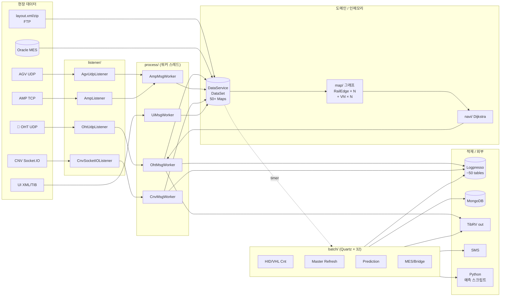

# SmartAtlas 시스템 전체 분석

> SK하이닉스 반도체 FAB OHT(Overhead Hoist Transport) 관리 시스템 `com.skhynix.smartatlas`
> 디코딩 소스 `ALT/decoded_main/java/com/skhynix/smartatlas/` 전체 (176 파일) 에 대한
> 패키지별 상세 분석 모음.

---

## 📑 문서 인덱스

| # | 문서 | 분석 대상 | 파일수 | 라인수 |
|---|---|---|---:|---:|
| 1 | [01_bootstrap_service_env.md](01_bootstrap_service_env.md) | 진입점, service/, environment/ | 11 | 1,011 |
| 2 | [02_batch.md](02_batch.md) | batch/ (Quartz Jobs) | 32 | 1,159 |
| 3 | [03_process_listener.md](03_process_listener.md) | process/, listener/ | 8 | 1,253 |
| 4 | [04_data_model.md](04_data_model.md) | data/, data/eq/, data/raw/ | 47 | 1,184 |
| 5 | [05_map_graph.md](05_map_graph.md) | map/, edge/, node/, mcslog/ | 26 | 805 |
| 6 | [06_navi_queryformat.md](06_navi_queryformat.md) | navi/, queryformat/* | 24 | 765 |
| 7 | [07_util_comm_db.md](07_util_comm_db.md) | util/, comm/, db/* | 28 | 1,179 |
| - | [00_SYSTEM_OVERVIEW.md](00_SYSTEM_OVERVIEW.md) | 시스템 전체 아키텍처 | - | - |
| **합계** | | **176** | **7,356+** |

---

## 🎯 시스템 한 줄 요약

SK하이닉스 FAB 의 OHT(천장 반송 차량) / CNV(컨베이어) / AMP / AGV / 스토커 의
실시간 상태를 수신하여 Logpresso·MongoDB·Oracle 에 적재하고, TIB/Rendezvous 로
타 시스템에 알리며, 30+ 개 Quartz 배치로 마스터/통계/예측을 갱신하는
SmartFx 기반 백엔드 서버.

---

## 🏗 아키텍처 한 장 요약



---

## 📂 패키지별 역할 매트릭스

| 패키지 | 책임 | 핵심 클래스 |
|---|---|---|
| `(root)` | 부트스트랩 | `LauncherListener`, `BizEventHandler` |
| `environment/` | 환경 설정, 기능 스위치 | `Env`, `FunctionItem` |
| `service/` | 비즈니스 진입 서비스 | `BizDataInitializer`, `TibrvService`, `UiLogpresso`, `HttpService`, `AmosService` |
| `listener/` | 네트워크 수신 | `OhtUdpListener`, `AgvUdpListener`, `AmpListener`, `CnvSocketIOListener` |
| `process/` | 메시지 워커 스레드 | `OhtMsgWorkerRunnable`(핵심), `Amp/Cnv/UiMsgWorker` |
| `batch/` | 32 개 Quartz Job | `HidEdgeInOutQueueFlushBatch`, `VhlCnt*Batch`, `QTransferPredictBatch`, `MesLotHisBatch`, ... |
| `data/` | 가공/실시간 데이터 | **`DataSet`** (50+ Map), `FabProperties`, `McpProperties` |
| `data/eq/` | 설비 모델 | `Eqp` 베이스 + 6 서브타입 (`Oht`, `Stocker`, `Conveyor`, ...) |
| `data/raw/` | layout.xml 원본 | **`Mcp75Config`** (14 Map 컨테이너) + 16 Raw* |
| `map/` | 그래프 토폴로지 | `AbstractEdge`/`Node`, `Vhl` |
| `map/edge/` | 8 종 엣지 | `RailEdge`(핵심), `CnvEdge`, `AgvEdge`, ... |
| `map/node/` | 8 종 노드 | `RailNode`, `EqpPortNode`, `StkPortNode`, ... |
| `map/mcslog/` | MCS 로그 VO | (그래프와 무관, 검색 폼) |
| `navi/` | Dijkstra 최단 경로 | `DijkstraVhlRouteFind`, `Navigator` |
| `queryformat/` | Logpresso/MongoDB 쿼리 DSL | `LogpressoCommonFilterQuery` 등 4 빌더 |
| `util/` | 유틸리티 | **`DataService`**(중추 싱글톤), `Util`, `LayoutUtil`, `XmlUtil`, `PythonUtil`, ... |
| `comm/` | 외부 통신 | `OracleAPI`, `TibrvAPI` |
| `db/logpresso/` | Logpresso 클라이언트 | `LogpressoAPI` (2 노드 fallback) |
| `db/mongodb/` | MongoDB 클라이언트 | `MongodbAPI`, Linq 빌더 군 |
| `db/mybatis/` | MyBatis 매퍼 핸들러 | `MybatisQueryHandler` |

---

## 🔄 데이터 흐름 (핵심 경로 4 종)

### 1) 실시간 OHT 메시지 → Logpresso/TIB

```
OHT 차량 (UDP)
   → OhtUdpListener (수신 큐잉)
   → OhtMsgWorkerRunnable._updateVehicle (라인 215~)
      ├ vehicle.set* (상태 업데이트)
      ├ railEdge 속도/HID 갱신
      ├ HID_INOUT 스위치 ON → DataSet.edgeInOutCountMap.merge (라인 519)
      ├ VHL_CNT 스위치 ON → hidVehicleCountMap 증감
      ├ HID_OFF 스위치 ON → ATLAS_OHT_HID_OFF Logpresso 즉시 적재
      ├ VHL_OFF 스위치 ON → ATLAS_OHT_VHL_OFF_* 적재 + TIB 송신
      └ TIBRV_SEND ON → addTibrvMessageQueue
```

### 2) 1분 단위 통계 → Logpresso

```
HidEdgeInOutQueueFlushBatch (매 분)
   → DataSet.edgeInOutCountMap.forEach (drain)
   → setEdgeInOutCountMap(new ConcurrentHashMap)
   → Tuple × N
   → LogpressoAPI.setInsertTuples("{FAB}_ATLAS_HID_INOUT", tuples, 100s)
```

### 3) 마스터 갱신 (일간) → Logpresso

```
HidEdgeInOutUpdateMasterBatch (매일)
   → FabProperties.McpProperties.Mcp75Config.RawHidMap 스캔
   → DataSet.edgeMap 의 RailEdge 인접 분석
   → {FAB}_ATLAS_INFO_HID_INOUT_MAS / {FAB}_ATLAS_HID_INFO_MAS 갱신
```

### 4) 예측 (분/시간) → Python → Logpresso

```
QTransferPredictBatch / AmosMinBatch (분/시간 주기)
   → Logpresso 조회로 입력 CSV 생성 (PythonUtil)
   → Windows 경로의 Python 스크립트 실행
   → stdout JSON Array 파싱
   → Logpresso 적재 (M16A_BOTTLENECK_ANOMALY, ATLAS_TS_PREDICT 등)
```

---

## 🔑 핵심 클래스 Top 10 (라인수 기준)

| 순위 | 클래스 | 라인 | 역할 |
|---:|---|---:|---|
| 1 | `UiLogpresso` | 3,549 | UI 백엔드 진입 (3,549줄 단일 클래스) |
| 2 | `QTransferPredictBatch` | 1,774 | 큐 트랜스퍼 예측 배치 |
| 3 | `BridgeLayoutDetailBatch` | 1,667 | 브리지 레이아웃 (24 종 알람) |
| 4 | `Mcp75Config` | 1,500+ | layout.xml 컨테이너 (14 ConcurrentMap) |
| 5 | `DataSet` | 1,445 | 인메모리 가공 데이터 (50+ Map) |
| 6 | `DataService` | 5,500+ | 중추 싱글톤 (17 필드, 30 public) |
| 7 | `AmosMinBatch` | 1,213 | 3 종 Python 예측 |
| 8 | `OhtMsgWorkerRunnable` | 1,014 | OHT UDP 처리 (HID/VHL/STAGE) |
| 9 | `Util` | 1,304 | 공통 유틸 (FTP/암호화/포맷) |
| 10 | `SystemMessageDetectBatch` | 893 | 시스템 메시지 이상치 탐지 |

---

## 🎚 FunctionType 스위치 인덱스 (FAB:MCP 단위)

| 스위치 | 사용처 | 비고 |
|---|---|---|
| `HID_INOUT` | `OhtMsgWorker:310`, `HidEdgeInOutUpdateMasterBatch:79` | HID 전환 카운트 |
| `HID_OFF` | `OhtMsgWorker:339`, `AlertingSystemStatus` | HID 이상 알림 |
| `VHL_OFF` | `OhtMsgWorker:354`, `MonitoringControlBatch` | 차량 이상 |
| `VHL_CNT` (+`_10/_30/_60`) | `OhtMsgWorker:316`, `VhlCnt*Batch` | 구간별 차량 수 |
| `RAIL_CUT` | `OhtMsgWorker`, `RailCutRefreshBatch` | 레일 차단 |
| `RAIL_VIBRATION` | `RailVibrationBatch` | 진동 |
| `RAIL_TRAFFIC` (+ Sub/MaxVel/AbsVel/VhlCnt/PassCnt) | `TrafficBatch` | 트래픽 통계 |
| `MAP_FILE_REFRESH` | `OhtMsgWorker:327`, layout 재로딩 | layout.zip refresh |
| `STAGE_COMMAND_MONITORING` | `OhtMsgWorker`, `MonitoringControlBatch` | 적재 명령 감시 |
| `UDP_MESSAGE_MONITORING` | listener 측 | UDP 패킷 누락 감지 |
| `TIBRV_SEND` | `OhtMsgWorker` | TIB 송신 ON/OFF |
| `CNV_INOUT` / `CNV_TIBRV_SEND` | `CnvMsgWorker` | CNV 진입/송신 |
| `AGV_INOUT` / `AGV_TIBRV_SEND` | `AmpMsgWorker`(AGV 분기) | AGV 진입/송신 |

---

## 💾 외부 시스템 연동

| 외부 | 사용처 | 패턴 |
|---|---|---|
| **Logpresso** | ~50 테이블 | bulk insert, 2 노드 fallback, timeout 별 그룹 |
| **MongoDB** | ~10 컬렉션 | Linq 빌더 (find/aggregate), XML 템플릿 |
| **Oracle** | MES 연동 | `OracleAPI` 풀, MyBatis 매퍼 |
| **TIB/Rendezvous** | 송수신 | `TibrvAPI`, `TibrvService` 분배 |
| **FTP** | layout.zip | `Util.download*` |
| **Python** | 예측 스크립트 | `PythonUtil` (Windows 경로 한정) |
| **HTTP** | 외부 API | `HttpService` (sync/async) |
| **SMS** | 알람 | `SmsUtil`, `SmsProperties` |

---

## ⚠ 주요 발견/이슈 (각 문서에서 추출)

### 부트스트랩/서비스
- `BizEventHandler` 4개 콜백 로그 라벨이 서로 뒤바뀜
- `FunctionItem.setUseFunction` 의 `RAIL_TRAFFIC_PASS_COUNT` case `break` 누락 → `RAIL_TRAFFIC_VEHICLE_COUNT` 로 fall-through
- `HttpService.async` 호출자 timeout 무시, `latch.await(30s)` 하드캡
- `BizDataInitializer.ohtSeq` non-atomic `static long`

### 메시지 처리
- `HID_INOUT` 은 `VHL_CNT` 가 함께 켜져야 정상 동작 (`vehicle.setHidId` 가 `_calculatedVhlCnt` 안에서만 호출됨)
- `Vhl.hidId` 초기값 -1 → 첫 메시지 시 음수 HID 가 DB 에 적재 가능
- 워커 `this.fabId` ≠ `vehicle.getFabId()` 인 경우 테이블 prefix 와 FAB_ID 컬럼이 다름

### 적재
- `LogpressoAPI.setInsertTuples(..., 100)` 의 `100` 은 batch size 가 아니라 timeout 초
- `HidEdgeInOutQueueFlushBatch` 의 빈 fabId 만나면 `continue` 가 아닌 `return` 으로 전체 루프 종료
- `M14A_QUEUE_ANOMALY`, `M16A_BOTTLENECK_ANOMALY` 등 fab 하드코딩

### 인프라
- `LogpressoAPI` 2 노드 자동 fallback + Canceller (ScheduledExecutor 강제종료)
- `CryptoUtil` ≒ `Util.decrypt` 중복 구현
- `MongodbQueryPool` JDOM2 mini-template (If/IfNotBlank 평가)
- `XmlUtil.formatMessageToString` TRANSACTIONID 를 디스크 +1 (동시성 위험)
- `UiLogpresso` 3,549 라인 단일 클래스 (분할 권장)

### 코드 사문화
- `navi/RouteResult` 호출부 전부 주석 처리됨
- `queryformat/extractCommonFilterJobHistory`, `extractCommonFilterCommandHistory` 미호출

---

## 🗺 추천 읽는 순서

처음 보는 사람:
1. **이 README** 로 전체 구조 파악
2. **00_SYSTEM_OVERVIEW.md** 로 데이터 흐름 그림 학습
3. **03_process_listener.md** § OhtMsgWorkerRunnable 로 실시간 처리 핵심 이해
4. **04_data_model.md** § DataSet 으로 인메모리 모델 파악
5. **02_batch.md** 에서 관심 배치만 발췌

운영/디버깅 시:
- 특정 테이블 (`*_ATLAS_HID_INOUT` 등) 추적 → `02_batch.md` + `07_util_comm_db.md` (LogpressoAPI)
- 특정 메시지 처리 추적 → `03_process_listener.md`
- 특정 그래프 노드/엣지 의미 → `05_map_graph.md`
- 특정 layout.xml 필드 → `04_data_model.md` § Mcp75Config

---

## 📦 부속 자료

같은 폴더에 함께 있는 자료:
- `../decoded_main/` — 원본 디코딩 자바 소스 176 파일
- `../HID_INOUT_FLOW.md` — `{FAB}_ATLAS_HID_INOUT` 적재 흐름 단독 분석 (기술용)
- `../HID_INOUT_고객용.md` — 위와 동일 주제의 고객 보고용
- `../LOGPRESSO_SAVE_INVENTORY.md` — Logpresso 적재 전체 인벤토리 (~50 테이블)
- `../hid_inout_logic/` — HID_INOUT 관련 자바 파일 11 개 모음 (zip 포함)

---

*분석 작업: 2026-05-18 / 7개 패키지 그룹 / 176 파일 / 7,356+ 라인 문서*
